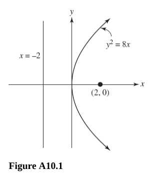
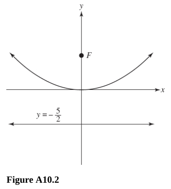
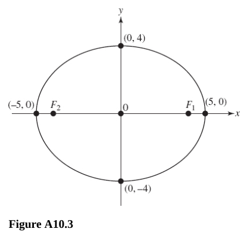
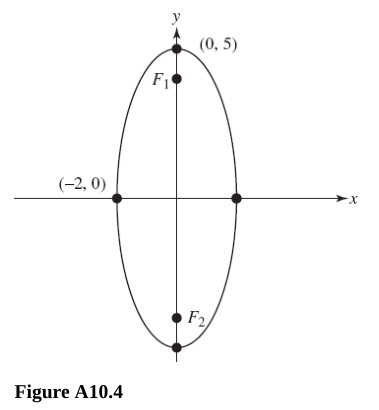
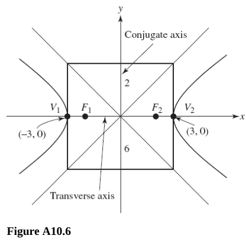
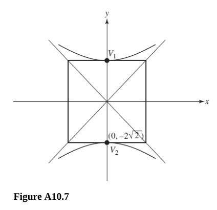
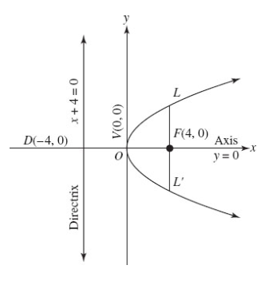
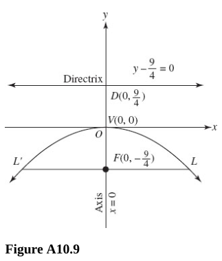
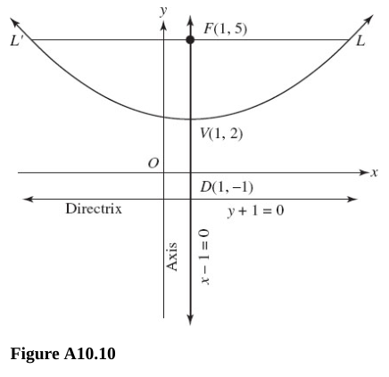
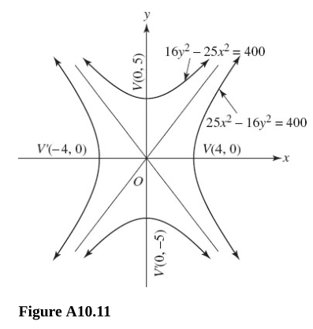

# Chapter 10 Conic Sections

---

## The Circle

---

**For questions 402-404,** find the center and radius of the given circle.

---

**402.** $x^2 + y^2 = 100$

**Answer:**

The standard circle formula can be written as:

$$ (x - h)^2 + (y - k)^2 = r^2 $$

Where the center is at $(h, k)$, and $r$ represents the radius.

Thusly in this case, our center is:

$$ \boxed{(0, 0)} $$

And our radius is $\sqrt{100}$, and therefore:

$$ \boxed{r = 10} $$

---

**403.** $7x^2 + 7y^2 + 14x - 56y - 25 = 0$

**Answer:**

Here we have to combine our like terms:

$$ (7x^2 + 14x) + (7y^2 - 56y) = 25  $$

$$ 7(x^2 + 2x) + 7(y^2 - 8y) = 25 $$

Now we have to complete the square for our two variadic terms to get it into
standard form:

$$ 7(x^2 + 2x + 1) + 7(y^2 - 8y + 16) = 25 + 7(1) + 7(16) $$

$$ 7(x + 1)^2 + 7(y - 4)^2 = 144$$

We can now divide out $7$ from both sides:

$$ (x + 1)^2 + (y - 4)^2 = \frac{144}{7} $$

And lo and behold, we are in standard form, albeit with an awkward fraction for
our squared radius. Nevertheless, from here we can easily determine the center
and the radius:

The center is:

$$ \boxed{(-1, 4)} $$

And the radius is:

$$ r = \sqrt{\frac{144}{7}} $$

$$ r = \frac{12}{\sqrt{7}} $$

Let's rationalize that denominator:

$$ \boxed{r = \frac{12\sqrt{7}}{7}} $$

---

**404.** $x^2 + y^2 - 6x + 8y - 11 = 0$

**Answer:**

This is similar to 403. Let's first try and get this into standard form by
grouping our like terms and then completing the square:

$$ (x^2 - 6x) + (y^2 + 8y) = 11 $$

Again, completing the square can take the middle term, divided by $2$ and then
squaring it to find our $c$ term:

$$ c = \left(\frac{b}{2}\right)^2 $$

So let's do that for each term now (remember to add any new numbers to the other
side of the equation):

$$ (x^2 - 6x + 9) + (y^2 + 8y + 16) = 11 + 9 + 16 $$

$$ (x - 3)^2 + (y + 4)^2 = 36 $$

And we're in standard form, from here we can determine the center of the circle
as:

$$ \boxed{(3, -4)} $$

And the radius as:

$$ r = \sqrt{36} $$

$$ \boxed{r = 6} $$

---

**405.** Write the equation of a circle with center $(-2, -3)$ and radius
$\sqrt{7}$.

**Answer:**

This is relatively straight forward, recall that the formula for a standard
circle is:

$$ (x - h)^2 + (y - k)^2 = r^2 $$

In this case, we can just plug in our given center point and radius from the
problem statement (just be careful with signs):

$$ (x - (-2))^2 + (y - (-3))^2 = (\sqrt{7})^2 $$

And let's just clean up the signs and simplify a bit to get our final answer:

$$ \boxed{(x + 2)^2 + (y + 3)^2 = 7} $$

---

**406.** Find the center and radius of the circle passing through the given
points.

$(0, 0) \text{, } (1, 1) \text{, } (1, 2)$

**Answer:**

The process to find the center and radius is lengthy, but pretty easily
understood. All we have to do is plug in at least two of these points into the
circle formula for the values of $x$ and $y$ and then solve for the unknown $h$
and $k$, and $r$ values to find the center:

$$ (x - h)^2 + (y - k)^2 = r^2 $$

$$ (1 - h)^2 + (2 - k)^2 = r^2 $$

$$ (1 - h)(1 - h) + (2 - k)(2 - k) = r^2 $$

$$ 1 - 2h + h^2 + 4 - 4k + k^2 = r^2 $$

And now let's plug in another point:

$$ (1 - h)^2 + (1 - k)^2 = r^2 $$

$$ (1 - h)(1 - h) + (1 - k)(1 - k) = r^2 $$

$$ 1 - 2h + h^2 + 1 - 2k + k^2 = r^2 $$

Even though this is somewhat haphazard looking, we can actually set these two
equal to each other:

$$ 1 - 2h + h^2 + 4 - 4k + k^2 = 1 - 2h + h^2 + 1 - 2k + k^2 $$

Now let's simplify, and see if we can solve for any variable (if not, we just
set one side to $0$, and go further down the rabbit hole):

$$ \cancel{1} \cancel{- 2h} \cancel{+ h^2} + 4 - 4k \cancel{+ k^2} = \cancel{1} \cancel{- 2h} + \cancel{h^2} + 1 - 2k \cancel{+ k^2} $$

$$ 4 - 4k = 1 - 2k $$

$$ 3 = 2k $$

$$ k = \frac{3}{2} $$

It makes sense that $h$ would cancel because both points being plugged in,
$(1, 1)$ and $(1, 2)$ have the same $x$ value. Therefore to solve for $h$, we'll
have to explore $(0, 0)$ with the value for $k$ plugged in:

$$ (0 - h)^2 + (0 - k)^2 = r^2 $$

$$ (0 - h)^2 + \left(0 - \frac{3}{2}\right)^2 = r^2 $$

$$ (-h)^2 + \left(-\frac{3}{2}\right)^2 = r^2 $$

$$ h^2 + \frac{9}{4} = r^2 $$

We can now set this equal to one of our previous evaluations with our found
value for $k$ plugged in to solve for $h$:

$$ h^2 + \frac{9}{4} = 1 - 2h + h^2 + 1 - 2\left(\frac{3}{2}\right) + \left(\frac{3}{2}\right)^2 $$

$$ h^2 + \frac{9}{4} = 1 - 2h + h^2 + 1 - \frac{6}{2} + \frac{9}{4} $$

$$ \cancel{h^2} \cancel{+ \frac{9}{4}} = 1 - 2h \cancel{+ h^2} + 1 - 3 \cancel{+ \frac{9}{4}} $$

$$ 1 - 2h + 1 - 3 = 0 $$

$$ -2h + 2 - 3 = 0 $$

$$ -2h - 1 = 0 $$

$$ -2h = 1 $$

$$ h = -\frac{1}{2} $$

And now we can solve for $r$ using any of our given points. Firstly, again,
recall our circle formula:

$$ (x - h)^2 + (y - k)^2 = r^2 $$

Now let's just plug in our values, being aware of signs:

$$ \left(x - \left(-\frac{1}{2}\right)\right)^2 + \left(y - \left(\frac{3}{2}\right)\right)^2 = r^2 $$

$$ \left(x + \frac{1}{2}\right)^2 + \left(y - \frac{3}{2}\right)^2 = r^2 $$

And now we can plug in any point and solve for $r$:

$$ \left(0 + \frac{1}{2}\right)^2 + \left(0 - \frac{3}{2}\right)^2 = r^2 $$

$$ \left(\frac{1}{2}\right)^2 + \left(-\frac{3}{2}\right)^2 = r^2 $$

$$ \frac{1}{4} + \frac{9}{4} = r^2 $$

$$ \frac{10}{4} = r^2 $$

$$ \frac{5}{2} = r^2 $$

$$ r = \sqrt{\frac{5}{2}} $$

And we can rationalize the denominator:

$$ r = \frac{\sqrt{5}}{\sqrt{2}} \cdot \frac{\sqrt{2}}{\sqrt{2}} $$

$$ r = \frac{\sqrt{5}\sqrt{2}}{2} $$

$$ r = \frac{\sqrt{10}}{2} $$

So our final answers are:

Center:

$$ \boxed{\left(-\frac{1}{2}, \frac{3}{2}\right)} $$

And our radius is:

$$ \boxed{r = \frac{\sqrt{10}}{2}} $$

Note: Mcgraw's answer in the back of the book is actually incorrect.

---

## The Parabola

**For questions 407 and 408,** find the focus and directrix for the given
parabola.

---

**407.** $y^2 = 40x$

**Answer:**

Let's review properties of parabolas briefly:

The standard form of a Parabola when it opens up or down is:

$$ (x - h)^2 = 4p(y - k) $$

In this, $h$ and $k$ represent the shifts from the origin to the $x$ and $y$
coordinate respectively. $p$ represents the distance from the focus of the
parabola. The focus of the parabola is a point that lies along the axis of
symmetry from which all points along the parabola are equidistant.

Where the focus is $(h, k + p)$ and the directrix is $y = k - p$

The standard form of Parabola when it opens right or left is:

$$ (y + k)^2 = 4p(x - h) $$

Where the focus is $(h + p, k)$ and the directrix is $x = h - p$.

For a parabola in the Quadratic form: $y = ax^2 + bx + c$.

One can find the Vertex with the following formulas:

$$ \left(\frac{-b}{2a}, \frac{4ac - b^2}{4a}\right) $$

And the Focus can be found with the following formulas:

$$ \left(\frac{-b}{2a}, \frac{4ac - b^2 + 1}{4a}\right) $$

The Directrix is an imaginary line that runs parallel to either the $x$ or $y$
axis depending on the direction of the parabola. Note that the Directrix is
determined as being an axis from which the parabola is equidistant to in
relation to the focus. In other words, the parabola lies exactly the same units
of distance inbetween the focus and the directrix.

And the Directrix can be found with the following formulas:

$$ y = c - (b^2 + 1)4a $$

So we are tasked with finding the focus and directrix of the following parabola:

$$ y^2 = 40x $$

Again, the parabola usually takes the form of:

$$ (x - h)^2 = 4p(y - k) $$

Or:

$$ (y - k)^2 = 4p(x - h) $$

In this case:

$$ y^2 = 40x $$

We can determine that this means:

$$ (y - 0)^2 = 4(10)(x - 0) $$

Since in this case, $p = 10$, we can determine that the focus is shifted $10$
units right from the $x$ origin. So the Focus is:

$$ \text{Focus: } (10, 0) $$

And the Directrix can be determined by:

$$ y = k - p $$

Or:

$$ x = h - p $$

$$ x = 0 - 10 $$

Thusly our directrix is:

$$ x = -10 $$

To recap, our answer is:

$$ \boxed{\text{Focus: }  (10, 0)} $$

$$ \boxed{\text{Directrix: } x = -10} $$

---

**408.** $x^2 = -16y$

**Answer:**

Again, the standard form of our parabola with $x^2$ being the exponential term:

$$ (x - h)^2 = 4p(y - k) $$

And our focus can be found by:

$$ (h, k + p) $$

In this case we can rewrite our original problem as:

$$ (x - 0)^2 = 4(-4)(y - 0) $$

Our focus therefore is:

$$ (0, 0 + (-4)) $$

$$ \text{Focus: } (0, -4) $$

And the directrix can be determined by:

$$ y = k - p $$

So therefore our directrix is:

$$ y = 0 - (-4) $$

$$ \text{Directrix: } y = 4 $$

Our final answer is:

$$ \boxed{\text{Focus: } (0, -4)} $$

$$ \boxed{\text{Directrix: } y = 4} $$

---

**For questions 409 and 410,** sketch the graph to find the focus and directrix
of the parabola given.

**409.** $y^2 = 8x$

**Answer:**

Let's first just find the focus and directrix as with 407 and 408, then we'll
graph it.

$$ (y - k)^2 = 4p(x - h)^2 $$

$$ \text{Focus: } (h + p, k) $$

$$ (y - 0)^2 = 4(2)(x - 0)^2 $$

$$ \text{Focus: } (h + p, k) $$

$$ \text{Focus: } (0 + 2, 0) $$

$$ \text{Focus: } (2 , 0) $$

And the directrix can be found by:

$$ x = h - p $$

$$ x = 0 - 2 $$

$$ x = -2 $$

$$ \text{Directrix: } x = -2 $$

See Figure A.10.1 for the graph:

---

**410.** $x^2 = 10y$

**Answer:**

$$ (x - 0)^2 = 4\left(\frac{5}{2}\right)(y - 0) $$

Focus:

$$ (h, k + p) $$

$$ \left(0, 0 + \frac{5}{2}\right) $$

$$ \text{Focus: } \left(0, \frac{5}{2}\right) $$

Directrix:

$$ y = k - p $$

$$ y = 0 - \frac{5}{2} $$

$$ \text{Directrix: } y = -\frac{5}{2} $$

See Figure A10.2 for the graph:

---

**For questions 411 and 412,** find the vertex of the given parabola.

---

**411.** $x^2 - 6x + 8y + 25 = 0$

**Answer:**

If a parabola is given to you in standard Quadratic Form:

$$ f(x) = ax^2 + b^2 + c $$

Then you can determine the Vertex by first solving for the $x$-coordinate using
the following formula:

$$ x = \frac{-b}{2a} $$

After that, you simply plug in the value for $x$ into $f(x)$ to find the $y$
value of the Vertex.

Let's first get our problem statement into standard Quadratic Form:

$$ x^2 - 6x + 8y + 25 = 0 $$

$$ x^2 - 6x + 25 = -8y $$

$$ y = \left(-\frac{1}{8}\right)x^2 + \left(\frac{3}{4}\right)x - \frac{25}{8} $$

Now let's solve for the $x$ coordinate of our Vertex:

$$ x = \frac{-b}{2a} $$

$$ x = \frac{-\left(\dfrac{3}{4}\right)}{2\left(-\dfrac{1}{8}\right)} $$

$$ x = 3 $$

And now we just plug this into our original formula for $x$ and solve for $y$:

$$ x^2 - 6x + 8y + 25 = 0 $$

$$ (3)^2 - 6(3) + 8y + 25 = 0 $$

$$ 9 - 18 + 8y + 25 = 0 $$

$$ -9 + 8y + 25 = 0 $$

$$ 8y = -25 + 9 $$

$$ 8y = -16 $$

$$ y = -2 $$

So our vertex is:

$$ \text{Vertex: } (3, -2) $$

You can also solve this by putting the original problem statement into Vertex
Form:

$$ x^2 - 6x + 8y + 25 = 0 $$

$$ x^2 - 6x + 8y = -25 $$

Complete the square:

$$ \left(\frac{b}{2}\right)^2 $$

$$ \left(\frac{-6}{2}\right)^2 $$

$$ (-3)^2 $$

$$ 9 $$

$$ (x^2 - 6x + 9) + 8y = -25 + 9 $$

$$ (x - 3)^2 + 8y = -16 $$

$$ (x - 3)^2 = -8y - 16 $$

$$ (x - 3)^2 = -8(y + 2) $$

The standard form of a parabola is:

$$ (x - h)^2 = 4p(y - k) $$

And our Vertex is simply:

$$ \text{Vertex: } (h, k) $$

So:

$$ \text{Vertex: } (3, -2) $$

---

**412.** $y^2 - 16x + 2y + 49 = 0$

Let's solve by putting into standard parabola form:

$$ y^2 - 16x + 2y + 49 = 0 $$

$$ y^2 + 2y - 16x = -49 $$

$$ (y^2 + 2y + 1) - 16x = -49 + 1 $$

$$ (y + 1)^2 - 16x = -48 $$

$$ (y + 1)^2 = 16x - 48 $$

$$ (y + 1)^2 = 16(x - 3) $$

$$ \text{Vertex: } (3, -1) $$

---

## The Ellipse

---

**For questions 413 and 414,** find the foci and lengths of the major and minor
axes for each given ellipse.

---

**413.** $\dfrac{x^2}{25} + \dfrac{y^2}{4} = 1$

**Answer:**

The form of the standard ellipse formula is:

$$ \frac{(x - h)^2}{a^2} + \frac{(y - k)^2}{b^2} = 1 $$

Where $a$ and $b$ represent the lengths of the major/minor axes respectively,
where $a > b > 0$.

One can determine the foci of an ellipse through the following formula:

$$ c^2 = a^2 - b^2 $$

And then plug in $c$ to find the foci:

$$ \text{Foci: } (+c, 0) \text{, } (-c, 0) $$

The $y$ coordinate in this case would change depending on the values of $h$ and
$k$, but could be determined by plugging in either positive or negative $c$.

In this case though the values of both $h$ and $k$ are $0$, so it doesn't effect
our foci.

Our major axis, $a$ is simply determined:

$$ \dfrac{x^2}{25} + \dfrac{y^2}{4} = 1 $$

$$ a = \sqrt{25} $$

$$ a = 5 $$

The major axis is simply double this:

$$ \text{major axis } = 2a $$

$$ \text{major axis } = 2(5) $$

$$ \text{major axis } = 10 $$

And our minor axis, $b$ is also simply determined:

$$ b = \sqrt{4} $$

$$ b = 2 $$

The minor axis is simply double this:

$$ \text{minor axis } = 2b $$

$$ \text{minor axis } = 2(2) $$

$$ \text{minor axis } = 4 $$

Now we can determine our foci by using the foci formula:

$$ c^2 = a^2 - b^2 $$

$$ c^2 = 25 - 4 $$

$$ c^2 = 21 $$

$$ c = \pm \sqrt{21} $$

And now we can write our foci as:

$$ \text{Foci: } (\sqrt{21}, 0) \text{, } (-\sqrt{21}, 0) $$

So our final answer is:

$$ \boxed{\text{major axis } = 10} $$

$$ \boxed{\text{minor axis } = 4} $$

$$ \boxed{\text{Foci: } (\sqrt{21}, 0) \text{, } (-\sqrt{21}, 0)} $$

---

**414.** $\dfrac{x^2}{4} + \dfrac{y^2}{25} = 1$

$$ b^2 = 4 $$

$$ b = \sqrt{4} $$

$$ b = 2 $$

$$ \text{minor axis } = 2b $$

$$ \text{minor axis } = 2(2) $$

$$ \text{minor axis } = 4 $$

$$ a^2 = 25 $$

$$ a = \sqrt{25} $$

$$ a = 5 $$

$$ \text{major axis } = 2a $$

$$ \text{major axis } = 2(5) $$

$$ \text{major axis } = 10 $$

$$ c^2 = a^2 - b^2 $$

$$ c^2 = 25 - 4 $$

$$ c^2 = 21 $$

$$ c = \pm \sqrt{21} $$

So what's different from 413? The foci is the same, but the major and minor axes
are switched. This means that when we express our foci, they actually lie along
the $y$ axis, not the $x$ axis. In other words this ellipse is "tall" rather
than "wide", and our focii rest along the $y$ coordinates instead:

$$ \text{Focii: } (0, \sqrt{21}) \text{, } (0, -\sqrt{21}) $$

Our final answers are:

$$ \boxed{\text{minor axis } = 4} $$

$$ \boxed{\text{major axis } = 10} $$

$$ \boxed{\text{Focii: } (0, \sqrt{21}) \text{, } (0, -\sqrt{21})} $$

---

**For questions 415 and 416,** sketch the graph of the given ellipse.

**415.** $\dfrac{x^2}{25} + \dfrac{y^2}{4} = 1$

For sketching the ellipse, you first start at the origin, $(h, k)$, from there
you can move out along the minor axis $b$ units along either the $x$ or $y$ axis
depending on which coordinate lies in the numerator of $b$. Place a point on
each side, either positive or negative.

You can then do the same for the major axis, moving out from the origin $a$
units along either the $x$ or $y$ axis depending on which coordiante lies in the
numerator of $a$. Place a point on each side, either positiev or negative.

You can then take a few more points if you'd like, but it's as simple as
sketching the ellipse from the four points. Make sure to mark the foci along the
major axis.

See Figure A10.3

---

**416.** $\dfrac{x^2}{4} + \dfrac{y^2}{25} = 1$

See Figure A10.4

---

**417.** Find the coordinates of the center of the ellipse and put the equation
in standard form for an ellipse.

$$ x^2 + 4y^2 - 6x + 32y + 69 = 0 $$

**Answer:**

First let's just put this in the standard form, that will tghen give us the
center of the ellipse by determining $h$ and $k$. Recall that the standard form
of an ellipse is:

$$ \frac{(x - h)^2}{a^2} + \frac{(y - k)^2}{b^2} = 1 $$

So let's get to work putting our problem statement into standard form:

$$ x^2 + 4y^2 - 6x + 32y + 69 = 0 $$

$$ x^2 - 6x + 4y^2 + 32y = -69 $$

Complete the square:

$$ (x^2 - 6x + 9) + 4(y^2 + 8y + 16) = -69 + 9 + 4(16) $$

$$ (x - 3)^2 + 4(y + 4)^2 = 4 $$

Now divide by $4$ on each side, and we'll get the standard form of our ellipse:

$$ \frac{(x - 3)^2}{4} + \frac{(y + 4)^2}{1} = 1 $$

Our center is just $(h, k)$, so our center is:

$$ \text{Center: } (3, -4) $$

Our final answer is:

Standard form:

$$ \boxed{\frac{(x - 3)^2}{4} + \frac{(y + 4)^2}{1} = 1} $$

Center:

$$ \boxed{\text{Center: } (3, -4)} $$

---

**418.** Find the vertices and foci for the given ellipse.

$$ x^2 + 4y^2 - 6x + 32y + 69 = 0 $$

**Answer:**

The vertices of the ellipse simply exist as the two points that lie along the
major axis of the ellipse:

$$ \text{Vertices: } (h + a, k) \text{, } (h - a, k) $$

Or:

$$ \text{Vertices: } (h, k + a) \text{, } (h, k - a) $$

If the ellipse is "long" rather than "wide" (_i.e._ the ellipse's major axis
runs parallel to the $y$ axis instead of the $x$ axis).

We can find this by setting our ellipse to standard form. Since this is the
exact same formula found in problem 417, we'll just take the results of the
standard form from there:

$$ \frac{(x - h)^2}{a^2} + \frac{(y - k)^2}{b^2} = 1 $$

$$ \frac{(x - 3)^2}{4} + \frac{(y + 4)^2}{1} = 1 $$

$a^2$ always lies as the denominator of the greater value, in this case that is
the first term:

$$ a^2 = 4 $$

$$ a = 2 $$

So now we can find our Vertices as being both 2 and -2 from the center:

$$ \text{Center: } (3, -4) $$

$$ \text{Vertices: } (h + a, k) \text{, } (h - a, k) $$

$$ \text{Vertices: } (5, -4) \text{, } (1, -4) $$

Now, let's find our foci:

$$ c^2 = a^2 - b^2 $$

$$ c^2 = (2)^2 - (1)^2 $$

$$ c^2 = 4 - 1 $$

$$ c^2 = 3 $$

$$ c = \pm \sqrt{3} $$

So our foci are:

$$ \text{Foci: } (\sqrt{3}, -4) \text{, } (-\sqrt{3}, -4) $$

Our answer is:

$$ \boxed{\text{Vertices: } (5, -4) \text{, } (1, -4)} $$

$$ \boxed{\text{Foci: } (\sqrt{3}, -4) \text{, } (-\sqrt{3}, -4)} $$

---

## The Hyperbola

---

**For questions 419-422,** find the foci and lengths of the transverse and
conjugate axes.

---

**419.** $\dfrac{x^2}{9} - \dfrac{y^2}{4} = 1$

**Answer:**

The Foci can be found similar to an ellipse, in that they are:

$$ \text{Foci: } (+c, k) \text{-c, k} $$

where $c^2 = a^2 + b^2$, and the lengths of the transverse and conjugate axes
are 2a and 2b respectively.

$$ a^2 = 9 \text{, } b^2 = 4 $$

$$ c^2 = 9 + 4 $$

$$ c^2 = 13 $$

$$ c = \pm \sqrt{13} $$

The length of the transverse axis is:

$$ 2a = 2(3) = 6 $$

And the length of the conjugate axis is:

$$ 2b = 2(2) = 4 $$

Thusly our answers are:

$$ \boxed{\text{Foci: } (\sqrt{13}, 0) \text{, } (-\sqrt{13}, 0)} $$

$$ \boxed{\text{Length of The Transverse Axis: } 6} $$

$$ \boxed{\text{Length of The Conjugate Axis: } 4} $$

---

**420.** $\dfrac{y^2}{4} - \dfrac{x^2}{9} = 1$

**Answer:**

$$ \frac{y^2}{4} -  \frac{x^2}{9} = 1 $$

In this case the hyperbola is "flipped" from the problem in 419. So instead of
the hyperbola's axis of symmetry running parallel to the $x$ axis, it runs along
the $y$ axis, this simply flips our answer from 419.

$$ \boxed{\text{Foci: } (0, \sqrt{13}) \text{, } (0, -\sqrt{13})} $$

$$ \boxed{\text{Length of The Transverse Axis: } 4} $$

$$ \boxed{\text{Length of The Conjugate Axis: } 6} $$

---

**421.** $4x^2 - y^2 = 16$

**Answer:**

$$ 4x^2 - y^2 = 16 $$

Let's get this into the standard form for a Hyperbola:

$$ \frac{x^2}{4} - \frac{y^2}{16} = 1 $$

Now we can evaluate as before. The axis of symmetry lies along the $x$ axis in
this case.

$$ c^2 = a^2 + b^2 $$

$$ c^2 = 4 + 16 $$

$$ c^2 = 20 $$

$$ c = \pm \sqrt{20} = \pm 2\sqrt{5} $$

Our answers are:

$$ \boxed{\text{Foci: } (2\sqrt{5}, 0) \text{, } (-2\sqrt{5}, 0)} $$

$$ \boxed{\text{Length of The Transverse Axis: } 4} $$

$$ \boxed{\text{Length of the Conjugate Axis: } 8} $$

---

**422.** $3y^2 - 2x^2 = 24$

**Answer:**

$$ 3y^2 - 2x^2 = 24 $$

$$ \frac{3y^2}{24} - \frac{2x^2}{24} = 1 $$

$$ \frac{y^2}{8} - \frac{x^2}{12} = 1 $$

$$ c^2 = 8 + 12 $$

$$ c^2 = 20 $$

$$ c = \pm 2\sqrt{5} $$

Our answers are:

$$ \text{Foci: } (0, 2\sqrt{5}) \text{, } (0, -2\sqrt{5}) $$

$$ \text{Length of The Transverse Axis: } 4\sqrt{2} $$

$$ \text{Length of The Conjugate Axis: } 4\sqrt{3} $$

---

**For questions 423 and 424,** sketch the given hyperbola. _Sketching hint:_
Sketch first the rectangle formed by the two axes, then the diagnolas to get the
asymptotes, then the vertices and the hyperbola.

---

**423.** $\dfrac{x^2}{9} - \dfrac{y^2}{4} = 1$

**Answer:**

$$ \dfrac{x^2}{9} - \dfrac{y^2}{4} = 1 $$

You can easily graph a Hyperbola by analyzing it from the Hyperbola Formula:

$$ \frac{(x - h)^2}{a^2} - \frac{(y - k)^2}{b^2} = 1 $$

This is a horizontally ($x$ axis) oriented hyperbola.

Or:

$$ \frac{(y - k)^2}{a^2} -  \frac{(x - h)^2}{b^2} = 1 $$

This is a vertically ($y$ axis) oriented hyperbola.

In our problem statement, $h$ and $k$ are $0$, putting our center at $(0, 0)$.

From here, we can find our vertices by analyzing $a$:

$$ a^2 = 9 $$

$$ a = 3 $$

And also $b$:

$$ b^2 = 4 $$

$$ b = 2 $$

The length of the Transverse axis is just $2a$, while the length of the Converse
Axis is just $2b$:

$$ \text{Length of The Transverse Axis: } 6 $$

$$ \text{Length of The Conjugate Axis: } 4 $$

From here, we can plot the points based off their numerator:

$$ (-a + h, k) \text{, } (a + h, k) \text{, } (h, -b + k) \text{, (h, b + k)} $$

$$ (-3, 0) \text{, } (3, 0) \text{, } (0, -2) \text{, } (0, 2) $$

These are the two vertices along the Transverse Axis, and the two conjugate
vertices along the Converse Axis.

Draw a box from the four points with a dotted line, then you can draw the
diagonal asymptotes along the corners. You can also determine the Asymptotes
with the following formula:

$$ y = \pm \left(\frac{b}{a}\right)x $$

$$ y = \pm \left(\frac{2}{3}\right)x $$

Lastly we can determine the Foci:

$$ c^2 = a^2 + b^2 $$

$$ c^2 = 9 + 4 $$

$$ c^2 = 13 $$

$$ c = \pm \sqrt{13} $$

Thusly we have our points, and we can graph:

$$ \boxed{\text{Vertices: } (\pm 3, 0)} $$

$$ \boxed{\text{Foci: } (\pm \sqrt{13}, 0)} $$

$$ \boxed{\text{Asymptotes: } y = \pm \left(\frac{2}{3}\right)x} $$

See Figure A10.6:

---

**424.** $3y^2 - 2x^2 = 24$

**Answer:**

Get it into Hyperbola standard form first:

$$ \frac{3y^2}{24} - \frac{2x^2}{24} = 1 $$

$$ \frac{y^2}{8} - \frac{x^2}{12} = 1 $$

This is a Vertically aligned Hyperbola since the positive term is $y^2$.

$$ a^2 = 8 $$

$$ a = \sqrt{8} $$

$$ a = 2\sqrt{2} $$

$$ a \approx 2.83 $$

So our Vertices lie at:

$$ \text{Vertices: } (0, \pm 2\sqrt{2}) $$

We can also plot our hyperbola by calculating along the $b$ points conjugate
($x$) axis:

$$ b^2 = 12 $$

$$ b = \sqrt{12} $$

$$ b = 2\sqrt{3} $$

$$ b \approx 3.46 $$

We can use the approximations for $a$ and $b$ to create a box with a dotted line
and from there we can determine our diagonal asymptotes along which our
Hyperbola will run alongside. Of course, we can calculate those asymptotes as
well:

$$ y = \pm \left(\frac{a}{b}\right)x $$

$$ y = \pm \left(\frac{2\sqrt{2}}{2\sqrt{3}}\right)x $$

$$ y = \pm \left(\frac{\sqrt{2}}{\sqrt{3}}\right)x $$

$$ \text{Asymptotes: } y = \pm \left(\frac{\sqrt{6}}{3}\right)x $$

The length of the Transverse axis is just $2a$, while the length of the Converse
axis is just $2b$:

$$ \text{Length Of The Transverse Axis } = 2a = 4\sqrt{2} $$

$$ \text{Length Of The Converse Axis } = 2b = 4\sqrt{3} $$

And our foci is simply:

$$ c^2 = a^2 + b^2 $$

$$ c^2 = 8 + 12 $$

$$ c^2 = 20 $$

$$ c = \pm \sqrt{20} $$

$$ c = \pm 2\sqrt{5} $$

$$ \text{Foci: } (0, \pm 2\sqrt{5}) $$

Thusly our final points that will help us graph are:

$$ \boxed{\text{Vertices: } (0, \pm 2\sqrt{2})} $$

$$ \boxed{a = 2\sqrt{2}} $$

$$ \boxed{b = 2\sqrt{3}} $$

$$ \boxed{\text{Asymptotes: } y = \pm \left(\frac{\sqrt{6}}{3}\right)x} $$

$$ \boxed{\text{Length Of The Transverse Axis } = 2a = 4\sqrt{2}} $$

$$ \boxed{\text{Length Of The Converse Axis } = 2b = 4\sqrt{3}} $$

$$ \boxed{\text{Foci: } (0, \pm 2\sqrt{5})} $$

See Figure A10.7:

---

**For questions 425 and 426,** find the equations of the asymptotes for the
given hyperbola.

---

**425.** $x^2 - \dfrac{y^2}{4} = 1$

**Answer:**

Let's put this in a form that conforms to the Hyperbola standard form:

$$ \frac{(x - h)^2}{a^2} - \frac{(y - k)^2}{b^2} = 1 $$

$$ \frac{x^2}{1} - \frac{y^2}{4} = 1 $$

This gives us the values we need to solve for the Asymptotes:

$$ y = \pm \left(\frac{b}{a}\right)x $$

$$ y = \pm \left(\frac{2}{1}\right)x $$

$$ \boxed{y = \pm 2x} $$

---

**426.** $\dfrac{y^2}{3} - \dfrac{x^2}{2} = 1$

**Answer:**

Our formula for solving for the Asymptotes changes slightly when the positive
term is $y$:

$$ y = \pm \left(\frac{a}{b}\right)x $$

$$ y = \pm \left(\frac{\sqrt{3}}{\sqrt{2}}\right)x $$

$$ \boxed{y = \pm \left(\frac{\sqrt{6}}{2}\right)x} $$

---

**For questions 427 and 428,** find the center of the given hyperbola and put
the equation in standard hyperbola form.

---

**427.** $x^2 - 4y^2 + 6x + 16y - 11 = 0$

**Answer:**

$$ x^2 - 4y^2 + 6x + 16y - 11 = 0 $$

So let's put it in standard form first, we can then easily find the center by
examining the values of $(h, k)$.

$$ x^2 + 6x - 4y^2 + 16y = 11 $$

$$ (x^2 + 6x) - 4(y^2 - 4y) = 11 $$

Complete the square:

$$ (x^2 + 6x + 9) - 4(y^2 - 4y + 4) = 11 + 9 + (-4)(4) $$

$$ (x + 3)^2 - 4(y - 2)^2 = 4 $$

$$ \frac{(x + 3)^2}{4} - \frac{(y - 2)^2}{1} = 1 $$

And this is in standard form, from here we can compare that to the standard
Hyperbola form formula:

$$ \frac{(x - h)^2}{a^2} -  \frac{(y - k)^2}{b^2} = 1 $$

And our center is just $(h, k)$:

$$ \text{Center: } (-3, 2) $$

Our final answer is:

$$ \boxed{\frac{(x + 3)^2}{4} - \frac{(y - 2)^2}{1} = 1} $$

$$ \boxed{\text{Center: } (-3, 2)} $$

---

**428.** $144x^2 - 25y^2 - 576x + 200y + 3776 = 0$

**Answer:**

$$ 144x^2 - 25y^2 - 576x + 200y + 3776 = 0 $$

$$ 144x^2 - 576x - 25y^2 + 200y = -3776 $$

$$ (144x^2 - 576x) - (25y^2 - 200y) = -3776 $$

$$ 144(x^2 - 4x) - 25(y^2 - 8y) = -3776 $$

Complete the square:

$$ 144(x^2 - 4x + 4) - 25(y^2 - 8y + 16) = -3776 + 144(4) + (-25)(16) $$

$$ 144(x - 2)^2 - 25(y - 4)^2 = -3600 $$

$$ \frac{144(x - 2)^2}{-3600} - \frac{25(y - 4)^2}{-3600} = 1 $$

$$ -\frac{(x - 2)^2}{25} + \frac{(y - 4)^2}{144} = 1 $$

And this is standard form:

$$ \frac{(y - 4)^2}{144} - \frac{(x - 2)^2}{25} = 1 $$

And from here we can determine the center again, by $(h, k)$:

$$  \frac{(y - k)^2}{a^2} - \frac{(x - h)^2}{b^2} = 1 $$

$$ \text{Center: } (2, 4) $$

Answers:

$$ \boxed{\frac{(y - 4)^2}{144} - \frac{(x - 2)^2}{25} = 1} $$

$$ \boxed{\text{Center: } (2, 4)} $$

---

**For questions 429 and 430,** find the vertices, foci and asymptotes.

**429.** $x^2 - 4y^2 + 6x + 16y - 11 = 0$

**Answer:**

This is just a combination of everything we've learned, so let's go:

$$ x^2 - 4y^2 + 6x + 16y - 11 = 0 $$

Standard form from 427:

$$ \frac{(x + 3)^2}{4} - \frac{(y - 2)^2}{1} = 1 $$

The Vertices can be found by evaluating $a$:

$$ a^2 = 4 $$

$$ a = 2 $$

And so our Vertices for a horizontally aligned hyperbola are:

$$ \text{Vertices: } (h \pm a, k) $$

$$ \text{Vertices: } (-3 \pm 2, 2) $$

$$ \text{Vertices: } (-1, 2) \text{, } (-5, 2) $$

The Foci can be determined with:

$$ c^2 = a^2 + b^2 $$

$$ c^2 = 4 + 1 $$

$$ c^2 = 5 $$

$$ c = \pm \sqrt{5} $$

So our Foci are:

$$ \text{Foci: } (h \pm c, k) $$

$$ \text{Foci: } (-3 \pm \sqrt{5}, 2) $$

$$ \text{Foci: } (-3 + \sqrt{5}, 2) \text{, } (-3 - \sqrt{5}, 2) $$

The asymptotes can be determined for a horizontally aligned hyperbola:

$$ \text{Asymptotes: } y = \pm \left(\frac{b}{a}\right)x $$

$$ \text{Asymptotes: } y = \pm \left(\frac{1}{2}\right)x $$

Thusly our final answers are:

$$ \boxed{\text{Vertices: } (-1, 2) \text{, } (-5, 2)} $$

$$ \boxed{\text{Foci: } (-3 + \sqrt{5}, 2) \text{, } (-3 - \sqrt{5}, 2)} $$

$$ \boxed{\text{Asymptotes: } y = \pm \left(\frac{1}{2}\right)x} $$

---

**430.** $144x^2 - 25y^2 - 576x + 200y + 3776 = 0$

**Answer:**

Get into standard form from problem 428:

$$ \frac{(y - 4)^2}{144} - \frac{(x - 2)^2}{25} = 1 $$

The vertices can be for a vertically aligned hyperbola are:

$$ \text{Vertices: } (h, k \pm a) $$

$$ a^2 = 144 $$

$$ a = 12 $$

$$ \text{Vertices: } (2, 4 \pm 12) $$

$$ \text{Vertices: } (2, 16) \text{, } (2, -8) $$

The Foci for a vertically aligned hyperbola are:

$$ \text{Foci: } (h, k \pm c) $$

$$ c^2 = a^2 + b^2 $$

$$ c^2 = 144 + 25 $$

$$ c^2 = 169 $$

$$ c = \pm 13 $$

$$ \text{Foci: } (2, 4 \pm 13) $$

$$ \text{Foci: } (2, 17) \text{, } (2, -9) $$

Asymptotes for a vertically aligned hyperbola are:

$$ \text{Asymptotes: } y = \pm\left(\frac{a}{b}\right)x $$

$$ \text{Asymptotes: } y = \pm\left(\frac{12}{5}\right)x $$

So our answers are:

$$ \boxed{\text{Vertices: } (2, 16) \text{, } (2, -8)} $$

$$ \boxed{\text{Foci: } (2, 17) \text{, } (2, -9)} $$

$$ \boxed{\text{Asymptotes: } y = \pm\left(\frac{12}{5}\right)x} $$

---

## Miscellaneous Problems

---

**For questions 431 and 432,** describe the locus represented by the given
equation.

---

**431**. $x^2 + y^2 - 10x + 8y + 5 = 0$

**Answer:**

Let's try to get this into a standard form we can recognize:

$$ x^2 + y^2 - 10x + 8y + 5 = 0 $$

$$ x^2 - 10x + y^2 + 8y = -5 $$

$$ (x^2 - 10x) + (y^2 + 8y) = -5 $$

Complete the square:

$$ (x^2 - 10x + 25) + (y^2 + 8y + 16) = -5 + 25 + 16 $$

$$ (x - 5)^2 + (y + 4)^2 = 36 $$

Now we have it in standard form. The locus of this equation is a **circle** with
a **center** at $(5, -4)$ and a **radius** of $6$.

---

**432.** $x^2 + y^2 + 4x - 6y + 24 = 0$

**Answer:**

Let's try to get this into a standard form we can recognize:

$$ x^2 + y^2 + 4x - 6y + 24 = 0 $$

$$ x^2 + 4x + y^2 - 6y = -24 $$

$$ (x^2 + 4x) + (y^2 - 6y) = -24 $$

Complete the square:

$$ (x^2 + 4x + 4) + (y^2 - 6y + 9) = -24 + 4 + 9 $$

$$ (x + 2)^2 + (y - 3)^2 = -11 $$

And this looks like a circle, but a circle cannot have an $r^2$ of $-11$, so
there is no real locus, only an **imaginary** locus.

---

**For questions 433-435,** for the given parabola, sketch the curve, find the
coordinates of the vertex and focus, and give the equations of the axis and
directrix.

---

**433.** $y^2 = 16x$

**Answer:**

Let's find the Vertex, Focus, axis, and directrix first:

The standard form for a parabola is:

$$ (y - k)^2 = 4p(x - h) $$

Where the focus is $(h + p, k)$ and the directrix is $x = h − p$.

So plugging in our given problem, we see in standard form it is:

$$ (y - 0)^2 = 4(4)(x - 0) $$

So the focus is:

$$ \text{Focus: } (0 + 4, 0) $$

$$ \text{Focus: } (4, 0) $$

And the directrix is:

$$ \text{Directrix: } x = 0 - 4 $$

$$ \text{Directrix: } x = -4 $$

The vertex is just $(h, k)$:

$$ \text{Vertex: } (0, 0) $$

And we can find the axis (of symmetry) by the following formulas when in
quadratic form:

$$ x = -\frac{b}{2a} $$

Or:

$$ y = -\frac{b}{2a} $$

Depending on the orientation of the hyperbola.

But in this case, we are in Vertex form, so the axis (of symmetry) can be found
much easier with the following formulas:

$$ x = h $$

Or:

$$ y = k $$

In this case, since this is a horizontally oriented parabola, we will use:

$$ y = k $$

$$ \text{Axis Of Symmetry: } y = 0 $$

So our final answers are:

$$ \boxed{\text{Focus: } (4, 0)} $$

$$ \boxed{\text{Directrix: } x = -4 \text{ or} (-4, 0)} $$

$$ \boxed{\text{Vertex: } (0, 0)} $$

$$ \boxed{\text{Axis Of Symmetry: } y = 0} $$

See Figure A10.8:

---

**434.** $x^2 = -9y$

**Answer:**

$$ (x - h)^2 = 4p(y - k)^2 $$

$$ (x - 0)^2 = 4\left(-\frac{9}{4}\right)(y - 0)^2 $$

Where the focus is $(h, k + p)$ and the directrix is $y = k − p$.

$$ \text{Focus: } \left(0, 0 + \left(-\frac{9}{4}\right)\right) $$

$$ \text{Focus: } \left(0, -\frac{9}{4}\right) $$

$$ \text{Directrix: } y = 0 - \left(-\frac{9}{4}\right) $$

$$ \text{Directrix: } y = \frac{9}{4} \text{ or } \left(0, \frac{9}{4}\right) $$

$$ \text{Vertex: } (h, k) $$

$$ \text{Vertex: } (0, 0) $$

$$ \text{Axis Of Symmetry: } x = h $$

$$ \text{Axis Of Symmetry: } x = 0 $$

Answers:

$$ \text{Focus: } \left(0, -\frac{9}{4}\right) $$

$$ \text{Directrix: } y = \frac{9}{4} \text{ or } \left(0, \frac{9}{4}\right) $$

$$ \text{Vertex: } (0, 0) $$

$$ \text{Axis Of Symmetry: } x = 0 $$

See Figure A10.9:

---

**435.** $x^2 - 2x - 12y + 25 = 0$

**Answer:**

$$ x^2 - 2x - 12y + 25 = 0 $$

We can convert this to standard form:

$$ (x - h)^2 = 4p(y - k)^2 $$

$$ x^2 - 2x = 12y - 25 $$

Complete the square:

$$ (x^2 - 2x + 1) = 12y - 25 + 1 $$

$$ (x - 1)^2 = 12y - 24 $$

$$ (x - 1)^2 = 12(y - 2) $$

$$ (x - 1)^2 = 4(3)(y - 2) $$

Where the focus is $(h, k + p)$ and the directrix is $y = k − p$.

$$ \text{Focus: } (1, 2 + 3) $$

$$ \text{Focus: } (1, 5) $$

$$ \text{Directrix: } y = 2 - 3 $$

$$ \text{Directrix: } y = -1 \text{ or } (1, -1) $$

$$ \text{Vertex: } (h, k) $$

$$ \text{Vertex: } (1, 2) $$

$$ \text{Axis Of Symmetry: } x = 1 $$

Answer is:

$$ \boxed{\text{Focus: } (1, 5)} $$

$$ \boxed{\text{Directrix: } y = -1 \text{ or } (1, -1)} $$

$$ \boxed{\text{Vertex: } (1, 2)} $$

$$ \boxed{\text{Axis Of Symmetry: } x = 1} $$

See Figure A10.10:

---

**436.** Write the equation of the conhjugate of the hyperbola $25x^2 - 16y^2 =
400$, and sketch both curves.

**Answer:**

Taken from the back of the book.

The equation of the conjugate hyperbola is $16y^2 - 25x^2 = 400$. The common
asymptotes have equations $y = \pm\dfrac{5x}{4}$. The vertices of $25x^2 - 16y^2
= 400$ are at $(\pm 4, 0)$. The vertices of $16y^2 - 25x^2 = 400$ are at
$(0, \pm 5)$. The curves are shown in Figure A10.11.

