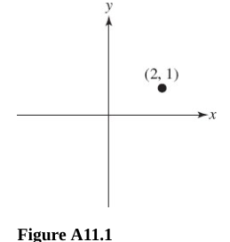
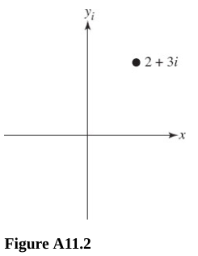
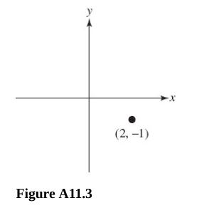
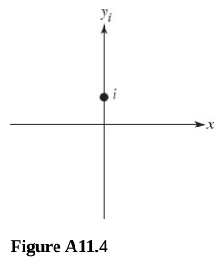
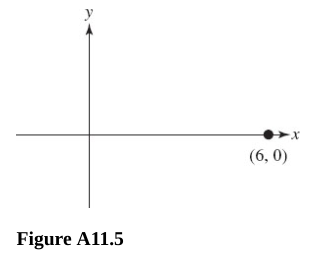

# Chapter 11 The Complex Numbers

---

## Polar Form

**437.** Plot the given complex number.

(A) $2 + i$

**Answer:**

Plotting complex numbers is somewhat similar to plotting standard Cartesian
$x$/$y$ coordinates. We simply refer to teh $x$ axis as the "real" axis, and the
$y$ axis as the "imaginary" axis, and otherwise it acts like a standard
cartesian graph:

(B) $2 + 3i$

**Answer:**

\(C\) $2 - i$

**Answer:**

(D) $i$

**Answer:**

(E) $6$

**Answer:**

---

**For questions 438-440,** give the polar (or trigonometric) form for the given
complex number.

---

**438.** $4 + 0i$

**Answer:**

$$ z = 4 + 0i $$

$$ z = a + bi $$

$$ r = \sqrt{a^2 + b^2} $$

$$ r = \sqrt{(4)^2 + (0)^2} $$

$$ r = \sqrt{16} $$

$$ r = 4 $$

$$ \theta = \tan^{-1}\left(\frac{b}{a}\right) $$

$$ \theta = \tan^{-1}\left(\frac{0}{4}\right) $$

$$ \theta = \tan^{-1}(0) $$

$$ \theta = 0 $$

$$ z = r[\cos\theta + i\sin\theta] $$

$$ z = 4[\cos(0) + i\sin(0)] $$

$$ \boxed{4[\cos(0) + i\sin(0)]} $$

---

**439.** $2\sqrt{3} - 2i$

**Answer:**

$$ z = 2\sqrt{3} - 2i $$

$$ r = \sqrt{(2\sqrt{3})^2 + (-2)^2} $$

$$ r = \sqrt{(4 \cdot 3) + 4} $$

$$ r = \sqrt{16} $$

$$ r = 4 $$

$$ \theta_r = \tan^{-1}\left(\frac{-2}{2\sqrt{3}}\right) $$

$$ \theta_r = -30\degree $$

$$ \theta = 360 - 30\degree = 330\degree $$

$$ z = 4[\cos(330\degree) + i\sin(330\degree)] $$

$$ \boxed{4[\cos(330\degree) + i\sin(330\degree)]} $$

Or:

$$ \boxed{4\left[\cos\left(\frac{11\pi}{6}\right) + i\sin\left(\frac{11\pi}{6}\right)\right]} $$

---

**440.** $5 + 5i$

**Answer:**

$$ z = 5 + 5i $$

$$ r = \sqrt{(5)^2 + (5)^2} $$

$$ r = \sqrt{25 + 25} $$

$$ r = \sqrt{50}$$

$$ r = 5\sqrt{2} $$

a$ \theta = \tan^{-1}\left(\frac{5}{5}\right) $$

$$ \theta = \tan^{-1}(1) $$

$$ \theta = \frac{\pi}{4} $$

$$ \boxed{5\sqrt{2}\left[\cos\left(\frac{\pi}{4}\right) + i\sin\left(\frac{\pi}{4}\right)\right]} $$

---

**For questions 442-444,** change the given complex number to polar form.

---

**442.**
$\sqrt{2}\left[\cos\left(\dfrac{5\pi}{4}\right) + i\sin\left(\dfrac{5\pi}{4}\right)\right]$

**Answer:**

$$ \sqrt{2}\left[\cos\left(\frac{5\pi}{4}\right) + i\sin\left(\frac{5\pi}{4}\right)\right] $$

$$ a = r\cos\theta $$

$$ a = \sqrt{2}\cos\left(\frac{5\pi}{4}\right) $$

$$ a = -1 $$

$$ b = r\sin\theta $$

$$ b = \sqrt{2}\sin\left(\frac{5\pi}{4}\right) $$

$$ b =  -1$$

$$ \boxed{-1 - i} $$

---

**443.** $4(\cos 0 + i \sin 0)$

**Answer:**

$$ 4(\cos 0 + i \sin 0) $$

$$ a = 4\cos 0 $$

$$ a = 4 $$

$$ b = 4\sin 0 $$

$$ b = 0 $$

$$ 4 + 0i $$

$$ \boxed{4} $$

---

**444.**
$4\left[\cos\left(\dfrac{11\pi}{6}\right) + i\sin\left(\dfrac{11\pi}{6}\right)\right]$

**Answer:**

$$ 4\left[\cos\left(\frac{11\pi}{6}\right) + i\sin\left(\frac{11\pi}{6}\right)\right] $$

$$ a = 4\cos\left(\frac{11\pi}{6}\right) $$

$$ a = 2\sqrt{3} $$

$$ b = -2 $$

$$ \boxed{2\sqrt{3} - 2i} $$

---

**For questions 445 and 446,** perform the operation indicated, and write the
result in $a + bi$ form.

---

**445.**
$2\left[\cos\left(\dfrac{\pi}{6}\right) + i\sin\left(\dfrac{\pi}{6}\right)\right] \cdot 3\left[\cos\left(\dfrac{\pi}{3}\right) + i\sin\left(\dfrac{\pi}{3}\right)\right]$

**Answer:**

$$ 2\left[\cos\left(\dfrac{\pi}{6}\right) + i\sin\left(\dfrac{\pi}{6}\right)\right] \cdot 3\left[\cos\left(\dfrac{\pi}{3}\right) + i\sin\left(\dfrac{\pi}{3}\right)\right] $$

$$ z_1 \cdot z_2 = (r_1)(r_1)[\cos(\theta_1 + \theta_2) + i\sin(\theta_1 + \theta_2)] $$

$$ (2)(3)\left[\cos\left(\frac{\pi}{6} + \frac{\pi}{3}\right) + i\sin\left(\frac{\pi}{6} + \frac{\pi}{3}\right)\right] $$

$$ 6\left[\cos\left(\frac{\pi}{2}\right) + i\sin\left(\frac{\pi}{2}\right)\right] $$

$$ a = 6\cos\left(\frac{\pi}{2}\right) $$

$$ a = 0 $$

$$ b = 6\sin\left(\frac{\pi}{2}\right) $$

$$ b = 6 $$

$$ 0 + 6i $$

$$ \boxed{6i} $$

---

**446.**
$\dfrac{12(\cos(200\degree) + i\sin(200\degree))}{3(\cos(350\degree) + i\sin(350\degree)}$

**Answer:**

$$ \frac{12(\cos(200\degree) + i\sin(200\degree))}{3(\cos(350\degree) + i\sin(350\degree)} $$

$$ \frac{z_1}{z_2} = \frac{r_1}{r_2}[\cos(\theta_1 - \theta_2) + i\sin(\theta_1 - \theta_2)] $$

$$ \frac{12}{3}[\cos(200\degree - 350\degree) + i\sin(200\degree - 350\degree)] $$

$$ 4[\cos(-150\degree) + i\sin(-150\degree)] $$

$$ 4[\cos(210\degree) + i\sin(210\degree)] $$

$$ a = 4\cos(210\degree) $$

$$ a = -2\sqrt{3} $$

$$ b = 4\sin(210\degree) $$

$$ b =  -2 $$

$$ \boxed{-2\sqrt{3} - 2i} $$

---

**447.** Use polar form to perform the given calculation.

$$ (1 + i)(\sqrt{2} - i\sqrt{2}) $$

**Answer:**

$$ z_1 = 1 + i $$

$$ r_1 = \sqrt{(1)^2 + (1)^2} $$

$$ r_1 = \sqrt{2} $$

$$ \theta_1 = \tan^{-1}\left(\frac{1}{1}\right) $$

$$ \theta_1 = \frac{\pi}{4} $$

$$ z_1 = \sqrt{2}\left[\cos\left(\frac{\pi}{4}\right) + i\sin\left(\frac{\pi}{4}\right)\right] $$

$$ z_2 = \sqrt{2} - i\sqrt{2} $$

$$ r_2 = \sqrt{(\sqrt{2})^2 + (-\sqrt{2})^2} $$

$$ r_2 = \sqrt{4} $$

$$ r_2 = 2 $$

$$ \theta_2 = \tan^{-1}\left(\frac{-\sqrt{2}}{\sqrt{2}}\right) $$

$$ \theta_2 = \tan^{-1}(1) $$

$$ \theta_2 = \frac{\pi}{4} $$

But because we are in Quadrant IV, this is actually:

$$ \theta_2 = \frac{7\pi}{4} $$

$$ z_2 = 2\left[\cos\left(\frac{7\pi}{4}\right) + i\sin\left(\frac{7\pi}{4}\right)\right] $$

$$ z_1 \cdot z_2 = 2\sqrt{2}\left[\cos\left(\frac{\pi}{4} + \frac{7\pi}{4}\right) + i\sin\left(\frac{\pi}{4} + \frac{7\pi}{4}\right)\right] $$

$$ z_1 \cdot z_2 = 2\sqrt{2}\left[\cos(2\pi) + i\sin(2\pi)\right] $$

$$ z_1 \cdot z_2 = 2\sqrt{2}(1 + 0i) $$

$$ z_1 \cdot z_2 = 2\sqrt{2}(1) $$

$$ z_1 \cdot z_2 = 2\sqrt{2} $$

$$ \boxed{2\sqrt{2}} $$

---

## Roots and De Moivre's Theorem

---

**448.** State De Moivre's theorem.

**Answer:**

Taken from the back of the book:

Let $n \in \Z$. Then
$[r(\cos\theta + i\sin\theta)]^n = r^n(\cos n\theta + i\sin n\theta)$

---

**449.** Find the indicated power.

$$ [3(\cos 10\degree + i\sin 10\degree)]^3 $$

**Answer:**

$$ 3^3[\cos(10\degree * 3) + i\sin(10\degree + 3)] $$

$$ 27[\cos(30\degree) + i\sin(30\degree)] $$

---

**For questions 450 and 451,** use De Moivre's theorem to rewrite each in
standard form.

---

**450.**
$\left[\cos\left(\dfrac{\pi}{3}\right) + i\sin\left(\dfrac{\pi}{3}\right)\right]^5$

**Answer:**

$$ 1^5\left[\cos\left(\frac{\pi}{3} \cdot 5\right) + i\sin\left(\frac{\pi}{3} \cdot 5\right)\right] $$

$$ 1\left[\cos\left(\frac{5\pi}{3}\right) + i\sin\left(\frac{5\pi}{3}\right)\right] $$

$$ a = r\cos\theta $$

$$ a = 1\cos\left(\frac{5\pi}{3}\right) $$

$$ a = \frac{1}{2} $$

$$ b = r\sin\theta $$

$$ b = 1\sin\left(\frac{5\pi}{3}\right) $$

$$ b = -\frac{\sqrt{3}}{2} $$

$$ \boxed{\frac{1}{2} - \frac{\sqrt{3}}{2}i} $$

---

**451.** $(\sqrt{3} + i)^{12}$

**Answer:**

$$ \sqrt{3} + i $$

$$ r = \sqrt{(\sqrt{3})^2 + (1)^2} $$

$$ r = \sqrt{4} $$

$$ r = 2 $$

$$ \theta = \tan^{-1}\left(\frac{1}{\sqrt{3}}\right) $$

$$ \theta = \tan^{-1}\left(\frac{\sqrt{3}}{3}\right) $$

$$ \theta = \frac{\pi}{6} $$

$$ 2\left[\cos\left(\frac{\pi}{6}\right) + i\sin\left(\frac{\pi}{6}\right)\right]^{12} $$

$$ 2^{12}\left[\cos\left(\frac{\pi}{6} \cdot 12\right) + i\sin\left(\frac{\pi}{6} \cdot 12\right)\right] $$

$$ 4096[\cos(2\pi) + i\sin(2\pi)] $$

$$ 4096[1 + 0i] $$

$$ 4096(1) $$

$$ \boxed{4096} $$

---

**For questions 452-454,** find the indicated roots.

---

**452.** The square roots of $i$

**Answer:**

First let's write this in standard form:

$$ z = 0 + 1i $$

Now let's convert to polar form:

$$ r = \sqrt{(0)^2 + (1)^2} $$

a$ r = \sqrt{1} $$

$$ r = 1 $$

Because taking the ArcTangent would yield an undefined answer, we have to graph
it and etermine that our complex number vector lies on the imaginary axis at
$y = 1$. This means it lies at the angle of $\theta = \dfrac{\pi}{2}$ or
$90\degree$.

In polar form we write this as:

$$ z = 1\left[\cos\left(\frac{\pi}{2}\right) + i\sin\left(\frac{\pi}{2}\right)\right] $$

We can then use De Moivre's Formula to express this:

$$ z_n = r^n\left[\cos(\theta + n) + i\sin(\theta + n)\right] $$

But if we're talking about counting the square roots, the form of De Moivre's
Formula changes slightly to accommodate for a fractional exponent:

$$ z_n = \sqrt[n]{r}\left[\cos\left(\frac{\theta + 2\pi k}{n}\right) + i\sin\left(\frac{\theta + 2\pi k}{n}\right)\right] \text{ for } k = 0, 1, \dots, n - 1 $$

We can now plug in our values for the first two square roots:

**Root 1:**

$$ k = 0 $$

$$ z_0 = \sqrt{1}\left[\cos\left(\frac{\dfrac{\pi}{2} + 2\pi(0)}{2}\right) + i\sin\left(\frac{\dfrac{\pi}{2} + 2\pi(0)}{2}\right)\right] $$

$$ z_0 = \cos\left(\frac{\pi}{4}\right) + i\sin\left(\frac{\pi}{4}\right) $$

$$ z_0 = \frac{\sqrt{2}}{2} + \frac{\sqrt{2}}{2}i $$

**Root 2:**

$$ z_1 = \sqrt{1}\left[\cos\left(\frac{\dfrac{\pi}{2} + 2\pi(1)}{2}\right) + i\sin\left(\frac{\dfrac{\pi}{2} + 2\pi(1)}{2}\right)\right] $$

$$ z_1 = \cos\left(\frac{5\pi}{4}\right) + i\sin\left(\frac{5\pi}{4}\right) $$

$$ z_1 = -\frac{\sqrt{2}}{2} - \frac{\sqrt{2}}{2}i $$

And these are our two answers for the square roots of $i$:

$$ \boxed{\frac{\sqrt{2}}{2} + \frac{\sqrt{2}}{2}i \text{, } -\frac{\sqrt{2}}{2} - \frac{\sqrt{2}}{2}i} $$

---

**453.** The cube roots of $-8$.

First let's write this in standard form:

$$ z = -8 + 0i $$

Now let's convert to polar form:

$$ r = \sqrt{(-8)^2 + (0)^2} $$

$$ r = \sqrt{64} $$

$$ r = 8 $$

$$ \theta = \tan^{-1}\left(\frac{0}{-8}\right) $$

$$ \theta = \tan^{-1}(0) $$

$$ \theta = 0 $$

But we know that This lies on the real axis at $-8$ inbetween Quadrant II and
Quadrant III, so:

$$ \theta = \pi $$

Let's write this in polar form:

$$ z = 8\left[\cos(\pi) + i\sin(\pi)\right] $$

We now can use the roots version of De Moivre's formula to solve for the cube
roots:

$$ z_n = \sqrt[n]{r}\left[\cos\left(\frac{\theta + 2\pi k}{n}\right) + i\sin\left(\frac{\theta + 2\pi k}{n}\right)\right] \text{ for } k = 0, 1, \dots, n - 1 $$

**Root 1:**

$$ z_0 = \sqrt[3]{8}\left[\cos\left(\frac{\pi + 2\pi(0)}{3}\right) + i\sin\left(\frac{\pi + 2\pi(0)}{3}\right)\right] $$

$$ z_0 = 2\left[\cos\left(\frac{\pi}{3}\right) + i\sin\left(\frac{\pi}{3}\right)\right] $$

$$ z_0 = 1 + \sqrt{3}i $$

**Root 2:**

$$ z_1 = \sqrt[3]{8}\left[\cos\left(\frac{\pi + 2\pi(1)}{3}\right) + i\sin\left(\frac{\pi + 2\pi(1)}{3}\right)\right] $$

$$ z_1 = 2[\cos(\pi) + i\sin(\pi)] $$

$$ z_1 = -2 + 0i $$

$$ z_1 = -2 $$

**Root 3:**

$$ z_2 = \sqrt[3]{8}\left[\cos\left(\frac{\pi + 2\pi(2)}{3}\right) + i\sin\left(\frac{\pi + 2\pi(2)}{3}\right)\right] $$

$$ z_2 = 2\left[\cos\left(\frac{5\pi}{3}\right) + i\sin\left(\frac{5\pi}{3}\right)\right] $$

$$ z_2 = 1 - \sqrt{3}i  $$

Answers:

$$ \boxed{1 + \sqrt{3}i \text{, } -2 \text{, } 1 - \sqrt{3}i} $$

---

**454.** The square roots of $1 + i\sqrt{3}$

Standard Form:

$$ z = 1 + i\sqrt{3} $$

$$ r = \sqrt{(1)^2 + (\sqrt{3})^2} $$

$$ r = \sqrt{1 + 3} $$

$$ r = \sqrt{4} $$

$$ r = 2 $$

$$ \theta = \tan^{-1}\left(\frac{\sqrt{3}}{1}\right) $$

$$ \theta = \frac{\pi}{3} $$

Quadrant I, this is fine.

Polar Form:

$$ z = 2\left[\cos\left(\frac{\pi}{3}\right) + i\sin\left(\frac{\pi}{3}\right)\right] $$

$$ z_n = \sqrt[n]{r}\left[\cos\left(\frac{\theta + 2\pi k}{n}\right) + i\sin\left(\frac{\theta + 2\pi k}{n}\right)\right] \text{ for } k = 0, 1, \dots, n - 1 $$

Root 1, $k = 0$:

$$ z_0 = \sqrt{2}\left[\cos\left(\frac{\dfrac{\pi}{3} + 2\pi(0)}{2}\right) + i\sin\left(\frac{\dfrac{\pi}{3} + 2\pi(0)}{2}\right)\right] $$

$$ z_0 = \sqrt{2}\left[\cos\left(\frac{\pi}{6}\right) + i\sin\left(\frac{\pi}{6}\right)\right] $$

$$ z_0 = \frac{\sqrt{6}}{2} + \frac{1}{\sqrt{2}}i $$

$$ z_0 = \frac{\sqrt{6}}{2} + \frac{\sqrt{2}}{2}i $$

Root 2, $k = 1$:

$$ z_1 = \sqrt{2}\left[\cos\left(\frac{\dfrac{\pi}{3} + 2\pi(1)}{2}\right) + i\sin\left(\frac{\dfrac{\pi}{3} + 2\pi(1)}{2}\right)\right] $$

$$ z_1 = \sqrt{2}\left[\cos\left(\frac{\dfrac{\pi}{3} + 2\pi(1)}{2}\right) + i\sin\left(\frac{\dfrac{\pi}{3} + 2\pi(1)}{2}\right)\right] $$

$$ z_1 = \sqrt{2}\left[\cos\left(\frac{7\pi}{6}\right) + i\sin\left(\frac{7\pi}{6}\right)\right] $$

$$ z_1 = -\frac{\sqrt{6}}{2} - \frac{1}{\sqrt{2}}i $$

$$ z_1 = -\frac{\sqrt{6}}{2} - \frac{\sqrt{2}}{2}i $$

Answers:

$$ \boxed{\frac{\sqrt{6}}{2} + \frac{\sqrt{2}}{2}i \text{, } -\frac{\sqrt{6}}{2} - \frac{\sqrt{2}}{2}i} $$

---

**455.** Solve $x^3 + 1 = 0$

**Answer:**

$$ x^3 = -1 $$

$$ z = -1 + 0i $$

$$ r = \sqrt{(-1)^2 + (0)^2} $$

$$ r = \sqrt{1} $$

$$ r = 1 $$

$$ \theta = \tan^{-1}\left(\frac{0}{-1}\right) $$

$$ \theta = \tan^{-1}(0) $$

$$ \theta = 0 $$

The vector lies at (-1, 0) along the Real axis inbetween Quadrants II and III:

$$ \theta = \pi $$

$$ z = 1\left[\cos(\pi) + i\sin(\pi)\right] $$

Root 1, $k = 0$:

$$ z_n = \sqrt[n]{r}\left[\cos\left(\frac{\theta + 2\pi k}{n}\right) + i\sin\left(\frac{\theta + 2\pi k}{n}\right)\right] \text{ for } k = 0, 1, \dots, n - 1 $$

$$ z_0 = \sqrt[3]{1}\left[\cos\left(\frac{\pi + 2\pi(0)}{3}\right) + i\sin\left(\frac{\pi + 2\pi(0)}{3}\right)\right] $$

$$ z_0 = 1\left[\cos\left(\frac{\pi}{3}\right) + i\sin\left(\frac{\pi}{3}\right)\right] $$

$$ z_0 = \frac{1}{2} + \frac{\sqrt{3}}{2}i $$

Root 2, $k = 1$:

$$ z_1 = \sqrt[3]{1}\left[\cos\left(\frac{\pi + 2\pi(1)}{3}\right) + i\sin\left(\frac{\pi + 2\pi(1)}{3}\right)\right] $$

$$ z_1 = 1\left[\cos(\pi) + i\sin(\pi)\right]$$

$$ z_1 = -1 + 0i $$

$$ z_1 = -1 $$

Root 3, $k = 2$

$$ z_2 = \sqrt[3]{1}\left[\cos\left(\frac{\pi + 2\pi(2)}{3}\right) + i\sin\left(\frac{\pi + 2\pi(2)}{3}\right)\right] $$

$$ z_2 = 1\left[\cos\left(\frac{5\pi}{3}\right) + i\sin\left(\frac{5\pi}{3}\right)\right]$$

$$ z_2 = \frac{1}{2} - \frac{\sqrt{3}}{2}i $$

Answers:

$$ \boxed{\frac{1}{2} + \frac{\sqrt{3}}{2}i \text{, } -1 \text{, } \frac{1}{2} - \frac{\sqrt{3}}{2}i} $$

---

**456.** Solve: $x^2 - (1 + i\sqrt{3}) = 0$

**Answer:**

$$ x^2 = 1 + i\sqrt{3} $$

$$ r = \sqrt{(1)^2 + (\sqrt{3})^2} $$

$$ r = \sqrt{1 + 3} $$

$$ r = \sqrt{4} $$

$$ r = 2 $$

$$ \theta = \tan^{-1}\left(\frac{\sqrt{3}}{1}\right) $$

$$ \theta = \frac{\pi}{3} $$

Quadrant I, fine.

$$ z = 2\left[\cos\left(\frac{\pi}{3}\right) + i\sin\left(\frac{\pi}{3}\right)\right] $$

$$ z_n = \sqrt[n]{r}\left[\cos\left(\frac{\theta + 2\pi k}{n}\right) + i\sin\left(\frac{\theta + 2\pi k}{n}\right)\right] \text{ for } k = 0, 1, \dots, n - 1 $$

Root 1, $k = 0$:

$$ z_0 = \sqrt{2}\left[\cos\left(\frac{\dfrac{\pi}{3} + 2\pi(0)}{2}\right) + i\sin\left(\frac{\dfrac{\pi}{3} + 2\pi(0)}{2}\right)\right] $$

$$ z_0 = \sqrt{2}\left[\cos\left(\frac{\pi}{6}\right) + i\sin\left(\frac{\pi}{6}\right)\right]$$

$$ z_0 = \frac{\sqrt{6}}{2} + \frac{\sqrt{2}}{2}i  $$

Root 2, $k = 1$:

$$ z_1 = \sqrt{2}\left[\cos\left(\frac{\dfrac{\pi}{3} + 2\pi(1)}{2}\right) + i\sin\left(\frac{\dfrac{\pi}{3} + 2\pi(1)}{2}\right)\right] $$

$$ z_1 = \sqrt{2}\left[\cos\left(\frac{7\pi}{6}\right) + i\sin\left(\frac{7\pi}{6}\right)\right] $$

$$ z_1 = -\frac{\sqrt{6}}{2} - \frac{\sqrt{2}}{2}i $$

Answers:

$$ \boxed{\frac{\sqrt{6}}{2} + \frac{\sqrt{2}}{2}i \text{, } -\frac{\sqrt{6}}{2} - \frac{\sqrt{2}}{2}i} $$
