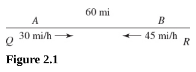
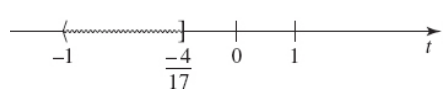
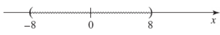
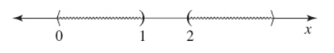
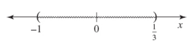

# Chapter 2 Equations and Inequalities

---

## Linear Equations

**For questions 42-42,** solve the given equation, if possible. In each case,
the replacement set for the variable is the set of real numbers.

---

**41.** $6x + 3 = 19x + 5$

**Answer:**

$$ 6x + 3 = 19x + 5 $$

$$ -2 = 13x $$

$$ \boxed{x = -\frac{2}{13}} $$

---

**42** $2(3x - 6) + 4(3x - 5) = 14x$

**Answer:**

$$ 2(3x - 6) + 4(3x - 5) = 14x $$

$$ 6x - 12 + 12x - 20 = 14x $$

$$ 6x - 12 + 12x - 20 - 14x = 0 $$

$$ 4x - 32 = 0 $$

$$ 4x = 32 $$

$$ \boxed{x = 8} $$

---

**For questions 43-49,** solve for $x$ or $y$ and check the given equation.

---

**43.** $x - 2(1 - 3x) = 6 + 3(4 - x)$

**Answer:**

$$ x - 2(1 - 3x) = 6 + 3(4 - x) $$

$$ x - 2 + 6x = 6 + 12 - 3x $$

$$ x - 2 + 6x - 6 - 12 + 3x = 0 $$

$$ 10x - 20 = 0 $$

$$ 10x = 20 $$

$$ \boxed{x = 2} $$

$$ (x) - 2(1 - 3(x)) \stackrel{?}{=} 6 + 3(4 - (x)) $$

$$ (2) - 2(1 - 3(2)) \stackrel{?}{=} 6 + 3(4 - (2)) $$

$$ 2 - 2 + 12 \stackrel{?}{=} 6 + 12 - 6 $$

$$ \boxed{12 = 12} $$

---

**44.** $ay + b = cy + d$

**Answer:**

$$ ay + b = cy + d $$

$$ ay - cy = d - b $$

$$ y(a - c) = d - b $$

$$ \boxed{y = \frac{d - b}{a - c}} $$

$$ a(y) + b = c(y) + d $$

$$ a\left(\frac{d - b}{a - c}\right) + b \stackrel{?}{=} c\left(\frac{d - b}{a - c}\right) + d $$

$$ a\left(\frac{d - b}{a - c}\right) - c\left(\frac{d - b}{a - c}\right) \stackrel{?}{=} d - b $$

$$ \left(\frac{d - b}{a - c}\right)(a - c) \stackrel{?}{=} d - b $$

$$ \boxed{\frac{d - b}{a - c} = \frac{d - b}{a - c}} $$

---

**45.** $\frac{3x - 2}{5} = 4 - \frac{1}{2}x$

**Answer:**

$$ \frac{3x - 2}{5} = 4 - \frac{1}{2}x $$

$$ \left(\frac{2}{1}\right)\left(\frac{3x - 2}{5}\right) = \left(4 - \frac{1}{2}x\right)\left(\frac{2}{1}\right) $$

$$ \frac{2(3x - 2)}{5} = 8 - x $$

$$ \frac{6x - 4}{5} = 8 - x $$

$$ \left(\frac{5}{1}\right)\left(\frac{6x - 4}{5}\right) = \left(8 - x\right)\left(\frac{5}{1}\right) $$

$$ 6x - 4 = 40 - 5x $$

$$ 11x = 44 $$

$$ \boxed{x = 4} $$

$$ \frac{3(x) - 2}{5} = 4 - \frac{1}{2}(x) $$

$$ \frac{3(4) - 2}{5} \stackrel{?}{=} 4 - \frac{1}{2}(4) $$

$$ \frac{12 - 2}{5} \stackrel{?}{=} 4 - 2 $$

$$ \frac{10}{5} \stackrel{?}{=} 2 $$

$$ \boxed{2 = 2} $$

---

**46.** $\frac{3x + 1}{3x - 1} = \frac{2x + 1}{2x - 3}$

**Answer:**

$$ \frac{3x + 1}{3x - 1} = \frac{2x + 1}{2x - 3} $$

$$ \left(\frac{3x - 1}{1}\right)\left(\frac{3x + 1}{3x - 1}\right) = \left(\frac{2x + 1}{2x - 3}\right)\left(\frac{3x - 1}{1}\right) $$

$$ (3x + 1) = \frac{(2x + 1)(3x - 1)}{2x - 3}$$

$$ (2x - 3)(3x + 1) = \left(\frac{(2x + 1)(3x - 1)}{2x - 3}\right)(2x - 3)$$

$$ (2x - 3)(3x + 1) = (2x + 1)(3x - 1) $$

$$ 6x^2 - 9x + 2x - 3 = 6x^2 + 3x - 2x - 1 $$

$$ -7x - 3 = x - 1 $$

$$ -2 = 8x $$

$$ \boxed{x = -\frac{1}{4}} $$

$$ \frac{3(x) + 1}{3(x) - 1} = \frac{2(x) + 1}{2(x) - 3} $$

$$ \frac{3\left(-\dfrac{1}{4}\right) + 1}{3\left(-\dfrac{1}{4}\right) - 1} \stackrel{?}{=} \frac{2\left(-\dfrac{1}{4}\right) + 1}{2\left(-\dfrac{1}{4}\right) - 3} $$

$$ \frac{\left(-\dfrac{3}{4}\right) + 1}{\left(-\dfrac{3}{4}\right) - 1} \stackrel{?}{=} \frac{\left(-\dfrac{2}{4}\right) + 1}{\left(-\dfrac{2}{4}\right) - 3} $$

$$ \frac{\dfrac{1}{4}}{-\dfrac{7}{4}} \stackrel{?}{=} \frac{\dfrac{1}{2}}{-\dfrac{7}{2}} $$

$$ \frac{1}{4} \cdot \left(-\frac{4}{7}\right) \stackrel{?}{=} \frac{1}{2} \cdot \left(-\frac{2}{7}\right)$$

$$ \boxed{-\frac{1}{7} = -\frac{1}{7}} $$

---

**47.** $\dfrac{1}{x - 3} - \dfrac{1}{x + 1} = \dfrac{3x - 2}{(x - 3)(x + 1)}$

**Answer:**

$$ \frac{1}{x - 3} - \frac{1}{x + 1} = \frac{3x - 2}{(x - 3)(x + 1)} $$

$$ \left(\frac{(x - 3)(x + 1)}{1}\right)\left(\frac{1}{x - 3} - \frac{1}{x + 1}\right) = \left(\frac{3x - 2}{(x - 3)(x + 1)}\right)\left(\frac{(x - 3)(x + 1)}{1}\right) $$

$$ (x + 1) - (x - 3) = 3x - 2 $$

$$ x + 1 - x + 3 = 3x - 2 $$

$$ 1 + 3 = 3x - 2 $$

$$ 4 = 3x - 2 $$

$$ 6 = 3x $$

$$ \boxed{x = 2} $$

$$ \frac{1}{(x) - 3} - \frac{1}{(x) + 1} = \frac{3(x) - 2}{((x) - 3)((x) + 1)} $$

$$ \frac{1}{(2) - 3} - \frac{1}{(2) + 1} = \frac{3(2) - 2}{((2) - 3)((2) + 1)} $$

$$ \frac{1}{-1} - \frac{1}{3} = \frac{6 - 2}{(-1)(3)} $$

$$ \frac{-3}{3} - \frac{1}{3} = \frac{4}{-3} $$

$$ \boxed{-\frac{4}{3} = -\frac{4}{3}} $$

---

**48.** $\dfrac{x^2 - 2}{x - 1} = x + 1 - \dfrac{1}{x - 1}$

**Answer:**

$$ \frac{x^2 - 2}{x - 1} = x + 1 - \frac{1}{x - 1} $$

$$ \left(\frac{x - 1}{1}\right)\left(\frac{x^2 - 2}{x - 1}\right) = \left(x + 1 - \frac{1}{x - 1}\right)\left(\frac{x - 1}{1}\right) $$

$$ x^2 - 2 = x(x - 1) + (x - 1) - 1 $$

$$ x^2 - 2 = x^2 - x + x - 1 - 1 $$

$$ x^2 - 2 = x^2 - 2 $$

$$ 0 = 0 $$

$$ \boxed{x \in \R} $$

---

**49.** $\dfrac{1}{x - 1} + \dfrac{1}{x - 3} = \dfrac{2x - 5}{(x - 1)(x - 3)}$

**Answer:**

$$ \frac{1}{x - 1} + \frac{1}{x - 3} = \frac{2x - 5}{(x - 1)(x - 3)} $$

$$ \left(\frac{(x - 1)(x - 3)}{1}\right)\left(\frac{1}{x - 1} + \frac{1}{x - 3}\right) = \left(\frac{2x - 5}{(x - 1)(x - 3)}\right)\left(\frac{(x - 1)(x - 3)}{1}\right) $$

$$ (x - 3) + (x - 1) = 2x - 5 $$

$$ 2x - 4 \neq 2x - 5 $$

$$ \boxed{\emptyset} $$

---

**50.** Find $k$ if the given number is a solution of the given equation.

(A) $12$, $2x + 5 = 3x + k$

**Answer:**

$$ 2x + 5 = 3x + k $$

$$ 2(12) + 5 = 3(12) + k $$

$$ 24 + 5 = 36 + k $$

$$ 29 = 36 + k $$

$$ \boxed{-7 = k} $$

(B) $2$, $x^2 + kx + 2 = 0$

**Answer:**

$$ x^2 + kx + 2 = 0 $$

$$ (2)^2 + k(2) + 2 = 0 $$

$$ 4 + 2k + 2 = 0 $$

$$ 2k + 6 = 0 $$

$$ 2k = -6 $$

$$ \boxed{k = -3} $$

---

**51.** The sum of two consecutive even integers is $10$. Find the integers.

**Answer:**

$$ x + (x + 2) = 10 $$

$$ 2x = 8 $$

$$ x = 4 $$

$$ x + 2 = 6 $$

$$ 4 + 6 = 10 $$

$$ \boxed{4 \text{, } 6} $$

---

**52.** The perimeter of a rectangle is $30 \text{m}$, and its length is twice
its width. Find the length and width of the rectangle.

**Answer:**

$$ 2w + 2(2w) = 30 $$

$$ 2w + 4w = 30 $$

$$ 6w = 30 $$

$$ w = 5 $$

$$ 2w = 10 $$

$$ \boxed{\text{width: } 5 \text{m, } \text{length: } 10 \text{m}} $$

---

**53.** Train $A$ leaves station $Q$ at the same time as train $B$ leaves
station $R$. Train $A$ travels at a rate of $30$ miles per hour (mi/h) directly
towards $R$, and $B$ travels at 45 mi/h directly toward $Q$. How many miles must
$A$ travel before the trains meet if the stations are $60$ miles apart? (See
Figure 2.1).

**Answer:**

$$ x = \text{miles train A must travel before the two trains meet} $$

$$ D = R \cdot T $$

| Train | Distance(D) | Rate\(R\) | Time(T)              |
| ----- | ----------- | --------- | -------------------- |
| $A$   | $x$         | $30$      | $\dfrac{x}{30}$      |
| $B$   | $60 - x$    | $45$      | $\dfrac{60 - x}{45}$ |

$$ \frac{x}{30} = \frac{60 - x}{45} $$

$$ \frac{45x}{30} = 60 - x $$

$$ 45x = 30(60 - x) $$

$$ 45x = 1800 - 30x $$

$$ 75x = 1800 $$

$$ \boxed{x = 24 \text{ miles}} $$

---

**54.** The sale price on a camera after a $20$ percent discount is $\$72$. What
was the price before the discount?

**Answer:**

$$ x = \text{the price of the camera before the discount} $$

$$ 0.8x = 72 $$

$$ \frac{4}{5}x = 72 $$

$$ x = 72\left(\frac{5}{4}\right)$$

$$ \boxed{x = \$90} $$

---

**55.** Suppose Kate can paint a particular room in $6$ hours. At what minimum
rate must her helper be able to paint the room alone if together they must
complete the job in $3\dfrac{3}{7}$ hours?

**Answer:**

$$ x = \text{ hours it would take Kate's helper to paint the room alone} $$

$$ \frac{1}{x} = \text{ amount of the job completed by Kate's helper in 1 hour} $$

$$ \frac{1}{6} = \text{ amount of the job completed by Kate in 1 hour} $$

$$ \frac{1}{6} + \frac{1}{x} = \left(\frac{1}{3 + \dfrac{3}{7}}\right)\left(3 + \frac{3}{7}\right) $$

$$ \frac{1}{6} + \frac{1}{x} = \left(\frac{1}{\dfrac{24}{7}}\right)\left(\dfrac{24}{7}\right) $$

NOTE: The answer they give makes little sense. consult Paul's Math Notes on this
one.

---

**56.** Barbara is twice as old as Mary, and Dick is three times as old as
Barbara. Their average age is $36$. How old is Barbara?

**Answer:**

$$ x = \text{ Barabara's age in years} $$

$$ \frac{x}{2} = \text{ Mary's Age in years} $$

$$ 3x = \text{ Dick's age in years} $$

$$ \frac{x + \dfrac{x}{2} + 3x}{3} = 36 $$

$$ \frac{\dfrac{2x}{2} + \dfrac{x}{2} + \dfrac{6x}{2}}{3} = 36 $$

$$ \frac{\dfrac{9x}{2}}{3} = 36 $$

$$ \frac{9x}{2} \cdot \frac{1}{3} = 36 $$

$$ \frac{9x}{6} = 36 $$

$$ 9x = 216 $$

$$ \boxed{x = 24 \text{ years old}} $$

---

**57.** Juanita has nickels and dimes in her pocket. Their total value is $\$1$,
and there are twice as many dimes as nickels. How many nickels does she have?

**Answer:**

$$ n = \text{ number of nickels Juanita has} $$

$$ 2n = \text{ number of dimes Juanita has} $$

$$ 0.05n + 0.10(2n) = 1 $$

$$ \frac{5n}{100} + \frac{10(2n)}{100} = 1 $$

$$ \frac{5n}{100} + \frac{20n}{100} = 1 $$

$$ \frac{25n}{100} = 1 $$

$$ \frac{1}{4}n = 1 $$

$$ \boxed{n = 4 \text{ nickels}} $$

---

## Nonlinear Equations

---

**For questions 58-67,** solve the given equation. Leave any answer containing a
radical in simplest radical form.

---

**58.** $x^2 = 9$

**Answer:**

$$ x^2 = 9 $$

$$ x = \pm \sqrt{9} $$

$$ \boxed{x = \pm 3} $$

---

**59.** $t^2 + 5 = 0$

**Answer:**

$$ t^2 + 5 = 0 $$

$$ t^2 = -5 $$

$$ t = \pm \sqrt{-5} $$

$$ \boxed{t = \pm i\sqrt{5}} $$

---

**60.** $4x^2 - 7 = 0$

**Answer:**

$$ 4x^2 - 7 = 0 $$

$$ 4x^2 = 7 $$

$$ x^2 = \frac{7}{4} $$

$$ x = \pm \sqrt{\frac{7}{4}} $$

$$ \boxed{x = \pm \frac{\sqrt{7}}{2}} $$

---

**61.** $(n + 5)^2 = 9$

**Answer:**

$$ (n + 5)^2 = 9 $$

$$ n + 5 = \pm \sqrt{9} $$

$$ n + 5 = \pm 3 $$

$$ n = -5 \pm 3 $$

$$ n = -5 + 3 \text{, } n = -5 - 3 $$

$$ \boxed{n = -2 \text{, } n = -8} $$

---

**62.** $x^2 + 3x + 2 = 0$

**Answer:**

$$ x^2 + 3x + 2 = 0 $$

$$ (x + 1)(x + 2) = 0 $$

$$ x + 1 = 0 $$

$$ x = -1 $$

$$ x + 2 = 0 $$

$$ x = -2 $$

$$ \boxed{x = -1 \text{, } x = -2} $$

$$ (-1)^2 + 3(-1) + 2 \stackrel{?}{=} 0 $$

$$ 1 - 3 + 2 \stackrel{?}{=} 0 $$

$$ -2 + 2 \stackrel{?}{=} 0 $$

$$ \boxed{0 = 0} $$

$$ (-2)^2 + 3(-2) + 2 \stackrel{?}{=} 0 $$

$$ 4 - 6 + 2 \stackrel{?}{=} 0 $$

$$ -2 + 2 \stackrel{?}{=} 0 $$

$$ \boxed{0 = 0} $$

---

**63.** $2t^2 - 2t = 12$

**Answer:**

$$ 2t^2 - 2t = 12 $$

$$ \frac{2t^2 - 2t}{2} = \frac{12}{2} $$

$$ t^2 - t = 6 $$

$$ t^2 - t - 6 = 0 $$

$$ (t - 3)(t + 2) = 0 $$

$$ t - 3 = 0 $$

$$ t = 3 $$

$$ t = -2 $$

$$ \boxed{t = 3 \text{, } t = -2} $$

$$ 2(3)^2 - 2(3) \stackrel{?}{=} 12 $$

$$ 2(9) - 6 \stackrel{?}{=} 12 $$

$$ 18 - 6 \stackrel{?}{=} 12 $$

$$ \boxed{12 = 12} $$

$$ 2(-2)^2 - 2(-2) \stackrel{?}{=} 12 $$

$$ 2(4) + 4 \stackrel{?}{=} 12 $$

$$ 8 + 4 \stackrel{?}{=} 12 $$

$$ \boxed{12 = 12} $$

---

**64.** $x^2 + x - 1 = 0$

**Answer:**

$$ x^2 + x - 1 = 0 $$

$$ x = \frac{-(1) \pm \sqrt{(1)^2 - 4(1)(-1)}}{2(1)} $$

$$ \boxed{x = \frac{-1 \pm \sqrt{5}}{2}} $$

---

**65.** $x^2 + 4x + 1 = 0$

**Answer:**

$$ x^2 + 4x + 1 = 0 $$

$$ x^2 + 4x + 4 - 4 + 1 = 0 $$

$$ (x^2 + 4x + 4) - 4 + 1 = 0 $$

$$ (x + 2)(x + 2) - 4 + 1 = 0 $$

$$ (x + 2)^2 - 4 + 1 = 0 $$

$$ (x + 2)^2 - 3 = 0 $$

$$ (x + 2)^2 = 3 $$

$$ x + 2 = \pm \sqrt{3} $$

$$ \boxed{x = -2 \pm \sqrt{3}} $$

---

**66.** $(x^2 - 3)(x^2 - 4) = 0$

**Answer:**

$$ (x^2 - 3)(x^2 - 4) = 0 $$

$$ x^2 - 3 = 0 $$

$$ x^2 = 3 $$

$$ x = \pm \sqrt{3} $$

$$ x^2 - 4 = 0 $$

$$ x^2 = 4 $$

$$ x = \pm \sqrt{4} $$

$$ x = \pm 2 $$

$$ \boxed{x = \sqrt{3} \text{, } x = -\sqrt{3} \text{, } x = 2 \text{, } x = -2} $$

---

**67.** $8y^{-2} + 6y^{-1} + 1 = 0$

$$ 8y^{-2} + 6y^{-1} + 1 = 0 $$

$$ 8\left(\frac{1}{y^2}\right) + 6\left(\frac{1}{y^1}\right) + 1 = 0 $$

$$ \frac{8}{y^2} + \frac{6}{y} + 1 = 0 $$

$$ \frac{8}{y^2} + \left(\frac{6}{y}\right)\left(\frac{y}{y}\right) + 1\left(\frac{y^2}{y^2}\right) = 0 $$

$$ \frac{8}{y^2} + \frac{6y}{y^2} + \frac{y^2}{y^2} = 0 $$

$$ \frac{8 + 6y + y^2}{y^2} = 0 $$

$$ y^2 + 6y + 8 = 0 $$

$$ (y + 2)(y + 4) = 0 $$

$$ y + 2 = 0 $$

$$ y = -2 $$

$$ y + 4 = 0 $$

$$ y = -4 $$

$$ \boxed{y = -2 \text{, } y = -4} $$

---

**68.** Find the discriminant.

(A) $Z^2 + 5Z - 6 = 0$

(B) $S^2 + 5S = 3$

**Answer:**

$$ D = b^2 - 4ac $$

(A)

$$ D = (5)^2 - 4(1)(-6) $$

$$ D = 25 + 24 $$

$$ \boxed{D = 49} $$

(B)

$$ S^2 + 5S = 3 $$

$$ S^2 + 5S - 3 = 0 $$

$$ D = (5)^2 - 4(1)(-3) $$

$$ D = 25 + 12 $$

$$ \boxed{D = 37} $$

---

**69.** Determine whether the equation has real roots.

(A) $x^2 + 11x + 11 = 0$

(B) $x^2 - 3x + \dfrac{9}{4} = 0$

\(C\) $2x^2 + x + 1 = 0$

**Answers:**

(A)

$$ x^2 + 11x + 11 = 0 $$

$$ x = \frac{-(11) \pm \sqrt{(11)^2 - 4(1)(11)}}{2(1)} $$

$$ x = \frac{-11 \pm \sqrt{121 - 44}}{2} $$

$$ x = \frac{-11 \pm \sqrt{77}}{2} $$

$$ \text{HAS TWO REAL ROOTS} $$

(B)

$$ x^2 - 3x + \frac{9}{4} = 0 $$

$$ x = \frac{-(-3) \pm \sqrt{(-3)^2 - 4(1)\left(\dfrac{9}{4}\right)}}{2(1)} $$

$$ x = \frac{3 \pm \sqrt{0}}{2} $$

$$ x = \frac{3}{2} $$

$$ \text{HAS ONE REAL ROOT} $$

\(C\)

$$ 2x^2 + x + 1 = 0 $$

$$ x = \frac{-(1) \pm \sqrt{(1)^2 - 4(2)(1)}}{2(2)} $$

$$ x = \frac{-1 \pm \sqrt{-7}}{4} $$

$$ x = \frac{-1 \pm i\sqrt{7}}{4} $$

$$ \text{HAS NO REAL ROOTS} $$

---

**70.** Reduce the given equation to a quadratic and solve.

$$ \sqrt{3w - 2} - \sqrt{w} = 2 $$

**Answer:**

$$ \sqrt{3w - 2} - \sqrt{w} = 2 $$

$$ \sqrt{3w - 2} = 2 + \sqrt{w} $$

$$ (\sqrt{3w - 2})^2 = (2 + \sqrt{w})^2 $$

$$ 3w - 2 = (2 + \sqrt{w})(2 + \sqrt{w}) $$

$$ 3w - 2 = 4 + 4\sqrt{w} + w $$

$$ 2w - 6 = 4\sqrt{w} $$

$$ (2w - 6)^2 = (4\sqrt{w})^2 $$

$$ (2w - 6)(2w - 6) = 16w $$

$$ 4w^2 - 12w - 12w + 36 = 16w $$

$$ 4w^2 - 24w + 36 = 16w $$

$$ 4w^2 - 40w + 36 = 0 $$

$$ (4w - 36)(w - 1) = 0 $$

$$ 4w - 36 = 0 $$

$$ 4w = 36 $$

$$ w = 9 $$

$$ w - 1 = 0 $$

$$ w = 1 $$

$$ \sqrt{3(9) - 2} - \sqrt{(9)} \stackrel{?}{=} 2 $$

$$ \sqrt{27 - 2} - \sqrt{9} \stackrel{?}{=} 2 $$

$$ \sqrt{25} - \sqrt{9} \stackrel{?}{=} 2 $$

$$ 5 - 3 \stackrel{?}{=} 2 $$

$$ \boxed{2 = 2} $$

$$ \sqrt{3(1) - 2} - \sqrt{(1)} \stackrel{?}{=} 2 $$

$$ \sqrt{3 - 2} - \sqrt{1} \stackrel{?}{=} 2 $$

$$ \sqrt{1} - \sqrt{1} \stackrel{?}{=} 2 $$

$$ 1 - 1 \stackrel{?}{=} 2 $$

$$ 0 \neq 2 $$

$$ \boxed{w = 9} $$

---

**71.** The height (in feet) of a ball thrown vertically upward above the ground
in $t$ second(s) is given by $h = 128t - 16t^2$. In how many seconds will the
ball be $192$ ft high?

**Answer:**

$$ 192 = 128t - 16t^2 $$

$$ 16t^2 - 128t + 192 = 0 $$

$$ t = \frac{-(-128) \pm \sqrt{(-128)^2 - 4(16)(192)}}{2(16)} $$

$$ t = \frac{128 \pm \sqrt{16384 - 12288}}{32} $$

$$ t = \frac{128 \pm \sqrt{4096}}{32} $$

$$ t = \frac{128 \pm 64}{32} $$

$$ t = 6 \text{, } t = 2 $$

$$ 192 \stackrel{?}{=} 128(6) - 16(6)^2 $$

$$ 192 \stackrel{?}{=} 768 - 16(36) $$

$$ 192 \stackrel{?}{=} 768 - 576 $$

$$ \boxed{192 = 192} $$

$$ 192 \stackrel{?}{=} 128(2) - 16(2)^2 $$

$$ 192 \stackrel{?}{=} 256 - 16(4) $$

$$ 192 \stackrel{?}{=} 256 - 64 $$

$$ \boxed{192 = 192} $$

$$ \boxed{t = 6 \text{ seconds, } t = 2 \text{ seconds}} $$

---

**72.** If $P$ dollars are invested at $r$ percent compounded annually, at the
end of $2$ years the amount will be $A = P(1 + r)^2$. At what interest rate will
$\$1000$ increase to $\$1400$ in $2$ years?

**Answer:**

$$ A = P(1 + r)^2 $$

$$ 1400 = 1000(1 + r)^2 $$

$$ 1.400 = (1 + r)^2 $$

$$ \frac{7}{5} = (1 + r)^2 $$

$$ \pm \sqrt{\frac{7}{5}} = 1 + r $$

$$ -1 \pm \sqrt{\frac{7}{5}} = r $$

$$ r \approx 0.18 \text{, } $$

$$ \boxed{r \approx 18\%} $$

NOTE: Discprepancy in $A$, answer is for $\$1440$.

---

**73.** Find two consecutive positive integers whose product is 210.

**Answer:**

$$ x(x + 1) = 210 $$

$$ x^2 + x = 210 $$

$$ x^2 + x - 210 = 0 $$

$$ x = \frac{-(1) \pm \sqrt{(1)^2 - 4(1)(-210)}}{2(1)} $$

$$ x = \frac{-1 \pm \sqrt{841}}{2} $$

$$ x = \frac{-1 \pm 29}{2} $$

Omit the negative.

$$ x = \frac{-1 + 29}{2} $$

$$ x = \frac{28}{2} $$

$$ x = 14 $$

$$ (14)((14) + 1) = 210 $$

$$ (14)(15) = 210 $$

$$ \boxed{210 = 210} $$

$$ \boxed{x = 14 \text{, } x + 1 = 15} $$

---

**74.** Write an algebraic expression for each statement.

(A) $3y$ less than $4$ times $z$ is nonpositive.

(B) $5$ times $t$ is less than or equal to $3$ less than $3$ times negative $y$.

\(C\) $5$ times $t$ is more than $3$ more than $3$ times $y$.

(D) $5$ times $t$ is $3$ more than $3$ times $y$.

(E) $5$ times $t$ is more than $3$ times $y$.

**Answers:**

(A)

$$ 4z - 3y < 0 $$

(B)

$$ 5t \leq 3(-y) - 3 $$

Or:

$$ 5t \leq -3y - 3 $$

\(C\)

$$ 5t > 3 + 3y $$

(D)

$$ 5t = 3 + 3y $$

(E)

$$ 5t > 3y $$

---

**75.** Is the given number a solution of the given inequality?

(A) $-x + 5 \geq 0$ ; $3$

(B) $\dfrac{4}{x} + 3 \geq \dfrac{1}{x}$ ; $\dfrac{1}{2}$

\(C\) $x^{-1} + 1 < x^{-2} - 2$ ; $1$

**Answers:**

(A)

$$ -(3) + 5 \geq 0 $$

$$ -3 + 5 \geq 0 $$

$$ 2 \geq 0 $$

$$ \boxed{3 \text{ is a solution}} $$

(B)

$$ \frac{4}{\left(\dfrac{1}{2}\right)} + 3 \geq \frac{1}{\left(\dfrac{1}{2}\right)} $$

$$ 8 + 3 \geq 2 $$

$$ 11 \geq 2 $$

$$ \boxed{\frac{1}{2} \text{ is a solution}} $$

\(C\)

$$ (1)^{-1} + 1 < (1)^{-2} - 2 $$

$$ 1 + 1 < 1 - 2 $$

$$ 2 < -1 $$

$$ \boxed{1 \text{ is not a solution}} $$

---

**For questions 76-78,** solve the given inequality (if possible).

---

**76.** $14t \leq 3t - 4$

**Answer:**

$$ 14t \leq 3t - 4 $$

$$ 14t \leq 3t - 4 $$

$$ 11t \leq -4 $$

$$ \boxed{t \leq -\frac{4}{11}} $$

---

**77.** $-3s > 5s + 2$

**Answer:**

$$ -3s > 5s + 2 $$

$$ -8s > 2 $$

$$ s < \frac{2}{-8} $$

$$ \boxed{s < -\frac{1}{4}} $$

---

**78.** $-6 < x + 2 < 10$

**Answer:**

$$ -6 < x + 2 < 10 $$

$$ \boxed{-8 < x < 8} $$

---

**For questions 79-80,** an inequality is given. Graph the solution, and
indicate the solution using interval notation.

**79.** $14t \leq -3t - 4$

**Answer:**

$$ 14t \leq -3t - 4 $$

$$ 17t \leq -4 $$

$$ t \leq -\frac{4}{17} $$

$$ \boxed{\left(-\infty, -\frac{4}{17}\right]} $$

---

**80.** $-6 < x + 2 < 10$

**Answer:**

$$ -6 < x + 2 < 10 $$

$$ -8 < x < 8 $$

$$ \boxed{(-8, 8)} $$

---

**81.** $a$, $b < 0$, and $a > b$. Tell whether each statement is true or false.
If it is false, give a counterexample.

(A) $a^2 > b^2$

(B) $ab < b^2$

\(C\) $a(a - b) > b(a - b)$

(D) $ab(a - b) > 0$

(E) $\dfrac{(a - b)^3}{b} > 0$

The established rules:

$$ a < 0 $$

$$ b < 0 $$

$$ a > b $$

**Answers:**

(A)

$$ a^2 > b^2 $$

False, consider:

$$ a = -1 \text{, } b = -2 $$

This fulfills our established rules:

$$ -1 < 0 $$

$$ -2 < 0 $$

$$ -1 > -2 $$

But if we plug our values into this we don't get a true statement:

$$ a^2 > b^2 $$

$$ (-1)^2 > (-2)^2 $$

$$ 1 > 4 $$

And therefore this statement is False.

(B)

$$ ab < b^2 $$

True. Because on both sides we reverse the sign, and thusly reverse the
inequality.

\(C\)

$$ a(a - b) > b(a - b) $$

$$ a = -1 $$

$$ b = -2 $$

$$ (-1)((-1) - (-2)) > (-2)((-1) - (-2)) $$

$$ (-1)((-1) + 2) > (-2)((-1) + 2) $$

$$ (-1)(1) > (-2)(1) $$

$$ -1 > -2 $$

True. $a > b$ implies $a - b > 0$. Multiplying both sides by $(a - b)$ maintains
the inequality.

(D)

$$ ab(a - b) > 0 $$

True, $(a - b)$ will always be positive, as will multiplying two negatives $ab$.
Multiplying these two positive numbers will yield a positive product.

(E)

$$ \frac{(a - b)^3}{b} > 0 $$

False, although $(a - b)^3$ will yield a positive number, dividing by $b$, which
is guaranteed to be a negative number, will always produce a negative number on
the left side of our inequality.

$$ a = -1 $$

$$ b = -2 $$

$$ \frac{(a - b)^3}{b} > 0 $$

$$ \frac{((-1) - (-2))^3}{(-2)} > 0 $$

$$ \frac{(1)^3}{(-2)} > 0 $$

$$ \frac{1}{(-2)} > 0 $$

$$ -\frac{1}{2} > 0 $$

---

**82.** Let $a$ and $b$ be positive integers whose sum is less than $12$.

(A) If we know that $a$ is either $1$ or $2$, how many possible choices are
there for $b$ ?

(B) How many possibilities are there altogether for $a$ and $b$ ?

**Answers:**

The established rules:

$$ a > 0 $$

$$ b > 0 $$

$$ a + b < 12 $$

(A)

$$ a + b < 12 $$

$$ (1) + b < 12 $$

$$ b < 11 $$

$$ \text{possible choices for } b \text{ so far: } 10 $$

$$ (2) + b < 12 $$

$$ b < 10 $$

$$ \text{possible choices for } b \text{ : } 10 + 9 = 19 $$

(B)

| Value for $a$ | Number of Choices    |
| ------------- | -------------------- |
| $a = 1$       | $10$ choices for $b$ |
| $a = 2$       | $9$ choices for $b$  |
| $a = 3$       | $8$ choices for $b$  |
| $a = 4$       | $7$ choices for $b$  |
| $a = 5$       | $6$ choices for $b$  |
| $a = 6$       | $5$ choices for $b$  |
| $a = 7$       | $4$ choices for $b$  |
| $a = 8$       | $3$ choices for $b$  |
| $a = 9$       | $2$ choices for $b$  |
| $a = 10$      | $1$ choice for $b$   |

$$ 10 + 9 + 8 + 7 + 6 + 5 + 4 + 3 + 2 + 1 = \boxed{55 \text{ choices}} $$

---

## Absolute Value

$$
|x| =
\begin{cases}
x \quad x \geq 0 \\
-x \quad x < 0 \\
\end{cases}
$$

or

$$ |x| = \sqrt{x^2} $$

---

**For questions 83 - 89,** solve each equation or inequality, if possible.

**83.** $|x| = 6$

**Answer:**

$$
|x| =
\begin{cases}
6 \quad x \geq 0 \\
-6 \quad x < 0 \\
\end{cases}
$$

$$ x = 6 \text{, } x = -6 $$

---

**84.** $|x| < 5$

**Answer:**

$$ -5 < x < 5 $$

$$ (-5, 5) $$

---

**85.** $|x| < -10$

This is not possible, since the Absolute Value of any number will always return
a positive value or 0.

$$ |x| \geq 0 $$

---

**86.** $|x - 4| = 3$

$$ |7 - 4| = 3 $$

$$ |3| = 3 $$

$$ |1 - 4| = 3 $$

$$ |-3| = 3 $$

$$ x = 7 \text{, } x = 1 $$

---

**87.** $|t - 2| \geq 5$

$$ |7 - 2| \geq 5 $$

$$ |5| \geq 5 $$

$$ |-3 - 2| \geq 5 $$

$$ |-5| \geq 5 $$

Any number greater than or equal to $7$, or any number less than or equal to
$-3$ will satisfy this inequality:

$$ t \geq 7 \text{, } t \leq -3 $$

$$ (-\infty, -3] \cup [7, \infty) $$

---

**88.** $|2x - 5| < 10$

$$ -10 < 2x - 5 < 10 $$

$$ -5 < 2x < 15 $$

$$ -\frac{5}{2} < x < \frac{15}{2} $$

$$ \left(-\frac{5}{2}, \frac{15}{2}\right) $$

---

**89.** $|1 - x| < 5$

$$ -5 < 1 - x < 5 $$

$$ -6 < -x < 4 $$

$$ 6 > x > -4 $$

$$ -4 < x < 6 $$

$$ (-4, 6) $$

---

## Nonlinear Inequalities

---

**For questions 90-92,** solve the given inequality. Graph the solution set for
each even-numbered problem, and express each odd-numbered solution set in
interval form.

---

**90.** $x^2 - 3x + 2 > 0$

**Answer:**

$$ x^2 - 3x + 2 > 0 $$

$$ x^2 - 3x + 2 > 0 $$

$$ (x - 2)(x - 1) > 0 $$

$$ x - 2 > 0 $$

$$ x > 2 $$

$$ x > 1 $$

$$ x > 2 $$

$$ (-\infty, 1) \cup (2, \infty) $$

---

**91.** $3x^2 + x > 0$

**Answer:**

$$ 3x^2 + x > 0 $$

$$ x(3x + 1) > 0 $$

$$ 3x + 1 > 0 $$

$$ 3x > -1 $$

$$ x > -\frac{1}{3} $$

$$ x > 0 $$

$$ \left(-\infty, -\frac{1}{3}\right) \cup (0, \infty) $$

---

**92.** $3x^2 < -2x + 1$

**Answer:**

$$ 3x^2 < -2x + 1 $$

$$ 3x^2 + 2x - 1 < 0 $$

$$ (3x - 1)(x + 1) < 0 $$

$$ 3x - 1 < 0 $$

$$ 3x < 1 $$

$$ x < \frac{1}{3} $$

$$ x + 1 < 0 $$

$$ x < -1 $$

$$ \left(-1, \frac{1}{3}\right) $$

---

## Miscellaneous Problems

---

**93.** Solve for $x$ : $\sqrt{5x - 1} - \sqrt{x} = 1$

**Answer:**

$$ \sqrt{5x - 1} - \sqrt{x} = 1 $$

$$ \sqrt{5x - 1} = 1 + \sqrt{x} $$

$$ 5x - 1 = (1 + \sqrt{x})(1 + \sqrt{x}) $$

$$ 5x - 1 = 1 + 2\sqrt{x} + x $$

$$ 4x - 2 = 2\sqrt{x} $$

$$ 2x - 1 = \sqrt{x} $$

$$ (2x - 1)(2x - 1) = x $$

$$ 4x^2 - 4x + 1 = x $$

$$ 4x^2 - 5x + 1 = 0 $$

$$ (4x - 1)(x - 1) = 0 $$

$$ 4x - 1 = 0 $$

$$ 4x = 1 $$

$$ x = \frac{1}{4} $$

$$ x - 1 = 0 $$

$$ x = 1 $$

$$ x = 1 \text{, } x = \frac{1}{4} $$

$$ \sqrt{5(1) - 1} - \sqrt{(1)} \stackrel{?}{=} 1 $$

$$ \sqrt{4} - \sqrt{1} \stackrel{?}{=} 1 $$

$$ 2 - 1 \stackrel{?}{=} 1 $$

$$ \boxed{1 = 1} $$

$$ \sqrt{5\left(\frac{1}{4}\right) - 1} - \sqrt{\left(\frac{1}{4}\right)} \stackrel{?}{=} 1 $$

$$ \sqrt{\frac{1}{4}} - \sqrt{\left(\frac{1}{4}\right)} \stackrel{?}{=} 1 $$

$$ 0 \neq 1 $$

$$ \boxed{x = 1} $$

---

**94.** Determine the character of the roots.

(A) $x^2 - 8x + 9 = 0$

**Answer:**

$$ b^2 - 4ac $$

$$ (-8)^2 - 4(1)(9) $$

$$ 64 - 36 $$

$$ 28 $$

Since $28 > 0$ and $28$ is not a perfect square, the roots are irrational and
unequal.

(B) $3x^2 - 8x + 9 = 0$

**Answer:**

$$ b^2 - 4ac $$

$$ (-8)^2 - 4(3)(9) $$

$$ 64 - 108 = -44 $$

Since $-44 < 0$ , the roots are imaginary and unequal.

\(C\) $6x^2 - 5x - 6 = 0$

**Answer:**

$$ b^2 - 4ac $$

$$ (-5)^2 - 4(6)(-6) $$

$$ 25 + 144 $$

$$ 169 $$

Since $169 > 0$ and is a perfect square, $169 = 13^2$. The roots are rational
and equal.

(D) $4x^2 - 4\sqrt{3}x + 3 = 0$

**Answer:**

$$ b^2 - 4ac $$

$$ (-4\sqrt{3})^2 - 4(4)(3) $$

$$ 48 - 48 $$

$$ 0 $$

The roots are real and equal.

The roots are:

$$ x = \frac{-(-4\sqrt{3}) \pm \sqrt{(-4\sqrt{3})^2 - 4(4)(3)}}{2(4)} $$

$$ x = \frac{4\sqrt{3} \pm \sqrt{(48 - 48}}{8} $$

$$ x = \frac{4\sqrt{3}}{8} $$

$$ x = \frac{\sqrt{3}}{2} $$

---

**95.** Two pipes together can fill a resevoir in 6 h 40 min. Find the time each
alone will take to fill the resevoir if one of the pipes can fill it in 3 h less
time than the other.

**Answer:**

$$ x = \text{time it takes the smaller pipe to fill the resevoir} $$

$$ x - 3 = \text{time it takes the larger pipe to fill the resevoir} $$

$$ \frac{1}{x} = \text{the rate at which the smaller pipe fills} $$

$$ \frac{1}{x - 3} = \text{the rate at which the larger pipe fills} $$

$$ \frac{1}{6 + \dfrac{40}{60}} = \text{the rate at which the resevoir is filled} $$

$$ \frac{1}{x} + \frac{1}{x - 3} = \frac{1}{6 + \dfrac{40}{60}} $$

$$ \frac{1}{x} + \frac{1}{x - 3} = \frac{1}{\dfrac{18}{3} + \dfrac{2}{3}} $$

$$ \frac{1}{x} + \frac{1}{x - 3} = \frac{1}{\dfrac{20}{3}} $$

$$ \frac{1}{x} + \frac{1}{x - 3} = \frac{3}{20} $$

$$ \left(\frac{x - 3}{x - 3}\right)\left(\frac{1}{x}\right) + \left(\frac{1}{x - 3}\right)\left(\frac{x}{x}\right) = \frac{3}{20} $$

$$ \frac{x - 3}{x(x - 3)} + \frac{x}{x(x - 3)} = \frac{3}{20} $$

$$ \frac{x - 3 + x}{x(x - 3)}= \frac{3}{20} $$

$$ \frac{2x - 3}{x(x - 3)}= \frac{3}{20} $$

$$ \frac{2x - 3}{x^2 - 3x} = \frac{3}{20} $$

$$ (x^2 - 3x)\left(\frac{2x - 3}{x^2 - 3x}\right) = \left(\frac{3}{20}\right)(x^2 - 3x) $$

$$ 2x - 3 = \frac{3(x^2 - 3x)}{20} $$

$$ 40x - 60 = 3x^2 - 9x $$

$$ 3x^2 - 9x - 40x + 60 = 0 $$

$$ 3x^2 - 49x + 60 = 0 $$

$$ x = \frac{-(-49) \pm \sqrt{(-49)^2 - 4(3)(60)}}{2(3)} $$

$$ x = \frac{49 \pm \sqrt{2401 - 720}}{6} $$

$$ x = \frac{49 \pm \sqrt{1681}}{6} $$

$$ x = \frac{49 \pm 41}{6} $$

$$ x = \frac{49 + 41}{6} $$

$$ x = \frac{90}{6} $$

$$ x = 15 $$

$$ x - 3 = 12 $$

$$ x = \frac{49 - 41}{6} $$

$$ x = \frac{8}{6} = \frac{4}{3} $$

$$ x - 3 = \frac{4}{3} - 3 = -\frac{5}{3} $$

The last answer is not possible as this would return a negative time, therefore:

$$ \boxed{x = 15 \text{ hours}} $$

$$ \boxed{x - 3 = 12 \text{ hours}} $$

---

**96.** Express $x^2 + y^2 - 6x - 9y + 2 = 0$ in the form
$a(x - h)^2 \pm b(y - k)^2 = c$ .

**Answer:**

$$ x^2 + y^2 - 6x - 9y + 2 = 0 $$

$$ x^2 + y^2 - 6x - 9y = -2 $$

$$ (x^2 - 6x) + (y^2 - 9y) = -2 $$

$$ (x^2 - 6x + 9) + \left(y^2 - 9y + \frac{81}{4}\right) = -2 + 9 + \frac{81}{4} $$

$$ (x - 3)^2 + \left(y - \frac{9}{2}\right)^2 = \frac{109}{4} $$

---

**97.** Transform each of the following into the form $a\sqrt{(x - h)^2 + k}$ or
$a\sqrt{k - (x - h)^2}$ .

(A) $\sqrt{4x^2 - 8x + 9}$

(B) $\sqrt{8x - x^2}$

\(C\) $\sqrt{3 - 4x - 2x^2}$

**Answers:**

(A)

$$ \sqrt{4x^2 - 8x + 9} $$

$$ \sqrt{4x^2 - 8x + 9 - 5 + 5} $$

$$ \sqrt{(4x^2 - 8x + 4) + 5} $$

$$ \sqrt{(2x - 2)^2 + 5} $$

$$ 2\sqrt{(x - 1)^2 + \frac{5}{4}} $$

(B)

$$ \sqrt{8x - x^2} $$

$$ \sqrt{-1(x^2 - 8x)} $$

$$ \sqrt{-1((x^2 - 8x + 16) - 16)} $$

$$ \sqrt{-1((x - 4)^2 - 16)} $$

$$ \sqrt{16 - (x - 4)^2} $$

\(C\)

$$ \sqrt{3 - 4x - 2x^2} $$

$$ \sqrt{-\frac{1}{2}\left(\left(x^2 + 2x - \frac{3}{2} + \frac{5}{2}\right) - \frac{5}{2}\right)} $$

$$ \sqrt{-\frac{1}{2}\left(\left(x^2 + 2x + 1\right) - \frac{5}{2}\right)} $$

$$ \sqrt{-\frac{1}{2}\left(\left(x + 1\right)^2 - \frac{5}{2}\right)} $$

$$ \sqrt{\frac{5}{4} - \frac{1}{2}(x + 1)^2} $$

$$ \sqrt{2}\sqrt{\frac{5}{2} - (x + 1)^2} $$

**98.** If an object is thrown directly upward with initial speed $v$ feet per
second (ft/s), its distance $s$ ft above the ground after $t$ seconds is given
by $s = vt - \dfrac{1}{2}gt^2$ . Taking $g = 32.2 \text{ ft/}s^2$ and the
initial speed as $120 \text{ ft/}s$ , find out

(A) when the object is $60$ ft above the ground.

**Answer:**

$$ s = vt - \frac{1}{2}gt^2 $$

$$ 60 = (120)t - \frac{1}{2}(32.2)t^2 $$

$$ 60 = 120t - 16.1t^2 $$

$$ -\frac{161}{10}t^2 + 120t - 60 = 0 $$

$$ -161t^2 + 1200t - 600 = 0 $$

$$ 161t^2 - 1200t + 600 = 0 $$

$$ t = \frac{-(-1200) \pm \sqrt{(-1200)^2 - 4(161)(600)}}{2(161)} $$

$$ t = \frac{1200 \pm 20\sqrt{2634}}{322} $$

$$ t = \frac{1200 + 20\sqrt{2634}}{322} $$

$$ t \approx 6.91 $$

$$ t = \frac{1200 - 20\sqrt{2634}}{322} $$

$$ t \approx 0.54 $$

$$ \boxed{t \approx 0.54 \text{ seconds , } t \approx 6.91 \text{ seconds}} $$

(B) when it is highest in its path and how high it is.

$$ t = \frac{-b}{2a} $$

$$ t = \frac{-(-120)}{2(16.1)} $$

$$ t \approx 3.73 \text{ seconds} $$

**99.** Without sketching, state whether the graph of each of the following
functions crosses the $x$ axis, is tangent to it, or lies wholly above or below
it.

(A) $3x^2 + 5x - 2$

(B) $2x^2 + 5x + 4$

\(C\) $4x^2 - 20x + 25$

(D) $2x - 9 - 4x^2$

**Answers:**

(A)

$$ 3x^2 + 5x - 2 $$

$$ 3x^2 + 5x - 2 = 0 $$

$$ (3x - 1)(x + 2) = 0 $$

$$ 3x - 1 = 0 $$

$$ 3x = 1 $$

$$ x = \frac{1}{3} $$

$$ x + 2 = 0 $$

$$ x = -2 $$

$$ 3\left(\frac{1}{3}\right)^2 + 5\left(\frac{1}{3}\right) - 2 \stackrel{?}{=} 0 $$

$$ 3\left(\frac{1}{9}\right) + 5\left(\frac{1}{3}\right) - 2 \stackrel{?}{=} 0 $$

$$ \frac{1}{3} + \frac{5}{3} - 2 \stackrel{?}{=} 0 $$

$$ \frac{6}{3} - 2 \stackrel{?}{=} 0 $$

$$ 2 - 2 \stackrel{?}{=} 0 $$

$$ 0 = 0 $$

$$ 3(-2)^2 + 5(-2) - 2 \stackrel{?}{=} 0 $$

$$ 3(4) - 10 - 2 \stackrel{?}{=} 0 $$

$$ 12 - 10 - 2 \stackrel{?}{=} 0 $$

$$ 2 - 2 \stackrel{?}{=} 0 $$

$$ 0 = 0 $$

This graph crosses the $x$ axis at $x = \dfrac{1}{3}$ and at $x = -2$.

(B)

$$ 2x^2 + 5x + 4 $$

$$ 2x^2 + 5x + 4 = 0 $$

$$ b^2 - 4ac $$

$$ (5)^2 - 4(2)(4) $$

$$ 25 - 32 $$

$$ -7 < 0 $$

No real roots, and $a > 0$, so the graph never touches the $x$-axis, and lies
wholly _above_ the $x$-axis.

\(C\)

$$ 4x^2 - 20x + 25 $$

$$ 4x^2 - 20x + 25 = 0 $$

$$ (2x - 5)(2x - 5) = 0 $$

$$ (2x - 5)^2 = 0 $$

$$ 2x - 5 = 0 $$

$$ 2x = 5 $$

$$ x = \frac{5}{2} $$

$$ b^2 - 4ac $$

$$ (-20)^2 - 4(4)(25) $$

$$ 400 - 400 = 0 $$

This graph crosses the $x$-axis at exactly one point, $x = \dfrac{5}{2}$, and
the graph is tangent to the $x$-axis.

(D)

$$ 2x - 9 - 4x^2 $$

$$ 2x - 9 - 4x^2 = 0 $$

$$ 4x^2 - 2x + 9 = 0 $$

$$ b^2 - 4ac $$

$$ (-2)^2 - 4(4)(9) $$

$$ 4 - 144 $$

$$ -140 < 0 $$

There are no real roots, and $a < 0$, the graph lies completely _below_ the
$x$-axis.

---

**100.** Form the quadratic equation whose roots $x_1$ and $x_2$ are

(A) $3 \text{, } \dfrac{2}{5}$

(B) $-2 + 3\sqrt{5} \text{, } -2 - 3\sqrt{5}$

\(C\) $\dfrac{3 - i\sqrt{2}}{2} \text{, } \dfrac{3 + i\sqrt{2}}{2}$

**Answers:**

(A)

$$ (x - 3)\left(x - \frac{2}{5}\right) = 0 $$

$$ x^2 - 3x - \frac{2}{5}x + (3)\left(\frac{2}{5}\right) = 0 $$

$$ x^2 - \frac{15}{5}x - \frac{2}{5}x + \frac{6}{5} = 0 $$

$$ x^2 - \frac{17}{5}x + \frac{6}{5} = 0 $$

$$ \frac{5x^2}{5} - \frac{17}{5}x + \frac{6}{5} = 0 $$

$$ \frac{5x^2 - 17x + 6}{5} = 0 $$

$$ \boxed{5x^2 - 17x + 6 = 0} $$

(B)

$$ (x - (-2 + 3\sqrt{5}))(x - (-2 - 3\sqrt{5})) = 0 $$

$$ (x + 2)^2 - (3\sqrt{5})^2 = 0 $$

$$ x^2 + 4x + 4 - (9 \cdot 5) = 0 $$

$$ x^2 + 4x + 4 - 45 = 0 $$

$$ \boxed{x^2 + 4x - 41 = 0} $$

\(C\)

$$ \dfrac{3 - i\sqrt{2}}{2} \text{, } \dfrac{3 + i\sqrt{2}}{2} $$

$$ a = \frac{3}{2} $$

$$ b = \frac{i\sqrt{2}}{2} $$

$$ \left(x - \frac{3}{2}\right)^2 - \left(\frac{i\sqrt{2}}{2}\right)^2 = 0 $$

$$ \left(x^2 -3x + \frac{9}{4}\right) - \left(\frac{-1 \cdot 2}{4}\right) $$

$$ \left(x^2 -3x + \frac{9}{4}\right) - \left(\frac{-2}{4}\right) $$

$$ \left(x^2 -3x + \frac{9}{4}\right) - \left(-\frac{1}{2}\right) = 0 $$

$$ x^2 - 3x + \frac{9}{4} + \frac{1}{2} = 0 $$

$$ x^2 - 3x + \frac{11}{4} = 0 $$

$$ \frac{4x^2}{4} - \frac{12x}{4} + \frac{11}{4} = 0 $$

$$ \frac{4x^2 - 12x + 11}{4} = 0 $$

$$ \boxed{4x^2 - 12x + 11 = 0} $$

**101.** Determine $k$ so that the given equation will have the stated property,
and write the resulting equation.

Note: each of these can simply use the Quadratic Formula to solve for $k$, then
plug it back in to find the equation.

(A) $x^2 + 4kx + k + 2 = 0$ has one root $0$ .

(B) $4x^2 - 8kx - 9 = 0$ has one root the negative of the other.

\(C\) $4x^2 - 8kx + 9 = 0$ has roots whose difference is $4$ .

**Answers:**

(A) $x^2 + 4kx + k + 2 = 0$ has one root $0$ .

If the equation has one root:

$$ x = 0 $$

$$ k + 2 = 0 $$

$$ k = -2 $$

$$ x^2 + 4(-2)x + (-2) + 2 = 0 $$

$$ \boxed{x^2 - 8x = 0} $$

(B) $4x^2 - 8kx - 9 = 0$ has one root the negative of the other.

If the equation has one root the negative of another:

$$ 2k = 0 $$

$$ k = 0 $$

$$ 4x^2 - 8(0)x - 9 = 0 $$

$$ \boxed{4x^2 - 9 = 0} $$

\(C\) $4x^2 - 8kx + 9 = 0$ has roots whose difference is $4$ .

Unanswered at time of this writing.
