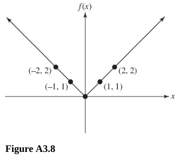

# Chapter 3 Graphs, Relations, and Functions

---

## Cartesian Coordinate System

---

**102.** Plot each of the following points in the Cartesian coordinate system:
$A(2, 0)$, $B(-2, 5)$, $C(-3, -2)$, $D(2, 1)$.

**Answer:**

---

**For questions 103 and 104,** find the distance between the given points.

---

**103.** $A(1, 0)$ and $B(0, 1)$

**Answer:**

The two points create a triangle and the distance between the two is the
hypotenuse via the Pythagorean Theorem:

$$ a^2 + b^2  = c^2 $$

$$ (1)^2 + (1)^2 = c^2 $$

$$ 1 + 1 = c^2 $$

$$ 2 = c^2 $$

$$ c = \pm \sqrt{2} $$

$$ \boxed{c = \sqrt{2}} $$

---

**104.** $A(1, 4)$ and $B(-1, 5)$

**Answer:**

The two points create a triangle and the distance between the two is the
hypotenuse via the Pythagorean Theorem:

$$ (1)^2 + (2)^2 = c^2 $$

$$ 1 + 4 = c^2 $$

$$ 5 = c^2 $$

$$ c = \pm \sqrt{5} $$

$$ \boxed{c = \sqrt{5}} $$

Note that the distance formula is the Pythagorean Theorem expressed differently:

$$ d(A, B) = \sqrt{(A_x - B_x)^2 + (A_y - B_y)^2} $$

---

**105.** Find the midpoint of the segment joining the two given points $(1, 2)$
and $(3, 2)$.

**Answer:**

Let $C$ be the midpoint coordinate.

$$ C = (C_x, C_y) $$

You can determine $C$ by adding the $x$ coordinates of the two given points and
dividing by two:

Let $A$ be the first given point $(1, 2)$. And let $B$ be the second given point
$(3, 2)$.

$$ C = \left(\frac{A_x + B_x}{2}, \frac{A_y + B_y}{2}\right) $$

$$ C = \left(\frac{(1) + (3)}{2}, \frac{(2) + (2)}{2}\right) $$

$$ C = \left(2, 2\right) $$

---

**106.** Decide whether the graphs of the following equations exhibit symmetry
with respect to the $x$ axis or origin. Do not graph the equations to determine
whether the symmetry exists.

The tests for symmetry are the following:

- Replace $x$ with $-x$. If the equation _does not_ change, the graph is
  symmetric with respect to the $y$ axis.

- Replace $y$ with $-y$. If the equation _does not_ change, the graph is
  symmetric with respect to the $x$ axis.

- Replace $x$ with $-x$ and $y$ with $-y$. If the equation _does not_ change,
  the graph is symmetric with respect to the origin.

(A) $y = x$

**Answer:**

$$ -y = x $$

The equation does change. The graph is not symmetric with respect to the $x$
axis.

$$ -y = -x $$

The equation does not change. The graph is symmetric with respect to the origin.

(B) $x^2 + y^2 = 4$

**Answer:**

$$ x^2 + (-y)^2 = 4 $$

The equation does not change. The graph is symmetric with respect to the $x$
axis.

$$ (-x)^2 + (-y)^2 = 4 $$

The equation does not change. The graph is symmetric with respect to the origin.

\(C\) $y = |2x|$

**Answer:**

$$ -y = |2x| $$

The equation does change. The graph is not symmetric with respect to the $x$
axis.

$$ -y = |2(-x)| $$

The equation does change. The graph is not symmetric with respect to the origin.

(D) $|x| + 1 = y$

**Answer:**

$$ x + 1 = -y $$

The equation does change. The graph is not symmetric with respect to the $x$
axis.

$$ |-x| + 1 = -y $$

The equation does change. The graph is not symmetric with respect to the origin.

(E) $y = x^3$

**Answer:**

$$ -y = x^3 $$

The equation does change. The graph is not symmetric with respect to the $x$
axis.

$$ -y = (-x)^3 $$

The equation does not change. The graph is symmetric with respect to the origin.

---

**107.** Graph $y = |x| + 1$.

**Answer:**

This creates a mirrored slope graph, starting at $(0, 1)$ and creating two slope
lines heading off from the $y$ axis in both directions:

---

## Relations and Functions

---

**108.** Tell whether the relation shown is a function. In all cases, $x$ is the
independent variable.

(A) See Figure 3.1.

**Answer:**

A Relation is a Function if each input produces exactly one output. One can
determine if a relation depicted on a graph is a function by performing the
Vertical Line Test.

In this case, yes the relation shown _is_ a function.

(B) See Figure 3.2.

**Answer:**

This relation is a classic Parabola shape function, it passes the Vertical Line
Test and it _is_ a function.

It might appear to not be a function, since we have two outputs that are the
same, but their inputs are different. In order to _not_ be a function, this
would have to have two of the same inputs give different outputs.

\(C\) See Figure 3.3.

**Answer:**

This relation is a standard Cubic function, it passes the Vertical Line Test and
it _is_ a function.

(D) See Figure 3.4.

**Answer:**

This relation _is_ also a function.

(E) See Figure 3.5.

**Answer:**

This relation _is not_ a function, it shows two of the same input with two
different outputs.

---

**109.** Tell whether the equation defines a function.

(A) $f(x) = 2x - 10$

**Answer:**

Yes, this is a function, one output value $f(x)$ maps directly to one input
value $x$.

(B) $f(x) = -2x^2 + 8$

**Answer:**

Yes, this is also a function for the same reason as mentioned for A.

\(C\) $y = |x|$

**Answer:**

Yes, this is also a function, $y$ is a single output that maps to $x$.

(D) $x = |y|$

**Answer:**

No, this is not a function, as $y$, the output, can have multiple values for the
same intput $x$.

(E) $x = 2y^2$

**Answer:**

Let's evaluate for $y$ to make our answer clear:

$$ y^2 = \frac{x}{2} $$

$$ y = \pm \sqrt{\frac{x}{2}} $$

No, this is not a function, since the output of $y$ can be either positive or
negative despite having the same input for $x$.

---

**110.** Find the indicated value if $f(x) = x - 9$, $g(x) = x^2 - 9$, and
$F(x) = x^3 - x + 4$.

(A) $F(2) - g(3)$

**Answer:**

This is just plug in and solve:

$$ ((2)^3 - (2) + 4) - ((3)^2 - 9) $$

$$ (8 - 2 + 4) - (9 - 9) $$

$$ (10) - (0) $$

$$ \boxed{F(2) - g(3) = 10} $$

(B) $F(1) + F(2)$

**Answer:**

$$ ((1)^3 - (1) + 4) + ((2)^3 - (2) + 4) $$

$$ (1 - 1 + 4) + (8 - 2 + 4) $$

$$ (4) + (10) $$

$$ \boxed{F(1) + F(2) = 14} $$

\(C\) $F(0) \cdot f(0)$

**Answer:**

$$ ((0)^3 - (0) + 4) \cdot ((0) - 9)  $$

$$ (4) \cdot (-9)  $$

$$ \boxed{F(0) \cdot f(0) = -36} $$

(D) $\dfrac{f(0)}{F(0)}$

**Answer:**

$$ \frac{((0) - 9)}{((0)^3 - (0) + 4)} $$

$$ \boxed{\frac{f(0)}{F(0)} = -\frac{9}{4}} $$

**111.** Find the domain of the given relation. In all cases, $x$ is the
independent variable.

(A) $2x + 5 = y$

$$ \text{Domain: } \left\{x \mid x \in \R \right\} $$

**Answer:**

(B) $y = x^2$

$$ \text{Domain: } \left\{x \mid x \in \R \right\} $$

**Answer:**

\(C\) $y = \sqrt{3 - x^2}$

$$ \text{Domain: } \left\{x \mid -\sqrt{3} \leq x \leq \sqrt{3} \right\} $$

**Answer:**

(D) $y = |x| - 1$

$$ \text{Domain: } \left\{x \mid x \in \R \right\} $$

**Answer:**

(E) $y = \dfrac{3}{2 - x}$

**Answer:**

$$ \text{Domain: } \left\{x \in \R \mid x \neq 2 \right\} $$

$$ \R \setminus \left\{2\right\} $$

(F) $x^2 + y^2 = 8$

**Answer:**

Let's evaluate for $y$ to get a clearer picture:

$$ x^2 + y^2 = 8 $$

$$ y^2 = 8 - x^2 $$

$$ y = \pm \sqrt{8 - x^2} $$

So $x^2$ cannot be less than $8$.

$$ \text{Domain: } \left\{x | -\sqrt{8} \leq x \leq \sqrt{8}\right\} $$

Which simlifies to:

$$ \text{Domain: } \left\{x | -2\sqrt{2} \leq x \leq 2\sqrt{2}\right\} $$

(G) $\left\{(x, y) \mid x \in \R, y \in \R, y = 3\right\}$

**Answer:**

$$ \text{Domain: } \left\{x \mid x \in \R \right\} $$

(H) $\left\{(1, 4), (2, 2), (3, 8)\right\}$

**Answer:**

$$ \text{Domain: } \left\{1, 2, 3\right\} $$

---

**112.** Find the range of the given function.

(A) $\left\{(1, 0), (0, 1), (2, a)\right\}$

**Answer:**

$$ \text{Range: } \left\{0, 1, a\right\} $$

(B) $f(x) = 2x - 3$

**Answer:**

$$ \text{Range: } \left\{f(x) \mid f(x) \in \R\right\} $$

\(C\) $f(x) = x^2$

**Answer:**

$$ \text{Range: } \left\{f(x) \mid f(x) \in \R, f(x) \geq 0\right\} $$

(D) $g(x) = 2 - |x|$

**Answer:**

$$ \text{Range: } \left\{f(x) \mid f(x) \in \R, f(x) \leq 0\right\} $$

(E) $f(x) = |x| + 5$

**Answer:**

$$ \text{Range: } \left\{f(x) \mid f(x) \in \R, f(x) \geq 5\right\} $$

(F) $f(x) = \sqrt{2 - x}$

**Answer:**

$$ \text{Range: } \left\{f(x) \mid f(x) \in \R, f(x) \geq 0\right\} $$

(G) $h(x) = 4$

**Answer:**

$$ \text{Range: } \left\{4\right\} $$

(H) $f(x) = \dfrac{1}{x}$

**Answer:**

$$ \text{Range: } \left\{f(x) \mid f(x) \in \R, f(x) \neq 0 \right\} $$

---

**113.** Tell whether the function is one-to-one.

Note: A function is one-to-one, if every one input maps to one _unique_ output.

(A) $f(x) = 3x + 4$

**Answer:**

Yes, this function is one to one. Every value plugged in for the input $x$ will
yield a unique output for $f(x)$.

(B) $f(x) = |x| + 1$

**Answer:**

This function is not one-to-one, as plugging in both $-1$ and $1$ for $x$ will
cause $f(x)$ to yield the same output.

\(C\) $g(x) = 3\sqrt{1 - x}$

**Answer:**

Yes, this function is one to one. Every value plugged in for the input $x$ will
yield a unique output for $g(x)$.

(D) $f(x) = \left\{(1, 2), (2, 1)\right\}$

**Answer:**

Yes, this function is one to one. Since $f(x)$ can only ever yield two outputs,
$\left\{2, 1\right\}$ and those outputs map directly to the inputs
$\left\{1, 2\right\}$, then $f(x)$ fulfills the definition of being a one-to-one
function.

(E) $h(x) = \left\{(1, 3), (2, 4), (3, 1), (3, 4)\right\}$

**Answer:**

No, this function is not one-to-one. Two inputs, $\left\{2, 3\right\}$ map to
the same output $\left\{4\right\}$. Thusly $h(x)$ does not fulfill the
definition of being a one-to-one function.

---

## Graph of a Function

---

**114.** **For questions 114A-114D,** refer to Figure 3.6, which is the graph of
$y = f(x)$.

(A) Is the relation $y = f(x)$ a function?

**Answer:**

Yes, by simply drawing the vertical line test, one can see that no two inputs
map to the same output, and therefore for every $x$ value there is exactly one
$y$ value.

(B) Find all intervals over which $y = f(x)$ is constant.

**Answer:**

The graph indicates that the outputs remain constant between the intervals of
$[d, c]$ as well as between the intervals of $[a, b]$.

\(C\) Find all intervals over which $y = f(x)$ is increasing and all intervals
over which it is decreasing.

**Answer:**

The only interval from which the graph $f(x)$ is decreasing is from
$(-\infty, d)$

(D) Find all intervals over which $y = f(x)$ is nonincreasing and those over
which it is nondecreasing.

**Answer:**

The intervals over which $y = f(x)$ are nonincreasing include the decreasing
interval mentioned in C, as well as the constant intervals mentioned in B. In
interval notation, this can be denoted as:

$$ (-\infty, c] \cup [a, b] $$

The intervals over which $y = f(x)$ are nondecreasing include all constant
intervals mentioned in B, as well as all intervals over which $y = f(x)$ are
increasing.

$$ [d, \infty) $$

---

**For questions 115-120,** graph the given function.

---

**115.** $f(x) = 2x - 3$

**Answer:**

---

**116.** $f(x) = x^2$

**Answer:**

---

**117.** $f(x) = x^3$

**Answer:**

---

**118.** $f(x) = \sqrt{x + 2}$

**Answer:**

---

**Answer:**

**119.** $f(x) = |x|$

**Answer:**

---

**120.** $f(x) = [x]$

**Answer:**

The answer is something I have not seen before, consult this:

---

## Step Functions and Continuity

**For questions 121 and 122,** graph the given function.

**121.**

$$
h(x) =
\begin{cases}
1 \quad x > 1 \\
2 \quad -2 < x \leq 1 \\
-1 \quad x \leq -2 \\
\end{cases}
$$

**Answer:**

---

**122.**

$$
f(x) =
\begin{cases}
x \quad x > 2 \\
x^2 \quad x \leq 2 \\
\end{cases}
$$

---

**123.** Tell whether the given function is continuous for every $x$ in its
domain. If it is not, tell where it is discontinuous.

(A) $f(x) = x^2$

**Answer:**

Yes, the given function is continuous within its domain, there is nowhere the
function breaks continuity.

(B) $f(x) = x^3 - 1$

Yes, the given function is continuous within its domain, there is nowhere the
function breaks continuity.

**Answer:**

\(C\) $g(x) = ax^2 + bx + c \text{; } a, b, c \in \R \text{; } b \neq 0$.

Yes, the given function is continuous within its domain, there is nowhere the
function breaks continuity. All quadratic functions are continuous.

**Answer:**

(D) $f(x) =
\begin{cases}
1 \quad x \geq 1 \\
0 \quad x < 1 \\
\end{cases}$

**Answer:**

This given function is not continuous within its domain. it breaks continuity
when $x = 1$.

---

## Linear Functions

**For questions 124-127,** find the slope and $y$ intercept (if they exist).

**124.** $y = 3x + 1$

**Answer:**

The slope is always the multiplier for $x$, while the $y$ intercept is always
the number outside of the function affecting the $x$.

Essentially:

$$ y = mx + b $$

$$ m = \text{ slope} $$

$$ b = y\text{-intercept} $$

$$ \text{slope} = 3 $$

$$ y\text{-intercept} = 1 $$

---

**125.** $-3y = x + 6$

**Answer:**

$$ -3y = x + 6 $$

$$ y = -\frac{x + 6}{3} $$

$$ y = -\frac{1}{3}x - 2 $$

$$ \text{slope} = -\frac{1}{3} $$

$$ y\text{-intercept} = -2 $$

---

**126.** $y = 3$

**Answer:**

There is no slope, and the $y$-intercept is $3$.

$$ y\text{-intercept} = 3 $$

---

**127.** $x = -2$

**Answer:**

There is no $y$-intercept nor is there any slope.

---

**For questions 128 and 129,** graph the linear functions given. Use the slope
and $y$ intercept graphing technique.

---

**128.** $y = 3x + 2$

**Answer:**

---

**129.** $y = -x + 1$

**Answer:**

---

**For questions 130-135,** find an equation of the line that satisfies the given
conditions.

---

**130.** No slope, $x$ intercept is $7$

**Answer:**

$$ y = mx + b $$

$$ x = 7 $$

---

**131.** Contains the points $(1, -1)$ and $(2, 3)$

**Answer:**

$$ m = \frac{y_1 - y_2}{x_1 - x_2} $$

$$ m = \frac{(3) - (-1)}{(2) - (1)} $$

$$ m = 4 $$

$$ y - y_1 = m(x - x_1) $$

Or otherwise interpreted as:

$$ b = -y_1 $$

$$ y - 3 = 4(x - 2) $$

$$ y = 4x - 5 $$

---

**132.** Contains the point $(2, 1)$ and is parallel to $y = x - 3$

**Answer:**

If the two functions are parallel, then the slope, $m$, is $1$.

$$ m = 1 $$

$$ y - y_1 = m(x - x_1) $$

$$ y - 1 = 1(x - 2) $$

$$ y - 1 = x - 2 $$

$$ y = x - 1 $$

---

**133.** Contains the point $(3, 1)$ and is perpendicular to $2x + y = 3$

**Answer:**

If the two functions are perpendicular, then the slope, $m$, is equal to the
reciprocal of the slope of the other function.

$$ m = -\frac{1}{2} $$

$$ y - y_1 = m(x - x_1) $$

$$ y - 1 = \frac{1}{2}(x - 3) $$

$$ y - 1 = \frac{1}{2}x - \frac{3}{2} $$

$$ y = \frac{1}{2}x - \frac{1}{2} $$

---

**134.** Vertical line containing $(7, -6)$

**Answer:**

A vertical line contains no slope, but has a $x$-intercept.

$$ x = 7 $$

---

**135.** Horizontal line containing $(7, -6)$

**Answer:**

A horizontal line contains no slope, but has a $y$-intercept.

$$ y = -6 $$

---

**136.** Find the point of intersection of $2x + 1 = y$ and $x - y = 3$

**Answer:**

$$ 2x + 1 = y $$

$$ x - y = 3 $$

$$ x = y + 3 $$

$$ y = x - 3 $$

$$ 2x + 1 = x - 3 $$

$$ \boxed{x = -4} $$

$$ x - y = 3 $$

$$ -y = 3 - x $$

$$ y = x - 3 $$

$$ y = (-4) - 3 $$

$$ \boxed{y = 7} $$

$$ \boxed{\text{Point of Intersection: } (-4, 7)} $$

---

**137.** Find all points of intersection of $y = x^2$ and $y = x$.

**Answer:**

$$ x^2 - x = 0 $$

This occurs when $x = 1$ and when $x = 0$.

Since $y = x$, the points of intersection are $(0, 0)$ and $(1, 1)$.

---

## Algebra of Functions

**For questions 138-140,** find $(f + g)(x)$, $(f - g)(x)$, and their respective
domains.

---

**138.** $f(x) = x^2$, $g(x) = x - 1$

**Answer:**

$$ (f + g)(x) = (x^2) + (x - 1) $$

$$ \boxed{(f + g)(x) = x^2 + x - 1} $$

$$ \text{Domain: } \left\{x \mid x \in \R\right\} $$

$$ (f - g)(x) = (x^2) - (x - 1) $$

$$ \boxed{(f - g)(x) = x^2 - x - 1} $$

$$ \text{Domain: } \left\{x \mid x \in \R\right\} $$

---

**139.** $f(x) = \dfrac{1}{x - 1}$, $g(x) = \sqrt{x}$

**Answer:**

$$ (f + g)(x) = \left(\frac{1}{x - 1}\right) + (\sqrt{x}) $$

$$ \text{Domain: } \left\{x \mid x \in \R, x \neq 0, x > 1\right\} $$

$$ (f - g)(x) = \left(\frac{1}{x - 1}\right) - (\sqrt{x}) $$

$$ \text{Domain: } \left\{x \mid x \in \R, x \neq 0, x > 1\right\} $$

---

**140.** $f(x) = \sqrt{x + 1}$, $g(x) = \sqrt{x - 1}$

$$ (f + g)(x) = (\sqrt{x + 1}) + (\sqrt{x - 1}) $$

$$ \text{Domain: } \left\{x \mid x \in \R, x \geq 1 \right\} $$

$$ (f - g)(x) = (\sqrt{x + 1}) - (\sqrt{x - 1}) $$

$$ \text{Domain: } \left\{x \mid x \in \R, x \geq 1 \right\} $$

---

**141.** $f(x) = \sqrt{x + 1}$, $g(x) = x - 3$. Find $fg(x)$ and
$\dfrac{f}{g}(x)$ and their respective domains.

**Answer:**

$$ fg(x) = (\sqrt{x + 1})(x - 3) $$

$$ \text{Domain: } \left\{x \mid x \in \R, x \geq -1\right\} $$

$$ \frac{f}{g}(x) = \frac{(\sqrt{x + 1})}{(x - 3)} $$

$$ \text{Domain: } \left\{x \mid x \in \R, x \geq -1, x \neq 3 \right\} $$

---

**For questions 142 and 143,** find $f \circ g (x)$

---

**142.** $f(x) =x^2$, $g(x) = 2x + 5$

**Answer:**

$$ (f \circ g)(x) = (2x + 5)^2 $$

$$ (f \circ g)(x) = (2x + 5)(2x + 5) $$

$$ \boxed{(f \circ g)(x) = 4x^2 + 10x + 25} $$

---

**143.** $f(x) = \dfrac{1}{1 + x}$, $g(x) = \dfrac{1}{2 + x}$

**Answer:**

$$ (f \circ g)(x) = \frac{1}{1 + \left(\dfrac{1}{2 + x}\right)} $$

$$ (f \circ g)(x) = \frac{1}{\left(\dfrac{2 + x}{2 + x}\right) + \left(\dfrac{1}{2 + x}\right)} $$

$$ (f \circ g)(x) = \frac{1}{\dfrac{2 + x + 1}{2 + x}} $$

$$ (f \circ g)(x) = \frac{1}{\dfrac{3 + x}{2 + x}} $$

$$ \boxed{(f \circ g)(x) = \frac{2 + x}{3 + x}} $$

---

**For questions 144 and 145,** find $g \circ f(x)$. These are functions from
questions 142 and 143 above. Check the results to notice that $f \circ g(x)$ and
$g \circ f(x)$ are not always the same function.

---

**144.** $f(x) =x^2$, $g(x) = 2x + 5$

**Answer:**

$$ (g \circ f)(x) = 2(x^2) + 5 $$

$$ \boxed{(g \circ f)(x) = 2x^2 + 5} $$

$$ (f \circ g)(x) = 4x^2 + 10x + 25 $$

$$ 2x^2 + 5 \neq 4x^2 + 10x + 25 $$

$$ \boxed{(g \circ f)(x) \neq (f \circ g)(x)} $$

---

**145.** $f(x) = \dfrac{1}{1 + x}$, $g(x) = \dfrac{1}{2 + x}$

**Answer:**

$$ (g \circ f)(x) = \frac{1}{2 + \left(\dfrac{1}{1 + x}\right)} $$

$$ (g \circ f)(x) = \frac{1}{\left(\dfrac{2(1 + x)}{1 + x}\right) + \left(\dfrac{1}{1 + x}\right)} $$

$$ (g \circ f)(x) = \frac{1}{\dfrac{2(1 + x) + 1}{1 + x}} $$

$$ (g \circ f)(x) = \frac{1}{\dfrac{2 + 2x + 1}{1 + x}} $$

$$ (g \circ f)(x) = \frac{1}{\dfrac{3 + 2x}{1 + x}} $$

$$ \boxed{(g \circ f)(x) = \frac{1 + x}{3 + 2x}} $$

$$ (f \circ g)(x) = \frac{2 + x}{3 + x} $$

$$ \frac{1 + x}{3 + 2x} \neq \frac{2 + x}{3 + x} $$

$$ \boxed{(g \circ f)(x) \neq (f \circ g)(x)} $$

---

**146.** Let $f(x) = 2x - 4$.

(A) Find the domain and range of $f$ and $f^{-1}$.

$$ \text{Domain for } f(x) \text{ : } \left\{x \mid x \in \R\right\} $$

$$ \text{Range for } f(x) \text{ : } \left\{f(x) \mid f(x) \in \R\right\} $$

$$ \text{Domain for } f^{-1}(x) \text{ : } \left\{x \mid x \in \R\right\} $$

$$ \text{Range for } f^{-1}(x) \text{ : } \left\{f^{-1}(x) \mid f^{-1}(x) \in \R\right\} $$

(B) Find $f^{-1}(x)$.

$$ f(x) = 2x - 4 $$

$$ y = 2x - 4 $$

$$ x = 2y - 4 $$

$$ x + 4 = 2y $$

$$ \frac{x + 4}{2} = y $$

$$ \frac{x + 4}{2} = f^{-1}(x) $$

$$ f^{-1}(x) = \frac{x + 4}{2} $$

\(C\) Find $f^{-1}\circ f(x)$.

$$ f^{-1}(x) = \frac{x + 4}{2} $$

$$ f(x) = 2x - 4 $$

$$ (f^{-1} \circ f)(x) = \frac{(2x - 4) + 4}{2} $$

$$ (f^{-1} \circ f)(x) = \frac{2x - 4 + 4}{2} $$

$$ (f^{-1} \circ f)(x) = \frac{2x}{2} $$

$$ (f^{-1} \circ f)(x) = x $$

(D) Find $f \circ f^{-1}(x)$.

$$ f^{-1}(x) = \frac{x + 4}{2} $$

$$ f(x) = 2x - 4 $$

$$ (f \circ f^{-1})(x) = 2\left(\frac{x + 4}{2}\right) - 4 $$

$$ (f \circ f^{-1})(x) = x + 4 - 4 $$

$$ (f \circ f^{-1})(x) = x $$

(E) Graph $f(x)$ and $f^{-1}(x)$ in the same coordinate system. Show that these
two graphs are symmetric about $y = x$.

---

**147.** Let $f(x) = x^2 + 1$, $x \geq 0$.

(A) Find the domain and range of $f^{-1}$.

$$ \text{Domain of } f^{-1}(x) \text{ : } \left\{x \mid x \in \R, x \geq 1\right\} $$

$$ \text{Range of } f^{-1}(x) \text{ : } \left\{f^{-1}(x) \mid f^{-1}(x) \in \R, f^{-1}(x) \geq 0\right\}$$

(B) Find $f^{-1}(x)$.

$$ f(x) = x^2 + 1 $$

$$ y = x^2 + 1 $$

$$ x = y^2 + 1 $$

$$ x - 1 = y^2 $$

$$ \sqrt{x - 1} = y $$

$$ y = \sqrt{x - 1} $$

$$ f^{-1}(x) = \sqrt{x - 1} $$

\(C\) Find $f^{-1} \circ f(x)$

$$ f(x) = x^2 + 1 $$

$$ f^{-1}(x) = \sqrt{x - 1} $$

$$ (f^{-1} \circ f)(x) = \sqrt{(x^2 + 1) - 1} $$

$$ (f^{-1} \circ f)(x) = \sqrt{x^2 + 1 - 1} $$

$$ (f^{-1} \circ f)(x) = \sqrt{x^2} $$

$$ (f^{-1} \circ f)(x) = \pm x $$

But the problem statement establishes that $x \geq 0$, so:

$$ (f^{-1} \circ f)(x) = x $$

(D) Find $f \circ f^{-1}(x)$.

$$ f(x) = x^2 + 1 $$

$$ f^{-1}(x) = \sqrt{x - 1} $$

$$ (f \circ f^{-1})(x) = (\sqrt{x - 1})^2 + 1 $$

$$ (f \circ f^{-1})(x) = (x - 1) + 1 $$

$$ (f \circ f^{-1})(x) = x - 1 + 1 $$

$$ (f \circ f^{-1})(x) = x $$

(E) Graph $f(x)$, $f^{-1}(x)$, and $y = x$ on the same axis system.

---

## Problem Solving and Formulas

---

**148.** An open box is to be formed from a rectangular sheet of tin $20$ x $32$
in by cutting equal squares, $x$ in on a side, from the four corners and turning
up the sides. Express the volume of the box as a function of $x$.

$$ V = x(32 - 2x)(20 - 2x) $$

---

**149.** A farmer has $600\text{ ft}$ of woven wire fencing available to enclose
a rectangular field and to divide it into three parts by two fences parrallel to
one end. If $x \text{ ft}$ of stone wall is used as one side of the field,
express the area enclosed as a function of $x$ when dividing the fences are
parallel to the stone wall. Refer to Figure 3.7.

The dimensions are expressed as $x$ and $y$

You need $3x$ for the outer and inner perimeter fences, and you need $2y$ for
the sides.

So the total amount of fencing used is $600 \text{ ft}$:

$$ 3x + 2y = 600 $$

Area is simple:

$$ A = \text{width} \cdot \text{height} $$

Solving for $y$ gives us the height:

$$ 3x + 2y = 600 $$

$$ 2y = 600 - 3x $$

$$ y = \frac{1}{2}(600 - 3x) $$

And then finding the area is simply multiplying the width, $x$ times the height:

$$ A = x \cdot \left(\frac{1}{2}(600 - 3x)\right) = \frac{3}{2}x(200 - x) $$

---

**150.** A right circular cylinder is said to be inscribed in a sphere if the
circumference of the base of the cylinder is in the surface of the sphere. If
the sphere has radius $R$, express the volume of the inscribed right circular
cylinder as a function of the radius $r$ of its base.

Let the height of the cylinder be denoted by $2h$.

Drawing a right triangle from the center of the sphere to the circumference of
the cylinder gives us:

As $h$ representse exactly half the height of the cylinder, we are creating a
relationship between the height of the cylinder, the radius of the cylinder's
base, and the Radius of the sphere like so:

$$ h^2 + r^2 = R^2 $$

And solving for $h$ gives us:

$$ h^2 = R^2 - r^2 $$

$$ h = \sqrt{R^2 - r^2} $$

The volume of the cylinder can be expressed as:

$$ V = \pi r^2 \cdot 2h $$

And now we can relate the entire volume of the cylinder to the circle by
substituting for $h$:

$$ V = \pi r^2 \cdot 2(\sqrt{R^2 - r^2}) $$

Simplified gives us:

$$ \boxed{V = 2\pi r^2\sqrt{R^2 -r^2}} $$

---

**151.** Let $z = f(x, y) = 2x^2 + 3y^2 - 4$. Find:

(A) $f(0, 0)$

$$ z = f(x, y) = 2x^2 + 3y^2 - 4 $$

$$ z = f(0, 0) = 2(0)^2 + 3(0)^2 - 4 $$

$$ z = f(0, 0) = -4 $$

(B) $f(2, -3)$

$$ z = f(x, y) = 2x^2 + 3y^2 - 4 $$

$$ z = f(2, -3) = 2(2)^2 + 3(-3)^2 - 4 $$

$$ z = f(2, -3) = 2(4) + 3(9) - 4 $$

$$ z = f(2, -3) = 8 + 27 - 4 $$

$$ z = f(2, -3) = 35 - 4 $$

$$ z = f(2, -3) = 31 $$

\(C\) $f(-x, -y)$

$$ z = f(x, y) = 2x^2 + 3y^2 - 4 $$

$$ z = f(-x, -y) = 2(-x)^2 + 3(-y)^2 - 4 $$

$$ z = f(x, y) = 2x^2 + 3y^2 - 4 $$
