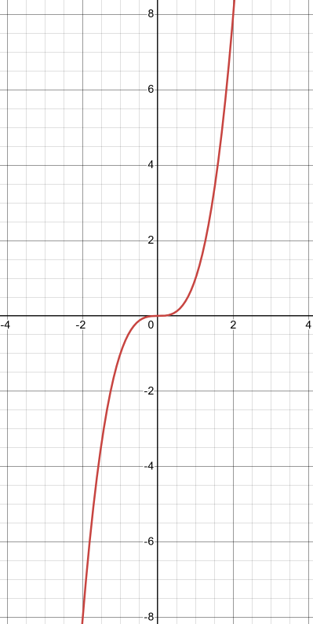

# Chapter 4 Polynomial and Rational Functions

---

## Polynomial Functions

---

**152.** Write the given equation in standard form.

(A) $4x^2 + 2x^3 - 6 + 5x = 0$

**Answer:**

$$ \boxed{4x^2 + 2x^3 + 5x - 6 = 0} $$

(B) $2x^5 + x^3 + 4 = 0$

**Answer:**

$$ \boxed{2x^5 + 0x^4 + x^3 + 0x^2 + 0x + 4 = 0} $$

\(C\) $\dfrac{x^5}{2} - 1 = 0$

**Answer:**

$$ 2\left(\frac{1}{2}x^5 + 0x^4 + 0x^3 + 0x^2 + 0x - 1\right) = 2(0) $$

$$ \boxed{x^5 + 0x^4 + 0x^3 + 0x^2 + 0x - 2 = 0} $$

(D) $(x + 2)^2 + 5 = 0$

**Answer:**

$$ (x + 2)(x + 2) + 5 = 0 $$

$$ x^2 + 4x + 4 + 5 = 0 $$

$$ \boxed{x^2 + 4x + 9 = 0} $$

---

**For questions 153 and 154,** find the vertex of the given parabola.

---

Note: Vertex can be found by following formula:

Find $x$-coordinate with the following:

$$ x = \frac{-b}{2a} $$

Plug in $x$ coordinate into original equation and solve for $f(x)$/$y$.

**153.** $y + 1 = 2(x - 3)^2$

**Answer:**

$$ y + 1 = 2(x - 3)^2 $$

$$ y = 2(x - 3)^2 - 1 $$

$$ y = 2(x - 3)(x - 3) - 1 $$

$$ y = 2(x^2 - 6x + 9) - 1 $$

$$ y = 2x^2 - 12x + 18 - 1 $$

$$ y = 2x^2 - 12x + 17 $$

$$ a = 2 $$

$$ b = -12 $$

$$ x = \frac{-b}{2a} $$

$$ x = \frac{-(-12)}{2(2)} $$

$$ x = \frac{12}{4} $$

$$ x = 3 $$

$$ y = 2x^2 - 12x + 17 $$

$$ y = 2(3)^2 - 12(3) + 17 $$

$$ y = 2(9) - 36 + 17 $$

$$ y = 18 - 36 + 17 $$

$$ y = -18 + 17 $$

$$ y = -1 $$

$$ \boxed{V = (3, -1)} $$

---

**154.** $y = x^2 - 4x + 6$

$$ a = 1 $$

$$ b = -4 $$

$$ x = \frac{-b}{2a} $$

$$ x = \frac{-(-4)}{2(1)} $$

$$ x = \frac{4}{2} $$

$$ x = 2 $$

$$ y = x^2 - 4x + 6 $$

$$ y = (2)^2 - 4(2) + 6 $$

$$ y = 4 - 8 + 6 $$

$$ y = -4 + 6 $$

$$ y = 2 $$

$$ V = (2, 2) $$

---

**155.** Identify the given parabola as opening upward or downward.

(A) $y = x^2 - 5x + 6$

**Answer:**

Parabolas going upwards or downwards can generally be ascertained by whether $a$
is positive or negative.

In this case $a$, is $1$, so it opens _upwards_.

(B) $y = 2 - x^2$

**Answer:**

Opens _downwards_.

\(C\) $y = x(1 - x)$

**Answer:**

$$ y = x(1 - x) $$

$$ y = x - x^2 $$

Opens _downwards_.

(D) $y = (2 - x)(3 - x)$

**Answer:**

$$ y = (2 - x)(3 - x) $$

$$ y = 6 - 3x - 2x + x^2 $$

Opens _upwards_.

---

**For questions 156 and 157,** find the maximum (or minimum) value of the
quadratic function.

---

**156.** $f(x) = 2(x - 3)^2 - 1$

**Answer:**

This function is given in Vertex Form, and we can see that $a = 2$, a positive
number, indicating that this function opens _upwards_. Thusly we will have to
find the minimum value of the quadratic function (the $y$-coordinate its
vertex).

Thusly the _minimum_ value for this quadratic function is $-1$.

---

**157.** $f(x) = -2x^2 + 3$

**Answer:**

This function opens _downwards_, thusly we will need to find its _maximum_.

The _maximum_ value for this quadratic function is $3$.

---

**158.** Is the given function a polynomial function?

(A) $y = x^2$

**Answer:**

Yes, this is a monomial.

(B) $y = \dfrac{1}{x^2}$

**Answer:**

No, the variable cannot be in a denominator under the definition of a
polynomial.

\(C\) $y = (x + 2)^x$

**Answer:**

No, as we cannot know the value of $x$ as the exponent. Exponents cannot be
negative nor fractions, and since we do not know if $x$ is either of these, we
cannot definitively determine if this is a polynomial or not.

(D) $y = 2x + 4 - 2i$

**Answer:**

This is a polynomial, complex numbers are perfectly fine in polynomials as the
definition of polynomials mainly has to do with how the variables and their
exponents are exemplified.

(E) $y = 2x^2 + \sqrt{3}x - i$

**Answer:**

This is a polynomial function. The complex coefficients of $\sqrt{3}$ and $-i$
are allowed within the definition of a polynomial function.

(F) $y = ix^3 - \sqrt{4}x - 2$

**Answer:**

$$ y = ix^3 - 2x - 2 $$

This is not a polynomial. Due to the answer saying so... apparently there's an
$x^{\frac{1}{2}}$ somewhere...

---

**For questions 159 and 160,** determine whether the graph of the polynomial
will cross or touch the $x$ axis at each zero.

---

**159.** $f(x) = x^2(x - 1)$

**Answer:**

$$ 0 = x^2(x - 1) $$

$$ x^2 = 0 $$

$$ x = 0 $$

$$ x - 1 = 0 $$

$$ x = 1 $$

Yes, the graph _touches_ the $x$-axis due to the $x^2$ factor having a
multiplicity of $2$, and the graph _crosses_ the $x$-axis due to the $x - 1$
factor having a multiplicity of $1$.

---

**160.** $f(x) = (x^2 - 1)(x + 2)^3$

**Answer:**

$$ f(x) = (x^2 - 1)(x + 2)^3 $$

$$ 0 = (x^2 - 1)(x + 2)^3 $$

$$ 0 = x^2 - 1 $$

$$ 1 = x^2 $$

$$ \pm 1 = x $$

$$ 0 = x + 2 $$

$$ x = -2 $$

The graph _crosses_ at $x = -2$, due to having an odd multiplicity of $3$.

The graph _crosses_ at both $1$ and $-1$ due to both having an odd multiplicity
of $1$.

---

**161.** Find the remainder by using the remainder theorem (long division).

$$ (x^3 - 5x^2 - 3x + 5) \div (x + 2) $$

**Answer:**

Written out long division yields a remainder of $-7$.

---

**162.** Show that the second expression is a factor of the first by means of
the factor theorem.

$$ 2x^3 - 3x^2 + 2x - 8 \text{, } x - 2 $$

**Answer:**

In order for $x - r$ to be a factor of $f(x)$, it must be able to be equivalent
to $0$ by the zero product property in order to be a factor. Thusly:

$$ x - 2 = 0 $$

$$ x = 2 $$

If we plug this into our original equation:

$$ f(2) = 2(2)^3 - 3(2)^2 + 2(2) - 8 $$

$$ f(2) = 2(8) - 3(4) + 4 - 8 $$

$$ f(2) = 16 - 12 + 4 - 8 $$

$$ f(2) = 4 + 4 - 8 $$

$$ f(2) = 8 - 8 $$

$$ f(2) = 0 $$

This proves that $x - 2$ is a factor of our original formula.

---

**163.** Write an equation with integral coefficients having the given numbers
and no others as roots.

$$ 1\text{, } 2\text{, } -3 $$

**Answer:**

$$ f(x) = (x - 1)(x - 2)(x + 3) $$

$$ f(x) = (x^2 - x - 2x + 2)(x + 3) $$

$$ f(x) = (x^2 - 3x + 2)(x + 3) $$

$$ f(x) = (x^2)(x + 3) - 3x(x + 3) + 2(x + 3) $$

$$ f(x) = x^3 + 3x^2 - 3x^2 - 9x + 2x + 6 $$

$$ \boxed{f(x) = x^3 - 7x + 6} $$

---

## Graphing Polynomial Functions

---

**For questions 164-166,** sketch the graph of the given polynomial function.

---

**164.** $f(x) = x^3$

**Answer:**

---

**165.** $y = (x - 3)(x^2 - 1)$

**Answer:**

---

**166.** $y = (x^2 - 1)(x^2 - 9)$

**Answer:**

---

**167.** Refer to the following situation: A parcel delivery service will
deliver only packages with length plus girth not exceeding 108 in. A packaging
company wishes to design a box with a square base that will have a maximum
volume and will meet the delivery service's restrictions.

(A) Write the volume of the box $V(x)$ in terms of $x$.

**Answer:**

$$ V = l \cdot w \cdot h $$

$$ V = x \cdot x \cdot (108 - 4x) $$

$$ V = x^2(108 - 4x) $$

(B) What is the domain of $V$ in question 167A?

**Answer:**

$$ 108 - 4x \geq 0 $$

$$ 108 \geq 4x $$

$$ 27 \geq x $$

$$ \text{Domain: } \left\{x \mid x \in \R \text{, } 0 \leq x \leq 27 \right\} $$

\(C\) Graph $V$ for the domain in question 167B.

**Answer:**

(D) From the graph in the previous question (see Figure A4.4 in the Answers),
estimate (to the nearest inch) the dimensions of the box with maximum volume.
What is the maximum volume?

**Answer:**

This gets into derivatives and is more in the realm of calculus, but let's dive
in:

Firstly let's take our original equation for The Volume and distribute:

$$ V = x^2(108 - 4x) $$

$$ V = 108x^2 - 4x^3 $$

Normally we could determine the local maxima using the Vertex formula:

$$ V_x = \frac{-b}{2a} $$

But this only works on quadratics. We'll need to dig deeper into the subject
Calculus and use derivatives for the first time here.

Firstly, let's establish a rule:

The power rule says:

$$ x^n = n \cdot x^{n - 1} $$

We can use this to establish the derivative of $V$ with respect to $x$ like so:

$$ \frac{dV}{dx} = \frac{d}{dx}(108x^2 - 4x^3) = (2 \cdot 108x) - (3 \cdot 4x^2) $$

$$ \frac{dV}{dx} = \frac{d}{dx}(108x^2 - 4x^3) = 216x - 12x^2 $$

Now we can set the derivative equal to $0$ and solve for $x$ to find our local
maxima (the Vertex):

$$ 216x - 12x^2 = 0 $$

$$ 12x(x - 18) = 0 $$

$$ 12x = 0 $$

$$ x = 0 $$

$$ \boxed{x = 18 \text{ in}} $$

Thusly we can determine the maximum volume occurs when our length/width of the
box is $\approx 18\text{ in}$. This would give us a maximum volume of:

$$ V = x^2(108 - 4x) $$

$$ V = (18)^2(108 - 4(18)) $$

$$ \boxed{V = 11664 \text{ in}} $$

---

**168.** Refer to graphs in Figures 4.1 - 4.6.

(A) Which of the figures represents a polynomial function which is always
increasing?

**Answer:**

Only the last one, Figure 4.6 illustrates a polynomial function which is always
increasing.

(B) Which of the figures are symmetric about the $y$ axis?

**Answer:**

Figure 4.1 and Figure 4.2 illustrate polynomial functions that are symmetric
about the $y$ axis.

\(C\) Which of the figures exhibits $x$ axis symmetry?

**Answer:** Figure 4.4 illustrates a polynomial function that exhibits $x$ axis
symmetry.

(D) Which figure has four zeros?

**Answer:** Figure 4.5 has four zeros, although only 3 are marked, there is
another $0$ directly at $(0, 0)$.

(E) In which figures are there two intervals in which the function is positive?

**Answer:**

Figures 4.2 and 4.5 both illustrate polynomial functions which have two
intervals in which the function is positive.

In 4.2, this occurs between $\left(-1, \dfrac{1}{2}\right)$ and between
$(1, \infty)$.

In 4.5, this occurs between $(-2, -1)$ and $(0, 3)$.

---

## Synthetic Division

---

**169.** Use synthetic division to find the quotient and remainder.
$(x^3 + x^2 + x + 3) \div (x - 1)$

**Answer:**

$$ \text{Quotient: } x^2 + 2x + 3$$

$$ \text{Remainder: } 6 $$

---

**For questions 170 and 171,** evaluate by synthetic division.

---

**170.** $f(-2)$ if $f(x) = x^3 - 7x^2 + 12x - 3$

**Answer:**

$$ f(-2) = -63 $$

---

**171.** $f(3)$ if $f(x) = x^3 - 7x^2 + 12x - 3$

**Answer:**

$$ f(3) = -3 $$

---

**For questions 172 and 173,** use synthetic division to show that the first
polynomial is a factor of the second.

---

**172.** $x - 3$, $x^3 - 18x + 27$

**Answer:**

Note that we took the $x = 3$ as the divisor.

Because the remainder is $0$, $x - 3$ is a factor of $x^3 - 18x + 27$.

---

**173.** $x + \dfrac{1}{2}$,
$x^4 - \dfrac{3x^2}{4} + \dfrac{x}{2} + \dfrac{3}{8}$

Because the remainder is $0$, $x + \dfrac{1}{2}$ is a factor of
$x^4 - \dfrac{3x^2}{4} + \dfrac{x}{2} + \dfrac{3}{8}$.

---

## Fundamental Theorem of Algebra

---

**174.** State the fundamental theorem of algebra.

**Answer:**

Every non-constant single-variable polynomial, $P(x)$, of a degree $d \geq 1$,
with complex coefficients has at least one complex root.

---

**For questions 175 and 176,** find a polynomial equation of lowest degree which
has the roots listed.

---

**175.** $0, 1, 2$

**Answer:**

$$ (x - 0)(x - 1)(x - 2) = 0 $$

$$ x(x - 1)(x - 2) = 0 $$

$$ x(x^2 - x - 2x + 2) = 0 $$

$$ x(x^2 - 3x + 2) = 0 $$

$$ x^3 - 3x^2 + 2x = 0 $$

---

**176.** $1 + \sqrt{3}$, $1 - \sqrt{3}$, $-1 - \sqrt{3}$

**Answer:**

$$ \left[x - (1 + \sqrt{3})\right]\left[x - (1 - \sqrt{3})\right]\left[x - (-1 - \sqrt{3})\right] = 0 $$

$$ (x - 1 - \sqrt{3})(x - 1 + \sqrt{3})(x + 1 + \sqrt{3}) = 0 $$

$$ \left[x(x - 1 + \sqrt{3}) - 1(x - 1 + \sqrt{3}) - \sqrt{3}(x - 1 + \sqrt{3})\right](x + 1 + \sqrt{3}) = 0 $$

$$ (x^2 - x \cancel{+ x\sqrt{3}} - x + 1 \cancel{- \sqrt{3}} \cancel{- x\sqrt{3}} \cancel{+ \sqrt{3}} - 3)(x + 1 + \sqrt{3}) = 0 $$

$$ (x^2 - 2x - 2)(x + 1 + \sqrt{3}) = 0 $$

$$ x^2(x + 1 + \sqrt{3}) - 2x(x + 1 + \sqrt{3}) - 2(x + 1 + \sqrt{3}) = 0 $$

$$ x^3 + x^2 + x^2\sqrt{3} - 2x^2 - 2x - 2x\sqrt{3} - 2x - 2 - 2\sqrt{3} = 0 $$

$$ x^3 - x^2 + x^2\sqrt{3} - 4x - 2x\sqrt{3} - 2 - 2\sqrt{3} = 0 $$

$$ x^3 - x^2 + x^2\sqrt{3} - 4x - 2x\sqrt{3} - 2 - 2\sqrt{3} = 0 $$

$$ x^3 - (1 - \sqrt{3})x^2 - (4 + 2\sqrt{3})x - (2\sqrt{3} + 2) $$

---

**177.** $(2 - 3i)$, $(2 + 3i)$, $-4$ ($\text{multiplicity} = 2$). Find a
polynomial $P(x)$ of lowest degree with leading coefficient $1$ (monic) that has
the indicated set of zeros. You may leave the answer in factored form, but
indicate the degree of the polynomial.

**Answer:**

$$ P(x) = (x + 4)^2(x - (2 - 3i))(x - (2 + 3i)) $$

The degree of the polynomial is $4$.

---

**For questions 178-180,** find the zeros of the given polynomial.

---

**178.** $x^2(x - 2)(x + 3) = 0$

**Answer:**

$$ x^2(x - 2)(x + 3) = 0 $$

$$ x^2 = 0 $$

$$ x = 0 $$

$$ x - 2 = 0 $$

$$ x = 2 $$

$$ x + 3 = 0 $$

$$ x = -3 $$

The zeros are:

$$ \boxed{ x = 0, x = 2 ,x = -3 } $$

---

**179.** $(x + i)^2(x - 1)^3(x + 4) = 0$

**Answer:**

$$ (x + i)^2 = 0 $$

$$ x + i = 0 $$

$$ x = -i $$

$$ (x - 1)^3 = 0 $$

$$ x - 1 = 0 $$

$$ x = 1 $$

$$ x + 4 = 0 $$

$$ x = -4 $$

The zeros are:

$$ \boxed{-i, 1, -4} $$

---

**180.** $(2x - 1)(2x + 5)(x - 3) = 0$

**Answer:**

$$ 2x - 1 = 0 $$

$$ 2x = 1 $$

$$ x = \frac{1}{2} $$

$$ 2x + 5 = 0 $$

$$ 2x = -5 $$

$$ x = -\frac{5}{2} $$

$$ x - 3 = 0 $$

$$ x = 3 $$

So our zeros are:

$$ \boxed{\frac{1}{2}, -\frac{5}{2}, 3} $$

---

**For questions 181-183,** find the remaining zeros of each given polynomial,
using the given zero(s).

---

**181.** $x^3 - 3x^2 + x + 1 \text{, } 1$

**Answer:**

$$ x = 1 $$

$$ x - 1 = 0 $$

Use division/synthetic division to solve for quotient.

After division, we are left with:

$$ (x - 1)(x^2 - 2x - 1) $$

We can now find our remaining zeros through the quadratic equation:

$$ x^2 - 2x - 1 $$

$$ x = \frac{-(-2) \pm \sqrt{(-2)^2 - 4(1)(-1)}}{2(1)} $$

$$ x = \frac{2 \pm \sqrt{4 + 4}}{2} $$

$$ x = \frac{2 \pm 2\sqrt{2}}{2} $$

$$ x = 1 \pm \sqrt{2} $$

So our zeros are:

$$ \boxed{1, 1 + \sqrt{2}, 1 - \sqrt{2}} $$

---

**182.** $x^3 - 3x^2 + 2$, $1 + \sqrt{3}$

**Answer:**

$$ x = 1 + \sqrt{3} $$

Any zero that has a square root in it also has a zero that is it's conjugate:

$$ x = 1 - \sqrt{3} $$

If we multiply these two together, we get a zero that can be divided into our
original equation

$$ \left[x - (1 + \sqrt{3})\right]\left[x - (1 - \sqrt{3}\right)] = x^2 - 2x - 2 $$

So we need to use synthetic/standard division to divide:

$$ (x^3 - 3x^2 + 2) \div (x^2 - 2x - 2) $$

Which yields $x - 1$ as a root, and therefore our remaining zero is:

$$ x = 1 $$

Our zeros therefore are:

$$ \boxed{1, 1 + \sqrt{3}, 1 - \sqrt{3}} $$

---

**183.** $x^4 - x^3 + 6x^2 - 26x + 20$, $-1 - 3i$

**Answer:**

$$ x = -1 - 3i $$

And $i$ is a root, so we have it's conjugate as a zero as well:

$$ x = -1 + 3i $$

$$ x - (-1 - 3i) = 0 $$

$$ x - (-1 + 3i) = 0 $$

Multiplying these two we get:

$$ \left[x - (-1 - 3i)\right]\left[x - (-1 + 3i)\right] $$

$$ (x + 1 + 3i)(x + 1 - 3i) $$

$$ (x)(x + 1 - 3i) + (1)(x + 1 - 3i) + (3i)(x + 1 - 3i) $$

$$ (x^2 + x - 3xi) + (x + 1 - 3i) + (3xi + 3i + 9) $$

$$ x^2 + x - 3xi + x + 1 - 3i + 3xi + 3i + 9 $$

$$ x^2 + 2x + 10 $$

Now we can divide this into our original equation to find our remaining zero(s):

$$ (x^4 - x^3 + 6x^2 - 26x + 20) \div (x^2 + 2x + 10 ) $$

Which yields:

$$ x^2 - 3x + 2 $$

This is easily factorable:

$$ (x - 2)(x - 1) $$

$$ x = 2, x = 1 $$

So our final zeros are:

$$ \boxed{-1 - 3i, -1 + 3i, 2, 1} $$

---

**184.** Find all possible candidates for rational zeros of the given
polynomial.

$$ 2x^2 - 5x + 2 $$

**Answer:**

$$ a_0 = 2 \text{(last coefficient)} $$

$$ a_n = 2 \text{(leading coefficient)} $$

$$ P\text{: } 2\text{: } \left\{\pm 1, \pm 2\right\} $$

$$ q\text{: } 2\text{: } \left\{\pm 1, \pm 2\right\} $$

$$ \frac{P}{q} \text{: } \left\{\pm \frac{1}{1}, \pm \frac{2}{2}, \pm \frac{1}{2}\right\} $$

Remember that this is all _possible_ canddiates for rational zeros of the given
polynomial, not the actual zeros.

---

**For questions 185 and 186,** find the rational zeros of the given polynomial.

---

**185.** $x^3 + 3x^2 + x - 2$

**Answer:**

$$ a_n = 1 $$

$$ a_0 = -2 $$

$$ P\text{: } -2 \text{: } \left\{\pm 1, \pm 2\right\} $$

$$ q\text{: } 1 \text{: } \left\{\pm 1\right\} $$

$$ \frac{P}{q} \text{: } \left\{\pm \frac{1}{1}, \pm \frac{2}{1}\right\} $$

Now to find the actual rational zeros from this potential list, plug them in
using synthetic/regular division:

$$ x = -2 $$

$$ x + 2 = 0 $$

$$ (x^3 + 3x^2 + x - 2) \div (x + 2) $$

Yields:

$$ x^2 + x - 1 $$

We don't need to evaluate any further, the other potential zeros leave us with
remainders and thusly are not zeros.

The only zesro is:

$$ \boxed{-2} $$

---

**186.** $2x^3 - x^2 - 5x - 2$

**Answer:**

$$ a_n = 2 $$

$$ a_0 = -2 $$

$$ P\text{: } -2 \text{: } \left\{\pm 1, \pm 2\right\} $$

$$ q\text{: } 2 \text{: } \left\{\pm 1, \pm 2\right\} $$

$$ \frac{P}{q} \text{: } \left\{\pm 1, \pm 2, \pm \frac{1}{2}\right\} $$

Checking roots, we find:

$$ x = -\frac{1}{2} $$

$$ x + \frac{1}{2} = 0 $$

$$ (2x^3 - x^2 - 5x - 2) \div \left(x + \frac{1}{2}\right) $$

Yields:

$$ 2x^2 - 2x - 4 $$

So $x = -\dfrac{1}{2}$ is a zero.

$$ x = -1 $$

$$ x + 1 = 0 $$

$$ (2x^3 - x^2 - 5x - 2) \div (x + 1) $$

Yields:

$$ 2x^2 - 3x - 2 $$

Which determines $x = -1$ is a zero.

$$ x = 2 $$

$$ x - 2 = 0 $$

$$ (2x^3 - x^2 - 5x - 2) \div (x - 2) $$

Yields:

$$ 2x^2 + 3x + 1 $$

Which determines $x = 2$ is a zero.

Others yield remainders and are not zeros.

$$ \boxed{-\frac{1}{2}, -1, 2} $$

---

**187.** Find all roots for $x^4 - x^3 - 5x^2 + 3x + 2$.

**Answer:**

$$ a_n = 1 $$

$$ a_0 = 2 $$

$$ P\text{: } 2 \text{: } \left\{\pm 1, \pm 2\right\} $$

$$ q\text{: } 1 \text{: } \left\{\pm 1\right\} $$

$$ \frac{P}{q} = \left\{\pm \frac{1}{1}, \pm \frac{2}{1}\right\} $$

$$ \frac{P}{q} = \left\{\pm 1, \pm 2\right\} $$

$$ x = 1 $$

$$ x - 1 = 0 $$

$$ (x^4 - x^3 - 5x^2 + 3x + 2) \div (x - 1) $$

Yields:

$$ x^3 - 5x - 2 $$

$\boxed{x = 1}$ is a zero.

$$ x = -1 $$

$$ x + 1 = 0 $$

$$ (x^4 - x^3 - 5x^2 + 3x + 2) \div (x + 1) $$

Yields a remainder, $x = -1$ is _not_ a zero.

$$ x = 2 $$

$$ x - 2 = 0 $$

$$ x = -2 $$

$$ (x^4 - x^3 - 5x^2 + 3x + 2) \div (x - 2) $$

Yields a remainder, $x = 2$ is _not_ a zero.

$$ x = -2 $$

$$ x + 2 = 0 $$

$$ (x^4 - x^3 - 5x^2 + 3x + 2) \div (x + 2) $$

Yields a remainder, $x = -2$ is _not_ a zero.

This leaves us with:

$$ (x^3 - 5x - 2)(x - 1) = 0 $$

We can now repeat the process for our remaining polynomial, which has the same
$\dfrac{P}{q}$.

$$ \frac{P}{q} \text{: } \left\{\pm 1, \pm 2\right\} $$

$$ x = -1 $$

$$ (x^3 - 5x - 2) \div (x + 1) $$

Yields a remainder, $x = -1$ is _not_ a zero.

$$ x = 1 $$

$$ (x^3 - 5x - 2) \div (x - 1) $$

Yields a remainder, $x = 1$ is _not_ a zero.

$$ x = -2 $$

$$ (x^3 - 5x - 2) \div (x + 2) $$

Yields:

$$ x^2 - 2x - 1 $$

$\boxed{x = -2}$ is a zero.

$$ x = 2 $$

$$ (x^3 - 5x - 2) \div (x - 2) $$

Yields a remainder, $x = 2$ is _not_ a zero.

This leaves us with:

$$ (x^2 - 2x - 1)(x + 2)(x - 1) = 0 $$

We can use the Quadratic Formula for the remaining quadratic factor:

$$ x = \frac{-(-2) \pm \sqrt{(-2)^2 - 4(1)(-1)}}{2(1)} $$

$$ x = \frac{2 \pm \sqrt{4 + 4}}{2} $$

$$ x = \frac{2 \pm 2\sqrt{2}}{2} $$

$$ x = 1 \pm \sqrt{2} $$

So our roots are:

$$ \boxed{-2, 1, 1 + \sqrt{2}, 1 - \sqrt{2}} $$

---

**For questions 188 and 189,** use Descartes' rule of signs to discuss the
number of positive and negative zeros of each given polynomial.

---

**188.** $P(x) = 2x^2 + x - 4$

**Answer:**

We can determine the positive potential zeros by counting the sign changes:

Positive to negative: 1

We then take this count and continually subtract 2, giving us the number of
zeros possible, in this case there is no negative we can reach there, so it's
just:

We have a potential of $1$ positive zeros.

We can determine the negative potential zeros by changing the $x$ argument to
$-x$, changing the signs of all _odd_ powered terms, and counting the sign
changes:

$$ P(-x) = 2x^2 - x - 4 $$

Positive to negative: 1

Same rule applies, continually subtract $2$ to determine the number of zeros
possible.

So we have a potential of $1$ negative zeros.

In total we have a potential $2$ zeros, a maximum $1$ positive zeros, and a
maximum of $1$ negative zeros.

---

**189.** $S(x) = x^5 + x^4 + x^3 - x^2 + 1$

**Answer:**

Again, we count the number of zeros:

Positive to Negative: 1

Negative to Positive 1

Continually subtract 2. $2 - 2 = 0$, so we have either $2$ or $0$ positive
zeros.

Thusly we have a potential of $2$ or $0$ positive zeros.

Now we change the argument's sign, change the sign of all _odd_ powered terms,
and count the sign changes:

$$ S(-x) = -x^5 + x^4 - x^3 - x^2 + 1 $$

Negative To Positive: 2

Positive To Negative: 1

Continually subtract 2...

So we have a potential $3$ or $1$ negative zeros.

In total we have a potential $5$ zeros, $2$ or $0$ possible positive zeros, and
$3$ or $1$ possible negative zeros.

---

**190.** For the given equation, show that there is at least one real zero
between the given values of $a$ and $b$.

$$ P(x) = x^2 - 3x - 2\text{; } a = 3\text{, } b = 4 $$

**Answer:**

If we simply plug in our two arguments for $x$, we can check if there is a sign
change. If there is, it means at some point $P(x)$ crossed the $x$ axis between
these two points and therefore there is a root somewhere inbetween them:

$$ P(3) = (3)^2 - 3(3) - 2 $$

$$ P(3) = 9 - 9 - 2 $$

$$ P(3) = -2 $$

$$ P(4) = (4)^2 - 3(4) - 2 $$

$$ P(4) = 16 - 12 - 2 $$

$$ P(4) = 4 - 2 $$

$$ P(4) = 2 $$

Since $P(3)$ and $P(4)$ have opposite signs, it means that there _is_ a root
between them.

---

## Rational and Algebraic Functions

**191.** Tell whether the given functionis rational and why?

(A) $f(x) = cx + d$

**Answer:**

This is a rational function, as it can be rewritten as a fractioin:

$$ f(x) = \frac{cx + d}{1} $$

In which both $cx + d$ and $1$ are polynomials.

(B) $f(x) = \dfrac{(x - 2)^{\frac{3}{2}}}{x - 2}$

**Answer:**

This might appear like a polynomial, but this simply can be rewritten as:

$$ f(x) = (x - 2)^{\frac{3}{2}} \cdot (x - 2)^{-1} $$

$$ f(x) = (x - 2)^{\frac{3}{2} - \frac{2}{2}} $$

$$ f(x) = (x - 2)^{\frac{1}{2}} $$

$$ f(x) = \sqrt{x - 2} $$

Because $\dfrac{1}{2}$ is _not_ a non-negative whole integer exponent, it does
not fulfill the definition of a Polynomial, and thusly cannot be used to create
a Rational Function.

\(C\) $g(x) = |x| $

**Answer:**

No, $|x|$ is not a polynomial.

(D) $f(x) = \dfrac{1}{\pi x}$

**Answer:**

Yes, this is a polynomial. $\pi$ is a constant multiplying our variable, $x$,
and is dividing another polynomial, $1$.

(E) $h(x) = 3^{x^2} + 2$

**Answer:**

No, a polynomial cannot be raised to a variable degree, remember that
Polynomials can only be raised to non-negative whole integers. Because we don't
know if $x$ is such an integer, we cannot know if this is a polynomial, and
therefore this cannot be a Rationaal Function.

(F) $y = \dfrac{x^2 + 3x - 7}{x^2 + 5x - 6}$

**Answer:**

This is a Rational Function. Both the numerator and denominator have classic
quadratic polynomials.

(G) $f(x) = (x + 2)^x$

**Answer:**

No, this cannot be a rational function for the same reason pointed out in 191E.

---

**For questions 192-194,** find all vertical and horizontal asymptotes of the
graph of the given function. Do _not_ graph the function.

---

**192.** $f(x) = \dfrac{x}{x + 1}$

**Answer:**

There is a _Vertical Asymptote_ at $x = -1$.

To determine the _Horizontal Asymptote_, we must consider the exponent of the
terms on both the numerator and denominator:

$$ n = \text{exponent of leading term on numerator} $$

$$ m = \text{exponent of leading term on the numerator} $$

$$ n < m \text{: Horizontal Asymptote at } y = 0 $$

$$ n = m \text{: Horizontal Asymptote at } \frac{\text{leading coefficient of the numerator}}{\text{leading coefficient of the denominator}} $$

$$ n > m \text{: No Horizontal Asymptote} $$

Since the exponents of both leading terms are the same (_.i.e._ $1$), then we
simply take the leading coefficient of the numerator, and divide it by the
leading coefficient of the denominator:

$$ y = \frac{1}{1} $$

So we have a _Horizontal Asymptote at $y = 1$.

$$ \boxed{\text{Vertical Asymptote at: } x = -1 \text{, Horizontal Asymptote at: } y = 1} $$

---

**193.** $f(x) = \dfrac{x^2}{x^2 - 4}$

**Answer:**

$$ f(x) = \frac{x^2}{x^2 - 4} $$

$$ f(x) = \frac{x^2}{(x + 2)(x - 2)} $$

There are _Vertical Asymptotes_ at $x = -2$ and at $x = 2$.

We also have a _Horizontal Asymptote_ at $y = 1$ based off what was discussed in
192.

---

**194.** $f(x) = \dfrac{x + 3}{(x - 2)(x + 1)(x + 2)}$

**Answer:**

There are Vertical Asymptotes at $x = 2$, $x = -1$, and at $x = -2$.

The Horizontal Asymptote takes a tiny bit of work:

$$ f(x) = \dfrac{x + 3}{(x - 2)(x + 1)(x + 2)} $$

$$ f(x) = \dfrac{x + 3}{(x^2 - 4)(x + 1)} $$

$$ f(x) = \dfrac{x + 3}{x^2(x + 1) - 4(x + 1)} $$

$$ f(x) = \dfrac{x + 3}{x^3 + x^2 - 4x - 4} $$

Because the exponent of the leading term on the numerator is less than the
exponent of the laeding term on the denominator, we have a Horizontal Asymptote
at $y = 0$.

$$ \boxed{\text{Vertical Asymptotes at: } x = 2, x = -1, x = -2 \text{,
    Horizontal Asymptote at: } y = 0} $$

---

**For questions 195 and 196,** sketch the graph of the given rational function.

**195.** $f(x) = \frac{x}{x + 1}$

**Answer:**

Taken from Professor Leonard's Precalculus Notes:

**Steps To Graphing Rational Functions**

1. Find The _Horizontal/Oblique Asymptotes_ **_OR_** the _End Behavior_.

2. Factor and Find the _Vertical Asymptote(s)_ and/or _Hole(s)_ along with the
   _Multiplicity_.

3. Find the $x$-intercepts: $\text{numerator } = 0$.

4. Find the $y$-intercept: $\text{plug } x = 0$.

5. Set $f(x)$ equal to the _Horizontal_ or _Oblique_ Asymptote to check for
   intersection (not for $y = 0$).

6. Make a number line with key points and find extra points.

7. Graph.

---

**196.** $f(x) = \dfrac{x^2}{x^2 - 4}$

**Answer:**

$$ f(x) = \frac{x^2}{x^2 - 4} $$

$$ f(x) = \frac{x^2}{(x + 2)(x - 2)} $$

Vertical Asymptotes at both $x = -2$ and $x = 2$. They are _Crosses_ as they
have _Odd_ multiplicity.

The leading terms of both the numerator and denominator are equal, thusly we
have a _Horizontal Asymptote_ at $y = 0$.

$$ x^2 = 0 $$

$$ x = 0 $$

$$ f(0) = \frac{(0)^2}{(0)^2 - 4} $$

$$ f(0) = 0 $$

$$ y = 0 $$

The $x$ intercepts are at $x = 0$.

The $y$ intercepts are at $y = 0$.

