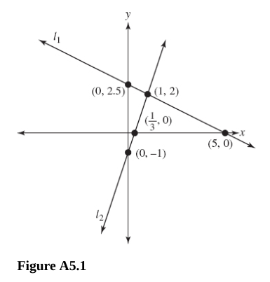
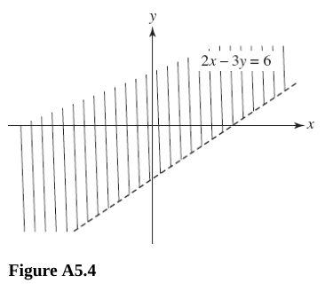
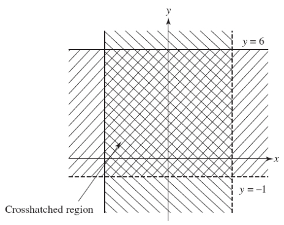
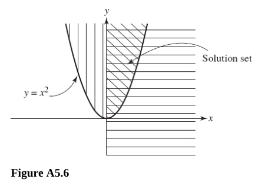

# Chapter 5 Systems of Equations and Inequalities

---

## Systems of Linear Equations

---

**197.** Solve the system of equations by graphing.

$$ x + 2y = 5 \text{, } 3x - y = 1 $$

Both graphs intersect at $(1, 2)$.

$$ \boxed{x = 1 \text{, } y = 2} $$

---

**198.** Without solving, tell whether the given system is independent,
dependent, or inconsistent.

You can determine dependence/independence/inconsistence by the following
formula:

$$ ax + by = c $$

$$ dx + ey = f $$

$$ \frac{d}{a} \neq \frac{e}{b} \text{: independent} $$

$$ \frac{d}{a} = \frac{e}{b} = \frac{f}{c} \text{: dependent} $$

$$ \frac{d}{a} = \frac{e}{b} \neq \frac{f}{c} \text{: inconsistent} $$

(A) $3x + y = 6 \text{, } 2x + y = 5$

**Answer:**

$$ \frac{3}{2} \neq \frac{1}{1} \text{: independent} $$

(B) $3x - y = 4 \text{, } x + y = 7$

**Answer:**

$$ \frac{3}{1} \neq \frac{-1}{1} \text{: independent} $$

\(C\) $2x + y = 10 \text{, } -4x - 2y = -20$

**Answer:**

$$ \frac{2}{-4} = \frac{1}{-2} = \frac{10}{-20} \text{: dependent}  $$

(D) $2x - y = -10 \text{, } -4x - y = 10$

**Answer:**

$$ \frac{2}{-4} \neq \frac{-1}{-1} \text{: independent} $$

(E) $y + x = 5 \text{, } y + x = 8$

**Answer:**

$$ \frac{1}{1} = \frac{1}{1} \neq \frac{5}{8} \text{: inconsistent} $$

(F) $x = 3y + 8 \text{, } 2y = x + 4$

**Answer:**

$$ x = 3y + 8 $$

$$ x - 3y = 8 $$

$$ 2y = x + 4 $$

$$ -x + 2y = 4 $$

$$ \frac{1}{-1} \neq \frac{-3}{2} \text{: independent} $$

(G) $y = x \text{, } 2y = x + 6$

**Answer:**

$$ y = x $$

$$ -x + y = 0 $$

$$ 2y = x + 6 $$

$$ -x + 2y = 6 $$

$$ \frac{-1}{-1} \neq \frac{1}{2} \text{: independent} $$

---

**For questions 199-201,** solve by using the addition/subtraction method.

---

**199.** $4x - y = 10 \text{, } x + 3y = 9$

**Answer:**

$$ 4x - y = 10 $$

$$ x + 3y = 9 $$

$$ 3(4x - y = 10) = 12x - 3y = 30 $$

$$ (x + 3y = 9) + (12x - 3y = 30) \rightarrow 13x = 39 \rightarrow x = 3  $$

$$ 4(3) - y = 10 \rightarrow 12 - y = 10 \rightarrow -y = -2 \rightarrow y = 2 $$

$$ (3) + 3y = 9 \rightarrow 3y = 6 \rightarrow y = 2 $$

$$ \boxed{x = 3, y = 2} $$

---

**200.** $2x + y = 5 \text{, } 4x + 2y = 10$

**Answer:**

$$ 2x + y = 5 $$

$$ 4x + 2y = 10 $$

$$ 2(2x + y = 5) \rightarrow 4x + 2y = 10 $$

$$ (4x + 2y = 10) - (4x + 2y = 10) \rightarrow 0 = 0 $$

The system is dependent. They are the same graph.

Let's express this properly:

$$ 2x + y = 5 $$

$$ y = 5 - 2x $$

$$ x = t \text{ where } t \text{ is any real number} $$

$$ y = 5 - 2t \text{ where } t \text{ is any real number} $$

---

**201.** $3x + y = 20 \text{, } 3x + y = 30$

**Answer:**

$$ 3x + y = 20 $$

$$ 3x + y = 30 $$

$$ (3x + y = 20) - (3x + y = 30) \rightarrow 0 = -10 $$

This is inconsistent, and therefore there is no solution.

$$ \boxed{\emptyset} $$

---

**For questions 203-206,** solve the given problem by using a system of linear
equations.

**203.** The sum of two numbers is $20$, and their difference is $10$. Find the
two numbers.

**Answer:**

$$ x + y = 20 $$

$$ x - y = 10 $$

We can use the method of substitution to find one of our variables first:

$$ x = 20 - y $$

$$ (20 - y) - y = 10 $$

$$ 20 - 2y = 10 $$

$$ -2y = -10 $$

$$ y = 5 $$

Now plug that into both of our equations to solve for $x$:

$$ x + (5) = 20 $$

$$ x = 15 $$

$$ x = 15 $$

Thusly our answer stands:

$$ \boxed{x = 15 \text{, } y = 5} $$

---

**204.** The length of a rectangle is $10 \text{ in}$ more than the width. The
perimeter of the rectangle is $60 \text{ in}$. Find the dimensions of the
rectangle.

**Answer:**

The length of the rectangle can be expressed by the following equation:

$$ w = \text{ width of rectangle} $$

$$ l = w + 10 = \text{ length of rectangle} $$

The perimeter of the rectangle can be expressed by the following equation:

$$ 60 = 2w + 2l $$

$$ 60 = 2w + 2(w + 10) $$

$$ 60 = 2w + 2w + 20 $$

$$ 40 = 4w $$

$$ w = 10 $$

$$ l = 20 $$

$$ \boxed{ \text{width } = 10 \text{ in, } \text{length } = 20 \text{ in}} $$

---

**205.** If the numerator of a fraction is increased by $2$, the fraction is
$\dfrac{1}{4}$; if the denominator is decreased by $6$, the fraction is
$\dfrac{1}{6}$. Find the fraction.

**Answer:**

$$ \frac{x + 2}{y} = \frac{1}{4} \text{, } \frac{x}{y - 6} = \frac{1}{6} $$

Both the method of substitution and the method of elimination will work and
neither will get rid of the messiness of dealing with fractions here, so let's
just use the method of substitution and be done with it.

$$ \frac{x + 2}{y} = \frac{1}{4} $$

$$ x + 2 = \frac{y}{4} $$

$$ y = 4x + 8 $$

$$ \frac{x}{y - 6} = \frac{1}{6} $$

$$ \frac{x}{(4x + 8) - 6} = \frac{1}{6} $$

$$ \frac{x}{4x + 2} = \frac{1}{6} $$

$$ x = \frac{4x + 2}{6} $$

$$ 6x = 4x + 2 $$

$$ 2x = 2 $$

$$ x = 1 $$

And now substitute $x$ back into both equations to solve for $y$ and to be sure
both equations return the same value for $y$:

$$ \frac{x + 2}{y} = \frac{1}{4} $$

$$ \frac{(1) + 2}{y} = \frac{1}{4} $$

$$ \frac{3}{y} = \frac{1}{4} $$

$$ 3 = \frac{y}{4} $$

$$ 12 = y $$

$$ \frac{x}{y - 6} = \frac{1}{6} $$

$$ \frac{(1)}{y - 6} = \frac{1}{6} $$

$$ 1 = \frac{y - 6}{6} $$

$$ 6 = y - 6 $$

$$ 12 = y $$

So our final fraction is:

$$ \boxed{\frac{1}{12}} $$

---

**206.** A woman can row downstream $6 \text{ mi}$ in $1 \text{ h}$ and return
in $2 \text{ h}$. Find her rate in still water and the rate of the river.

**Answer:**

Let $x = \text{rate in still water } \dfrac{\text{mi}}{\text{h}}$

Let $y = \text{rate of the river } \dfrac{\text{mi}}{\text{h}}$

$$ x + y = \text{rate downstream} $$

$$ x - y = \text{rate upstream} $$

$$ x + y = 6 $$

$$ x - y = \frac{6}{2} = 3 $$

$$ (x + y = 6) + (x - y = 3) \rightarrow 2x = 9 \rightarrow x = \frac{9}{2}
\rightarrow x = 4\frac{1}{2} \frac{\text{mi}}{\text{h}} $$

$$ (x + y = 6) - (x - y = 3) \rightarrow 2y = 3 \rightarrow y = \frac{3}{2}
\rightarrow y = 1\frac{1}{2} \frac{\text{mi}}{\text{h}} $$

$$ \boxed{\text{rate in still water} = 4\frac{1}{2} \frac{\text{mi}}{\text{h}}} $$

$$ \boxed{\text{rate of the river} = 1\frac{1}{2} \frac{\text{mi}}{\text{h}}} $$

---

**207.** Solve the system

$$
\begin{cases}
x - 5y + 3z = 9 \quad (1) \\
2x - y + 4z = 6 \quad (2) \\
3x - 2y + z = 2 \quad (3) \\
\end{cases}
$$

**Answer:**

$$ (x - 5y + 3z = 9) - 3(3x - 2y + z = 2) \rightarrow -8x + y = 3  $$

$$ (2x - y + 4z = 6) - (-4)(3x - 2y + z = 2) \rightarrow -10x + 7y = -2 $$

$$ -7(-8x + y = 3) + (-10x + 7y = -2) \rightarrow 46x = -23 \rightarrow \boxed{x = -\frac{1}{2}} $$

$$ -8\left(-\frac{1}{2}\right) + y = 3 \rightarrow \boxed{y = -1} $$

$$ \left(-\frac{1}{2}\right) - 5(-1) + 3z = 9 \rightarrow \boxed{z = \frac{3}{2}} $$

---

## Matrices and Determinants

---

**208.** Find $a$, $b$, $c$, $d$.

$$ \left[\begin{array}{cc} a & b \\ c & d \\ \end{array}\right]

=

\left[\begin{array}{cc} 1 & 5 \\ -2 & 3 \\ \end{array}\right] $$

**Answer:**

$$ a = 1 $$

$$ b = 5 $$

$$ c = -2 $$

$$ d = 3 $$

---

**For questions 209-213,** refer to the following matrices.

$$
A =
\left[\begin{array}{cc}
1 & -1 \\
3 & 1 \\
\end{array}\right]
$$

$$
B =
\left[\begin{array}{cc}
-3 & 2 \\
-2 & -3 \\
\end{array}\right]
$$

$$
C =
\left[\begin{array}{c}
-2 \\
-3 \\
1 \\
\end{array}\right]
$$

$$
D =
\left[\begin{array}{c}
2 \\
3 \\
5 \\
\end{array}\right]
$$

$$
E =
\left[\begin{array}{cccc}
-4 & -1 & 0 & -2 \\
\end{array}\right]
$$

$$
F =
\left[\begin{array}{cc}
-2 & -3 \\
-2 & 0 \\
1 & -2 \\
3 & -5 \\
\end{array}\right]
$$

---

**209.** What are the dimensions of $B$ and $E$?

**Answer:**

The dimensions of a matrix are read by row (horizontal) x column (vertical).

So the dimensnions of $B$ are $2 \text{ x } 2$.

And the dimensions of $E$ are $1 \text{ x } 4$.

---

**210.** What element is in the second row, first column of $F$?

**Answer:**

The second row of $F$ is: $[-2, 0]$

So the first column of that row contains the value:

$$ \boxed{-2} $$

---

**211.** Find $A + B$.

**Answer:**

$$
A + B =
\left[\begin{array}{cc}
1 & -1 \\
3 & 1 \\
\end{array}\right]
+
\left[\begin{array}{cc}
-3 & 2 \\
-2 & -3 \\
\end{array}\right]
$$

$$
A + B =
\left[\begin{array}{cc}
-2 & 1 \\
1 & -2 \\
\end{array}\right]
$$

---

**212.** Find the negative of matrix $B$.

**Answer:**

$$
-B =
\left[\begin{array}{cc}
3 & -2 \\
2 & 3 \\
\end{array}\right]
$$

---

**213.** Find $3D - 4C$.

**Answer:**

$$
C =
\left[\begin{array}{c}
-2 \\
-3 \\
1 \\
\end{array}\right]
$$

$$
D =
\left[\begin{array}{c}
2 \\
3 \\
5 \\
\end{array}\right]
$$

$$
4C =
\left[\begin{array}{c}
-8 \\
-12 \\
4 \\
\end{array}\right]
$$

$$
3D =
\left[\begin{array}{c}
6 \\
9 \\
15 \\
\end{array}\right]
$$

$$
3D - 4C =
\left[\begin{array}{c}
14 \\
21 \\
11 \\
\end{array}\right]
$$

---

**For questions 214 and 215,**

$$
A=
\left[\begin{array}{ccc}
2 & 3 & 1 \\
0 & -4 & 5 \\
\end{array}\right]
$$

$$
B=
\left[\begin{array}{ccc}
-5 & 2 & 4 \\
3 & 0 & -1 \\
\end{array}\right]
$$

---

**214.** Find $2B$.

**Answer:**

$$
2B=
\left[\begin{array}{ccc}
-10 & 4 & 8 \\
6 & 0 & -2 \\
\end{array}\right]
$$

---

**215.** Find $A^T$.

**Answer:**

This denotation means the "transpose of $A$", which means the matrix which has
rowsn and columns of $A$ interchanged.

$$
A=
\left[\begin{array}{ccc}
2 & 3 & 1 \\
0 & -4 & 5 \\
\end{array}\right]
$$

$$
A^T=
\left[\begin{array}{cc}
2 & 0 \\
3 & -4 \\
1 & 5 \\
\end{array}\right]
$$

---

**For questions 216-220,** find the product indicated.

---

**216.**

$$ \left[\begin{array}{cc} 1 & 2 \\ 3 & 1 \\ \end{array}\right]
\left[\begin{array}{cc} -1 & 2 \\ -1 & 2 \\ \end{array}\right]$$

**Answer:**

The product is defined since the number of columns for the first matrix is equal
to the number of rows of the second matrix.

$$ \left[\begin{array}{cc} 1 & 2 \\ 3 & 1 \\ \end{array}\right]
\left[\begin{array}{cc} -1 & 2 \\ -1 & 2 \\ \end{array}\right]

=

\left[\begin{array}{cc} 1(-1) + 2(-1) & 1 \cdot 2 + 2 \cdot 2 \\ 3(-1) + 1(-1) &
3 \cdot 2 + 1 \cdot 2 \\ \end{array}\right]

=

\left[\begin{array}{cc} -3 & 6 \\ -4 & 8 \\ \end{array}\right]

$$

---

**217.**

$$
\left[\begin{array}{c}
1 \\
1 \\
0 \\
\end{array}\right]
\left[\begin{array}{ccc}
2 & 3 & 1 \\
\end{array}\right]
$$

**Answer:**

The product is defined since the number of columns for the first matrix is equal
to the number of rows of the second matrix.

$$ \left[\begin{array}{c} 1 \\ 1 \\ 0 \\ \end{array}\right]
\left[\begin{array}{ccc} 2 & 3 & 1 \\ \end{array}\right]

=

\left[\begin{array}{ccc} 1 \cdot 2 & 1 \cdot 3 & 1 \cdot 1 \\ 1 \cdot 2 & 1
\cdot 3 & 1 \cdot 1 \\ 0 \cdot 2 & 0 \cdot 3 & 0 \cdot 1 \\ \end{array}\right]

=

\left[\begin{array}{ccc} 2 & 3 & 1 \\ 2 & 3 & 1 \\ 0 & 0 & 0 \\
\end{array}\right] $$

---

**218.**

$$
\left[\begin{array}{ccc}
2 & 1 & 3 \\
\end{array}\right]
\left[\begin{array}{ccc}
2 & 1 & 0 \\
0 & 0 & 0 \\
1 & 0 & 2 \\
\end{array}\right]
$$

**Answer:**

The product is defined since the number of columns for the first matrix is equal
to the number of rows of the second matrix.

$$
\left[\begin{array}{ccc}
(2 \cdot 2 + 1 \cdot 0 + 3 \cdot 1) & (2 \cdot 1 + 1 \cdot 0 + 3 \cdot 0) & (2 \cdot 0 + 1 \cdot 0 + 3 \cdot 2) \\
\end{array}\right]
$$

$$
\left[\begin{array}{ccc}
7 & 2 & 6 \\
\end{array}\right]
$$

---

**219.**

$$
\left[\begin{array}{c}
4 \\
1 \\
6 \\
\end{array}\right]
\left[\begin{array}{ccc}
1 & 0 & 1 \\
0 & 2 & 0 \\
0 & 0 & 1 \\
\end{array}\right]
$$

**Answer:**

The product is not defined because the number of columns of the first matrix (1)
does not equal the number of rows of the second matrix (3).

You could compose it so that it were defined if you were to transpose the first
matrix (make it's columns into rows instead):

$$
\left[\begin{array}{ccc}
4 & 1 & 6\\
\end{array}\right]
\left[\begin{array}{ccc}
1 & 0 & 1 \\
0 & 2 & 0 \\
0 & 0 & 1 \\
\end{array}\right]
$$

Note that this is not the same problem statement however and would not yield the
answer to this. There is **no solution** to this problem.

---

**220.**

$$
\left[\begin{array}{ccc}
1 & 2 & 3 \\
1 & 0 & 1 \\
\end{array}\right]
\left[\begin{array}{cc}
3 & 1 \\
4 & 2 \\
6 & 0 \\
\end{array}\right]
$$

**Answer:**

The product is defined as the first matrix's number of columns is equal to the
second matrix's number of rows.

Again, it always go multiply the first upper left terms then add it to the
second column times the second row then add it to the third column times the
third row and so on.

$$
\left[\begin{array}{cc}
(1 \cdot 3 + 2 \cdot 4 + 3 \cdot 6) & (1 \cdot 1 + 2 \cdot 2 + 3 \cdot 0) \\
(1 \cdot 3 + 0 \cdot 4 + 1 \cdot 6) & (1 \cdot 1 + 0 \cdot 2 + 1 \cdot 0) \\
\end{array}\right]
$$

$$
\left[\begin{array}{cc}
29 & 5 \\
9 & 1 \\
\end{array}\right]
$$

---

**221.** Perform the indicated operations. The $\cdot$ represents the _dot
product_.

$$
\left[\begin{array}{cc}
1 & 6 \\
\end{array}\right]
\cdot
\left[\begin{array}{c}
0 \\
1 \\
\end{array}\right]
+
\left[\begin{array}{ccc}
2 & 3 & 4 \\
\end{array}\right]
\cdot
\left[\begin{array}{c}
1 \\
2 \\
3 \\
\end{array}\right]
$$

**Answer:**

Both products are defined as their columns are equivalent to their other terms
rows.

$$
\left[\begin{array}{cc}
1 & 6 \\
\end{array}\right]
\cdot
\left[\begin{array}{c}
0 \\
1 \\
\end{array}\right]
$$

$$
\left[\begin{array}{c}
(1 \cdot 0 + 6 \cdot 1) \\
\end{array}\right]
= 6
$$

$$
\left[\begin{array}{ccc}
2 & 3 & 4 \\
\end{array}\right]
\cdot
\left[\begin{array}{c}
1 \\
2 \\
3 \\
\end{array}\right]
$$

$$
\left[\begin{array}{c}
(2 \cdot 1 + 3 \cdot 2 + 4 \cdot 3) \\
\end{array}\right]
= 20
$$

$$ 6 + 20 = \boxed{26} $$

---

**For questions 222-225,** verify the given statements, where

$$
A=
\left[\begin{array}{cc}
1 & 2 \\
0 & 1 \\
\end{array}\right]
\text{, }
B=
\left[\begin{array}{cc}
1 & 1 \\
2 & 3 \\
\end{array}\right]
\text{, }
C=
\left[\begin{array}{cc}
-3 & 1 \\
-1 & 2 \\
\end{array}\right]
$$

---

**222.** $AB \neq BA$

Let's evaluate $AB$ first:

$$
A=
\left[\begin{array}{cc}
1 & 2 \\
0 & 1 \\
\end{array}\right]
\text{, }
B=
\left[\begin{array}{cc}
1 & 1 \\
2 & 3 \\
\end{array}\right]
$$

$$
AB=
\left[\begin{array}{cc}
1 & 2 \\
0 & 1 \\
\end{array}\right]
\left[\begin{array}{cc}
1 & 1 \\
2 & 3 \\
\end{array}\right]
$$

The product is defined as the number of columns for $A$ equal the number of rows
for $B$.

$$
AB=
\left[\begin{array}{cc}
(1 \cdot 1 + 2 \cdot 2) & (1 \cdot 1 + 2 \cdot 3) \\
(0 \cdot 1 + 1 \cdot 2) & (0 \cdot 1 + 1 \cdot 3) \\
\end{array}\right]
$$

$$
AB=
\left[\begin{array}{cc}
5 & 7 \\
2 & 3 \\
\end{array}\right]
$$

Now let's evaluate for $BA$:

The product is defined as the number of columns for $B$ equal the number of rows
for $A$.

$$
B=
\left[\begin{array}{cc}
1 & 1 \\
2 & 3 \\
\end{array}\right]
\text{, }
A=
\left[\begin{array}{cc}
1 & 2 \\
0 & 1 \\
\end{array}\right]
$$

$$
BA=
\left[\begin{array}{cc}
1 & 1 \\
2 & 3 \\
\end{array}\right]
\left[\begin{array}{cc}
1 & 2 \\
0 & 1 \\
\end{array}\right]
$$

$$
BA=
\left[\begin{array}{cc}
(1 \cdot 1 + 1 \cdot 0) & (1 \cdot 2 + 1 \cdot 1) \\
(2 \cdot 1 + 3 \cdot 0) & (2 \cdot 2 + 3 \cdot 1) \\
\end{array}\right]
$$

$$
BA=
\left[\begin{array}{cc}
1 & 3 \\
2 & 7 \\
\end{array}\right]
$$

And we can clearly see that if:

$$
AB=
\left[\begin{array}{cc}
5 & 7 \\
2 & 3 \\
\end{array}\right]
$$

And if:

$$
BA=
\left[\begin{array}{cc}
1 & 3 \\
2 & 7 \\
\end{array}\right]
$$

That:

$$
\left[\begin{array}{cc}
5 & 7 \\
2 & 3 \\
\end{array}\right]
\neq
\left[\begin{array}{cc}
1 & 3 \\
2 & 7 \\
\end{array}\right]
$$

And therefore the original problem statement is verifiably true that:

$$ AB \neq BA $$

---

**223.** $(AB)C = A(BC)$

Using our evaluations from 222, we can save ourselves some work here. Let's
first solve for $(AB)C$:

$$
AB=
\left[\begin{array}{cc}
5 & 7 \\
2 & 3 \\
\end{array}\right]
$$

$$
C=
\left[\begin{array}{cc}
-3 & 1 \\
-1 & 2 \\
\end{array}\right]
$$

The product is defined as the number of columns for $AB$ is equal to the number
of rows for $C$.

$$
(AB)C=
\left[\begin{array}{cc}
(5 \cdot -3 + 7 \cdot -1) & (5 \cdot 1 + 7 \cdot 2) \\
(2 \cdot -3 + 3 \cdot -1) & (2 \cdot 1 + 3 \cdot 2) \\
\end{array}\right]
$$

$$
(AB)C=
\left[\begin{array}{cc}
-22 & 19 \\
-9 & 8 \\
\end{array}\right]
$$

Now let's evaluate for $A(BC)$:

$$
A=
\left[\begin{array}{cc}
1 & 2 \\
0 & 1 \\
\end{array}\right]
\text{, }
B=
\left[\begin{array}{cc}
1 & 1 \\
2 & 3 \\
\end{array}\right]
\text{, }
C=
\left[\begin{array}{cc}
-3 & 1 \\
-1 & 2 \\
\end{array}\right]
$$

First we'll need to evaluate $BC$:

The product is defined as the number of columns in $B$ equals the number of rows
in $C$.

$$
BC=
\left[\begin{array}{cc}
(1 \cdot -3 + 1 \cdot -1) & (1 \cdot 1 + 1 \cdot 2) \\
(2 \cdot -3 + 3 \cdot -1) & (2 \cdot 1 + 3 \cdot 2) \\
\end{array}\right]
$$

$$
BC=
\left[\begin{array}{cc}
-4 & 3 \\
-9 & 8 \\
\end{array}\right]
$$

And now we can evaluate for $A(BC)$:

$$
A=
\left[\begin{array}{cc}
1 & 2 \\
0 & 1 \\
\end{array}\right]
\text{, }
BC=
\left[\begin{array}{cc}
-4 & 3 \\
-9 & 8 \\
\end{array}\right]
$$

The product is defined as the number of columns in $A$ is equal to the number of
rows in $BC$.

$$
A(BC)=
\left[\begin{array}{cc}
(1 \cdot -4 + 2 \cdot -9) & (1 \cdot 3 + 2 \cdot 8) \\
(0 \cdot -4 + 1 \cdot -9) & (0 \cdot 3 + 1 \cdot 8) \\
\end{array}\right]
$$

$$
A(BC)=
\left[\begin{array}{cc}
-22 & 19 \\
-9 & 8 \\
\end{array}\right]
$$

Finally we can compare:

$$
(AB)C=
\left[\begin{array}{cc}
-22 & 19 \\
-9 & 8 \\
\end{array}\right]
\text{, }
A(BC)=
\left[\begin{array}{cc}
-22 & 19 \\
-9 & 8 \\
\end{array}\right]
$$

And we can clearly see that they are equal, therefore our original problem
statement is verifiably true that:

$$ (AB)C = A(BC) $$

---

**224.** $A(B + C) = AB + AC$.

Let's first evaluate $B + C$:

$$
A=
\left[\begin{array}{cc}
1 & 2 \\
0 & 1 \\
\end{array}\right]
\text{, }
B=
\left[\begin{array}{cc}
1 & 1 \\
2 & 3 \\
\end{array}\right]
\text{, }
C=
\left[\begin{array}{cc}
-3 & 1 \\
-1 & 2 \\
\end{array}\right]
$$

The sum is defined because both matrices $B$ and $C$ have the exact same number
of rows and columns.

$$ B + C = \left[\begin{array}{cc} 1 & 1 \\ 2 & 3 \\ \end{array}\right] +
\left[\begin{array}{cc} -3 & 1 \\ -1 & 2 \\ \end{array}\right]

=

\left[\begin{array}{cc} -2 & 2 \\ 1 & 5 \\ \end{array}\right] $$

$$
B + C=
\left[\begin{array}{cc}
-2 & 2 \\
1 & 5 \\
\end{array}\right]
$$

Now let's multiply $A(B + C)$. The product is defined because the number of
columns in matrix $A$ is equal to the number of rows in matrix $B + C$.

$$
A=
\left[\begin{array}{cc}
1 & 2 \\
0 & 1 \\
\end{array}\right]
$$

$$
B + C=
\left[\begin{array}{cc}
-2 & 2 \\
1 & 5 \\
\end{array}\right]
$$

$$
A(B + C)=
\left[\begin{array}{cc}
(1 \cdot -2 + 2 \cdot 1) & (1 \cdot 2 + 2 \cdot 5) \\
(0 \cdot -2 + 1 \cdot 1) & (0 \cdot 2 + 1 \cdot 5) \\
\end{array}\right]
$$

$$
A(B + C)=
\left[\begin{array}{cc}
0 & 12 \\
1 & 5 \\
\end{array}\right]
$$

Now we evaluate for $AB + AC$. Luckily we already have AB from problem 222:

$$
AB=
\left[\begin{array}{cc}
5 & 7 \\
2 & 3 \\
\end{array}\right]
$$

So let's evaluate for $AC$. The product is defined as the number of columns in
$A$ is equal to the number of rows in $C$.

$$
A=
\left[\begin{array}{cc}
1 & 2 \\
0 & 1 \\
\end{array}\right]
\text{, }
C=
\left[\begin{array}{cc}
-3 & 1 \\
-1 & 2 \\
\end{array}\right]
$$

$$
AC=
\left[\begin{array}{cc}
(1 \cdot -3 + 2 \cdot -1) & (1 \cdot 1 + 2 \cdot 2) \\
(0 \cdot -3 + 1 \cdot -1) & (0 \cdot 1 + 1 \cdot 2) \\
\end{array}\right]
$$

$$
AC=
\left[\begin{array}{cc}
-5 & 5 \\
-1 & 2 \\
\end{array}\right]
$$

So now we can evaluate for $AB + AC$:

$$
AB=
\left[\begin{array}{cc}
5 & 7 \\
2 & 3 \\
\end{array}\right]
\text{, }
AC=
\left[\begin{array}{cc}
-5 & 5 \\
-1 & 2 \\
\end{array}\right]
$$

$$ AB + AC= \left[\begin{array}{cc} 5 & 7 \\ 2 & 3 \\ \end{array}\right] +
\left[\begin{array}{cc} -5 & 5 \\ -1 & 2 \\ \end{array}\right]

=

\left[\begin{array}{cc} 0 & 12 \\ 1 & 5 \\ \end{array}\right] $$

$$
AB + AC=
\left[\begin{array}{cc}
0 & 12 \\
1 & 5 \\
\end{array}\right]
$$

So finally we can compare our two evaluated matrices:

$$
A(B + C)=
\left[\begin{array}{cc}
0 & 12 \\
1 & 5 \\
\end{array}\right]
$$

$$
AB + AC=
\left[\begin{array}{cc}
0 & 12 \\
1 & 5 \\
\end{array}\right]
$$

And we can clearly see that they are equal. Therefore we can verify that our
problem statement is true:

$$ A(B + C) = AB + AC $$

---

**225.** $(B + C)A = BA + CA$.

Luckily we have $B + C$ from 224:

$$
B + C=
\left[\begin{array}{cc}
-2 & 2 \\
1 & 5 \\
\end{array}\right]
$$

Let's evalaute $(B + C)A$. The product is defined as $B + C$ has a number of
columns equivalent to the number of rows of $A$.

$$
B + C=
\left[\begin{array}{cc}
-2 & 2 \\
1 & 5 \\
\end{array}\right]
\text{, }
A=
\left[\begin{array}{cc}
1 & 2 \\
0 & 1 \\
\end{array}\right]
$$

$$
(B + C)(A)=
\left[\begin{array}{cc}
(-2 \cdot 1 + 2 \cdot 0) & (-2 \cdot 2 + 2 \cdot 1) \\
(1 \cdot 1 + 5 \cdot 0) & (1 \cdot 2 + 5 \cdot 1) \\
\end{array}\right]
$$

$$
(B + C)(A)=
\left[\begin{array}{cc}
-2 & -2 \\
1 & 7 \\
\end{array}\right]
$$

Now we can evaluate $BA + CA$. Luckily we already have $BA$ from 222.

$$
BA=
\left[\begin{array}{cc}
1 & 3 \\
2 & 7 \\
\end{array}\right]
$$

So we just have to evaluate for $CA$ now. The product is defined as the number
of columns for $C$ is equal to the number of rows for $A$.

$$
C=
\left[\begin{array}{cc}
-3 & 1 \\
-1 & 2 \\
\end{array}\right]
\text{, }
A=
\left[\begin{array}{cc}
1 & 2 \\
0 & 1 \\
\end{array}\right]
$$

$$
CA=
\left[\begin{array}{cc}
(-3 \cdot 1 + 1 \cdot 0) & (-3 \cdot 2 + 1 \cdot 1) \\
(-1 \cdot 1 + 2 \cdot 0) & (-1 \cdot 2 + 2 \cdot 1) \\
\end{array}\right]
$$

$$
CA=
\left[\begin{array}{cc}
-3 & -5 \\
-1 & 0 \\
\end{array}\right]
$$

And now we can evaluate $BA + CA$:

$$
BA=
\left[\begin{array}{cc}
1 & 3 \\
2 & 7 \\
\end{array}\right]
\text{, }
CA=
\left[\begin{array}{cc}
-3 & -5 \\
-1 & 0 \\
\end{array}\right]
$$

$$
BA + CA=
\left[\begin{array}{cc}
(1 + (-3)) & (3 + (-5)) \\
(2 + (-1)) & (7 + 0) \\
\end{array}\right]
$$

$$
BA + CA=
\left[\begin{array}{cc}
-2 & -2 \\
1 & 7 \\
\end{array}\right]
$$

Finally we can compare:

$$
(B + C)(A)=
\left[\begin{array}{cc}
-2 & -2 \\
1 & 7 \\
\end{array}\right]
\text{, }
BA + CA=
\left[\begin{array}{cc}
-2 & -2 \\
1 & 7 \\
\end{array}\right]
$$

And we can clearly see they are equivalent, so therefore our original problem
statement is verifiably true:

$$ (B + C)(A = BA + CA) $$

---

**226.** Evaluate the determinant.

$$
\left[\begin{array}{cc}
1 & 6 \\
5 & 4 \\
\end{array}\right]
$$

**Answer:**

The determinant is defined as the number of columns equals the number of rows
(_.i.e._ the matrix is a square). You can calculate the determinant by taking
the first row first column element and multiplying it diagonally across the
matrix. Then subtract the first row last element by the other diagonal:

$$ (1 \cdot 4) - (6 \cdot 5) = 4 - 30 = \boxed{-26} $$

---

**227.** Evaluate the determinant by using cofactors.

$$
\left[\begin{array}{ccc}
1 & 4 & 1 \\
1 & 1 & -2 \\
2 & 1 & -1 \\
\end{array}\right]
$$

**Answer:**

We have never seen this before, so let's just try to evaluate as best we can.
Based off of this short introduction to determinants and cofactors found
[here](https://www.algebrapracticeproblems.com/cofactor-expansion/), we can
determine quite a few things.

One is that by finding the minor of the matrix. Which minor we find is
determined by the row we choose, denoted by $i$, as well as which column we
choose, denoted by $j$. We then eliminate that row and column to get a smaller
matrix.

So if we were to take the minor of our matrix by eliminating both the first row
and first column of our matrix, we would get:

$$
M_{1, 1} =
\left[\begin{array}{cc}
1 & -2 \\
1 & -1 \\
\end{array}\right]
$$

Now, we can find the determinant of this Minor using the method described in
226, but this is only the _Minor_ determinant:

$$ \det\left(M_{1, 1}\right) = (1 \cdot -1) - (-2 \cdot 1) $$

$$ \det\left(M_{1, 1}\right) = 1 $$

To find the cofactor is a bit more complicated. A Cofactor is denoted as
follows:

$$ C_{ij} $$

Where, once again, $i$ denotes the row and $j$ denotes the column.

We can evaluate the cofactor with the following formula:

$$ C_{i, j} = (-1)^{i + j} \cdot \det(M_{i, j}) $$

As an aside, the comma is optional in notation for smaller matrices:

$$ C_{ij} = (-1)^{i + j} \cdot \det(M_{ij}) $$

We can therefore determine the conjugate of $1, 1$ like so:

$$ C_{11} = (-1)^{1 + 1} \cdot \det{M_{11}} $$

$$ \det\left(M_{1, 1}\right) = (1 \cdot -1) - (-2 \cdot 1) $$

$$ \det\left(M_{1, 1}\right) = 1 $$

$$ C_{11} = (-1)^{2} \cdot 1 $$

$$ C_{11} = 1 \cdot 1 $$

$$ C_{11} = 1 $$

We can then find the determinant for the entire matrix using conjugates from
${1,1}$ through to ${1, 3}$. We already have $C_{11}$, let's find $C_{12}$ and
$C_{13}$. Note that we only have to choose one row to do this, but we do have to
iterate through the each column along that chosen row.

$$ C_{12} = (-1)^{1 + 2} \cdot \det{M_{12}} $$

$$
M_{12}
\left[\begin{array}{cc}
1 & -2 \\
2 & -1 \\
\end{array}\right]
$$

$$ \det{M_{12}} = (1 \cdot -1) - (-2 \cdot 2) $$

$$ \det{M_{12}} = (-1) - (-4) $$

$$ \det{M_{12}} = 3 $$

$$ C_{12} = (-1)^{3} \cdot (3) $$

$$ C_{12} = -1 \cdot 3 $$

$$ C_{12} = -3 $$

$$ C_{13} = (-1)^{1 + 3} \cdot \det{M_{13}} $$

$$
M_{13}
\left[\begin{array}{cc}
1 & 1 \\
2 & 1 \\
\end{array}\right]
$$

$$ \det{M_{13}} = (1 \cdot 1) - (1 \cdot 2) $$

$$ \det{M_{13}} = (1) - (2) $$

$$ \det{M_{13}} = -1 $$

$$ C_{13} = (-1)^{1 + 3} \cdot (-1) $$

$$ C_{13} = (-1)^{4} \cdot (-1) $$

$$ C_{13} = 1 \cdot (-1) $$

$$ C_{13} = -1 $$

Now, the formula for finding the determinant of the entire matrix would be:

$$ C_{11} + C_{12} + C{13} $$

But, there is a coefficient that we must apply to each cofactor prior to
evaluating this expression. The Coefficient is determined by the value found at
each matrix cell, so for example ${1, 1}$ has the value of $1$. ${1, 2}$ has the
value of $4$, and ${1, 3}$ has the value of $1$:

$$ 1C_{11} + 4C_{12} + 1C{13} $$

Evaluating this we get:

$$ 1(1) + 4(-3) + 1(-1) $$

$$ 1 - 12 - 1 $$

And finally we get our final discriminant of:

$$ \boxed{-12} $$

Final Note:

The notation for all of this, should you have a matrix, $A$, would be something
along the lines of:

$$ A_{i, j}C_{i, j} + A_{i, j + 1}C_{i, j + 1} + A_{i, j + 2}C_{i, j+ 2} \dots $$

---

**228.** State the theorem that can be used to justify the given statement.

These answers are just taken from the back.

(A)

$$ \left[\begin{array}{cc} 6 & 8 \\ 0 & -1 \\ \end{array}\right]

=

2 \left[\begin{array}{cc} 3 & 4 \\ 0 & -1 \\ \end{array}\right] $$

**Answer:**

If every element in a column or row of a determinant is multiplied by a constant
(here, row $1$ is multiplied by $2$), the new determinant is the constant times
the original.

(B)

$$ \left[\begin{array}{ccc} 1 & 3 & 6 \\ 0 & 0 & 0 \\ 4 & 9 & 1 \\
\end{array}\right]

= 0 $$

**Answer:**

In a given determinant, if any column or row is all zeros, the determinant is
$0$. Here, row $2$ is all zeros.

\(C\)

$$ \left[\begin{array}{ccccc} 0 & 4 & 6 & 3 & 8 \\ 0 & 1 & 2 & 1 & 0 \\ 0 & 1 &
6 & 18 & 9 \\ 0 & 1 & 4 & 0 & 1 \\ 0 & 0 & 1 & 1 & 0 \\ \end{array}\right]

= 0 $$

**Answer:**

See question 228B. All entries here in column $1$ are zero. Notice how much work
is saved by using this theorem.

(D)

$$ \left[\begin{array}{cc} 4 & 3 \\ 1 & 2 \\ \end{array}\right]

= \left[\begin{array}{cc} 4 - 3 & 3 - 6 \\ 1 & 2 \\ \end{array}\right] $$

**Answer:**

If a constant multiple of a row or column is added to another row or column, the
determinant's value is unchanged. Here we multiplied row $2$ by $-3$ and added
it to row $1$.

(E)

$$ \left[\begin{array}{cccc} 1 & 2 & 4 & 1 \\ 1 & 3 & 4 & 2 \\ 1 & 2 & 4 & 1 \\
0 & 1 & 4 & 1 \\ \end{array}\right]

= 0 $$

**Answer:**

If two rows or columns in a given determinant are identical, then the
determinant's value $= 0$. Here row $1 =$ row $3$.

(F)

$$ \left[\begin{array}{ccc} 2 & 1 & 3 \\ 4 & 6 & 9 \\ 2 & 8 & 1 \\
\end{array}\right]

=

-

\left[\begin{array}{ccc} 4 & 6 & 9 \\ 2 & 1 & 3 \\ 2 & 8 & 1 \\
\end{array}\right] $$

**Answer:**

If two rows or columns are interchanged in a given determinant, the resulting
determinant is the negative of the original. Here, rows $1$ and $2$ were
interchanged.

---

**229.** Show that the two matrices are inverses of each other.

$$
\left[\begin{array}{cc}
3 & -4 \\
-2 & 3 \\
\end{array}\right]
\left[\begin{array}{cc}
3 & 4 \\
2 & 3 \\
\end{array}\right]
$$

An inverse of a minor matrix(a 2 x 2 matrix) can be determined by taking the
original, swapping each element them for their diagonals, applying negatives to
the first row second column and the second row first column elements, then
multiplying it by the reciprocal of the determinant.

Very difficult, lol. Here's what the abstract looks like:

$$ \left[\begin{array}{cc} a & b \\ c & d \\ \end{array}\right] ^{-1}

=

\frac{1}{ad - bc}

\left[\begin{array}{cc} d & -b \\ -c & a \\ \end{array}\right]

$$

If we look at our problem statement, we can see that indeed they are inverses of
each other, but let's evaluate the multiplication. If we get an
[identity matrix](https://en.wikipedia.org/wiki/Identity_matrix), then they are
inverses:

$$ \left[\begin{array}{cc} 3 & -4 \\ -2 & 3 \\ \end{array}\right]
\left[\begin{array}{cc} 3 & 4 \\ 2 & 3 \\ \end{array}\right]

=

\left[\begin{array}{cc} (3 \cdot 3 + -4 \cdot 2) & (3 \cdot 4 + -4 \cdot 3) \\
(-2 \cdot 3 + 3 \cdot 2) & (-2 \cdot 4 + 3 \cdot 3) \\ \end{array}\right]

= \left[\begin{array}{cc} 1 & 0 \\ 0 & 1 \\ \end{array}\right] $$

This is an identity matrix and therefore our two matrices are inverses of one
another. We can express this as, if $AB = I$, then $A = B^{-1}$.

---

**For questions 230 and 231,** a matrix $M$ is given. Find $M^{-1}$.

---

**230.**

$$
\left[\begin{array}{cc}
1 & 2 \\
1 & 3 \\
\end{array}\right]
$$

We can find the inverse by the following formula:

$$ \left[\begin{array}{cc} a & b \\ c & d \\ \end{array}\right] ^{-1}

=

\frac{1}{ad - bc}

\left[\begin{array}{cc} d & -b \\ -c & a \\ \end{array}\right]

$$

$$ \left[\begin{array}{cc} 1 & 2 \\ 1 & 3 \\ \end{array}\right] ^{-1}

=

\frac{1}{(1 \cdot 3) - (2 \cdot 1)} \left[\begin{array}{cc} 3 & -2 \\ -1 & 1 \\
\end{array}\right] $$

$$

\frac{1}{1}

\left[\begin{array}{cc} 3 & -2 \\ -1 & 1 \\ \end{array}\right] $$

Therefore our final inverse is:

$$ \left[\begin{array}{cc} 1 & 2 \\ 1 & 3 \\ \end{array}\right] ^{-1}

=

\left[\begin{array}{cc} 3 & -2 \\ -1 & 1 \\ \end{array}\right] $$

We can check it by multiplying the two matrices and seeing if we get an Identity
Matrix.

---

**231.**

$$
M=
\left[\begin{array}{ccc}
1 & -3 & 0 \\
0 & 3 & 1 \\
2 & -1 & 2 \\
\end{array}\right]
$$

First compute the determinant of the matrix $M$:

$$ \det(A) = a^{11} \cdot \det(M_{11}) - a_{12} \cdot \det(M_{12}) + a_{13}
\cdot \det(M_{13}) $$

The Minor of $M_{11}$ is:

$$ M_{11} \left[\begin{array}{cc} 3 & 1 \\ -1 & 2 \\ \end{array}\right]

\Rightarrow

\det(M_{11}) = (3 \cdot 2) - (1 \cdot -1) = 6 + 1 = 7 $$

Then the Cofactor of $a_{11}$ is:

$$ C_{11} = (-1)^{1 + 1} \cdot 7 = 7 $$

The Minor of $M_{12}$ is:

$$ M_{12} \left[\begin{array}{cc} 0 & 1 \\ 2 & 2 \\ \end{array}\right]

\Rightarrow

\det(M_{12}) = (0 \cdot 2) - (1 \cdot 2) = -2 $$

And the Cofactor of $a_{12}$ is:

$$ C_{12} = (-1)(1 + 2) \cdot -2 = 2 $$

The Minor of $M_{13}$ is:

$$ M_{13} \left[\begin{array}{cc} 0 & 3 \\ 2 & -1 \\ \end{array}\right]

\Rightarrow

\det(M_{13}) = (0 \cdot -1) - (3 \cdot 2) = -6 $$

And the Cofactor of $a_{13}$ is:

$$ C_{13} = (-1)^{1 + 3} \cdot -6 = -6 $$

The determinant of the entire matrix $M$ can be computed as so:

$$ \det(M) = a_{11}C_{11} + a_{12}C_{12} + a_{13}C_{13} $$

Again, our original matrix, $M$, is:

$$
M=
\left[\begin{array}{ccc}
1 & -3 & 0 \\
0 & 3 & 1 \\
2 & -1 & 2 \\
\end{array}\right]
$$

Plugging in all our values we get:

$$ \det(M) = (1)(7) + (-3)(2) + (0)(-6) = 7 - 6 + 0 = 1 $$

This tells us that the matrix is invertible, as $\det(M) \neq 0$.

Now we can compute the Cofactor Matrix by computing the remaining cofactors.

We already have Row 1:

- $C_{11} = 7$

- $C_{12} = 2$

- $C_{13} = -6$

Row 2:

The Minor of $M_{21}$ is:

$$ M_{21} \left[\begin{array}{cc} -3 & 0 \\ -1 & 2 \\ \end{array}\right]

\Rightarrow

\det(M_{21}) = (-3 \cdot 2) - (0 \cdot -1) = -6 $$

Then the Cofactor of $a_{21}$ is:

$$ C_{21} = (-1)^{2 + 1} \cdot (-6) = 6 $$

The Minor of $M_{22}$ is:

$$ M_{22} \left[\begin{array}{cc} 1 & 0 \\ 2 & 2 \\ \end{array}\right]

\Rightarrow

\det(M_{22}) = (1 \cdot 2) - (0 \cdot 2) = 2 $$

Then the Cofactor of $a_{22}$ is:

$$ C_{22} = (-1)^{2 + 2} \cdot 2 = 2 $$

The Minor of $M_{23}$ is:

$$ M_{23} \left[\begin{array}{cc} 1 & -3 \\ 2 & -1 \\ \end{array}\right]

\Rightarrow

\det(M_{23}) = (1 \cdot -1) - (-3 \cdot 2) = 5 $$

Then the Cofactor of $a_{23}$ is:

$$ C_{23} = (-1)^{2 + 3} \cdot (5) = -5 $$

Row 2:

- $C_{21} = 6$

- $C_{22} = 2$

- $C_{23} = -5$

Row 3:

The Minor of $M_{31}$ is:

$$ M_{31} \left[\begin{array}{cc} -3 & 0 \\ 3 & 1 \\ \end{array}\right]

\Rightarrow

\det(M_{31}) = (-3 \cdot 1) - (0 \cdot 3) = -3 $$

Then the Cofactor of $a_{31}$ is:

$$ C_{31} = (-1)^{3 + 1} \cdot (-3) = -3 $$

The Minor of $M_{32}$ is:

$$ M_{32} \left[\begin{array}{cc} 1 & 0 \\ 0 & 1 \\ \end{array}\right]

\Rightarrow

\det(M_{32}) = (1 \cdot 1) - (0 \cdot 0) = 1 $$

Then the Cofactor of $a_{32}$ is:

$$ C_{32} = (-1)^{3 + 2} \cdot (1) = -1 $$

The Minor of $M_{33}$ is:

$$ M_{33} \left[\begin{array}{cc} 1 & -3 \\ 0 & 3 \\ \end{array}\right]

\Rightarrow

\det(M_{33}) = (1 \cdot 3) - (-3 \cdot 0) = 3 $$

Then the Cofactor of $a_{33}$ is:

$$ C_{33} = (-1)^{3 + 3} \cdot () = 3 $$

Row 3:

- $C_{31} = -3$

- $C_{32} = -1$

- $C_{33} = 3$

Our Cofactor Matrix is:

$$ C_{M} = $$

$$
C_{M}=
\left[\begin{array}{ccc}
7 & 2 & -6 \\
6 & 2 & -5 \\
-3 & -1 & 3 \\
\end{array}\right]
$$

To get the Adjugate we need to transpose the Cofactor Matrix:

$$
adj(M) = (C_{M})^{T} =
\left[\begin{array}{ccc}
7 & 6 & -3 \\
2 & 2 & -1 \\
-6 & -5 & 3 \\
\end{array}\right]
$$

Then we divide the entire Adjugate by the determinant $d_{M}$, which is $1$,
leaving us with our final answer:

$$
M^{-1}=
\left[\begin{array}{ccc}
7 & 6 & -3 \\
2 & 2 & -1 \\
-6 & -5 & 3 \\
\end{array}\right]
$$

---

**For questions 232 and 233,** use Cramer's rule to solve the given system.

---

**232.** $x + 2y = 6 \text{, } 3x - 5y = 10$

Write the system in matrix form:

We want to express this system as:

$$ AX = B $$

Where:

$$
A =
\left[\begin{array}{cc}
1 & 2 \\
3 & -5 \\
\end{array}\right]
$$

is the **coefficient matrix**

And:

$$
X=
\left[\begin{array}{c}
x \\
y \\
\end{array}\right]
$$

Are the variables. and:

$$
B=
\left[\begin{array}{c}
6 \\
10 \\
\end{array}\right]
$$

Then we Compute the determinant of matrix $A$ as $D$:

$$ D = \det(A) = (1 \cdot -5) - (2 \cdot 3) = -11 $$

Compute $D_x$ - replace the first column of $A$ with $B$

$$
D_x
\left[\begin{array}{cc}
6 & 2 \\
10 & -5 \\
\end{array}\right]
$$

$$ D_x = \det(x) = (6 \cdot -5) - (2 \cdot 10) = -50 $$

Compute $D_y$ - replace the second column of $A$ with $B$

$$
D_y=
\left[\begin{array}{cc}
1 & 6 \\
3 & 10 \\
\end{array}\right]
$$

$$ D_y = \det(y) = (1 \cdot 10) - (6 \cdot 3) = -8 $$

And then apply Cramer's Rule:

$$ x = \frac{D_x}{D} = \frac{-50}{-11} = \frac{50}{11} $$

$$ y = \frac{D_y}{D} = \frac{-8}{-11} = \frac{8}{11} $$

---

**233.** $x + y = 0 \text{, } 2y + z = -5 \text{, } -x + z = -3$

**Answer:**

Put it in standard form first:

$$ x + y + 0z = 0 $$

$$ 0x +2y + z = -5 $$

$$ -x + 0y + z = -3 $$

Put it into matrix form:

$$ AX = B $$

$$ A= \left[\begin{array}{ccc} 1 & 1 & 0 \\ 0 & 2 & 1 \\ -1 & 0 & 1 \\
\end{array}\right] \text{, } X= \left[\begin{array}{c} x \\ y \\ z \\
\end{array}\right] \text{, } B= \left[\begin{array}{c} 0 \\ -5 \\ -3 \\
\end{array}\right]
$$

Now we determine the Determinant of the Entire Matrix $A$:

$$
a_{11}=
\left[\begin{array}{cc}
2 & 1 \\
0 & 1 \\
\end{array}\right]
$$

$$ \det(A_{11}) = a_{11}(-1)^{1 + 1} \cdot [(2 \cdot 1) - (1 \cdot 0)] $$

$$ \det(A_{11}) = (1)(1) \cdot 2 $$

$$ \det(A_{11}) = 2 $$

$$
a_{12}=
\left[\begin{array}{cc}
0 & 1 \\
-1 & 1 \\
\end{array}\right]
$$

$$ \det(A_{12}) = a_{12}(-1)^{1 + 2} \cdot [(0 \cdot 1) - (1 \cdot -1)] $$

$$ \det(A_{12}) = (1)(-1) \cdot 1 $$

$$ \det(A_{12}) = -1 $$

$$
a_{13}=
\left[\begin{array}{cc}
0 & 2 \\
-1 & 0 \\
\end{array}\right]
$$

$$ \det(A_{13}) = a_{13}(-1)^{1 + 3} \cdot [(0 \cdot 0) - (2 \cdot -1)] $$

$$ \det(A_{13}) = (0)(1) \cdot 2 $$

$$ \det(A_{13}) = 0 $$

Our final determinant is:

$$ D = \det(A_{11}) + \det(A_{12}) + \det(A_{13}) $$

$$ D = 2 + (-1) + 0 $$

$$ D = 1 $$

Because $D \neq 0$, there is a unique solution.

Now we compute $D_x$, $D_y$, and $D_z$.

We replace one column at a time in matrix $A$ with vector $B$.

We replace the first column of matrix $A$ with vector $B$ to find $D_x$:

$$ A= \left[\begin{array}{ccc} 1 & 1 & 0 \\ 0 & 2 & 1 \\ -1 & 0 & 1 \\
\end{array}\right] \text{, } X= \left[\begin{array}{c} x \\ y \\ z \\
\end{array}\right] \text{, } B= \left[\begin{array}{c} 0 \\ -5 \\ -3 \\
\end{array}\right]
$$

$$
D_x=
\left[\begin{array}{ccc}
0 & 2 & 0 \\
-5 & 2 & 1 \\
-3 & 0 & 1 \\
\end{array}\right]
$$

And we use cofactor expansion on the first row:

$$ \det(Dx_{11}) = 0 \cdot (-1)^{1 + 1} \cdot ((2 \cdot 1) - (1 \cdot 0)) = 0 $$

$$ \det(Dx_{12}) = 1 \cdot (-1)^{1 + 2} \cdot ((-5 \cdot 1) - (1 \cdot -3)) = 2 $$

$$ \det(Dx_{13}) = 0 \cdot (-1)^{1 + 3} \cdot ((-5 \cdot 0) - (2 \cdot -3)) = 0 $$

And we sum to find $D_x$:

$$ D_x = \det(Dx_{11}) + \det(Dx_{12}) + \det(Dx_{13}) = 2 $$

Replace the second column of $A$ with $B$ to find $D_y$

$$
D_y
\left[\begin{array}{ccc}
1 & 0 & 0 \\
0 & -5 & 1 \\
-1 & -3 & 1 \\
\end{array}\right]
$$

And use cofactor expansion on the first row:

$$ D_y = 1 \cdot (-1)^{1 + 1} \cdot ((-5 \cdot 1) - (1 \cdot -3)) = -2 $$

Because the other cofactors will all multiply by $0$, we'll ignore them.

Replace the third column of $A$ with $B$ to find $D_z$

$$
D_z=
\left[\begin{array}{ccc}
1 & 1 & 0 \\
0 & 2 & -5 \\
-1 & 0 & -3 \\
\end{array}\right]
$$

And use cofactor expansion on the first row:

$$ dz_{11} = 1 \cdot (-1)^{1 + 1} \cdot ((2 \cdot -3) - (-5 \cdot 0)) = -6 $$

$$ dz_{12} = 1 \cdot (-1)^{1 + 2} \cdot ((0 \cdot -3) - (-5 \cdot -1)) = 5 $$

And because the last cofactor automatically multiplies by $0$, we'll ignore it.

Calculate the sum of $D_z$:

$$ D_z = -6 + 5 = -1 $$

And now we use Cramer's rule to find the solution to our system:

$$ x = \frac{D_x}{D} = \frac{2}{1} = 2 $$

$$ y = \frac{D_y}{D} = \frac{-2}{1} = -2 $$

$$ z = \frac{D_z}{D} = \frac{-1}{1} = -1 $$

And our final solution is:

$$ \boxed{x = 2 \text{, } y = -2 \text{, } z = -1} $$

---

## Systems of Nonlinear Equations

**234.** Solve the system algebraically.

$$ 3x - y = 8 \text{, } 3x^2 - y^2 = 26 $$

$$ 3x - y = 8 $$

$$ -y = 8 - 3x $$

$$ y = 3x - 8 $$

$$ 3x^2 - y^2 = 26 $$

$$ 3x^2 - (3x - 8)^2 = 26 $$

$$ 3x^2 - (3x - 8)(3x - 8) = 26 $$

$$ 3x^2 - (9x^2 - 24x - 24x + 64) = 26 $$

$$ 3x^2 - (9x^2 - 48x + 64) = 26 $$

$$ 3x^2 - 9x^2 + 48x - 64 = 26 $$

$$ -6x^2 + 48x - 90 = 0 $$

$$ x^2 - 8x + 15 = 0 $$

$$ (x - 3)(x - 5) = 0 $$

$$ x = 3 \text{, } x = 5 $$

$$ y = 3(3) - 8 $$

$$ y = 9 - 8 $$

$$ y = 1 $$

$$ y = 3(5) - 8 $$

$$ y = 15 - 8 $$

$$ y = 7 $$

$$  $$

$$ \boxed{x = 3 \text{ and } y = 1 \text{ or } x = 5 \text{ and } y = 7} $$

---

**235.** Solve the system

$$
\begin{cases}
x^2 + y^2 = 25 \quad (1) \\
\quad xy = 12 \quad (2)
\end{cases}
$$

$$ (x^2 + y^2 = 25) + (2(xy = 12)) $$

$$ (x^2 + y^2 = 25) + (2xy = 24) $$

$$ x^2 + 2xy + y^2 = 49 $$

$$ (x + y)(x + y) = 49 $$

$$ (x + y)^2 = 49 $$

$$ x + y = \pm 7 $$

$$ (x^2 + y^2 = 25) + (-2(xy = 12)) $$

$$ (x^2 + y^2 = 25) + (-2xy = -24) $$

$$ x^2 - 2xy + y^2 = 1 $$

$$ (x - y)(x - y) = 1 $$

$$ (x - y)^2 = 1 $$

$$ x - y = \pm 1 $$

$$ (x + y = 7) + (x - y = 1) $$

$$ 2x = 8 $$

$$ x = 4 $$

$$ x + y = 7 $$

$$ 4 + y = 7 $$

$$ y = 3 $$

$$ (x + y = 7) + (x - y = -1) $$

$$ 2x = 6 $$

$$ x = 3 $$

$$ x + y = 7 $$

$$ 3 + y = 7 $$

$$ y = 4 $$

$$ (x + y = -7) + (x - y = 1) $$

$$ 2x = -6 $$

$$ x = -3 $$

$$ x + y = -7 $$

$$ -3 + y = -7 $$

$$ y = -4 $$

$$ (x + y = -7) + (x - y = -1) $$

$$ 2x = -8 $$

$$ x = -4 $$

$$ x + y = -7 $$

$$ -4 + y = -7 $$

$$ y = -3 $$

$$ \boxed{x = \pm 4 \text{, } y = \pm 3} $$

---

**For questions 236-240,** solve the given problem by using a system of
equations.

---

**236.** Two numbers differ by $2$, and their squares differ by $48$. Find the
numbers.

$$ x - y = 2 $$

$$ x = y + 2 $$

$$ x^2 - y^2 = 48 $$

$$ (y + 2)^2 - y^2 = 48 $$

$$ (y + 2)(y + 2) - y^2 = 48 $$

$$ y^2 + 4y + 4 - y^2 = 48 $$

$$ 4y + 4 = 48 $$

$$ 4y = 44 $$

$$ y = 11 $$

$$ x - y = 2 $$

$$ x - 11 = 2 $$

$$ x = 13 $$

$$ \boxed{x = 13 \text{, } y = 11} $$

---

**237.** The sum of the circumferences of two circles is $88 \text{ in}$, and
the sum of their ares is $\dfrac{2200}{7} \text{ in}^2$ when $\pi \approx
\dfrac{22}{7}$. Find the radius of each circle.

$$ C = 2\pi r $$

$$ A = \pi r^2 $$

The two formulas expressed are:

$$ C_x + C_y = 88 \text{ in} $$

$$ A_x + A_y = \frac{2200}{7} \text{ in}^2 $$

The circumference formula can be expanded to be represented as:

$$ C_x + C_y = 88 \text{ in} $$

$$ (2\pi \cdot r_x) + (2\pi \cdot r_y) = 88 $$

Let's simplify this as much as possible and put in the approximation for $\pi$
for the Circumference calculation:

$$ 2\left(\frac{22}{7}\right)(r_x + r_y) = 88 $$

$$ \left(\frac{44}{7}\right)(r_x + r_y) = 88 $$

$$ r_x + r_y = 14 $$

Let's now expand and then simplify the area equation in a similar fashion:

$$ A_x + A_y = \frac{2200}{7} \text{ in}^2 $$

$$ (\pi (r_x)^2) + (\pi (r_y)^2) = \frac{2200}{7} $$

$$ \left(\frac{22}{7}\right)((r_x)^2 + (r_y)^2) = \frac{2200}{7} $$

$$ (r_x)^2 + (r_y)^2 = 100 $$

Now we have two equations that we need to equate as a system in order to solve
for both radii.

$$ r_x + r_y = 14 $$

$$ (r_x)^2 + (r_y)^2 = 100 $$

$$ r_x = 14 - r_y $$

$$ (14 - r_y)^2 + (r_y)^2 = 100 $$

$$ (14 - r_y)(14 - r_y) + (r_y)^2 = 100 $$

$$ (196 - 28r_y + (r_y)^2) + (r_y)^2 = 100 $$

$$ 2(r_y)^2 - 28r_y + 196 = 100 $$

$$ 2(r_y)^2 - 28r_y + 96 = 0 $$

$$ (r_y)^2 - 14r_y + 48 = 0 $$

$$ (r_y - 8)(r_y - 6) = 0 $$

$$ r_y = 8 $$

$$ r_y = 6 $$

And now we plug in both to find values for $r_x$:

$$ r_x + r_y = 14 $$

$$ r_x + (8) = 14 $$

$$ r_x = 6 $$

$$ r_x + (6) = 14 $$

$$ r_x = 8 $$

So we have:

$$ \boxed{r_y = 8 \text{ and } r_x = 6 \text{ or } r_y = 6 \text{ and } r_x = 8 } $$

---

**238.** A party costing $\$30$ is planned. It is found that by adding $3$ more
to the group, the cost per person would be reduced by $50¢$. For how many people
was the party originally planned?

Let $p = \text{ how many people the party was originally planned for}$.

Let $c = \text{ the cost for the party per person}$

$$ pc = 30 $$

$$ c = \frac{30}{p} $$

$$ c - 0.5 = \frac{30}{p + 3} $$

$$ \frac{30}{p} - 0.5 = \frac{30}{p + 3} $$

$$ \left(\frac{1}{30}\right)\left(\frac{30}{p} - 0.5\right) = \left(\frac{30}{p + 3}\right)\left(\frac{1}{30}\right) $$

$$ \frac{1}{p} - \frac{1}{60} = \frac{1}{p + 3} $$

$$ \frac{1}{p} - \frac{1}{p + 3} = \frac{1}{60} $$

$$ \left(\frac{p + 3}{p + 3}\right)\left(\frac{1}{p}\right) - \left(\frac{p}{p}\right)\left(\frac{1}{p + 3}\right) = \frac{1}{60} $$

$$ \frac{p + 3 - p}{p(p + 3)} = \frac{1}{60} $$

$$ \frac{3}{p^2 + 3p} = \frac{1}{60} $$

$$ \frac{180}{p^2 + 3p} = 1 $$

$$ 180 = p^2 + 3p $$

$$ p^2 + 3p - 180 = 0 $$

$$ (p - 12)(p + 15) = 0 $$

$$ p = 12 $$

$$ p = -15 $$

Since you cannot have a negative number of people, the total number of original
people was:

$$ \boxed{p = 12} $$

---

**239.** The square of a certain number exceeds twice the square of another
number by $16$. Find the numbers if the sum of their squares is $208$.

$$ x = \text{ a certain number} $$

$$ y = \text{ another number} $$

$$ x^2 = 2y^2 + 16 $$

$$ x^2 + y^2 = 208 $$

$$ x^2 = 208 - y^2 $$

$$ 208 - y^2 = 2y^2 + 16 $$

$$ 192 = 3y^2 $$

$$ y^2 = 64 $$

$$ y = \pm 8 $$

$$ x^2 = 2(8)^2 + 16 $$

$$ x^2 = 2(64) + 16 $$

$$ x^2 = 128 + 16 $$

$$ x^2 = 144 $$

$$ x = \pm 12 $$

$$ \boxed{x = \pm 12 \text{, } y = \pm 8} $$

---

**240.** The diagonal of a rectangle is $85 \text{ ft}$. If the short side is
increased by $11 \text{ ft}$ and the long side decreased by $7 \text{ ft}$, the
length of the diagonal remains the same. Find the original dimensions.

$$ x = \text{ length of the short side of the rectangle} $$

$$ y = \text{ length of the long side of the rectangle} $$

$$ x^2 + y^2 = 85^2 $$

$$ x^2 + y^2 = 7225 $$

$$ (x + 11)^2 + (y - 7)^2 = 85^2 $$

$$ (x + 11)^2 + (y - 7)^2 = 7225 $$

$$ x^2 + y^2 = (x + 11)^2 + (y - 7)^2 $$

$$ x^2 + y^2 = (x + 11)(x + 11) + (y - 7)(y - 7) $$

$$ x^2 + y^2 = (x^2 + 22x + 121) + (y^2 - 14y + 49) $$

$$ 0 = 22x + 121 - 14y + 49 $$

$$ 0 = 22x - 14y + 170 $$

$$ 11x - 7y + 85 = 0 $$

$$ 11x = 7y - 85 $$

$$ x = \frac{7y - 85}{11} $$

$$ \left(\frac{7y - 85}{11}\right)^2 + y^2 = 7225 $$

$$ \left(\frac{(7y - 85)^2}{11^2}\right) + y^2 = 7225 $$

$$ \left(\frac{(7y - 85)(7y - 85)}{121}\right) + y^2 = 7225 $$

$$ \left(\frac{49y^2 - 1190y + 7225}{121}\right) + y^2 = 7225 $$

$$ 49y^2 - 1190y + 7225 + 121y^2 = 874225 $$

$$ 170y^2 - 1190y - 867000 = 0 $$

$$ y^2 - 7y - 5100 = 0 $$

$$ y = \frac{-(-7) \pm \sqrt{(-7)^2 - 4(1)(-5100)}}{2(1)} $$

$$ y = \frac{7 \pm \sqrt{20449}}{2} $$

$$ y = \frac{7 \pm 143}{2} $$

$$ y = \frac{7 + 143}{2} $$

$$ y = \frac{150}{2} $$

$$ y = 75 $$

$$ y = \frac{7 - 143}{2} $$

$$ y = -68 $$

$y$ cannot equal a negative distance therefore:

$$ y = 75 \text{ ft} $$

Let's now figure out the shorter side, $x$:

$$ x^2 + y^2 = 7225 $$

$$ x^2 + (75)^2 = 7225 $$

$$ x^2 + 5625 = 7225 $$

$$ x^2 = 1600 $$

$$ x = \pm 40 $$

And since $x$ also cannot be a negative distance this means:

$$ x = 40 \text{ ft} $$

And our answer is:

$$ \boxed{x = 40 \text{ ft, } y = 75 \text{ ft}} $$

---

## Systems of Inequalities

**241.** Graph the given inequality.

$$ 2x - 3y < 6 $$

**Answer:**

We graph the line $2x - 3y = 6$. Then we find which "side" of the plane
satisfies the inequality by testing a point. Dash the line $2x - 3y = 6$ since
the inequality is $<$ not $\leq$. Test $(0, 0)$: $2(0) - 3(0) < 6$. Thus, the
$(0, 0)$ side of the plane is shaded.

---

**For questions 242 and 243,** find the solution set of each system graphically.

---

**242.** $-2 \leq x < 2 \text{, } -1 < y \leq 6$

**Answer:**

We graph $2 \leq x < 2$ and $-1 < y \leq 6$ on teh same set of axes and find
where they intersect. Notice the crosshatched region: That is the solution set.

---

**243.** $y \geq x^2 \text{, } x \geq 0$

**Answer:**

Use $(0, 1)$ as a test. Is $1 > 0^2$ ? Yes! The crosshatched region is the
solution set.

---

**244.** Find a parametric representation of the line segment
$\overline{P_1P_2}$.

$$ P_1(2, 3)\text{, } P_2(5, 8) $$

If the line $l$ connects $P_1(x_1, y_1)$ and $P_2(x_2, y_2)$, then $x = x_1 +
t(x_2 - x_1)$ and $y = y_1 + t(y_2 - y_1)$ for any $t \in \R$ represents
$(x, y)$ on $l$.

In this case:

$$ x = 2 + t(5 - 2) $$

Which simplifies to:

$$ x = 2 + 5t - 2t $$

$$ x = 2 + 3t $$

And:

$$ y = 3 + t(8 - 3) $$

Which simplifies to:

$$ y = 3 + 8t - 3t $$

$$ y = 3 + 5t $$

Both $x = 2 + 3t$ and $y = 3 + 5t$ represent $(x, y)$ on the line
$\overline{P_1P_2}$. If $0 \leq t \leq 1$, the segment $\overline{P_1P_2}$ is
represented.

---

**245.** Find the maximum and minimum values for $f(t)$ in the given range.

$$ f(t) = 2t + 5 \text{, } 0 \leq t \leq 4 $$

**Answer:**

If $f(t) = at + b \text{, } a\neq 0$ (where $a \text{, }b \in \R$), then if $c
\leq t \leq d$, the extrema for $f$ occur at $c$ and $d$. Also if $a > 0$, the
maximum is $f(d)$ and the minimum is $f(c)$. If $a < 0$, the maximum is $f(c)$
and the minimum is $f(d)$. Here $a = 2 > 0 \text{; } c = 0 \text{, } d = 4$.
Thus, the maximum is $f(4) = 4(2) + 5 = 13$, and the minimum is $f(0) = 5$.

---

**246.** Express $f(x, y)$ as $g(t)$ for $\overline{P_1P_2}$ and then find the
extrema.

$$ f(x, y) = 3x + 2y - 5 \text{; } P_1 = (2, 1) \text{, } P_2 = (8, 6) $$

**Answer:**

$f(x, y) = f\left[x_1 + t(x_2 - x_1), y_1 + t(y_2 - y_2)\right] = ax_1 + by_1 +
c + \left[a(x_2 - x_1) + b(y_2 - y_1)\right]t = g(t)$, where
$P_1 = (x_1, y_1) \text{, } P_2 = (x_2, y_2)$ and $f(x, y) = ax + by + c$. Then
$g(t) = ax_1 + by_1 + c + \left[a(x_2 - x_1) + b(y_2 - y_2)\right]t = g(t) = 3(2) + 2(1) + (-5) + \left[3(8 - 2) + 2(6 - 1)\right]t = 3 + (18 + 10)t = 3 + 28t$.
Since $28 > 0$, the maximum is $g(1) = 31$ and the minimum is $g(0) = 3$.
