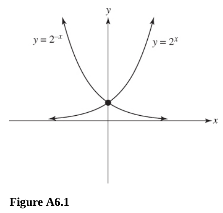
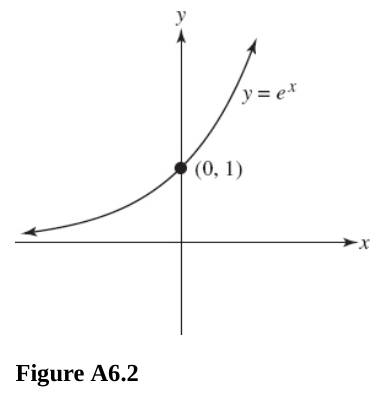
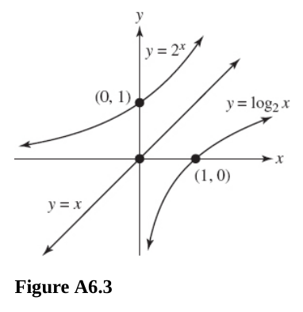

# Chapter 6 Exponential and Logarithmic Functions

---

## Exponential Functions

---

**247.** Sketch $y = 2^x$ and $y = 2^{-x}$ on the same axes.

**Answer:** Since $2^x \cdot 2^{-x} = 1$, we suispect something interesting will
occur. Notice that one curve is the image of the other in the $y$ axis. It shows
symmetry around the $y$-axis. There also is a Horizontal Asymptote along the
$x$-axis.

---

**248.** Sketch $y = \mathbf{e}^x$.

$\mathbf{e}$ is
[Euler's Number](https://en.wikipedia.org/wiki/E_(mathematical_constant)), and
is the base for natural logarithms. In Calculus you will learn that $\mathbf{e}$
is the number which $\left(1 + \dfrac{1}{b}\right)^n$ approaches as $n$ gets
arbitrarily large. An approximation of this number is
$\mathbf{e} \approx 2.718$; it is an irrational number. Thus when $x = 0$,
$\mathbf{e}^0 = 1$; and as $x$ increases, so does $\mathbf{e}^x$.

---

**249.** Let $f(x) = a^x$.

(A) Prove that $f(x + y) = f(x)f(y)$.

**Answer:**

$$ f(x + y) = a^{x + y} $$

$$ f(x)f(y) = a^{x}a^{y} $$

When multiplying exponents with the same base, you can equate them to the base
raised to the addition of those two exponents:

$$ f(x)f(y) = a^{x}a^{y} = a^{x + y} $$

And we can see these are the same, thusly:

$$ f(x + y) = a^{x + y} $$

$$ f(x)f(y) = a^{x + y} $$

Therefore:

$$ f(x + y) = f(x)f(y) $$

(B) Prove that $f(x - y) = \dfrac{f(x)}{f(y)}$

**Answer:**

$$ f(x) = a^x $$

$$ f(y) = a^y $$

$$ \frac{f(x)}{f(y)} = \frac{a^x}{a^y} $$

$$ f(x - y) = a^{x - y} $$

Conversely to the Exponent Multiplication Rule, you can also divide a
subtraction exponent like so:

$$ f(x - y) = a^{x - y} = a^{x} \cdot a^{-y} $$

Which generally means:

$$ f(x - y) = a^{x - y} = a^{x} \cdot a^{-y} = a^{x} \cdot \frac{1}{a^{y}} = \frac{a^x}{a^y} $$

This leaves us with:

$$ f(x - y) = \frac{a^x}{a^y} $$

And we previously established that:

$$ \frac{f(x)}{f(y)} = \frac{a^x}{a^y} $$

And indeed, our original problem statement asked us to prove the equivalency:

$$ f(x - y) = \dfrac{f(x)}{f(y)} $$

And we have found that both of these equal:

$$ \frac{a^x}{a^y} $$

\(C\) Prove that $f$ is one-to-one.

$$ f(x) = a^x $$

**Answer:**

Supposing that $m \neq n$. That means that $a^m \neq a^n$, meaning that the
function $f(x)$ is indeed one-to-one.

(D) Prove that $f(-x) = \dfrac{1}{f(x)}$

As discussed in 249B, a negative exponent always results in a fraction:

$$ f(-x) = a^{-x} = \frac{1}{a^x} = \frac{1}{f(x)} $$

(E) Prove that $f(b + x) = a^bf(x)$.

$$ f(x) = a^x $$

$$ f(b + x) = a^{b + x} = a^b \cdot a^x = a^bf(x) $$

---

**250.** Compute the compound amount. $\$2000$ at $12$ percent compounded
semiannually for $3$ years.

**Answer:**

Compound Interest is calculated using the following formula:

$$ A = P\left(1 + \frac{r}{n} \right)^{n \cdot t} $$

See Professor Leonard's Precalculus 063 markdown file for a full review.

$$ A = (2000)\left(1 + \frac{0.12}{2}\right)^{2 \cdot 3} $$

$$ A = (2000)(1.06)^6 $$

$$ A = \$2837.04 $$

---

**251.** Compute the principal $P$ invested to yield the following compound
amounts $A$. $\$5000$ at $10$ percent compounded annually for $5$ years.

**Answer:**

$$ A = P\left(1 + \frac{r}{n} \right)^{n \cdot t} $$

$$ 5000 = P\left(1 + \frac{0.1}{1} \right)^{1 \cdot 5} $$

$$ 5000 = P(1.1)^5 $$

$$ 5000 = P(1.61051) $$

$$ P = \$3104.61 $$

---

**252.** Compute the amount due, given that the interest is compounded
continuously. $\$3000$ at $10$ percent for $5$ years.

**Answer:**

Continuously compounded interest can be calculated using the following formula:

$$ A = P\mathbf{e}^{r \cdot t} $$

See Professor Leonard's Precalculus 063 markdown file for a full review.

$$ A = 3000\mathbf{e}^{0.1 \cdot 5} $$

$$ A = 3000\mathbf{e}^{0.5} $$

$$ A = \$4946.16 $$

---

## Logarithmic FUnctions

---

**For questions 253-257,** solve the equation.

---

**253.** $\log 100 = x$

**Answer:**

$$ 10^x = 100 $$

$$ x = 2 $$

---

**254.** $\log x = 2$

**Answer:**

$$ 10^2 = x $$

$$ 100 = x $$

---

**255.** $\log_{x}81 = 4$

$$ x^4 = 81 $$

$$ x = \sqrt[4]{81} $$

$$ x = 3 $$

Note that you cannot return a negative number when solving for the base of a
logarithm, as it cannot produce real number (_i.e._ it produces a complex
number).

---

**256.** $\ln \mathbf{e}^{x + 2} = 7$

$\ln \mathbf{e}^{x + 2} = 7$

$$ \mathbf{e}^7 = \mathbf{e}^{x + 2} $$

Exponents with the same base can be set equal to each other and solved:

$$ 7 = x + 2 $$

$$ x = 5 $$

---

**257.** $\log_{e^2} x = 10$

$$ (e^2)^{10} = x $$

An exponent raised to another exponent can be reduced to a single exponent
multiplied.

$$ x = e^{2 \cdot 10} $$

$$ x = e^{20} $$

---

**258.** Evaluate the given expression where $f(x) = \log x$, $g(x) = 10^x$,
$h(x) = \ln x$, $k(x) = e^x$, $l(x) = x^2$.

(A) $f \circ g(x)$

**Answer:**

$$ (f \circ g)(x) = \log (10^x) $$

$$ (f \circ g)(x) = x $$

Note that this means that $f(x)$ and $g(x)$ are inverse functions.

(B) $g \circ f(x)$

**Answer:**

$$ (g \circ f)(x) = 10^{\log x} $$

$$ (g \circ f)(x) = x $$

In this case there is a Domain restriction however that $x > 0$.

Again, we demonstrate that $g(x)$ and $f(x)$ are inverse functions.

\(C\) $h \circ k(x)$

**Answer:**

$$ (h \circ k)(x) = \ln (e^x) $$

$$ (h \circ k)(x) = x $$

Same deal, inverses.

(D) $f \circ l(10)$

**Answer:**

$$ (f \circ l)(10) = \log (10^2) $$

$$ (f \circ l)(10) = 2 $$

(E) $l \circ h(3)$

**Answer:**

$$ (l \circ h)(3) = (\ln 3)^2 $$

$$ (l \circ h)(3) \approx 1.2069 $$

---

**259.** Sketch $y = \log_{2} x$, $y = 2^x$ on the same axes.

These are inverse functions, and are symmetric about $y = x$.

---

**260.** Prove that $g(x) = \log_{a}x$ is one-to-one.

Since $a$ must always be positive in accordance with the definition of
Logarithms, then consider that $m \neq n$, then $\log_{a}m \neq \log_{a}n$, and
therefore $g(x)$ is one-to-one.

---

**261.** Find the domain and range of the given function.

(A) $y = \log_{3}(x + 1)$

**Answer:**

We know that $x + 1 \neq 0$, as no base raised to any exponent can ever equal
$0$ except for $0$.

Thusly the domain in set notation is:

$$ \left\{x \in \R \mid x > -1\right\} $$

Or in interval notation:

$$ (-1, \infty) $$

And the Range is all real numbers:

$$ \left\{y \in \R\right\} $$

$$ (-\infty, \infty) $$

(B) $y = \log_{3}(2x - 5)$

**Answer:**

Same deal, we know that $2x - 5 \neq 0$. Solving for $x$ leaves us with:

$$ 2x \neq 5 $$

$$ x \neq \frac{5}{2} $$

Thusly the domain in set notation is:

$$ \left\{x \in \R \mid x > \frac{5}{2}\right\} $$

$$ \left(\frac{5}{2}, \infty\right) $$

And the Range is all real numbers:

$$ \left\{y \in \R\right\} $$

$$ \left(-\infty, \infty\right) $$

\(C\) $y = \log_{5}(x^2 + 1)$

**Answer:**

Since $x^2 + 1$ will always yield a positive answer, we can plug in any real
number into $x$. thusly the domain is all real numbers.

This can be expressed using the "for all" symbol:

$$ x^2 + 1 > 0 \text{ } \forall \text{ } x \in \R $$

Thusly our Domain is all real numbers, as is our Range:

Domain:

$$ \left\{x \in \R\right\} $$

$$ (-\infty, \infty) $$

Range:

$$ \left\{y \in \R\right\} $$

$$ (-\infty, \infty) $$

(D) $y = |\log_{6}x|$

**Answer:**

The value for $x$ must not equal $0$, thusly the Domain is:

$$ \left\{x \in \R \mid x > 0\right\} $$

$$ (0, \infty) $$

And because the output is an Absolute value, this means that the Range also
cannot be less than $0$:

$$ \left\{y \in \R \mid x \geq 0\right\} $$

$$ [0, \infty) $$

---

## Properties of Log Functions

---

**262.** Write each expression as the algebraic sum of logarithms. The base is
any positive real number except $1$.

(A) $\log(251)(46)(18)$

**Answer:**

All multiplicants of a logarithm can be rewritten as a log of that same base
adding all the individual arguments:

$$ \log(251)(46)(18) = \log(251) + \log(46) + \log(18) $$

(B) $\log(34)^2(2.7)$

**Answer:**

We can first rewrite it as it was in 262A:

$$ \log(34)^2(2.7) = \log(34)^2 + \log(2.7) $$

We also can move all exponents of a logarithm to the front of the logarithm as a
coefficent:

$$ \log(34)^2(2.7) = 2\log(34) + \log(2.7) $$

\(C\) $\log(24)^{\frac{1}{2}}(35)^3$

**Answer:**

$$ \log(24)^{\frac{1}{2}}(35)^3 = \log(24)^{\frac{1}{2}} + \log(35)^3 $$

$$ \log(24)^{\frac{1}{2}}(35)^3 = \frac{1}{2}\log(24)+ 3\log(35) $$

(D) $\log\left(\dfrac{(83)(41)}{29}\right)$

**Answer:**

Converse to the multiplication, the division means subtraction:

$$ \log\left(\frac{(83)(41)}{29}\right) = (\log(83) + \log(41)) - \log(29) $$

(E) $\log a^nb^m$

**Answer:**

$$ \log a^nb^m = \log(a^n) + \log(b^m) $$

$$ \log a^nb^m = n\log(a) + m\log(b) $$

(F) $\log\left(\sqrt[n]{a^{n -1}p}\right)$

**Answer:**

Difficult, but if we think about it all roots can be expressed as exponents:

$$ \log\left(\sqrt[n]{a^{n -1}p}\right) = \log(a^{n - 1}p)^{\frac{1}{n}} $$

$$ \log\left(\sqrt[n]{a^{n -1}p}\right) = \frac{1}{n}\log(a^{n - 1}p) $$

$$ \log\left(\sqrt[n]{a^{n -1}p}\right) = \frac{1}{n}\log(a^{n - 1}) + \frac{1}{n}\log(p) $$

$$ \log\left(\sqrt[n]{a^{n -1}p}\right) = \frac{n - 1}{n}\log(a) + \frac{\log(p)}{n} $$

---

**263.** Obtain the required logarithm for the following.

(A) $\log_{2}(8)(16,384)$

**Answer:**

$$ \log_{2}(8)(16,384) = \log_{2}(8) + \log_{2}(16384) = 3 + 14 = 17  $$

(B) $\log_{2}(16,384)^{-2}$

**Answer:**

$$ \log_{2}(16,384)^{-2} = -2\log_{2}(16384) = -2(14) = -28 $$

\(C\) $\log_{2}\sqrt[4]{65,536}$

**Answer:**

$$ \log_{2}\sqrt[4]{65,536} = \log_{2}(65536)^{\frac{1}{4}} $$

$$ \log_{2}\sqrt[4]{65,536} = \frac{1}{4}\log_{2}(65536) $$

$$ \log_{2}\sqrt[4]{65,536} = \frac{1}{4}(16) $$

$$ \log_{2}\sqrt[4]{65,536} = 4 $$

---

**264.** Write each expression in terms of a single logarithm with a coefficient
of $1$.

(A) $2\log_{b}x - \log_{b}y$

**Answer:**

$$ 2\log_{b}x - \log_{b}y = \log_{b}x^2 - \log_{b}y $$

$$ 2\log_{b}x - \log_{b}y = \frac{\log_{b}x^2}{\log_{b}y} $$

$$ 2\log_{b}x - \log_{b}y = \log_{b}\left(\frac{x^2}{y}\right) $$

(B) $3\log_{b} x + 2\log_{b}y - 4\log_{b}z$

**Answer:**

$$ 3\log_{b} x + 2\log_{b}y - 4\log_{b}z = \log_{b}x^3 + \log_{b}y^2 - \log_{b}z^4 $$

$$ 3\log_{b} x + 2\log_{b}y - 4\log_{b}z = \log_{b}\left(\frac{x^2y^2}{z^4}\right)$$

\(C\) $\dfrac{1}{5}(2\log_{b}x + 3\log_{b}y)$

**Answer:**

$$ \frac{1}{5}(2\log_{b}x + 3\log_{b}y) = \frac{1}{5}(\log_{b}x^2 + \log_{b}y^3) $$

$$ \frac{1}{5}(2\log_{b}x + 3\log_{b}y) = \frac{1}{5}(\log_{b}(x^2y^3)) $$

$$ \frac{1}{5}(2\log_{b}x + 3\log_{b}y) = \log_{b}(x^2y^3)^{\frac{1}{5}} $$

$$ \frac{1}{5}(2\log_{b}x + 3\log_{b}y) = \log_{b}(x^{\frac{2}{5}}y^{\frac{3}{5}}) $$

---

**265.** Rewrite the given expression in terms of common logarithms.

(A) $\log_{6}7$

**Answer:**

Recall that we can change any logarithm into any other logarithm with a
different base via the change of base formula:

$$ \log_{b}x = \frac{\log_{a}x}{\log_{a}b} $$

$$ \log_{6}7 = \frac{\log 7}{\log 6} $$

(B) $\log_{\frac{1}{3}}30$

**Answer:**

$$ \log_{\frac{1}{3}}30 = \frac{\log30}{\log\left(\frac{1}{3}\right)} $$

$$ \log_{\frac{1}{3}}30 = \frac{\log30}{-\log3} $$

$$ \log_{\frac{1}{3}}30 = \frac{\log(10 \cdot 3)}{-\log3} $$

$$ \log_{\frac{1}{3}}30 = \frac{\log10 + \log3}{-\log3} $$

$$ \log_{\frac{1}{3}}30 = \frac{1 + \log3}{-\log3} $$

\(C\) $\log_{20}\mathbf{e}$

**Answer:**

$$ \log_{20}\mathbf{e} = \frac{\log\mathbf{e}}{\log20} $$

$$ \log_{20}\mathbf{e} = \frac{\log\mathbf{e}}{\log(10 \cdot 2)} $$

$$ \log_{20}\mathbf{e} = \frac{\log\mathbf{e}}{\log10 + \log2} $$

$$ \log_{20}\mathbf{e} = \frac{\log\mathbf{e}}{1 + \log2} $$

(D) $\log_{20}\mathbf{e}^3$

**Answer:**

$$ \log_{20}\mathbf{e}^3 = \frac{\log\mathbf{e}^3}{\log20} $$

$$ \log_{20}\mathbf{e}^3 = \frac{3\log\mathbf{e}}{\log(10 \cdot 2)} $$

$$ \log_{20}\mathbf{e}^3 = \frac{3\log\mathbf{e}}{\log10 + \log2} $$

$$ \log_{20}\mathbf{e}^3 = \frac{3\log\mathbf{e}}{1 + \log2} $$

---

**266.** Tell whether the given statement is true or false, and explain your
answer.

(A) $(\log 15)^0 = 1$

**Answer:**

This is true, since $\log 15 \in \R$, and any number $a^0 = 1 \forall a \in \R$.
Therefore this statement is true.

True.

(B) If $f(x) = \log_{8}x$, then the range of $f$ is $\R$.

**Answer:**

Yes, any standard logarithm that takes in an input $x$ within the domain of
being greater than $0$, then $f(x)$ will return a number that lies within the
Real Number System, $\R$.

True.

\(C\) The domain of $y = \log_{x}b$ is $\R$.

**Answer:**

No, because $x$ is the base, the input of the base is restricted to be greater
than $1$, and thusly is more restricted than simply being within the entire Real
Number System, $\R$.

False.

(D) $\log_{x}a = \log_{\frac{1}{x}}\left(\dfrac{1}{a}\right)$

**Answer:**

Let's abstract this a bit to get a more generalized view. Let's say that the
entire left handside just equals a variable, $b$ (a substitution):

$$ \log_{x}a = b $$

This means:

$$ x^b = a $$

If we then take the reciprocal of both sides:

$$ \frac{1}{x^b} = \frac{1}{a} $$

And we know that we can take any exponent of a fraction with the numerator of
$1$ to be the exponent of the entire fraction:

$$ \left(\frac{1}{x}\right)^b = \frac{1}{a} $$

And if we express this as a logarithm:

$$ \log_{\frac{1}{x}}\left(\frac{1}{a}\right) = b $$

And if we now remove our temporary variable $b$, and input our original
substitution we get:

$$ \log_{\frac{1}{x}}\left(\frac{1}{a}\right) = \log_{x}a $$

And this proves our original problem statement assertion.

True.

(E) $f(x) = \log_{b}x$ is an always-decreasing function.

**Answer:**

$$ y = f(x) $$

$$ y = \log_{b}x $$

$$ b^y = x $$

False, as $x$ increases, the output $f(x)$ always increases as well.

(F) $\log_{k}ab = (\log_{k}a)(\log_{k}b)$

**Answer:**

False, this is ignoring how multiplication in logarithms works. When a logarithm
as a multipcation in its argument, it equivocates to addition:

$$ \log_{k}ab = \log_{k}a + \log_{k}b \neq (\log_{k}a)(\log_{k}b) $$

(G) Let $g(x) = \log_{a}x$ and $h(x) = \log_{b}x$; then
$g \circ h(ab) = \log_{a}(1 + \log_{b}a)$.

**Answer:**

$$ h(ab) = \log_{b}(ab) = \log_{b}a + \log_{b}b = \log_{b}a + 1 $$

$$ (g \circ h)(ab) = \log_{a}(1 + \log_{b}a) $$

This statement is true.

(H) Using functions $g$ and $h$ in question 266(G), $g \circ h(ab) = \log_{a}1 +
\log_{a}(\log_{b}a)$.

**Answer:**

$$ g(x) = \log_{a}x $$

$$ h(x) = \log_{b}x $$

$$ h(ab) = \log_{b}(ab) = \log_{b}a + \log_{b}b = 1 + \log_{b}a $$

$$ (g \circ h)(ab) = \log_{a}(1 + \log_{b}a) \neq \log_{a}1 + \log_{a}(\log_{b}a) $$

False, this is trying to trick you into thinking that logarithms are somehow
like multiplication, but we cannot distribute a logarithm.

(I) $\log_{a}\left(\dfrac{1}{x}\right) = -\log_{a}x$

**Answer:**

Yes, this is true. if we consider:

$$ -\log_{a}x = -1\log_{a}x = \log_{a}x^{-1} = \log_{a}\left(\frac{1}{x}\right) $$

You can also go the other way around:

$$ \log_{a}\left(\frac{1}{x}\right) = \log_{a}x^{-1} = -1\log_{a}x = -\log_{a}x $$

True.

(J) $\log_{b}a = \dfrac{1}{\log_{a}b}$

**Answer:**

If we consider the conversion of logs formula:

$$ \log_{a}x = \frac{\log_{b}x}{\log_{b}a} $$

And we convert our lefthand side log:

$$ \log_{b}a = \frac{\log_{a}a}{\log_{b}a} = \frac{1}{\log_{b}a} $$

And this is what we were trying to prove.

True.

---

**267.** Find $x$ so that
$\dfrac{3}{2}\log_{b}4 - \dfrac{2}{3}\log_{b}8 + 2\log_{b}2 = \log_{b}x$.

**Answer:**

$$ \frac{3}{2}\log_{b}4 - \frac{2}{3}\log_{b}8 + 2\log_{b}2 = \log_{b}x $$

$$ \log_{b}4^{\frac{3}{2}} - \log_{b}8^{\frac{2}{3}} + \log_{b}2^2 = \log_{b}x $$

$$ \log_{b}8 - \log_{b}4 + \log_{b}4 = \log_{b}x $$

$$ \log_{b}8 = \log_{b}x $$

$$ \boxed{x = 8} $$

---

**268.** Let $f(x) = 7^x$. Find the domain and range of $f^{-1}(x)$.

**Answer:**

$$ f(x) = 7^x $$

$$ y = 7^x $$

$$ x = 7^y $$

$$ \log_{7}x = y $$

$$ f^{-1}(x) = \log_{7}x $$

The Domain of a logarithm is always the Range of the Exponent and the Range of a
logarithm is always the Domain of the exponent.

The Domain is all numbers greater than $0$, and the range is all real numbers:

Domain:

$$ \left\{x \in \R \mid x > 0\right\} $$

$$ (0, \infty) $$

Range:

$$ \left\{f^{-1}(x) \in \R \right\} $$

$$ (-\infty, \infty) $$

---

**269.** Solve the equation $A = P\mathbf{e}^{rt}$ for $r$.

**Answer:**

$$ A = P\mathbf{e}^{rt} $$

$$ \frac{A}{P} = \mathbf{e}^{rt} $$

$$ \ln\left(\frac{A}{P}\right) = rt $$

$$ \ln A - \ln P = rt $$

$$ r = \frac{\ln A - \ln P}{t} $$

---

**270.** Solve the given equation for $x$ in terms of $y$.

(A) $y = 10^x$

**Answer:**

$$ y = 10^x $$

$$ \log y = x $$

(B) $y = 3(10^{2x})$

$$ y = 3(10^{2x}) $$

$$ \log y = \log 3(10^{2x}) $$

$$ \log y = \log 3 + \log(10^{2x})$$

$$ \log y = \log 3 + 2x $$

$$ \log y - \log 3 = 2x $$

$$ \log\left(\frac{y}{3}\right) = 2x $$

$$ \frac{\log\left(\frac{y}{3}\right)}{2} = x $$

$$ \frac{1}{2}\log\left(\frac{y}{3}\right) = x $$

$$ \log\left(\frac{y}{3}\right)^{\frac{1}{2}} = x $$

$$ x = \log\left(\frac{y}{3}\right)^{\frac{1}{2}} $$

\(C\) $y = \dfrac{e^x + e^{-x}}{2}$

Substitute:

$$ u = e^x $$

$$ y = \frac{u + \dfrac{1}{u}}{2} $$

$$ 2y = u + \frac{1}{u} $$

$$ 2y = \frac{u^2}{u} + \frac{1}{u} $$

$$ 2y = \frac{u^2 + 1}{u} $$

$$ 2uy = u^2 + 1 $$

$$ u^2 - 2uy + 1 = 0 $$

$$ u = \frac{-(-2y) \pm \sqrt{(-2y)^2 - 4(1)(1)}}{2(1)} $$

$$ u = \frac{2y \pm \sqrt{4y^2 - 4}}{2} $$

$$ u = \frac{2y \pm \sqrt{4(y^2 - 1)}}{2} $$

$$ u = \frac{2y \pm 2\sqrt{y^2 - 1}}{2} $$

$$ u = \frac{2y \pm 2\sqrt{y^2 - 1}}{2} $$

$$ u = \frac{2y \pm 2\sqrt{y^2 - 1}}{2} $$

$$ u = y \pm \sqrt{y^2 - 1} $$

Resubstitute back in $e^x$ for $u$:

$$ e^x = y \pm \sqrt{y^2 - 1} $$

$$ x = \ln(y \pm \sqrt{y^2 - 1}) $$

---

**For questions 271-276,** solve the given equation; when appropriate, give
answers to three decimal places.

---

**271.** $5^{x^2 - 3x} = 625$

**Answer:**

$$ 5^{x^2 - 3x} = 625 $$

$$ 5^{x^2 - 3x} = 5^4 $$

$$ x^2 - 3x = 4 $$

$$ x^2 - 3x - 4 = 0 $$

$$ (x + 1)(x - 4) = 0 $$

$$ \boxed{x = -1 \text{, } x = 4} $$

---

**272.** $195^x = 2.68$

**Answer:**

$$ 195^x = 2.68 $$

$$ \log_{195}(2.68) = x $$

$$ x \approx 0.187 $$

---

**273.** $\log_{5}(x - 1) + \log_{5}(x + 3) = 1$

**Answer:**

$$ \log_{5}(x - 1) + \log_{5}(x + 3) = 1 $$

$$ \log_{5}(x - 1)(x + 3) = 1 $$

$$ \log_{5}(x^2 + 2x - 3) = 1 $$

$$ 5^1 = x^2 + 2x - 3 $$

$$ 5 = x^2 + 2x - 3 $$

$$ x^2 + 2x - 8 = 0 $$

$$ (x + 4)(x - 2) = 0 $$

$$ x = -4 \text{, } x = 2 $$

But $-4$ will cause our Domain to go out or range (less than $0$), so our answer
is:

$$ \boxed{x = 2} $$

---

**274.** $\log(3x + 4) = \log(5x - 6)$

$$ \log(3x + 4) = \log(5x - 6) $$

You can equivilate these like exponents since they have the same base:

$$ 3x + 4 = 5x - 6 $$

$$ 10 = 2x $$

$$ x = 5 $$

And it won't cause any domain issues, so we are good.

$$ \boxed{x = 5} $$

---

**276.** $\log x = \ln e$

$$ 10^{\log x} = 10^{\ln e} $$

$$ x = 10^1 $$

$$ \boxed{x = 10} $$
