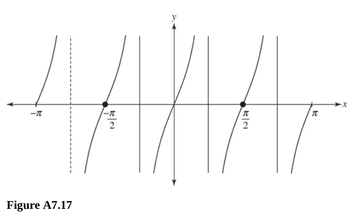

# Chapter 7 Trigonometric Functions

---

## Angle Measurement

---

**For questions 277-279,** sketch the angle of each of the following measures.
In your sketch, place the angle in standard position.

---

**277.** $225\degree$

**Answer:**

Consult/draw the Unit Circle, this is a standard angle, $180\degree + 45\degree
= 225\degree$.

---

**278.** $420\degree$

**Answer:**

This goes one full rotation around the Unit Circle, $420\degree - 360\degree =
60\degree$.

Make sure to show one full rotation before landing on $60\degree$:

---

**279.** $-\dfrac{\pi}{3}$

This is expressed in radians and goes in the opposite direction, this would end
up in the same position as $300\degree$ or $\dfrac{5\pi}{3}$, just make sure to
illustrate the proper direction (reverse).

---

**280.**

$$ 114\degree29'46'' - 81\degree4'11'' $$

**Answer:**

$$ 33\degree25'35'' $$

---

**281.** Express the given angle in degrees, minutes, and seconds.

$$ 40.25\degree $$

**Answer:**

$$ 40\degree + 0.25 \cdot 60' = 40\degree15'0'' $$

---

**282.** Rewrite the given angle in decimal form.

$$ 27\degree15'25'' $$

**Answer:**

$$ 27\degree + \frac{15}{60}\degree + \frac{25}{60^2}\degree $$

$$ 27\degree + 0.25\degree + 0.0069\overline{4}\degree $$

$$ 27.02569\overline{4}\degree $$

---

**For questions 283-286,** convert the given angle to degrees if it is in
radians and to radians if it is in degrees.

---

**283.** $\dfrac{\pi}{4}$

**Answer:**

$$ \frac{\pi}{4} \cdot \frac{180\degree}{\pi} = 45\degree $$

---

**284.** $-\dfrac{\pi}{6}$

**Answer:**

$$ -\frac{\pi}{6} \cdot \frac{180\degree}{\pi} = -30\degree $$

---

**285.** $45\degree$

**Answer:**

$$ 45\degree \cdot \frac{\pi \text{ radians}}{180\degree} = \frac{45\pi}{180} = \frac{\pi}{4} \text{ radians} $$

---

**286.** $-135\degree$

**Answer:**

$$ -135\degree \cdot \frac{\pi \text{ radians}}{180\degree} = \frac{-135\pi}{180} = \frac{-3\pi}{4} \text{ radians} $$

---

**287.** Find the radian measure of a central angle $\theta$ subtended by an arc
$s$ in a circle of radius $R$, where $R$ and $s$ are given as shown.

$$ R = 4 \text{ cm, } s = 24\text{ cm} $$

**Answer:**

We have not seen a problem worded this way. Let's break it down. The angle,
$\theta$, is "subtended" by an arc $s$. This means the arclength of $s$ is the
portion of the circumference "created" by the angle $\theta$.

The formula for finding an angle in radians from the arc length and radius is:

$$ \theta = \frac{s}{R} \text{ radians} $$

Therefore, we can plug in our values for $s$ and $R$, and get our answer:

$$ \theta = \frac{24 \text{ cm}}{4 \text{ cm}} = 6 \text{ radians} $$

---

**288.** Find five angles coterminal with $-155\degree$.

**Answer:**

"coterminal" just means that it's the same angle along the $x$/$y$ Coordinate
System but it's been rotated around by $2\pi$/$360\degree$.

In this case we can move it around by $360\degree$ to get new coterminal angles:

$$ -155\degree + 360\degree = \boxed{205\degree} + 360\degree = \boxed{565\degree} + 360\degree = \boxed{925\degree} $$

Conversely, we can also subtract and move in the opposite direction around our
coordinate system to get further negative angles that are coterminal:

$$ -155\degree - 360\degree = \boxed{-515\degree} - 360\degree = \boxed{-875\degree} $$

So five coterminal angles to $-155\degree$ are:

$$ \boxed{-875\degree \text{, } -515\degree \text{, } 205\degree \text{, } 565\degree \text{, } 925\degree} $$

---

**289.** The minute hand of a clock is $12 \text{ in}$ long. How far does the
tip of the hand move during $20 \text{ min}$ ?

**Answer:**

$20 \text{ min}$ is $\dfrac{1}{3} \text{ h}$.

Expressed in radians, this is $\dfrac{2\pi}{3}$, or $120\degree$.

The question is asking for the arclength of the angle. The formula for this was
expressed in 287.

$$ \theta = \frac{s}{R} $$

Where $\theta$ is the angle, $s$ is the arclength, and $R$ is the radius.

Solving for the arclength, we get:

$$ s = \theta \cdot R $$

This problem is essentially asking us the arclength of the minute hand covered
after $20 \text{ min}$:

$$ s = \left(\frac{2\pi}{3}\right)(12) = \frac{24\pi}{3} = 8\pi \text{ in} =
25.1 \text{ in} $$

---

**290.** A railroad curve is to be laid out on a circle. What radius should be
used if the track is to change direction by $25\degree$ in a distance of $120
\text{ ft}$ ?

**Answer:**

This is another arc length problem. Essentially the track will change after
$25\degree$ and after $120 \text{ ft}$ is traveled along the circumference (an
arc length). Thusly our arc length formula will apply:

$$ s = R \cdot \theta $$

We can solve for the radius like so:

$$ R = \frac{s}{\theta} $$

But our angle is not expressed in radians, which we need. Thusly:

$$ 25\degree \cdot \frac{\pi \text{ radians}}{180\degree} = \frac{25\pi}{180} =
\frac{5\pi}{36} \text{ radians} $$

Now we can use this to find our radius:

$$ R = \frac{120 \text{ ft}}{\dfrac{5\pi}{36} \text{ radians}} \approx 275 \text{ ft} $$

---

**291.** Assuming the earth to be a sphere of radius $3960 \text{ mi}$, find the
distance of a point in latitude $36\degree\text{N}$ from the equator.

**Answer:**

This is actually still an arclength problem. In fact that's exactly what we are
solving for:

$$ s = R \cdot \theta $$

Let's convert the degrees to radians first

$$ 36\degree \cdot \frac{\pi \text{ radians}}{180\degree} = \frac{36\pi}{180} = \frac{\pi}{5} \text{ radians}$$

Now let's solve for the distance:

$$ s = 3960 \text{ mi} \cdot \frac{\pi}{5} \text{ radians} $$

$$ s = 792\pi \approx 2488 \text{ mi} $$

---

**For questions 292 and 293,** in which quadrant will $\theta$ terminate?

---

**292.** $\sin\theta$ and $\cos\theta$ are both negative.

**Answer:**

$\theta$ will terminate in Quadrant III, as $\cos\theta$ relates to the
$x$-coordinate and $\sin\theta$ relates to the $y$-coordinate which are both
negative in Quadrant III.

---

**293.** $\sec\theta$ is negative, and $\tan\theta$ is negative.

**Answer:**

$\sec\theta$ is just the reciprocal trigonometric function of cosine:

$$ \sec\theta = \frac{1}{\cos\theta} $$

If $\sec\theta$ is negative, this means that $\cos\theta$ is negative, which
means that $\theta$ lies in either Quadrant II or Quadrant III.

$\tan\theta$ is negative in either Quadrant II or Quadrant IV, as either
$\sin\theta$ or $\cos\theta$ are negative.

Narrowing it down, this means that $\theta$ must reside in Quadrant II for both
$\sec\theta$ and $\tan\theta$ to be negative.

---

**For questions 294 and 295,** in which quadrants may $\theta$ terminate?

---

**294.** $\sin\theta$ is positive.

**Answer:**

$\sin\theta$ relates to the $y$-coordinate, which is positive in Quadrant I and
Quadrant II.

---

**295.** $\tan\theta$ is negative.

**Answer:**

$\tan\theta = \dfrac{\sin\theta}{\cos\theta}$. Therefore if $\tan\theta$ is
negative, then that means that either $\sin\theta$ is negative and $\cos\theta$
is positive, OR $\sin\theta$ is positive and $\cos\theta$ is negative.

This only occurs in Quadrant II and Quadrant IV.

---

**296.** Determine the values of $\cos\theta$ and $\tan\theta$ if $\sin\theta =
\dfrac{m}{n}$, a negative fraction.

**Answer:**

Since $\sin\theta$ is negative, $\theta$ is in Quadrant III or Quadrant IV.

Consider the Pythagorean Formula as it relates to the Circle:

$$ x^2 + y^2 = r^2 $$

$$ x^2 = r^2 - y^2 $$

$$ x = \pm \sqrt{r^2 - y^2} $$

We can plug in our other variable names established in the problem statement:

$$ y = m \text{, } r = n \text{, } x = \pm \sqrt{n^2 - m^2} $$

And The positive or negative as it relates depend on the Quadrant:

Quandrant III:

$$ \sin\theta = \frac{m}{n} $$

$$ \cos\theta = -\frac{\sqrt{n^2 - m^2}}{n} $$

$$ \tan\theta = \frac{\sin\theta}{\cos\theta} = \frac{\dfrac{m}{n}}{-\dfrac{\sqrt{n^2 - m^2}}{n}} $$

$$ \tan\theta = -\frac{m}{\sqrt{n^2 - m^2}} $$

Quadrant IV:

$$ \sin\theta = \frac{m}{n} $$

$$ \cos\theta = \frac{\sqrt{n^2 - m^2}}{n} $$

$$ \tan\theta = \frac{\sin\theta}{\cos\theta} = \frac{\dfrac{m}{n}}{\dfrac{\sqrt{n^2 - m^2}}{n}} $$

$$ \tan\theta = \frac{m}{\sqrt{n^2 - m^2}} $$

---

**297.** Evaluate
$\sin0\degree + 2\cos0\degree + 3\sin90\degree + 4\cos90\degree + 5\sec0\degree + 6\csc90\degree$

$$ 0 + 2(1) + 3(1) + 4(0) + 5\left(\frac{1}{1}\right) + 6\left(\frac{1}{1}\right) $$

$$ 0 + 2 + 3 + 0 + 5 + 6 $$

$$ 2 + 3 + 5 + 6 $$

$$ \boxed{16} $$

---

## Trigonometric Functions

---

**For questions 298-305,** find the value of the trigonometric function at the
given angle. Do _not_ use a calculator.

---

**298.** $\sin90\degree$

**Answer:**

$$ \sin90\degree = 1 $$

---

**299.** $\sin45\degree$

**Answer:**

$$ \sin45\degree = \frac{\sqrt{2}}{2} $$

---

**300.** $\cos60\degree$

**Answer:**

$$ \cos60\degree = \frac{1}{2} $$

---

**301.** $\sin120\degree$

**Answer:**

$$ \sin120\degree = \frac{\sqrt{3}}{2} $$

---

**302.** $\cos135\degree$

**Answer:**

$$ \cos135\degree = -\frac{\sqrt{2}}{2} $$

---

**303.** $\sin\left(\dfrac{3\pi}{4}\right)$

**Answer:**

$$ \sin\left(\dfrac{3\pi}{4}\right) = \frac{\sqrt{2}}{2} $$

---

**304.** $\sec\left(\dfrac{4\pi}{3}\right)$

**Answer:**

$$ \sec\left(\dfrac{4\pi}{3}\right) = \frac{1}{-\dfrac{1}{2}} = -2 $$

---

**305.** $\sin(-960\degree)$

**Answer:**

$$ \sin(-960\degree) = \sin(-600) = \sin(-240) = \sin(120) = \frac{\sqrt{3}}{2} $$

---

**For questions 306 and 307,** evaluate the given expression.

**306.** $\sin^{2}315\degree + \cos^{2}315\degree$

**Answer:**

$$ (\sin315\degree)^2 + (\cos315\degree)^2 $$

$$ \left(\frac{-1\sqrt{2}}{2}\right)^2 + \left(\frac{\sqrt{2}}{2}\right)^2 $$

$$ \frac{2}{4} + \frac{2}{4} = \frac{1}{2} + \frac{1}{2} = \boxed{1} $$

---

**307.**
$\cos\left(\dfrac{\pi}{4}\right)\cos\left(\dfrac{\pi}{2}\right)-\sin\left(\dfrac{\pi}{4}\right)\sin\left(\dfrac{\pi}{2}\right)$

**Answer:**

$$ \left(\frac{\sqrt{2}}{2}\right)(0) - \left(\frac{\sqrt{2}}{2}\right)(1) $$

$$ \boxed{-\frac{\sqrt{2}}{2}} $$

---

**For questions 308 and 309,** find the value of the other five trigonometric
functions for the indicated $\theta$. Do _not_ find $\theta$.

---

**308.** $\sin\theta = \frac{3}{5} \text{, } \cos\theta < 0$

**Answer:**

Since $\cos\theta$ is negative, this means that it lies within Quadrant II or
Quandrant III.

$$ \sin\theta = \frac{y}{r} $$

$$ x^2 + y^2 = r^2 $$

$$ x^2 = r^2 - y^2 $$

$$ x = \pm \sqrt{r^2 - y^2} $$

Again, $x$ must be negative:

$$ x = -\sqrt{r^2 - y^2} $$

So:

$$ y = 3 \text{, } r = 5 $$

$$ \boxed{\sin\theta = \frac{3}{5}} $$

$$ \cos\theta = \frac{x}{r} $$

$$ \cos\theta = \frac{-\sqrt{5^2 - 3^2}}{5} $$

$$ \cos\theta = \frac{-\sqrt{25 - 9}}{5} $$

$$ \cos\theta = \frac{-\sqrt{16}}{5} $$

$$ \boxed{\cos\theta = -\frac{4}{5}} $$

$$ \tan\theta = \frac{\sin\theta}{\cos\theta} $$

$$ \tan\theta = \frac{\dfrac{3}{5}}{-\dfrac{4}{5}} $$

$$ \boxed{\tan\theta = -\frac{3}{4}} $$

$$ \boxed{\csc\theta = \frac{5}{3}} $$

$$ \boxed{\sec\theta = -\frac{5}{4}} $$

$$ \boxed{\cot\theta = -\frac{4}{3}} $$

---

**309.** $\tan\theta = -\dfrac{4}{3} \text{, } \sin\theta < 0$

**Answer:**

Because $\sin\theta$ is negative, this means we can only be in Quadrant III or
Quadrant IV, but since $\tan\theta$ is also negative, this means that we are in
Quadrant IV.

$$ \tan\theta = \frac{\sin\theta}{\cos\theta} $$

$$ \sin\theta = \frac{-4}{r} $$

$$ \cos\theta = \frac{3}{r} $$

$$ x^2 + y^2 = r^2 $$

$$ (3)^2 + (-4)^2 = r^2 $$

$$ 9 + 16 = r^2 $$

$$ 25 = r^2 $$

$$ r = \pm 5 $$

But a radius is always positive in the context of a Circle, so therefore:

$$ r = 5 $$

$$ \boxed{\sin\theta = -\frac{4}{5}} $$

$$ \boxed{\cos\theta = \frac{3}{5}} $$

$$ \boxed{\tan\theta = -\frac{4}{3}} $$

$$ \boxed{\csc\theta = -\frac{5}{4}} $$

$$ \boxed{\sec\theta = \frac{5}{3}} $$

$$ \boxed{\cot\theta = -\frac{3}{4}} $$

---

## Inverse Trigonometric Functions

**For questions 310-312,** find the value of the given expression. Do _not_ use
a calculator or a table of values.

---

**310.** $\sin^{-1}\left(\dfrac{1}{2}\right)$

**Answer:**

$$ \sin^{-1}\left(\dfrac{1}{2}\right) = \frac{\pi}{6} $$

Remember that if $y = \sin^{-1}x$, then
$-\dfrac{\pi}{2} \leq y \leq \dfrac{\pi}{2}$.

For future reference that if $y = \cos^{-1}x$, then $0 \leq y \leq \pi$.

This is why we don't have multiple answers to these questions, the range is
restricted.

---

**311.** $\arctan\sqrt{3}$

**Answer:**

ArcTangent is Tangent Inverse:

$$ \tan^{-1}\sqrt{3} = \frac{\pi}{3} $$

If $y = \tan^{-1}x$, then $-\dfrac{\pi}{2} \leq y \leq \dfrac{\pi}{2}$

---

**312.** $\tan(\arccos0.5)$

**Answer:**

ArcCosine is just Cosine Inverse:

$$ \cos^{-1}0.5 = \cos^{-1}\left(\frac{1}{2}\right) = \frac{\pi}{3} $$

$$ \tan\left(\frac{\pi}{3}\right) = \sqrt{3} $$

---

## Graphing the Trigonometric Functions

---

**For questions 313 and 314,** find the period of the function.

---

**313.** $y = 4\sin(2x + \pi)$

**Answer:**

Consider that this is in the form where we can easily read the period:

$$ y = A\sin(\omega x) + B $$

Where $|A|$ is the amplitude, $\omega$ is the angular frequency (_i.e._ how
quickly and angle changes over time), and $B$ is the Vertical Shift.

The Period for Sine is naturally $2\pi$, but is adjusted by $\omega$ as the
Period can occur more or less rapidly depending on the value of $\omega$. The
formula to determine Sine's Period is can be determined by:

$$ T = \frac{2\pi}{\omega} $$

Thusly we can calculate our period here as:

$$ T = \frac{2\pi}{2} = \pi $$

---

**314.** $f(x) = \dfrac{1}{3}\tan\left(2x - \dfrac{\pi}{7}\right)$

**Answer:**

Nothing changes for a formula here, we aren't really thinking on the Amplitude,
the Phase Shift (the addition or subtraction inside our Trigonometric function's
argument), or even the vertical shift. We are only concerned with Tangent's
natural Period, $\pi$, and the value of $\omega$, which is $2$ again in this
case.

$$ T = \frac{\pi}{\omega} $$

$$ T = \frac{\pi}{2} $$

---

**For questions 315 and 316,** determine the phase shift.

---

**315.** $y = \sin(x + \pi)$

**Answer:**

The phase shift is the addition or subtraction inside of the Trigonometric
function after the $x$, so our Phase shift is $\pi$. Note that in order to
properly determine the Phase Shift, the coefficient for $x$ must be $1$.

Our Phase shift is in this case, $\pi$ units to the left.

---

**316.** $f(x) = \dfrac{1}{3}\sin\left(2x - \dfrac{\pi}{7}\right)$

**Answer:**

In order to determine the Phase Shift, we must make sure the coefficient for $x$
is $1$:

$$ f(x) = \frac{1}{3}\sin\left(2x - \frac{\pi}{7}\right) $$

$$ f(x) = \frac{1}{3}\sin\left[2\left(x - \frac{\pi}{14}\right)\right] $$

And now we can see that we have a Phase Shift _to the right_ by
$\dfrac{\pi}{14}$ radians.

---

**For questions 317 and 318,** sketch, on the same axes, one complete period of
each function.

**317.** $y = \sin x \text{, } y = \sin 2x$

**Answer:**

Graphing $\sin x$ is relatively straight forward, consider the period of $sin x$
is $2\pi$, create half intervals of $\pi$, then $\dfrac{\pi}{2}$, and
$\dfrac{3\pi}{2}$. Then set up the range of $[-1, 1]$ along the $y$-axis, and
then just plot your points.

After that, there's only the period of $y = \sin 2x$ to consider.

Recall that the standard form is $y = A\sin(\omega x) + B$, and our period is
the natural period of Sine divided by $\omega$:

$$ T = \frac{2\pi}{\omega} $$

$$ T = \frac{2\pi}{2} = \pi $$

This means that our Period will occur more frequently, instead of one period
every $2\pi$, as we had for $y = \sin x$, we will have one period every $\pi$
for $y = 2\sin x$.

This results in the following graph:

---

**318.** $y = \sin x \text{, } y = 2\sin x$

**Answer:**

Here we have the same first graph as in 317, but for $y = 2\sin x$, instead of
changing the period, we are changing the Amplitude, which means that our $y$
values will be multiplied by the Amplitude when graphing, it just makes the
graph vary more.

Recall that Amplitude is not effected by the sign:

$$ |A| = \text{ Amplitude} $$

So for example, instead of having $\left(\dfrac{\pi}{2}, 1\right)$, we'll have
$\left(\dfrac{\pi}{2}, 3\right)$.

---

**For questions 319-321,** sketch the given equation.

---

**319.** $y = \sin\left(x + \dfrac{\pi}{3}\right)$

$$ y = \sin\left(x + \frac{\pi}{3}\right) $$

Here we have a straight forward function save for a Phase Shift. There is no
adjustment to the Period or the Amplitude, and there are no Vertical Shifts.

We have a Phase shift to the left by $\dfrac{\pi}{3}$ radians along the
$x$-axis.

---

**320.** $y = 3\tan2x \text{, } (-\pi \leq x \leq \pi)$

Yeah, the domain for $x$ is given to us here.

Here we don't have any phase shift, but we do have an Amplitude adjustment and a
Period Adjustment.

Let's address the Amplitude, which simply means that the variance in our graph
will be wider, instead of between $1$ and $-1$, it will be between $3$ and $-3$.

Additionally our period is adjusted, recall that the natural period for Tangent
is $\pi$:

$$ T = \frac{\pi}{\omega} $$

$$ T = \frac{\pi}{2} $$

This means that instead of having Vertical Asymptotes at $\dfrac{\pi}{2}$ and
$\dfrac{3\pi}{2}$ and so on, we will have vertical asymptotes at
$\dfrac{\pi}{4}$, $\dfrac{3\pi}{4}$ and so on.

---

**321.** $y = \arcsin x$

This is just the inverse of Sine:

$$ y = \sin^{-1}x $$

Essentially we are "flipping" what the $x$ and $y$ axes mean.

In a standard Trigonometric graph, the $x$ axis reprsents the angles, while the
$y$ axis represents either the $x$ (Cosine) or $y$ (Sine) axis or the
relationship between the two in the case of Tangent.

Here, the input is the $y$ coordinate, represented confusingly by the variable
$x$, and the output is the $x$ coordinate, confusingly represented by the
variable $y$.

Additionally, we have domain restrictions that create vertical asymptotes every
$\dfrac{\pi}{2}$ intervals.

