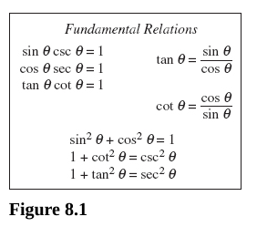
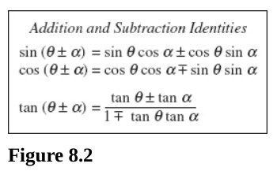
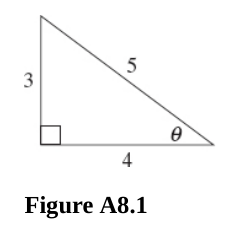
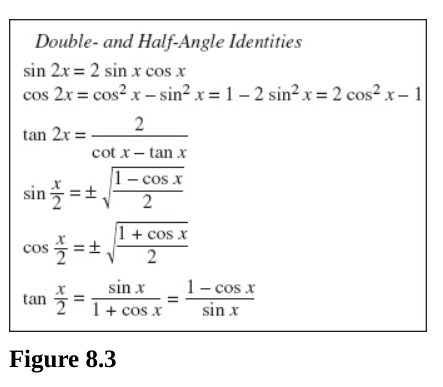
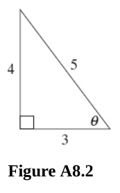

# Chapter 8 Trigonometric Equations and Inequalities

---

## Elementary Identities

---

**For questions 322-330,** prove that the given equation is an identity. Refer
to Figure 8.1 when necessary.

---

**322.** $\sin x(\csc x - \sin x) = \cos^2x$

**Answer:**

$$ \sin x(\csc x - \sin x) = \cos^2x $$

$$ \sin x\csc x - \sin^2x = \cos^2x $$

$$ 1 - \sin^2x = \cos^2x $$

$$ 1 - \sin^2x = \cos^2x $$

$$ 1 = \sin^2x + \cos^2x $$

$$ 1 = 1 $$

---

**323.** $\cos x(\sec x - \cos x) = \sin^2x$

**Answer:**

$$ \cos x(\sec x - \cos x) = \sin^2x $$

$$ \cos x\sec x - \cos^2x = \sin^2x $$

$$ \cos x\left(\frac{1}{\cos x}\right) - \cos^2x = \sin^2x $$

$$ 1 - \cos^2x = \sin^2x $$

$$ 1 = \sin^2x + \cos^2x $$

$$ 1 = 1 $$

---

**324.** $\dfrac{\sin x + \cos x}{\tan x} = \cos x + \dfrac{\cos^2x}{\sin x}$

**Answer:**

$$ \frac{\sin x + \cos x}{\tan x} = \cos x + \frac{\cos^2x}{\sin x} $$

$$ \frac{\sin x}{\tan x} + \frac{\cos x}{\tan x} = \cos x + \frac{\cos^2x}{\sin x} $$

$$ \frac{\sin x}{\left(\dfrac{\sin x}{\cos x}\right)} + \frac{\cos x}{\left(\dfrac{\sin x}{\cos x}\right)} = \cos x + \frac{\cos^2x}{\sin x} $$

$$ \sin x\left(\frac{\cos x}{\sin x}\right)+ \cos x\left(\frac{\cos x}{\sin x}\right) = \cos x + \frac{\cos^2x}{\sin x} $$

$$ \cos x + \frac{\cos^2 x}{\sin x} = \cos x + \frac{\cos^2x}{\sin x} $$

---

**325.**
$\dfrac{\sin^2x}{1 - \sin^2 x} + \dfrac{\cos^2x}{1 - \cos^2x} = \dfrac{\tan^4x + 1}{\tan^2x}$

**Answer:**

$$ \frac{\sin^2x}{1 - \sin^2 x} + \frac{\cos^2x}{1 - \cos^2x} = \frac{\tan^4x + 1}{\tan^2x} $$

$$ \sin^2\theta + \cos^2\theta = 1 $$

$$ \sin^2\theta = 1 - \cos^2\theta $$

$$ \cos^2\theta = 1 - \sin^2\theta $$

$$ \frac{\sin^2x}{\cos^2x} + \frac{\cos^2x}{\sin^2x} = \frac{\tan^4x + 1}{\tan^2x} $$

$$ \tan^2x + \cot^2x = \frac{\tan^4x}{\tan^2x} + \frac{1}{\tan^2x} $$

$$ \tan^2x + \cot^2x = \frac{\tan^2x \cdot \tan^2x}{\tan^2x} + \frac{1}{\tan^2x} $$

$$ \tan^2x + \cot^2x = \tan^2x + \cot^2x $$

---

**326.** $(1 - \sin x)(1 + \sin x) + \sin^2x = 1$

**Answer:**

$$ (1 - \sin x)(1 + \sin x) + \sin^2x = 1 $$

$$ 1 - \sin^2x + \sin^2x = 1 $$

$$ 1 = 1 $$

---

**327.** $\dfrac{1 + \cot x}{\cot x} = \tan x + \csc^2 x - \cot^2x$

**Answer:**

$$ \frac{1}{\cot x} + \frac{\cot x}{\cot x} = \tan x + \csc^2 x - \cot^2x $$

$$ \tan x + 1 = \tan x + \csc^2 x - \cot^2x $$

$$ 1 = \csc^2 x - \cot^2x $$

$$ 1 = \frac{1}{\sin^2x} - \frac{\cos^2x}{\sin^2x}$$

$$ \sin^2x = 1 - \cos^2x $$

$$ \sin^2x + \cos^2x = 1 $$

$$ 1 = 1 $$

---

**328.** Same as 327, possible to solve in a different way?

**Answer:**

$$ \frac{1 + \cot x}{\cot x} = \tan x + \csc^2 x - \cot^2x $$

$$ 1 + \cot^2\theta = \csc^2\theta $$

$$ \frac{1 + \cot x}{\cot x} = \tan x + (1 + \cot^2 x)- \cot^2x $$

$$ \frac{1 + \cot x}{\cot x} = \tan x + 1 $$

$$ \frac{1 + \cot x}{\cot x} = \frac{1}{\cot x} + 1 $$

$$ \frac{1 + \cot x}{\cot x} = \frac{1}{\cot x} + \frac{\cot x}{\cot x} $$

$$ \frac{1 + \cot x}{\cot x} = \frac{1 + \cot x}{\cot x}$$

---

**329.** $(\sin x + \cos x)^4 = 1 + 4\sin x\cos x + 4(\sin x \cos x)^2$

**Answer:**

$$ (\sin x + \cos x)^4 = 1 + 4\sin x\cos x + 4(\sin x \cos x)^2 $$

$$ (\sin x + \cos x)(\sin x + \cos x)(\sin x + \cos x)(\sin x + \cos x) = 1 + 4\sin x\cos x + 4(\sin x \cos x)^2 $$

$$ (\sin^2x + 2\sin x\cos x + \cos^2x)(\sin^2x + 2\sin x\cos x + \cos^2x) = 1 + 4\sin x\cos x + 4(\sin x \cos x)^2 $$

$$ (\sin^2x + \cos^2x + 2\sin x\cos x)(\sin^2x + \cos^2x + 2\sin x\cos x) = 1 + 4\sin x\cos x + 4(\sin x \cos x)^2 $$

$$ (1 + 2\sin x\cos x)(1 + 2\sin x\cos x) = 1 + 4\sin x\cos x + 4(\sin x \cos x)^2 $$

$$ 1 + 4\sin x\cos x + 4(\sin x \cos x)^2 = 1 + 4\sin x\cos x + 4(\sin x \cos x)^2 $$

**330.**
$\dfrac{\cos^2\theta - \sin^2\theta}{\sin\theta\cos\theta} = \cot\theta - \tan\theta$

**Answer:**

$$ \frac{\cos^2\theta - \sin^2\theta}{\sin\theta\cos\theta} = \cot\theta - \tan\theta $$

$$ \frac{\cos^2\theta}{\sin\theta\cos\theta} - \frac{\sin^2\theta}{\sin\theta\cos\theta} = \cot\theta - \tan\theta $$

$$ \frac{\cos\theta}{\sin\theta} - \frac{\sin\theta}{\cos\theta} = \cot\theta - \tan\theta $$

$$ \cot\theta - \tan\theta = \cot\theta - \tan\theta $$

---

**331.** Express each of the other functions of $\theta$ in terms of
$\sin\theta$.

**Answer:**

$$ \sin^2\theta + \cos^2\theta = 1 $$

$$ \cos^2\theta = 1 - \sin^2\theta $$

$$ \cos\theta = \pm \sqrt{1 - \sin^2\theta} $$

$$ \tan\theta = \frac{\sin\theta}{\cos\theta} $$

$$ \tan\theta = \frac{\sin\theta}{\pm \sqrt{1 - \sin^2\theta}} $$

$$ \csc\theta = \frac{1}{\sin\theta} $$

$$ \sec\theta = \frac{1}{\pm \sqrt{1 - \sin^2\theta}} $$

$$ \cot\theta = \frac{\pm \sqrt{1 - \sin^2\theta}}{\sin\theta} $$

---

**332.** Express each of the other functions of $\theta$ in terms of
$\tan\theta$.

**Answer:**

$$ \sec^2\theta = 1 + \tan^2\theta $$

$$ \boxed{\sec\theta = \pm \sqrt{1 + \tan^2\theta}} $$

$$ \tan\theta = \frac{\sin\theta}{\cos\theta} $$

$$ \sin\theta = \tan\theta\cos\theta $$

$$ \sin\theta = \tan\theta\left(\frac{1}{\pm \sqrt{1 + \tan^2\theta}}\right) $$

$$ \boxed{\sin\theta = \frac{\tan\theta}{\pm \sqrt{1 + \tan^2\theta}}} $$

$$ \boxed{\cos\theta = \frac{1}{\pm \sqrt{1 + \tan^2\theta}}} $$

$$ \csc\theta = \frac{1}{\dfrac{\tan\theta}{\pm \sqrt{1 + \tan^2\theta}}} $$

$$ \boxed{\csc\theta = \frac{\pm \sqrt{1 + \tan^2\theta}}{\tan\theta}} $$

$$ \boxed{\cot\theta = \frac{1}{\tan\theta}} $$

---

**333.** Using the fundamental relations, find the values of the functions of
$\theta$, given $\sin\theta = \dfrac{3}{5}$

**Answer:**

$$ \sin\theta = \frac{3}{5} $$

Since $\sin\theta$ is positive, this means that our angle $\theta$ must reside
within Quadrant I and Quadrant II. We'll divide our final answer based on these
two quadrants.

$$ \sin^2\theta + \cos^2\theta = 1 $$

$$ \left(\frac{3}{5}\right)^2 + \cos^2\theta = 1 $$

$$ \frac{9}{25} + \cos^2\theta = 1 $$

$$ \cos^2\theta = 1 - \frac{9}{25} $$

$$ \cos^2\theta = \frac{16}{25} $$

$$ \cos\theta = \pm \frac{4}{5} $$

$$ \tan\theta = \frac{\dfrac{3}{5}}{\pm \dfrac{4}{5}} $$

$$ \tan\theta = \pm \frac{3}{4} $$

$$ \csc\theta =  \frac{5}{3} $$

$$ \sec\theta = \pm \frac{5}{4} $$

$$ \cot\theta = \pm \frac{4}{3} $$

Quandrant I:

$$ \sin\theta = \frac{3}{5} $$

$$ \cos\theta = \frac{4}{5} $$

$$ \tan\theta = \frac{3}{4} $$

$$ \csc\theta =  \frac{5}{3} $$

$$ \sec\theta = \frac{5}{4} $$

$$ \cot\theta = \frac{4}{3} $$

Quandrant II:

$$ \sin\theta = \frac{3}{5} $$

$$ \cos\theta = -\frac{4}{5} $$

$$ \tan\theta = -\frac{3}{4} $$

$$ \csc\theta =  \frac{5}{3} $$

$$ \sec\theta = -\frac{5}{4} $$

$$ \cot\theta = -\frac{4}{3} $$

---

**334.** Using the fundamental relations, find the values of the functions of
$\theta$, given $\tan\theta = -\dfrac{5}{12}$.

**Answer:**

$\tan\theta$ is only negative in Quadrants II and IV, so we'll divide our final
answer based off of this.

$$ \tan\theta = -\frac{5}{12} $$

$$ \tan\theta = \frac{\frac{y}{r}}{\frac{x}{r}} $$

$$ x^2 + y^2 = r^2 $$

$$ 5^2 + 12^2 = r^2 $$

$$ 25 + 144 = r^2 $$

$$ 169 = r^2 $$

$$ \pm 13 = r $$

But radius can only ever be positive, thusly $r = 13$.

$$ \sin\theta = \pm \frac{5}{13} $$

$$ \cos\theta = \pm \frac{12}{13} $$

$$ \csc\theta = \pm \frac{13}{5} $$

$$ \sec\theta = \pm \frac{13}{12} $$

$$ \cot\theta = -\frac{12}{5} $$

Quandrant II:

$$ \sin\theta = \frac{5}{13} $$

$$ \cos\theta = -\frac{12}{13} $$

$$ \csc\theta = \frac{13}{5} $$

$$ \sec\theta = -\frac{13}{12} $$

$$ \cot\theta = -\frac{12}{5} $$

Quandrant IV:

$$ \sin\theta = -\frac{5}{13} $$

$$ \cos\theta = \frac{12}{13} $$

$$ \csc\theta = -\frac{13}{5} $$

$$ \sec\theta = \frac{13}{12} $$

$$ \cot\theta = -\frac{12}{5} $$

---

**335.** Perform the indicated operations.

(A) $(\sin\theta - \cos\theta)(\sin\theta + \cos\theta)$

**Answer:**

$$ \sin^2\theta - \cos^2\theta $$

(B) $(\sin A + \cos A)^2$

**Answer:**

$$ (\sin A + \cos A)(\sin A + \cos A) $$

$$ \sin^2A + 2\sin A \cos A + \cos^2A $$

\(C\) $(\sin x + \cos y)(\sin y - \cos x)$

**Answer:**

$$ \sin x\sin y + \cos y\sin y - \sin x\cos x - \cos y\cos x$$

(D) $(\tan^2A - \cot A)^2$

$$ (\tan^2A - \cot A)(\tan^2A - \cot A) $$

$$ \tan^4A - 2\tan^2A\cot A + \cot^2 A $$

**Answer:**

(E) $1 + \dfrac{\cos\theta}{\sin\theta}$

$$ \frac{\sin\theta}{\sin\theta} + \frac{\cos\theta}{\sin\theta} $$

$$ \frac{\sin\theta + \cos\theta}{\sin\theta} $$

**Answer:**

(F) $1 - \dfrac{\sin\theta}{\cos\theta} + \dfrac{2}{\cos^2\theta}$

**Answer:**

$$ \frac{\cos^2\theta}{\cos^2\theta} - \frac{\sin\theta\cos\theta}{\cos^2\theta} + \frac{2}{\cos^2\theta} $$

$$ \frac{\cos^2\theta - \sin\theta\cos\theta + 2}{\cos^2\theta}$$

---

**336.** Factor.

(A) $\sin^2\theta - \sin\theta\cos\theta$

**Answer:**

$$ \sin\theta(\sin\theta - \cos\theta) $$

(B) $\sin^2\theta + \sin^2\theta\cos^2\theta$

**Answer:**

$$ \sin^2\theta(1 + \cos^2\theta) $$

\(C\) $\sin^2\theta + \sin\theta\sec\theta - 6\sec^2\theta$

**Answer:**

$$ (\sin\theta + 3\sec\theta)(\sin\theta - 2\sec\theta) $$

(D)
$\sin^3\theta\cos^2\theta - \sin^2\theta\cos^3\theta + \sin\theta\cos^2\theta$

**Answer:**

$$ \sin\theta\cos^2\theta(\sin^2\theta - \sin\theta\cos\theta + 1) $$

(E) $\sin^4\theta - \cos^4\theta$

**Answer:**

$$ (\sin^2\theta + \cos^2\theta)(\sin^2\theta - \cos^2\theta) $$

$$ (\sin^2\theta + \cos^2\theta)(\sin\theta + \cos\theta)(\sin\theta - \cos\theta) $$

---

**337.** Simplify each of the following.

(A) $\sec\theta - \sec\theta\sin^2\theta$

**Answer:**

$$ \sec\theta(1 - \sin^2\theta) $$

$$ \sin^2\theta + \cos^2\theta = 1 $$

$$ \sin^2\theta = 1 - \cos^2\theta $$

$$ \sec\theta(1 - (1 - \cos^2\theta)) $$

$$ \sec\theta(\cos^2\theta) $$

$$ \left(\frac{1}{\cos\theta}\right)\left(\frac{\cos^2\theta}{1}\right) $$

$$ \frac{\cos^2\theta}{\cos\theta} $$

$$ \boxed{\cos\theta} $$

(B) $\sin\theta\sec\theta\cot\theta$

**Answer:**

$$ \sin\theta\left(\frac{1}{\cos\theta}\right)\left(\frac{\cos\theta}{\sin\theta}\right) $$

$$ \left(\frac{\sin\theta}{\cos\theta}\right)\left(\frac{\cos\theta}{\sin\theta}\right) $$

$$ \boxed{1} $$

\(C\) $\sin^2\theta(1 + \cot^2\theta)$

**Answer:**

$$ \sin^2\theta\left(1 + \frac{\cos^2\theta}{\sin^2\theta}\right) $$

$$ \frac{\sin^2\theta}{1} + \frac{\sin^2\theta\cos^2\theta}{\sin^2\theta} $$

$$ \sin^2\theta + \cos^2\theta $$

$$ \boxed{1} $$

(D) $\sin^2\theta\sec^2\theta - \sec^2\theta$

**Answer:**

$$ \sec^2\theta(\sin^2\theta - 1) $$

$$ \sin^2\theta + \cos^2\theta = 1 $$

$$ \sin^2\theta = 1 - \cos^2\theta $$

$$ \sec^2\theta((1 - \cos^2\theta) - 1) $$

$$ \sec^2\theta(-1\cos^2\theta) $$

$$ \left(\frac{1}{\cos^2\theta}\right)(-\cos^2\theta) $$

$$ \frac{-\cos^2\theta}{\cos^2\theta} $$

$$ \boxed{-1} $$

(E) $(\sin\theta + \cos\theta)^2 + (\sin\theta - \cos\theta)^2$

**Answer:**

$$ (\sin\theta + \cos\theta)(\sin\theta + \cos\theta) + (\sin\theta - \cos\theta)(\sin\theta - \cos\theta) $$

$$ (\sin^2\theta + 2\sin\theta\cos\theta + \cos^2\theta) + (\sin^2\theta - 2\sin\theta\cos\theta + \cos^2\theta) $$

$$ 2\sin^2\theta + 2\cos^2\theta $$

$$ 2(\sin^2\theta + \cos^2\theta) $$

$$ 2(1) $$

$$ \boxed{2} $$

(F) $\tan^2\theta\cos^2\theta + \cot^2\theta\sin^2\theta$

**Answer:**

$$ \left(\frac{\sin^2\theta}{\cos^2\theta}\right)\left(\frac{\cos^2\theta}{1}\right) + \left(\frac{\cos^2\theta}{\sin^2\theta}\right)\left(\frac{\sin^2\theta}{1}\right) $$

$$ \sin^2\theta + \cos^2\theta $$

$$ \boxed{1} $$

---

## Addition and Subtraction Identities

Refer to Figure 8.2 when necessary for questions in this section.

---

**For questions 338 -340,** find the value of the given expression. Do _not_ use
tables or a calculator.

**338.** $\tan 75\degree$

**Answer:**

We use the identity:

$$ \tan(x \pm y) = \frac{\tan x \pm \tan y}{1 \mp \tan x \tan y} $$

$$ \tan(45\degree + 30\degree) = \frac{\tan 45\degree + \tan 30\degree}{1 - \tan 45\degree \tan 30\degree} $$

$$ \tan(45\degree + 30\degree) = \frac{1 + \dfrac{1}{\sqrt{3}}}{1 - 1 \cdot \dfrac{1}{\sqrt{3}}} $$

$$ \tan(45\degree + 30\degree) = \frac{1 + \dfrac{1}{\sqrt{3}}}{1 - \dfrac{1}{\sqrt{3}}} $$

$$ \tan(45\degree + 30\degree) = \frac{\dfrac{\sqrt{3} + 1}{\sqrt{3}}}{\dfrac{\sqrt{3} - 1}{\sqrt{3}}} $$

$$ \boxed{\tan(75\degree) = \frac{\sqrt{3} + 1}{\sqrt{3} - 1}} $$

**339.** $\tan \dfrac{7\pi}{12}$

**Answer:**

We'll use the same identity as in 338.

$$ \tan(x \pm y) = \frac{\tan x \pm \tan y}{1 \mp \tan x \tan y} $$

$$ \tan \frac{7\pi}{12} = \tan\left(\frac{4\pi}{12} + \frac{3\pi}{12}\right) = \tan\left(\frac{\pi}{3} + \frac{\pi}{4}\right) $$

$$ \tan\left(\frac{\pi}{4} + \frac{\pi}{3}\right) = \frac{\tan\left(\dfrac{\pi}{4}\right) + \tan\left(\dfrac{\pi}{3}\right)}{1 - \tan\left(\dfrac{\pi}{4}\right)\tan\left(\dfrac{\pi}{3}\right)} $$

$$ \tan\left(\frac{\pi}{4} + \frac{\pi}{3}\right) = \frac{1 + \sqrt{3}}{1 - (1)(\sqrt{3})} $$

$$ \boxed{\tan\left(\frac{\pi}{4} + \frac{\pi}{3}\right) = \frac{1 + \sqrt{3}}{1 - \sqrt{3}}} $$

---

**340.**
$\dfrac{\tan 80\degree + \tan 40\degree}{1 - \tan 80\degree \tan 40\degree}$

**Answer:**

This is taking our identity from 339 and 338 and reversing the process. This is
simply:

$$ \tan(80\degree + 40\degree) = \tan(120\degree) $$

Which is on the Unit Circle.

This has the point on the Unit Circle of
$\left(-\dfrac{1}{2}, \dfrac{\sqrt{3}}{2}\right)$

Thusly:

$$ \boxed{\tan(120\degree) = -\sqrt{3}} $$

---

**341.** Prove:
$\dfrac{\sin(\theta + h) - \sin\theta}{h} = (\cos\theta)\dfrac{\sin h}{h} - (\sin\theta)\dfrac{1 - \cos h}{h}$

**Answer:**

Let's use the trigonometric identity:

$$ \sin(\alpha \pm \beta) = \sin\alpha\cos\beta \pm \cos\alpha\sin\beta $$

$$ \frac{\sin(\theta + h) - \sin\theta}{h} = (\cos\theta)\frac{\sin h}{h} - (\sin\theta)\frac{1 - \cos h}{h}$$

$$ \frac{\sin\theta\cos h + \cos\theta\sin h - \sin\theta}{h} = (\cos\theta)\frac{\sin h}{h} - (\sin\theta)\frac{1 - \cos h}{h}$$

$$ \frac{\cos\theta\sin h}{h} + \frac{\sin\theta\cos h}{h} - \frac{\sin\theta}{h} = (\cos\theta)\frac{\sin h}{h} - (\sin\theta)\frac{1 - \cos h}{h}$$

$$ (\cos\theta)\frac{\sin h}{h} + (\sin h)\frac{\cos h - 1}{h} = (\cos\theta)\frac{\sin h}{h} - (\sin\theta)\frac{1 - \cos h}{h}$$

$$ (\cos\theta)\frac{\sin h}{h} - (\sin h)\frac{1 - \cos h}{h} = (\cos\theta)\frac{\sin h}{h} - (\sin\theta)\frac{1 - \cos h}{h}$$

---

**342.** Evaluate:
$\sin\left[\cos^{-1}\left(-\dfrac{4}{5}\right) + \sin^{-1}\left(-\dfrac{3}{5}\right)\right]$

**Answer:**

Think about a Right Triangle here, we actually have the same hypotenuse from the
denominator of our given points:

Let's use the trigonometric identity:

$$ \sin(\alpha \pm \beta) = \sin\alpha\cos\beta \pm \cos\alpha\sin\beta $$

$$ \sin\left[\cos^{-1}\left(-\frac{4}{5}\right) + \sin^{-1}\left(-\frac{3}{5}\right)\right] $$

$$ \sin\left(\cos^{-1}\left(-\frac{4}{5}\right)\right)\cos\left(\sin^{-1}\left(-\frac{3}{5}\right)\right) + \cos\left(\cos^{-1}\left(-\frac{4}{5}\right)\right)\sin\left(\sin^{-1}\left(-\frac{3}{5}\right)\right) $$

$$ \left(\frac{3}{5}\right)\left(\frac{4}{5}\right) + \left(-\frac{4}{5}\right)\left(-\frac{3}{5}\right) $$

$$ \frac{12}{25} + \frac{12}{25} $$

$$ \boxed{\frac{24}{25}} $$

---

## Double- and Half-Angle Identities

---

**For questions 343 and 344,** prove that the given formula is true for all $x$.
Use Figure 8.3 when necessary.

---

**343.** $\sin 2x = 2\sin x\cos x$

**Answer:**

Let's use the identity:

$$ \sin(\alpha \pm \beta) = \sin\alpha\cos\beta \pm \cos\alpha\sin\beta $$

$$ \sin(x + x) = \sin x\cos x + \cos x\sin x $$

$$ \sin(x + x) = \sin x\cos x + \sin x\cos x $$

$$ \sin(x + x) = 2\sin x\cos x $$

$$ \sin 2x = 2\sin x\cos x $$

---

**344.** $\cos 2x = \cos^2x - \sin^2x = 1 - 2 \sin^2 x = 2 \cos^2 x - 1$

**Answer:**

Let's use the identity:

$$ \cos(\theta \pm \alpha) = \cos\theta\cos\alpha \mp \sin\theta\sin\alpha $$

$$ \cos(x + x) = \cos x \cos x - \sin x \sin x $$

$$ \cos 2x = \cos^2x - \sin^2x $$

And The Pythagorean Identity for cosine:

$$ \sin^2\theta + \cos^2\theta = 1 $$

$$ \cos^2\theta = 1 - \sin^2\theta $$

$$ \cos(x + x) = (1 - \sin^2\theta) - \sin^2x $$

$$ \cos 2x = 1 - 2\sin^2\theta $$

And if we use the Pythagorean Identity for sine:

$$ \sin^2\theta + \cos^2\theta = 1 $$

$$ \sin^2\theta = 1 - \cos^2\theta $$

$$ \cos(x + x) = 1 - 2(1 - \cos^2\theta) $$

$$ \cos(x + x) = 1 - 2 + 2\cos^2\theta $$

$$ \cos(x + x) = -1 + 2\cos^2\theta $$

$$ \cos 2x = 2\cos^2\theta - 1 $$

---

**For questions 345 and 346,** find the exact value of the given expression
without using a table or calculator.

**345.** $\sin 22.5\degree$

Let's use the Half Angle Identity for Sine:

$$ \sin \frac{x}{2} = \pm \sqrt{\frac{1 - \cos x}{2}} $$

$$ 22.5 \cdot 2 = 45 $$

Since this is a Quadrant 1 Angle, the value returned for Sine must be positive,
and we omit the $\pm$ to show the coordinate returned is positive.

$$ \sin\left(\frac{45}{2}\right) = \sqrt{\frac{1 - \cos 45\degree}{2}} $$

$$ \sin\left(\frac{45}{2}\right) = \sqrt{\frac{1 - \dfrac{\sqrt{2}}{2}}{2}} $$

---

**346.** $\tan 165\degree$

**Answer:**

Let's use the Half Angle Identity For Tangent:

$$ \tan \frac{x}{2} = \frac{\sin x}{1 + \cos x} = \frac{1 - \cos x}{\sin x} $$

$$ 330 \div 2 = 165 $$

$$ \tan \frac{330}{2} = \frac{1 - \cos 330\degree}{\sin 330\degree} $$

At $330\degree$, we get the point on the Unit Circle of
$\left(\dfrac{\sqrt{3}}{2}, -\dfrac{1}{2}\right)$.

$$ \tan \frac{330}{2} = \frac{1 - \dfrac{\sqrt{3}}{2}}{-\dfrac{1}{2}} $$

$$ \tan \frac{330}{2} = \frac{\dfrac{2 - \sqrt{3}}{2}}{-\dfrac{1}{2}} $$

$$ \tan \frac{330}{2} = \left(\frac{2 - \sqrt{3}}{2}\right)\left(-\frac{2}{1}\right) $$

$$ \tan \frac{330}{2} = \sqrt{3} - 2 $$

---

**For questions 347-349,** find the exact value without using a table or
calculator.

**347.** $\sin\left(2\cos^{-1} \dfrac{3}{5}\right)$

**Answer:**

Let's use the Double-Angle Identity for Sine:

$$ \sin 2x = 2\sin x\cos x $$

$$ \sin\left(2\cos^{-1} \frac{3}{5}\right) = 2\sin\left(\cos^{-1} \frac{3}{5}\right)\cos\left(\cos^{-1} \frac{3}{5}\right) $$

This uses the same relations as a previous problem:

Thusly this evaluates to:

$$ \sin\left(2\cos^{-1} \frac{3}{5}\right) = 2\left(\frac{4}{5}\right)\left(\frac{3}{5}\right) $$

$$ \sin\left(2\cos^{-1} \frac{3}{5}\right) = 2\left(\frac{12}{25}\right) $$

$$ \sin\left(2\cos^{-1} \frac{3}{5}\right) = \frac{24}{25} $$

---

**348.** $\tan\left[2\cos^{-1}\left(-\dfrac{4}{5}\right)\right]$

**Answer:**

Let's use the Double-Angle Identity for Tangent:

$$ \tan 2x = \frac{2\tan x}{1 - \tan^2x} $$

$$ \tan 2x = \frac{2\tan\left(\cos^{-1}\left(-\dfrac{4}{5}\right)\right)}{1 - \tan^2\left(\cos^{-1}\left(-\dfrac{4}{5}\right)\right)} $$

$$ \tan 2x = \frac{2\left(-\dfrac{3}{4}\right)}{1 - \left(-\dfrac{3}{4}\right)^2} $$

$$ \tan 2x = \frac{-\dfrac{6}{4}}{1 - \left(\dfrac{9}{16}\right)} $$

$$ \tan 2x = \frac{-\dfrac{24}{16}}{\dfrac{7}{16}} $$

$$ \tan 2x = \left(-\dfrac{24}{16}\right)\left(\dfrac{16}{7}\right) $$

$$ \tan 2x = -\frac{24}{7} $$

---

**349.** $\sin\left(\dfrac{x}{2}\right)$ if $\cos x = \dfrac{1}{3}$,
$0\degree < x < 90\degree$.

We're obviously in Quadrant I, so our answer for Sine must be positive.

Let's use the Half-Identity for Sine:

$$ \sin \frac{x}{2} = \pm \sqrt{\frac{1 - \cos x}{2}} $$

$$ \sin \frac{x}{2} = \pm \sqrt{\frac{1 - \left(\dfrac{1}{3}\right)}{2}} $$

$$ \sin \frac{x}{2} = \pm \sqrt{\frac{\dfrac{2}{3}}{2}} $$

$$ \sin \frac{x}{2} = \pm \sqrt{\frac{2}{6}} $$

$$ \sin \frac{x}{2} = \pm \sqrt{\frac{1}{3}} $$

And again, our angle is in Quadrant I, so our Sine must be positive:

$$ \sin \frac{x}{2} = \sqrt{\frac{1}{3}} $$

---

## Product and Sum Identities

---

**350.** State the four basic product identities.

**Answer:**

$$ 2\sin A\cos B = \sin(A + B) + \sin(A - B) $$

$$ 2\cos A\sin B  = \sin(A + B) - \sin(A - B) $$

$$ 2\cos A\cos B = \cos(A + B) + \cos(A - B) $$

$$ 2\sin A\sin B = \cos(A - B) - \cos(A + B) $$

---

**351.** State the four basic sum identities.

**Answer:**

$$ \sin A + \sin B = 2 \cdot \sin \frac{A + B}{2} \cdot \cos \frac{A - B}{2} $$

$$ \sin A - \sin B = 2 \cdot \cos \frac{A + B}{2} \cdot \sin \frac{A - B}{2} $$

$$ \cos A + \cos B = 2 \cdot \cos \frac{A + B}{2} \cdot \cos \frac{A - B}{2} $$

$$ \cos A - \cos B = -2 \cdot \sin \frac{A + B}{2} \cdot \sin \frac{A - B}{2} $$

Careful with that last one, it was wrong on Mcgraw and Geek For Geeks
Article...two sources got this wrong. The above with the $-2$ coefficient is the
correct one.

---

**352.** Express each of the following as a sum or difference:

(A) $\sin40\degree\cos30\degree$

**Answer:**

$$ \sin A\cos B = \frac{1}{2}\left(\sin(A + B) + \sin(A - B)\right) $$

$$ \sin40\degree\cos30\degree = \frac{1}{2}\left(\sin(40\degree + 30\degree) + \sin(40\degree - 30\degree)\right) $$

$$ \sin40\degree\cos30\degree = \frac{1}{2}\left(\sin70\degree + \sin10\degree\right) $$

(B) $\cos110\degree\sin55\degree$

**Answer:**

$$ \cos A\sin B  = \frac{1}{2}(\sin(A + B) - \sin(A - B)) $$

$$ \cos110\degree\sin55\degree = \frac{1}{2}(\sin(110\degree + 55\degree) - \sin(110\degree - 55\degree)) $$

$$ \cos110\degree\sin55\degree = \frac{1}{2}(\sin(165\degree) - \sin(55\degree)) $$

\(C\) $\cos50\degree\cos35\degree$

**Answer:**

$$ \cos A\cos B = \frac{1}{2}(\cos(A + B) + \cos(A - B)) $$

$$ \cos50\degree\cos35\degree = \frac{1}{2}(\cos(50\degree + 35\degree) + \cos(50\degree - 35\degree)) $$

$$ \cos50\degree\cos35\degree = \frac{1}{2}(\cos(85\degree) + \cos(15\degree)) $$

(D) $\sin55\degree\sin40\degree$

**Answer:**

$$ \sin A\sin B = \frac{1}{2}(\cos(A - B) - \cos(A + B)) $$

$$ \sin55\degree\sin40\degree = \frac{1}{2}(\cos(55\degree - 40\degree) - \cos(55\degree + 40\degree)) $$

$$ \sin55\degree\sin40\degree = \frac{1}{2}(\cos(15\degree) - \cos(95\degree)) $$

---

**353.** Rewrite as a product.

$$ \sin20\degree + \sin15\degree $$

$$ \sin A + \sin B = 2 \cdot \sin \frac{A + B}{2} \cdot \cos \frac{A - B}{2} $$

$$ \sin20\degree + \sin15\degree = 2 \cdot \sin \frac{20\degree + 15\degree}{2} \cdot \cos \frac{20\degree - 15\degree}{2} $$

$$ \sin20\degree + \sin15\degree = 2\sin\left(\frac{35\degree}{2}\right)\cos\left(\frac{5\degree}{2}\right) $$

$$ \sin20\degree + \sin15\degree = 2\sin17.5\degree\cos2.5\degree $$

---

**354.** Express each of the following as a product.

(A) $\sin50\degree + \sin40\degree$

**Answer:**

$$ \sin A + \sin B = 2 \cdot \sin \frac{A + B}{2} \cdot \cos \frac{A - B}{2} $$

$$ \sin50\degree + \sin40\degree = 2 \cdot \sin \frac{50\degree + 40\degree}{2} \cdot \cos \frac{50\degree - 40\degree}{2} $$

$$ \sin50\degree + \sin40\degree = 2 \cdot \sin \frac{90\degree}{2} \cdot \cos \frac{10\degree}{2} $$

$$ \sin50\degree + \sin40\degree = 2\sin45\degree\cos5\degree $$

(B) $\sin70\degree - \sin20\degree$

**Answer:**

$$ \sin A - \sin B = 2 \cdot \cos \frac{A + B}{2} \cdot \sin \frac{A - B}{2} $$

$$ \sin70\degree - \sin20\degree = 2 \cdot \cos \frac{70\degree + 20\degree}{2} \cdot \sin \frac{70\degree - 20\degree}{2} $$

$$ \sin70\degree - \sin20\degree = 2 \cdot \cos \frac{90\degree}{2} \cdot \sin \frac{50\degree}{2} $$

$$ \sin70\degree - \sin20\degree = 2\cos45\degree\sin25\degree $$

\(C\) $\cos55\degree + \cos25\degree$

**Answer:**

$$ \cos A + \cos B = 2 \cdot \cos \frac{A + B}{2} \cdot \cos \frac{A - B}{2} $$

$$ \cos55\degree + \cos25\degree = 2 \cdot \cos \frac{55\degree + 25\degree}{2} \cdot \cos \frac{55\degree - 25\degree}{2} $$

$$ \cos55\degree + \cos25\degree = 2 \cdot \cos \frac{80\degree}{2} \cdot \cos \frac{30\degree}{2} $$

$$ \cos55\degree + \cos25\degree = 2\cos40\degree\cos15\degree $$

(D) $\cos35\degree - \cos75\degree$

**Answer:**

$$ \cos A - \cos B = -2 \cdot \sin \frac{A + B}{2} \cdot \sin \frac{A - B}{2} $$

$$ \cos35\degree - \cos75\degree = -2 \cdot \sin \frac{35\degree + 75\degree}{2} \cdot \sin \frac{35\degree - 75\degree}{2} $$

$$ \cos35\degree - \cos75\degree = -2 \cdot \sin \frac{110\degree}{2} \cdot \sin \frac{-40\degree}{2} $$

$$ \cos35\degree - \cos75\degree = -2\sin55\degree\sin(-20\degree) $$

Due to Sine being an Odd Function:

$$ \sin(-\theta) = -\sin\theta $$

We can rewrite this as:

$$ \cos35\degree - \cos75\degree = 2\sin55\degree\sin(20\degree) $$

---

**355.** Prove: $\dfrac{\sin4A + \sin2A}{\cos4A + \cos2A} = \tan3A$

**Answer:**

$$ \frac{\sin4A + \sin2A}{\cos4A + \cos2A} = \tan3A $$

We can use both the Sine and Cosine Sum-To-Product Formulas

$$ \sin A + \sin B = 2 \cdot \sin \frac{A + B}{2} \cdot \cos \frac{A - B}{2} $$

$$ \cos A + \cos B = 2 \cdot \cos \frac{A + B}{2} \cdot \cos \frac{A - B}{2} $$

$$ \frac{2\sin \dfrac{4A + 2A}{2}\cos \dfrac{4A - 2A}{2}}{2\cos \dfrac{4A + 2A}{2}\cos \dfrac{4A - 2A}{2}} = \tan3A $$

Alot of cancellation can happen now:

$$ \frac{\cancel{2}\sin \dfrac{4A + 2A}{2}\cancel{\cos \dfrac{4A - 2A}{2}}}{\cancel{2}\cos \dfrac{4A + 2A}{2}\cancel{\cos \dfrac{4A - 2A}{2}}} = \tan3A $$

$$ \frac{\sin \dfrac{4A + 2A}{2}}{\cos \dfrac{4A + 2A}{2}} = \tan3A $$

$$ \frac{\sin \dfrac{6A}{2}}{\cos \dfrac{6A}{2}} = \tan3A $$

$$ \frac{\sin3A}{\cos3A} = \tan3A $$

$$ \tan3A = \tan3A $$

---

## Trigonometric Equations

---

**For questions 356 and 357,** determine whether the given number is a solution
of the given equation.

---

**356.** $\dfrac{3\pi}{4}$, $1 + \tan x = 0$

**Answer:**

$$ 1 + \tan\left(\frac{3\pi}{4}\right) \stackrel{?}{=} 0 $$

$$ 1 + (-1) \stackrel{?}{=} 0 $$

$$ 0 = 0 $$

Yes, $\dfrac{3\pi}{4}$ is a solution of $1 + \tan x = 0$.

---

**357.** $\dfrac{\pi}{2}$, $1 + \tan x = 0$

**Answer:**

$$ 1 + \tan\left(\frac{\pi}{2}\right) \stackrel{?}{=} 0 $$

$$ 1 + \text{undefined} \stackrel{?}{=} 0 $$

No, because $\tan\left(\dfrac{\pi}{2}\right)$ is undefined, there is no
solution.

---

**For questions 358 and 359,** solve the given equation, finding all solutions
which lie in the interval $(0, 2\pi)$.

---

**358.** $4\cos^2x - 3 = 0$

**Answer:**

$$ 4\cos^2x = 3 $$

$$ \cos^2x = \frac{3}{4} $$

$$ \cos x = \pm \sqrt{\frac{3}{4}} $$

$$ \cos x = \pm \frac{\sqrt{3}}{2} $$

There are four solutions, along the Unit Circle, Cosine equals this value at the
following angles:

Quandrant I: $\dfrac{\pi}{6}$, with a positive coordinate of
$\dfrac{\sqrt{3}}{2}$

Quandrant II: $\dfrac{5\pi}{6}$, with a negative coordinate of
$-\dfrac{\sqrt{3}}{2}$

Quadrant III: $\dfrac{7\pi}{6}$, with a negative coordinate of
$-\dfrac{\sqrt{3}}{2}$

Quandrat IV: $\dfrac{11\pi}{6}$, with a positive coordinate of
$\dfrac{\sqrt{3}}{2}$

---

**359.** $2\sin^2x - 1 = 0$

**Answer:**

$$ 2\sin^2x - 1 = 0 $$

$$ 2\sin^2x = 1  $$

$$ \sin^2x = \frac{1}{2}  $$

$$ \sin x = \pm \sqrt{\frac{1}{2}}  $$

$$ \sin x = \pm \frac{\sqrt{2}}{2} $$

There are four angles at which the Sine coordinate is this value:

Quadrant I: $\dfrac{\pi}{4}$, with a positive coordinate of
$\dfrac{\sqrt{2}}{2}$.

Quadrant II: $\dfrac{3\pi}{4}$, with a positive coordiante of
$\dfrac{\sqrt{2}}{2}$.

Quandrant III: $\dfrac{5\pi}{4}$, with a negative coordiante of
$-\dfrac{\sqrt{2}}{2}$.

Quandrant III: $\dfrac{7\pi}{4}$, with a negative coordiante of
$-\dfrac{\sqrt{2}}{2}$.

---

**For questions 360-362,** solve for all $x$ such that $0 \leq x \leq 2\pi$.

---

**360.** $2\sin x - \csc x = 1$

**Answer:**

$$ 2\sin x - \csc x = 1 $$

$$ 2\sin x - \left(\frac{1}{\sin x}\right) = 1 $$

$$ 2\sin^2x - 1 = \sin x $$

$$ 2\sin^2x - \sin x - 1 = 0 $$

$$ (2\sin x + 1)(\sin x - 1) = 0 $$

$$ 2\sin x + 1 = 0 $$

$$ 2\sin x = -1 $$

$$ \sin x = -\frac{1}{2} $$

$$ x = \frac{7\pi}{6} \text{, } x = \frac{11\pi}{6} $$

$$ \sin x - 1 = 0 $$

$$ \sin x = 1 $$

$$ x = \frac{\pi}{2} $$

So we have three possible angles for $x$:

$$ \boxed{x = \frac{\pi}{2} \text{, } x = \frac{7\pi}{6} \text{, } x = \frac{11\pi}{6}} $$

---

**361.** $\cos x - \sqrt{3}\sin x = 1$

**Answer:**

$$ \cos x - 1 = \sqrt{3}\sin x $$

$$ (\cos x - 1)^2 = (\sqrt{3}\sin x)^2 $$

$$ (\cos x - 1)(\cos x - 1) = 3\sin^2x $$

$$ \cos^2x - 2\cos x + 1 = 3\sin^2x $$

$$ \cos^2x - 2\cos x + 1 = 3(1 - \cos^2x) $$

$$ \cos^2x - 2\cos x + 1 = 3 - 3\cos^2x $$

$$ 4\cos^2x - 2\cos x - 2 = 0 $$

$$ 2(2\cos^2x - \cos x - 1) = 0 $$

$$ 2(2\cos x + 1)(\cos x - 1) = 0 $$

$$ 2\cos + 1 = 0 $$

$$ 2\cos = -1 $$

$$ \cos = -\frac{1}{2} $$

$$ x = \frac{2\pi}{3} \text{, } x = \frac{4\pi}{3} $$

$$ \cos x - 1 = 0 $$

$$ \cos x = 1 $$

$$ x = 0 $$

Check:

$$ \cos x - \sqrt{3}\sin x = 1 $$

$$ \cos\left(\frac{2\pi}{3}\right) - \sqrt{3}\sin\left(\frac{2\pi}{3}\right) \stackrel{?}{=} 1 $$

$$ -\frac{1}{2} - \sqrt{3}\left(\frac{\sqrt{3}}{2}\right) \stackrel{?}{=} 1 $$

$$ -\frac{1}{2} - \sqrt{3}\left(\frac{\sqrt{3}}{2}\right) \stackrel{?}{=} 1 $$

$$ -\frac{1}{2} - \frac{3}{2} \stackrel{?}{=} 1 $$

$$ -\frac{4}{2} \stackrel{?}{=} 1 $$

$$ -2 \neq 1 $$

$$ \boxed{x = \frac{4\pi}{3} \text{, } x = 0} $$

---

**362.** $2\cos^2 \dfrac{1}{2}x = \cos^2x$

This requires a bit of manipulating our Cosine Double-Angle Formula:

$$ \cos(2\theta) = 2\cos^2\theta - 1 $$

$$ \cos^2\theta = \frac{1 + \cos(2\theta)}{2} $$

$$ \theta = \frac{x}{2} \text{, } 2\theta = x $$

$$ \cos^2\left(\frac{x}{2}\right) = \frac{1 + \cos x}{2} $$

$$ 2\cos^2\left(\frac{x}{2}\right) = 1 + \cos x $$

As you can see, we can now substitute the left hand side of our problem
statement equation with this:

$$ 1 + \cos x = \cos^2x $$

And solve:

$$ \cos^2x - \cos x - 1 = 0 $$

$$ \cos x = \frac{-(-1) \pm \sqrt{(-1)^2 - 4(1)(-1)}}{2(1)} $$

$$ \cos x = \frac{1 \pm \sqrt{5}}{2} $$

$$ \cos x \approx 1.6180 \text{, } \cos x \approx -0.6180 $$

Cosine cannot exceed 1:

$$ \cos x \approx -0.6180 $$

We can apply the ArcCosine ($\cos^{-1}$) to find an approximation of the angle:

$$ \cos^{-1}(-0.6180) \approx 128\degree1' $$

---

**363.** Solve: $\arccos2x = \arcsin x$

**Answer:**

Let's assign some variables to get an idea:

$$ \alpha = \arccos2x $$

$$ \beta = \arcsin x $$

If $x$ is positive, this means that $\sin\beta = x$ and
$\cos\beta = \sqrt{1 - x^2}$.

Take the Cosine of both sides of the equation:

$$ \cos(\arccos2x) = \cos(\arcsin x) $$

$$ 2x = \sqrt{1 - x^2} $$

$$ 4x^2 = 1 - x^2 $$

$$ 5x^2 = 1 $$

$$ x^2 = \frac{1}{5} $$

$$ x = \pm \sqrt{\frac{1}{5}} $$

$$ x = \pm \frac{\sqrt{5}}{5} $$

But we already established that $x$ is positive, so:

$$ x = \frac{\sqrt{5}}{5} $$

$$ x \approx 0.4472 $$

---

**364.** Solve: $\arctan x + \arctan(1 - x) = \arctan \dfrac{4}{3}$

$$ \arctan x + \arctan(1 - x) = \arctan \dfrac{4}{3} $$

$$ \alpha = \arctan x $$

$$ \beta = \arctan(1 - x) $$

$$ \tan\alpha = x $$

$$ \tan\beta = 1 - x $$

$$ \tan(\alpha + \beta) = \frac{\tan\alpha + \tan\beta}{1 - \tan\alpha\tan\beta} = \tan\left(\arctan \frac{4}{3}\right) $$

$$ \tan(\alpha + \beta) = \frac{x + (1 - x)}{1 - x(1 - x)} = \tan\left(\arctan \frac{4}{3}\right) $$

$$ \tan(\alpha + \beta) = \frac{1}{1 - x + x^2} = \tan\left(\arctan \frac{4}{3}\right) $$

$$ \tan(\alpha + \beta) = \frac{1}{1 - x + x^2} = \frac{4}{3} $$

$$ \frac{1}{x^2 - x + 1} = \frac{4}{3} $$

$$ \frac{3}{x^2 - x + 1} = 4 $$

$$ 3 = 4(x^2 - x + 1) $$

$$ 3 = 4x^2 - 4x + 4 $$

$$ 0 = 4x^2 - 4x + 1 $$

$$ 4x^2 - 4x + 1 = 0 $$

$$ (2x - 1)(2x - 1) = 0 $$

$$ (2x - 1)^2 = 0 $$

$$ 2x - 1 = 0 $$

$$ 2x = 1 $$

$$ \boxed{x = \frac{1}{2}} $$

---

**365.** Solve: $\sec x + \tan x = 1$, $(0, 2\pi)$.

$$ \sec x + \tan x = 1 $$

Recall the Identity for Secant:

$$ \sec^2\theta = 1 + \tan^2\theta $$

$$ \sec x = 1 - \tan x $$

$$ \sec^2x = (1 - \tan x)^2 $$

$$ \sec^2x = (1 - \tan x)(1 - \tan x) $$

$$ \sec^2x = 1 - 2\tan x + \tan^2x $$

$$ \sec^2x = \tan^2x - 2\tan x + 1$$

Now substitute in the Secant Identity:

$$ 1 + \tan^2x = \tan^2x - 2\tan x + 1 $$

$$ 0 = -2\tan x $$

$$ \tan x = 0 $$

$$ x = 0 \text{, } x = \pi $$

Check:

$$ \sec(\pi) + \tan(\pi) \stackrel{?}{=} 1 $$

$$ \frac{1}{\cos(\pi)} + 0 \stackrel{?}{=} 1 $$

$$ \frac{1}{-1} \stackrel{?}{=} 1 $$

$$ -1 \neq 1 $$

---

**366.** Solve for all real $x$, using a calculator. Give answer to four
significant digitgs. $\sin x = 0.2977$.

**Answer:**

Just taken from the back of the book at this point:

Recall that if $\sin x = r(r \in [-1, 1])$, then $x = 2k\pi + \sin^{-1}r$ or $x
= 2k + (\pi - \sin^{-1}r) = (2k + 1)\pi - \sin^{-1}r$ where $k \in \Z$. Here,
using a calculator, we find $\sin^{-1}0.2977 \approx 0.3023$. Thus, $x = 2k\pi +
0.3023$ or $x = (2k + 1)\pi - 0.3023 \forall k \in \Z$.
