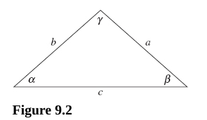
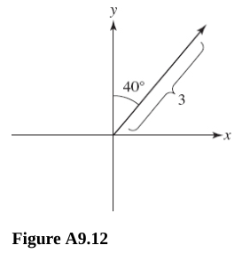
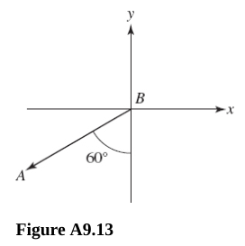
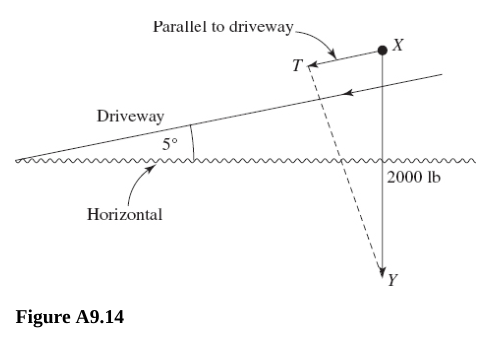
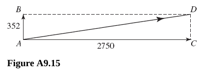
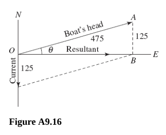
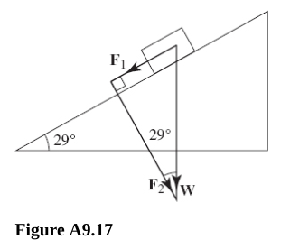

# Chapter 9 Trigonometric Equations and Inequalities

---

## Right Triangles

**For questions 367-369,** find the remaining parts of $\Delta ABC$, where
$\angle C = 90\degree$. Round all angles to the nearest minute and all lengths
to the nearest hundredth.

---

**367.** $b = 12 \text{, } c = 13$

**Answer:**

For side $a$:

$$ a^2 + b^2 = c^2 $$

$$ a^2 + 12^2 = 13^2 $$

$$ a^2 + 144 = 169 $$

$$ a^2 = 25 $$

$$ a = \sqrt{25} $$

$$ \boxed{a = 5} $$

For $\angle A$:

$$ \sin\angle A = \frac{5}{13} $$

$$ \arcsin\left(\frac{5}{13}\right) = \angle A $$

$$ \angle A \approx 22.61\degree $$

Converted to minutes and Hundredths, this is:

$$ 0.61 \cdot 60 = 36.6 $$

Rounded this is:

$$ \boxed{\angle A \approx 22\degree 37'} $$

For $\angle B$:

$$ \sin\angle B = \frac{12}{13} $$

$$ \arcsin\left(\frac{12}{13}\right) = \angle B $$

$$ \angle B \approx 67.38\degree $$

$$ 0.38 \cdot 60 = 22.8 $$

$$ \boxed{\angle B \approx 67.38\degree 23'} $$

---

**368.** $\angle B = 17\degree50' \text{, } c = 3.45$

**Answer:**

For side $b$:

$$ \arcsin\left(\frac{b}{3.45}\right) = \angle B $$

$$ \arcsin\left(\frac{b}{3.45}\right) = 17\degree50' $$

$$ \sin 17\degree50' = \frac{b}{3.45} $$

$$ \frac{50}{60} \approx 0.83 $$

$$ \sin17.83\degree = \frac{b}{3.45} $$

$$ \sin(0.31 \text{ radians}) = \frac{b}{3.45} $$

$$ b = 3.45(\sin(0.31 \text{ radians})) $$

$$ \boxed{b \approx 1.06} $$

For side $a$:

$$ a^2 + b^2 = c^2 $$

$$ a^2 + (1.06)^2 = (3.45)^2 $$

$$ a^2 + 1.12 = 11.90 $$

$$ a^2 = 10.78 $$

$$ \boxed{a \approx 3.28} $$

For $\angle A$:

$$ \angle A + \angle B + \angle C = 180\degree $$

$$ \angle A + 17\degree50' + 90\degree = 180\degree $$

$$ \angle A + 17.83\degree + 90\degree = 180\degree $$

$$ \angle A + 17.83\degree + 90\degree = 180\degree $$

$$ \angle A = 72.17\degree $$

$$ 0.17 \cdot 60 = 10.2 $$

$$ \boxed{\angle A \approx 72\degree10'} $$

---

**369.** $b = 10 \text{, } c = 12.6$

**Answer:**

Find side $a$:

$$ a^2 + b^2 = c^2 $$

$$ a^2 + 10^2 = 12.6^2 $$

$$ a^2 + 100 = 158.76 $$

$$ a^2 = 58.76 $$

$$ \boxed{a \approx 7.67} $$

Find $\angle A$:

$$ \sin \angle A = \frac{7.67}{12.6} $$

$$ \arcsin\left(\frac{7.67}{12.6}\right) = \angle A $$

$$ \angle A \approx 37.50\degree $$

$$ \boxed{\angle A \approx 37\degree 30'} $$

Find $\angle B$:

$$ \sin \angle B = \frac{10}{12.6} $$

$$ \arcsin\left(\frac{10}{12.6}\right) = \angle B $$

$$ \angle B \approx 52.53\degree $$

$$ \boxed{\angle B \approx 52\degree 32'} $$

---

**370.** Find the perimeter of a hexagon inscribed in a circle of radius $5
\text{ m}$ (assume a regular polygon).

Since it is a regular hexagon, we can create a non-right triangle by drawing two
vertices from one side of the hexagon to the center of the circle/hexagon, each
with a length of 5, since the two endpoints of the vertices intersect with the
circumference of the circle. We can then divide the non-right triangle into two
equal right triangles. The angles $\angle AOD$ and $\angle BOD$ both have
measurements of $30\degree$. This is because a regular hexagon will divide a
circle evenly and will create 6 $60\degree$ angles per side. Then when divided
by $2$ equal triangles, this will create two right triangles each with a
$30\degree$ angle from the center. The other angles can be ascertained as
$60\degree$ as:

$$ 180\degree - 30\degree = 60\degree $$

This gives us all three angles and one side of our triangle. We only need to
determine the length of either $\overline{AD}$ or $\overline{BD}$ and double it.

$$ \sin \angle AOD = \frac{\overline{AD}}{\overline{AO}} $$

$$ \sin 30\degree = \frac{\overline{AD}}{5} $$

$$ 0.5 = \frac{\overline{AD}}{5} $$

$$ \overline{AD} = 2.5 $$

And then we just double it to find the length of one side:

$$ \overline{AB} = 5 $$

And then the perimeter is easily calculated for our hexagon:

$$ 5 \cdot 6 = \boxed{30 \text{m}} $$

---

**371.** If a train climbs at a constant angle of $1\degree23'$, how many
vertical feet has it climbed after going $1 \text{ mi}$?

**Answer:**

$$ \tan 1\degree23' = \frac{\overline{AB}}{5280 \text{ ft}} $$

$$ \boxed{\overline{AB} \approx 127.5 \text{ ft}} $$

---

**372.** Find the diameter of the moon (to the nearest mile) if at 239,000 mi
from earth it subtends an angle of $32'$ relative to an observer on the earth.

**Answer:**

$$ \tan 16' = \frac{r}{239000} $$

$$ r \approx 1112.36 \text{ mi} $$

$$ d = 2r $$

$$ \boxed{d \approx 2225 \text{ mi}} $$

---

**373.** An object $4 \text{ ft}$ tall casts a $3 \text{ ft}$ shadow when the
angle of elevation of the sun is $\theta$. Find $\theta$ to the nearest degree.

**Answer:**

$$ \tan \theta = \frac{4}{3} $$

$$ arctan\left(\frac{4}{3}\right) = \theta $$

$$ \theta \approx 53.13\degree $$

---

**374.** If $\angle A$ is an acute angle:

(A) Why is $\sin \angle A < 1$?

**Answer:**

An acute angle is any angle which lies between $0$ and $90$ degrees:

$$ 0\degree < \theta < 90\degree $$

This means that the side $a$ is always less than the hypotenuse, side $c$. And
the sine function always being the opposite over the hypotenuse will always
return a fraction that is less than $1$.

If $a < c$, then $\sin \angle A = \frac{a}{c} < 1$

(B) When is $\sin \angle A = \cos \angle A$?

**Answer:**

This occurs when you have an isosceles triangle (90/45/45), as both sides $a$
and it's adjacent side, $b$ are equal.

Thusly if $\angle A$ is an acute angle, then this only occurs when $\angle A =
45\degree$.

\(C\) Why is $\sin \angle A < \csc \angle A$?

**Answer:**

Cosecant is the Reciprocal Function of Sine, since we established in part A of
this question that $\sin \angle A < 1$, it therefore makes sense that $\csc
\angle A > 1$, and therefore Cosecant of $\angle A$ will always be greater than
Sine of $\angle A$.

(D) Why is $\sin \angle A < \tan \angle A$?

**Answer:**

Tangent of $\angle A$ is the length of side $a$ divided by the length of side
$b$:

$$ \tan \angle A = \frac{a}{b} $$

And the Sine of $\angle A$ is the length of side $a$ divided by the length of
the hypotenuse, side $c$:

$$ \sin \angle A = \frac{a}{c} $$

Since in a right triangle, the lengths both sides $a$ and $b$ are always less
than the length of side $c$:

$$ a < c $$

$$ b < c $$

It makes sense that since Sine is always divided by the greater length
hypotenuse, and Tangent is always divided by the lesser length $b$, and the
numerator of both is always side $a$, that sine is always divided by the greater
number than tangent and therefore is always less than tangent:

$$ \frac{a}{c} < \frac{a}{b} $$

(E) When is $\sin \angle A < \cos \angle A$?

**Answer:**

Between $0\degree$ and $45\degree$, but not including either:.

$$ 0\degree < \angle A < 45\degree $$

(F) When is $\tan \angle A > 1$?

**Answer:**

Between $45\degree$ and $90\degree$, but not including either:

$$ 45\degree < \angle A < 90\degree $$

---

**375.** Find the values of the trigonometric functions of $45\degree$.

**Answer:**

$$ \sin 45\degree = \frac{\sqrt{2}}{2} $$

$$ \cos 45\degree = \frac{\sqrt{2}}{2} $$

$$ \tan 45\degree = 1 $$

$$ \csc 45\degree = \sqrt{2} $$

$$ \sec 45\degree = \sqrt{2} $$

$$ \cot 45\degree = 1 $$

---

**376.** Find the values of the trigonometric functions of $30\degree$ and
$60\degree$.

**Answer:**

$$ \sin 30\degree = \frac{1}{2} $$

$$ \cos 30\degree = \frac{\sqrt{3}}{2} $$

$$ \tan 30\degree = \frac{\sqrt{3}}{3} $$

$$ \csc 30\degree = 2 $$

$$ \sec 30\degree = \frac{2}{\sqrt{3}} = \frac{2\sqrt{3}}{3} $$

$$ \cot 30\degree =  \frac{3}{\sqrt{3}} = \frac{3\sqrt{3}}{3} = \sqrt{3} $$

$$ \sin 60\degree = \frac{\sqrt{3}}{2} $$

$$ \cos 60\degree =  \frac{1}{2} $$

$$ \tan 60\degree = \sqrt{3} $$

$$ \csc 60\degree = \frac{2\sqrt{3}}{3} $$

$$ \sec 60\degree = 2 $$

$$ \cot 60\degree = \frac{\sqrt{3}}{3} $$

---

**377.** When the sun is $20\degree$ above the horizon, how long is the shadow
cast by a building $150 \text{ ft}$ high?

**Answer:**

$$ \tan 20\degree = \frac{150}{x} $$

$$ \cot 20\degree = \frac{x}{150} $$

$$ x = 150\cot 20\degree $$

$$ \boxed{x \approx 412 \text{ ft}} $$

---

**378.** A tree $100 \text{ ft}$ tall casts a shadow $120 \text{ ft}$ long. Find
the angle of elevation of the sun.

**Answer:**

Let $\theta$ be the angle of elevation of the sun.

$$ \tan\theta = \frac{100}{120} $$

$$ \theta = \arctan\left(\frac{100}{120}\right) $$

$$ \theta \approx 39.81\degree $$

$$ \boxed{\theta \approx 39\degree49'} $$

---

**379.** Find the length of the chord of a circle of radius $20 \text{ m}$
subtended by a central angle of $150\degree$.

**Answer:**

Let $2x$ be the length of the chord.

$$ \frac{150\degree}{2} = 75\degree $$

$$ \sin 75\degree = \frac{x}{20} $$

$$ x = 20\sin 75\degree $$

$$ x \approx 19.3 $$

$$ \boxed{2x \approx 38.6 \text{ m}} $$

---

**380.** Find the height of a tree if the angle of elevation of its top changes
from $20\degree$ to $40\degree$ as the observer advances $75 \text{ ft}$ toward
its base. See Figure 9.1.

**Answer:**

Let $h = \overline{BC}$ and let $x = \overline{DC}$

$$ \tan 20\degree = \frac{h}{x + 75} $$

$$ \tan 40\degree = \frac{h}{x} $$

Solve for $h$ with both:

$$ \tan 20\degree = \frac{h}{x + 75} $$

$$ (x + 75)\tan 20\degree = h $$

$$ \tan 40\degree = \frac{h}{x} $$

$$ x\tan 40\degree = h $$

Set them equal to each other and solve for $x$:

$$ (x + 75)\tan 20\degree = x\tan 40\degree $$

$$ x\tan 20 \degree + 75\tan 20\degree = x\tan 40\degree $$

$$ 75\tan 20\degree = x\tan 40\degree - x\tan 20\degree $$

$$ 75\tan 20\degree = x(\tan 40\degree - \tan 20\degree) $$

$$ x = \frac{75\tan 20\degree}{\tan 40\degree - \tan 20\degree} $$

$$ x \approx 57.45 $$

Now plug into one of the formulas and solve for $h$:

$$ \tan 40\degree = \frac{h}{x} $$

$$ h = x\tan 40\degree $$

$$ h \approx 48.2 \text{ ft} $$

---

## Law of Sines

---

**For questions 381-384,** find the measure of the indicated angle or the length
of the indicated side. Refer to Figure 9.2, and use a calculator.

**381.**
$\beta = 12\degree40' \text{, } \gamma = 100\degree \text{, } b = 13.1\text{; find } a$

**Answer:**

We can first use the Interior Angle Sum To find the last remaining angle,
$\alpha$.

$$ 180\degree - 100\degree - 12\degree 41' = \alpha $$

$$ \alpha \approx 67\degree 19' $$

Now we can use the Law of Sines to find side $a$:

$$ \frac{\sin\alpha}{a} = \frac{\sin\beta}{b} $$

$$ \frac{\sin(67\degree 19')}{a} = \frac{\sin(12\degree 40')}{13.1} $$

$$ \sin(67\degree 19') = a\left(\frac{\sin(12\degree 40')}{13.1}\right) $$

$$ a = \frac{\sin(67\degree 19')}{\dfrac{\sin(12\degree 40')}{13.1}} $$

$$ a = \sin(67\degree 19')\left(\frac{13.1}{\sin(12\degree 40')}\right) $$

And now use the calculator to get an approximation of our answer:

$$ \boxed{a \approx 55.1} $$

---

**382.**
$\beta = 27\degree 30' \text{, } \gamma = 54\degree 30' \text{, } a = 9.27\text{; find }b \text{ and }c$

**Answer:**

First let's use the Interior Angle Sum to find $\alpha$:

$$ 180\degree - 54\degree 30' - 27\degree 30' = \alpha $$

$$ \alpha = 98\degree $$

Now we can use the Law of Sines to solve for side $b$:

$$ \frac{\sin\alpha}{a} = \frac{\sin \beta}{b} $$

$$ \frac{\sin(98\degree)}{9.27} = \frac{\sin(27\degree 30')}{b} $$

$$ b\left(\frac{\sin(98\degree)}{9.27}\right) = \sin(27\degree 30') $$

$$ b = \frac{\sin(27\degree 30')}{\dfrac{\sin(98\degree)}{9.27}} $$

$$ b = \sin(27\degree 30')\left(\frac{9.27}{\sin(98\degree)}\right) $$

Now we can use our calculator to approximate the length of side $b$:

$$ \boxed{b \approx 4.32} $$

We can now apply the Law of Sines again to solve for side $c$:

$$ \frac{\sin\alpha}{a} = \frac{\sin \gamma}{c} $$

$$ \frac{\sin(98\degree)}{9.27} = \frac{\sin(54\degree 30')}{c} $$

$$ c\left(\frac{\sin(98\degree)}{9.27}\right) = \sin(54\degree 30') $$

$$ c = \frac{\sin(54\degree 30')}{\dfrac{\sin(98\degree)}{9.27}} $$

$$ c = \sin(54\degree 30')\left(\frac{9.27}{\sin(98\degree)}\right) $$

$$ \boxed{c \approx 7.62} $$

---

**383.**

$a = 50 \text{, } c = 40 \text{, } \gamma = 30\degree \text{; find } b \text{ if } \alpha < 90\degree$

**Answer:**

We'll first have to find $\alpha$ using the Law of Sines:

$$ \frac{\sin\alpha}{a} = \frac{\sin\gamma}{c} $$

$$ \frac{\sin\alpha}{50} = \frac{\sin(30\degree)}{40} $$

$$ \sin\alpha = 50\left(\frac{\sin(30\degree)}{40}\right) $$

$$ \alpha = \sin^{-1}\left(\frac{50\sin(30\degree)}{40}\right) $$

$$ \alpha \approx 39\degree $$

Normally we would find out if $\alpha$ could also be $180\degree - 39\degree$,
but becase the problem statement specifies that $\alpha < 90\degree$, we will
ignore this step.

We can now approxiate side $b$ using an approximation for angle $\beta$ by using
the Interior Angle Sum Formula:

$$ \beta \approx 180\degree - 30\degree - 39\degree $$

$$ \beta \approx 111\degree $$

And now we can use the Law of Sines again to approximate the length of side $b$:

$$ \frac{\sin\gamma}{c} = \frac{\sin\beta}{b} $$

$$  \frac{\sin(30\degree)}{40} \approx \frac{\sin(111\degree)}{b} $$

$$ \sin(30\degree) \approx \frac{40\sin(111\degree)}{b} $$

$$ b\sin(30\degree) \approx 40\sin(111\degree) $$

$$ b \approx \frac{40\sin(111\degree)}{\sin(30\degree)} $$

We can now use our calculator to approximate the length of side $b$:

$$ \boxed{b \approx 75} $$

---

**384.**
$a = 14 \text{, } b = 23 \text{, } \alpha = 41\degree \text{; find } \beta$

We can use the Law of Sines, but I suspect we will get two values for $\beta$:

$$  \frac{\sin\alpha}{a} = \frac{\sin\beta}{b} $$

$$ \frac{\sin(41\degree)}{14} = \frac{\sin\beta}{23} $$

$$ \sin\beta = \frac{23\sin(41\degree)}{14} $$

$$ \beta = \sin^{-1}\left(\frac{23\sin(41\degree)}{14}\right) $$

And now we can use our calculator to approximate the angle $\beta$:

This yields a complex number and therefore $\beta = \text{ undefined}$ and there
is no solution. The reason why is because $\dfrac{23\sin(41\degree)}{14}$ yields
approximately $1.078$, but because Sine cannot ever exceed $1$, this falls
outside the Domain of Sine and outside the Range of ArcSine.

$$ \boxed{\emptyset} $$

---

## Law of Cosines

---

**For questions 385-387,** find the indicated piece of information concerning
the triangle in Figure 9.2. Use a calculator.

---

**385.**
$\alpha = 50\degree 40' \text{, } b = 7.03 \text{, } c = 7.00 \text{; find } a \text{ and } \beta$

**Answer:**

We can use the Law of Cosines to determine $a$:

$$ a^2 = b^2 + c^2 - 2bc\cos\alpha $$

$$ a^2 = (7.03)^2 + (7.00)^2 - 2(7.03)(7.00)\cos(50\degree 40') $$

$$ a = \sqrt{(7.03)^2 + (7.00)^2 - 2(7.03)(7.00)\cos(50\degree 40')} $$

We can use our calculator here to approximate the length of side $a$:

$$ \boxed{a \approx 6.00} $$

We can then use the Law of Cosines (or the Law of Sines) to find the angle
$\beta$:

$$ \beta = \cos^{-1}\left(\frac{a^2 + c^2 - b^2}{2ac}\right) $$

$$ \beta \approx \cos^{-1}\left(\frac{(6.00)^2 + (7.00)^2 - (7.03)^2}{2(6.00)(7.00)}\right) $$

We can use our calculator here to approximate the angle $\beta$:

$$ \boxed{\beta \approx 64\degree 54'} $$

---

**386.**
$\gamma = 120\degree 20' \text{, } a = 5.73 \text{, } b = 10.2 \text{; find } c \text{ and } \beta$

**Answer:**

We can use the Law of Cosines to determine $c$:

$$ c^2 = a^2 + b^2 - 2ab\cos\gamma $$

$$ c^2 = (5.73)^2 + (10.2)^2 - 2(5.73)(10.2)\cos(120\degree 20') $$

$$ c = \sqrt{(5.73)^2 + (10.2)^2 - 2(5.73)(10.2)\cos(120\degree 20')} $$

Then use our calculator to approximate the length of $c$:

$$ \boxed{c \approx 14.0} $$

We can then use the Law of Cosines again to determine the angle of $\beta$:

$$ \beta = \cos^{-1}\left(\frac{a^2 + c^2 - b^2}{2ac}\right) $$

$$ \beta \approx \cos^{-1}\left(\frac{(5.73)^2 + (14.0)^2 - (10.2)^2}{2(5.73)(14.0)}\right) $$

And we can use our calculator to approximate the angle of $\beta$:

$$ \boxed{\beta \approx 38\degree 56'} $$

---

**387.**
$a = 4.00 \text{, } b = 10.0 \text{, } c = 9.00 \text{; find } \alpha \text{ and } \gamma$

**Answer:**

We have all three sides but no angles, we'll use the Law of Cosines for $\alpha$
first:

$$ \alpha = \cos^{-1}\left(\frac{b^2 + c^2 - a^2}{2bc}\right) $$

$$ \alpha = \cos^{-1}\left(\frac{(10.0)^2 + (9.00)^2 - (4.00)^2}{2(10.0)(9.00)}\right) $$

And now use our calculator to approximate angle $\alpha$:

$$ \boxed{\alpha \approx 23\degree 34'} $$

And we can use the Law of Cosines to also solve for $\gamma$:

$$ \gamma = \cos^{-1}\left(\frac{a^2 + b^2 - c^2}{2ab}\right) $$

$$ \gamma = \cos^{-1}\left(\frac{(4.00)^2 + (10.0)^2 - (9.00)^2}{2(4.00)(10.0)}\right) $$

And use our calculator to approximate angle $\gamma$:

$$ \boxed{\gamma \approx 64\degree 4'} $$

---

## Vectors

---

**For questions 388-389,** the magnitude and direction of a vector are given.
Represent them geometrically.

---

**388.** $3 \text{, N} 40\degree \text{E}$

**Answer:**

Taken directly from the back as we didn't cover Vectors in Professor Leonard's
Lecture seris:

The "length" of the vector is $3$ (magnitude), and we move $40\degree$ in the
easterly direction from north ($y$ axis).

---

**389.** $5 \text{, S} 60\degree \text{W}$

**Answer:**

This is relatively intuitive we can treat a standard Cartesian Plan Graph as a
NWSE "map", and from the first letter, we can determine which direction we are
oriented along the $y$ axis, and then from the second letter, we can determine
which direction we are oriented along the $x$ axis.

---

**For questions 390 and 391,** find the magnitude of the given vector.

---

**390.** $(4, 5)$

**Answer:**

This creates a standard right triangle in Quadrant I on a standard Cartesian
Graph. Thusly we can use the Pythagorean Theorem to determine the magnitude,
which is just the hypotenuse:

$$ a^2 + b^2 = c^2 $$

$$ (4)^2 + (5)^2 = c^2 $$

$$ 16 + 25 = c^2 $$

$$ 41 = c^2 $$

$$ c = \sqrt{41} $$

$$ \boxed{c \approx 6.40} $$

---

**391.** $(6, -14)$

**Answer:**

Same deal as 390, we just use the pythagorean theorem, don't worry about the
negative as we're just trying to determine the length/magnitude of the vector,
we don't have to worry about which quadrant it takes place in.

$$ (6)^2 + (14)^2 = c^2 $$

$$ 36 + 196 = c^2 $$

$$ c^2 = 232 $$

$$ c = \sqrt{232} $$

$$ c = 2\sqrt{58} $$

$$ \boxed{c \approx 15.23} $$

---

**For questions 392 and 393,** determine the direction of the given vector.

**392.** $(4, -3)$

**Answer:**

This is asking us the angle at which the vector is heading. This solution
requires the use of a trigonometric function, specifically Tangent:

$$ \tan\theta = \frac{y}{x} $$

$$ \tan\theta = -\frac{3}{4} $$

$$ \theta = \tan^{-1}\left(-\frac{3}{4}\right) $$

And our calculator gives an approximation for the angle $\theta$:

$$ \theta \approx -36.87\degree$$

Because our point is in Quadrant IV, our reference is from $360\degree$, so
thusly we add our angle to $360\degree$ to get our final answer:

Which we measure as $360\degree - 36.87\degree$:

$$ \theta \approx 360\degree - 36.87\degree $$

$$ \theta \approx 323.13\degree $$

And converted to minutes:

$$ \boxed{\theta \approx 323\degree 8'} $$

---

**393.** $v = (-2, -1)$

**Answer:**

Same idea as 392:

$$ \tan\theta = \frac{y}{x} $$

$$ \tan\theta = \frac{1}{2} $$

$$ \theta = \tan^{-1}\left(\frac{1}{2}\right) $$

$$ \theta \approx 26.57\degree $$

$$ \theta \approx 26\degree 34' $$

Because $(-2, -1)$ lies in Quadrant III, this is the reference from $180\degree$
into Quadrant III, thusly we add $180\degree$ to get our actual answer:

$$ \theta = 180\degree + 26\degree 34' $$

$$ \theta = 206\degree 34' $$

---

**394.** Let $a = (1, 0) \text{, } b = (3, 0) \text{, } c = (4, 6) \text{, } d =
(4, 9) \text{, } e = (1, 6)$. Find each of the following.

(A) $2a$

**Answer:**

Simply multiply each of the coordinates of $a$ by $2$:

$$ 2a = (2, 0) $$

(B) $\dfrac{2}{3}b$

**Answer:**

Same idea as 394A:

$$ \frac{2}{3}b = \left(2, 0\right) $$

\(C\) $a + c$

**Answer:**

Simply add the $x$ coordinates together and the $y$ coordinates together.

$$ a + c = (1, 0) + (4, 6) = (5, 6) $$

(D) $a - d$

**Answer:**

Simply subtract the $x$ coordinates together and the $y$ coordinates together.

$$ a - d = (1, 0) - (4, 9) = (-3, -9) $$

(E) $a \cdot c$

**Answer:**

This one's slightly different, we multiply the $x$ coordinates together and the
$y$ coordinates together, and then add the results.

$$ a \cdot c = (1, 0) \cdot (4, 6) = (1 \cdot 4) + (0 \cdot 6) = 4 + 0 = 4 $$

---

**395.** Rewrite the given vector in terms of $i$ and $j$. $(4, 7)$

**Answer:**

Writing vectors in terms of $i$ and $j$ is simply the addition of the $x$
coordinate "multiplied" with the variable $i$ and then added to the $y$
coordinate "multiplied" with the variable $j$. Keep in mind that this is a form
of notation and does not imply an actual multiplication.

$$ 4i + 7j $$

Note that this form of notation becomes useful in physics calculations and 3D
representations.

---

**396.** Find the unit vector in the direction of the given vector. $(6, 4)$.

**Answer:**

Because we have never covered vectors before, let's go over a brief overview of
determinint unit vectors here before arriving at our answer to this problem
statement:

Unit vector notation can be denoted like so:

$$ \hat{v} = \frac{\vec{v}}{\|\vec{v}\|}$$

Where:

- $\vec{v}$ is the vector

- $\|\vec{v}\|$ is the **magnitude(length)** of the vector

- $\hat{v}$ (read as "v-hat") denotes the **unit vector**

Note that $\|\vec{v}\\$ represents not the absolute value, but rather the length
of the vector, and thusly is determined by the pythagorean theorem in the
context of vectors:

$$ a^2 + b^2 = c^2 $$

Thusly if we had a vector with a point of $(3, 4)$, we could denote the vector
itself as so:

$$ \vec{v} = \langle 3, 4 \rangle $$

And the magnitude/length of such a vector could be denoted and calculated like
so:

$$ \|\vec{v}\| = \sqrt{3^2 + 4^2} = \sqrt{9 + 16} = \sqrt{25} = 5 $$

We could then denote the unit vector like so:

$$ \hat{v} = \frac{\vec{v}}{\|\vec{v}\|} $$

$$ \hat{v} = \frac{\langle 3, 4 \rangle}{\sqrt{3^2 + 4^2}} $$

$$ \hat{v} = \frac{\langle 3, 4 \rangle}{5} $$

$$ \hat{v} = \langle \frac{3}{5}, \frac{4}{5} \rangle $$

We are in very basic terms, relating our point (vector) to a unit of $1$ (think
of the unit circle).

Now that we know this, we can find the unit vector of our original problem
statement:

$$ (6, 4) $$

Which we can rewrite in proper form for a vector:

$$ \vec{v} = \langle 6, 4 \rangle $$

Then we can take the unit vector formula:

$$ \hat{v} = \frac{\vec{v}}{\|\vec{v}\|} $$

And calculate our unit vector:

$$ \hat{v} = \frac{\langle 6, 4 \rangle}{\sqrt{6^2 + 4^2}} $$

$$ \hat{v} = \frac{\langle 6, 4 \rangle}{\sqrt{36 + 16}} $$

$$ \hat{v} = \frac{\langle 6, 4 \rangle}{\sqrt{52}} $$

$$ \hat{v} = \frac{\langle 6, 4 \rangle}{2\sqrt{13}} $$

$$ \hat{v} = \langle \frac{6}{2\sqrt{13}}, \frac{4}{2\sqrt{13}} \rangle $$

---

**397.** Find the angle between the vectors $(1, 0)$ and $(\sqrt{2}, \sqrt{2})$.

**Answer:**

Again, we have not covered vectors at all, so here is a brief overview on
finding the angle between two vectors:

The formula for finding the angle between two vectors involes the use of the
**dot product formula** which reads as follows:

$$ \vec{u} \cdot \vec{v} = \|\vec{u}\|\|\vec{v}\|\cos\theta $$

Which if we solve for the angle we get:

$$ \cos\theta = \frac{\vec{u} \cdot \vec{v}}{\|\vec{u}\|\|\vec{v}\|} $$

$$ \theta = \cos^{-1}\left(\frac{\vec{u} \cdot \vec{v}}{\|\vec{u}\|\|\vec{v}\|}\right) $$

You can read more about finding the angle between two vectors over at
[CueMath](https://www.cuemath.com/geometry/angle-between-vectors/).

We can use this formula to find the angle between our two vectors in our initial
problem statement:

$$ \vec{u} = \langle 1, 0 \rangle $$

$$ \vec{v} = \langle \sqrt{2}, \sqrt{2} \rangle $$

$$ \theta = \cos^{-1}\left(\frac{\langle 1, 0 \rangle \cdot \langle \sqrt{2}, \sqrt{2}\rangle}{\sqrt{1^2 + 0^2}\sqrt{(\sqrt{2})^2 + (\sqrt{2})^2}}\right) $$

$$ \theta = \cos^{-1}\left(\frac{(1 \cdot \sqrt{2}) + (0 \cdot \sqrt{2})}{\sqrt{1}\sqrt{4}}\right) $$

$$ \theta = \cos^{-1}\left(\frac{\sqrt{2}}{2}\right) $$

$$ \theta = 45\degree $$

Also expressed in radians as:

$$ \theta = \frac{\pi}{4} $$

---

**398.** An automobile weighing $2000 \text{ lb}$ is standing on a smooth
driveway that is inclined $5.0\degree$ with the horizontal. Find the force
parallel to the driveway necessary to keep the car from rolling down the hill.
Neglect all friction.

**Answer:**

Taken directly from the back of the book:

See Figure A9.14:

We need the compononent of ray $XY$ parallel to the driveway; i.e., we need
$\|TX\|$. Since $\dfrac{\|TX\|}{2000} = \sin 5\degree$,
$\|TX\| = 2000\sin 5\degree = 174.5 \text{ lb}$.

---

**399.** An airplane is moving horizontally at $240 \text{ mi/h}$ when a bullet
is shot from the plane with speed $2750 \text{ ft/s}$ at right angles to the
path of the airplane. Find the resultant speed and direction of the bullet.

**Answer:**

Taken directly from the back of the book:

The speed of the airplane is
$240 \text{ mi/h} = \dfrac{240(5280)}{(60)(60)} \text{ ft/s} = 352 \text{
    ft/s}$. In Figure A9.15, vector, $AB$ represents the velocity of the
airplane, vector $AC$ represents the initial velocity of the bullet, and vector
$AD$ represents the resultant velocity of the bullet. In right triangle $ACD$,
$AD\sqrt{(352)^2 - (2750)^2} = 2700 \text{ ft/s}$,
$\tan\angle CAD = \dfrac{352}{2750} = 0.1280$, and $\angle CAD = 7\degree 20'$.
Thus, the bullet travels at $2770 \text{ ft/s}$ along a path making an angle of
$82\degree 40'$ with the path of the airplane.

---

**400.** A river flows due south at $125 \text{ ft/min}$. A motorboat, moving at
$475 \text{ ft/min}$ in still water, is headed due east across the river. (A)
Find the direction in which the boat moves and its speed. (B) In what direction
must the boat be headed in order for it to move due east, and what is its speed
in that direction?

**Answer:**

Taken directly from the back of the book.

**(A)** Refer to Figure 9.3 in the question section (no such figure...). In
right triangle $OAB$, $OB = \sqrt{(475)^2 + (125)^2} = 491$,
$\tan \theta = \dfrac{125}{475} = 0.2632$, and $\theta = 14\degree 40'$. Thus
the boat moves at $491 \text{ ft/min}$ in the direction
$\text{S}74\degree 20'\text{E}$.

**(B)** Refer to Figure A9.16. In right triangle $OAB$, $\sin\theta =
\dfrac{125}{475} = 0.2632$ and $\theta = 15\degree 20'$. Thus the boat must be
headed $\text{N}74\degree 40'\text{E}$, and its speed in that direction is
$OB = \sqrt{(475)^2 - (125)^2} = 458 \text{ ft/min}$.

---

**401.** A block weighing $W = 500 \text{ lb}$ rests upon a ramp inclined
$29\degree$ with the horizontal. Find the force tending to move the block down
the ramp and the force of the block on the ramp.

**Answer:**

Taken directly from the back of the book.

Refer to Figure A9.17. Resolve the weight $\mathbf{W}$ of the block into
components $\mathbf{F_1}$ and $\mathbf{F_2}$, respectively, parallel and
perpendicular to the ramp. $\mathbf{F_1}$ is the force tending to move the block
down the ramp, and $\mathbf{F_2}$ is the force of the block on the ramp.

$$ \mathbf{F_1} = \mathbf{W}\sin 29\degree = 500(0.4848) = 242 \text{ lb} $$

$$ \mathbf{F_2} = \mathbf{W}\cos 29\degree = 500(0.8746) = 437 \text{ lb} $$

