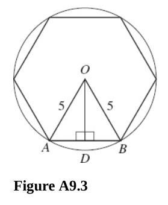
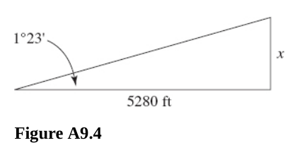
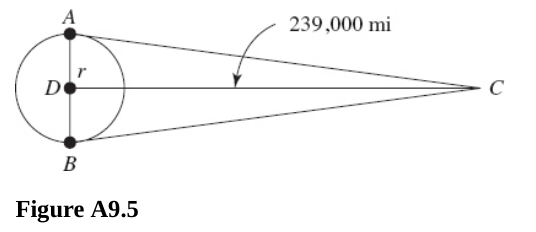
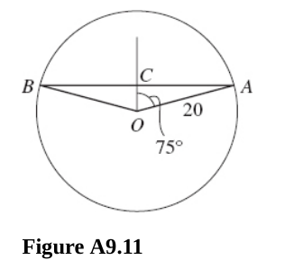
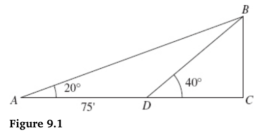

# Chapter 9 Trigonometric Equations and Inequalities

---

## Right Triangles

**For questions 367-369,** find the remaining parts of $\Delta ABC$, where
$\angle C = 90\degree$. Round all angles to the nearest minute and all lengths
to the nearest hundredth.

---

**367.** $b = 12 \text{, } c = 13$

**Answer:**

For side $a$:

$$ a^2 + b^2 = c^2 $$

$$ a^2 + 12^2 = 13^2 $$

$$ a^2 + 144 = 169 $$

$$ a^2 = 25 $$

$$ a = \sqrt{25} $$

$$ \boxed{a = 5} $$

For $\angle A$:

$$ \sin\angle A = \frac{5}{13} $$

$$ \arcsin\left(\frac{5}{13}\right) = \angle A $$

$$ \angle A \approx 22.61\degree $$

Converted to minutes and Hundredths, this is:

$$ 0.61 \cdot 60 = 36.6 $$

Rounded this is:

$$ \boxed{\angle A \approx 22\degree 37'} $$

For $\angle B$:

$$ \sin\angle B = \frac{12}{13} $$

$$ \arcsin\left(\frac{12}{13}\right) = \angle B $$

$$ \angle B \approx 67.38\degree $$

$$ 0.38 \cdot 60 = 22.8 $$

$$ \boxed{\angle B \approx 67.38\degree 23'} $$

---

**368.** $\angle B = 17\degree50' \text{, } c = 3.45$

**Answer:**

For side $b$:

$$ \arcsin\left(\frac{b}{3.45}\right) = \angle B $$

$$ \arcsin\left(\frac{b}{3.45}\right) = 17\degree50' $$

$$ \sin 17\degree50' = \frac{b}{3.45} $$

$$ \frac{50}{60} \approx 0.83 $$

$$ \sin17.83\degree = \frac{b}{3.45} $$

$$ \sin(0.31 \text{ radians}) = \frac{b}{3.45} $$

$$ b = 3.45(\sin(0.31 \text{ radians})) $$

$$ \boxed{b \approx 1.06} $$

For side $a$:

$$ a^2 + b^2 = c^2 $$

$$ a^2 + (1.06)^2 = (3.45)^2 $$

$$ a^2 + 1.12 = 11.90 $$

$$ a^2 = 10.78 $$

$$ \boxed{a \approx 3.28} $$

For $\angle A$:

$$ \angle A + \angle B + \angle C = 180\degree $$

$$ \angle A + 17\degree50' + 90\degree = 180\degree $$

$$ \angle A + 17.83\degree + 90\degree = 180\degree $$

$$ \angle A + 17.83\degree + 90\degree = 180\degree $$

$$ \angle A = 72.17\degree $$

$$ 0.17 \cdot 60 = 10.2 $$

$$ \boxed{\angle A \approx 72\degree10'} $$

---

**369.** $b = 10 \text{, } c = 12.6$

**Answer:**

Find side $a$:

$$ a^2 + b^2 = c^2 $$

$$ a^2 + 10^2 = 12.6^2 $$

$$ a^2 + 100 = 158.76 $$

$$ a^2 = 58.76 $$

$$ \boxed{a \approx 7.67} $$

Find $\angle A$:

$$ \sin \angle A = \frac{7.67}{12.6} $$

$$ \arcsin\left(\frac{7.67}{12.6}\right) = \angle A $$

$$ \angle A \approx 37.50\degree $$

$$ \boxed{\angle A \approx 37\degree 30'} $$

Find $\angle B$:

$$ \sin \angle B = \frac{10}{12.6} $$

$$ \arcsin\left(\frac{10}{12.6}\right) = \angle B $$

$$ \angle B \approx 52.53\degree $$

$$ \boxed{\angle B \approx 52\degree 32'} $$

---

**370.** Find the perimeter of a hexagon inscribed in a circle of radius $5
\text{ m}$ (assume a regular polygon).

Since it is a regular hexagon, we can create a non-right triangle by drawing two
vertices from one side of the hexagon to the center of the circle/hexagon, each
with a length of 5, since the two endpoints of the vertices intersect with the
circumference of the circle. We can then divide the non-right triangle into two
equal right triangles. The angles $\angle AOD$ and $\angle BOD$ both have
measurements of $30\degree$. This is because a regular hexagon will divide a
circle evenly and will create 6 $60\degree$ angles per side. Then when divided
by $2$ equal triangles, this will create two right triangles each with a
$30\degree$ angle from the center. The other angles can be ascertained as
$60\degree$ as:

$$ 180\degree - 30\degree = 60\degree $$

This gives us all three angles and one side of our triangle. We only need to
determine the length of either $\overline{AD}$ or $\overline{BD}$ and double it.

$$ \sin \angle AOD = \frac{\overline{AD}}{\overline{AO}} $$

$$ \sin 30\degree = \frac{\overline{AD}}{5} $$

$$ 0.5 = \frac{\overline{AD}}{5} $$

$$ \overline{AD} = 2.5 $$

And then we just double it to find the length of one side:

$$ \overline{AB} = 5 $$

And then the perimeter is easily calculated for our hexagon:

$$ 5 \cdot 6 = \boxed{30 \text{m}} $$

---

**371.** If a train climbs at a constant angle of $1\degree23'$, how many
vertical feet has it climbed after going $1 \text{ mi}$?

**Answer:**

$$ \tan 1\degree23' = \frac{\overline{AB}}{5280 \text{ ft}} $$

$$ \boxed{\overline{AB} \approx 127.5 \text{ ft}} $$

---

**372.** Find the diameter of the moon (to the nearest mile) if at 239,000 mi
from earth it subtends an angle of $32'$ relative to an observer on the earth.

**Answer:**

$$ \tan 16' = \frac{r}{239000} $$

$$ r \approx 1112.36 \text{ mi} $$

$$ d = 2r $$

$$ \boxed{d \approx 2225 \text{ mi}} $$

---

**373.** An object $4 \text{ ft}$ tall casts a $3 \text{ ft}$ shadow when the
angle of elevation of the sun is $\theta$. Find $\theta$ to the nearest degree.

**Answer:**

$$ \tan \theta = \frac{4}{3} $$

$$ arctan\left(\frac{4}{3}\right) = \theta $$

$$ \theta \approx 53.13\degree $$

---

**374.** If $\angle A$ is an acute angle:

(A) Why is $\sin \angle A < 1$?

**Answer:**

An acute angle is any angle which lies between $0$ and $90$ degrees:

$$ 0\degree < \theta < 90\degree $$

This means that the side $a$ is always less than the hypotenuse, side $c$. And
the sine function always being the opposite over the hypotenuse will always
return a fraction that is less than $1$.

If $a < c$, then $\sin \angle A = \frac{a}{c} < 1$

(B) When is $\sin \angle A = \cos \angle A$?

**Answer:**

This occurs when you have an isosceles triangle (90/45/45), as both sides $a$
and it's adjacent side, $b$ are equal.

Thusly if $\angle A$ is an acute angle, then this only occurs when $\angle A =
45\degree$.

\(C\) Why is $\sin \angle A < \csc \angle A$?

**Answer:**

Cosecant is the Reciprocal Function of Sine, since we established in part A of
this question that $\sin \angle A < 1$, it therefore makes sense that $\csc
\angle A > 1$, and therefore Cosecant of $\angle A$ will always be greater than
Sine of $\angle A$.

(D) Why is $\sin \angle A < \tan \angle A$?

**Answer:**

Tangent of $\angle A$ is the length of side $a$ divided by the length of side
$b$:

$$ \tan \angle A = \frac{a}{b} $$

And the Sine of $\angle A$ is the length of side $a$ divided by the length of
the hypotenuse, side $c$:

$$ \sin \angle A = \frac{a}{c} $$

Since in a right triangle, the lengths both sides $a$ and $b$ are always less
than the length of side $c$:

$$ a < c $$

$$ b < c $$

It makes sense that since Sine is always divided by the greater length
hypotenuse, and Tangent is always divided by the lesser length $b$, and the
numerator of both is always side $a$, that sine is always divided by the greater
number than tangent and therefore is always less than tangent:

$$ \frac{a}{c} < \frac{a}{b} $$

(E) When is $\sin \angle A < \cos \angle A$?

**Answer:**

Between $0\degree$ and $45\degree$, but not including either:.

$$ 0\degree < \angle A < 45\degree $$

(F) When is $\tan \angle A > 1$?

**Answer:**

Between $45\degree$ and $90\degree$, but not including either:

$$ 45\degree < \angle A < 90\degree $$

---

**375.** Find the values of the trigonometric functions of $45\degree$.

**Answer:**

$$ \sin 45\degree = \frac{\sqrt{2}}{2} $$

$$ \cos 45\degree = \frac{\sqrt{2}}{2} $$

$$ \tan 45\degree = 1 $$

$$ \csc 45\degree = \sqrt{2} $$

$$ \sec 45\degree = \sqrt{2} $$

$$ \cot 45\degree = 1 $$

---

**376.** Find the values of the trigonometric functions of $30\degree$ and
$60\degree$.

**Answer:**

$$ \sin 30\degree = \frac{1}{2} $$

$$ \cos 30\degree = \frac{\sqrt{3}}{2} $$

$$ \tan 30\degree = \frac{\sqrt{3}}{3} $$

$$ \csc 30\degree = 2 $$

$$ \sec 30\degree = \frac{2}{\sqrt{3}} = \frac{2\sqrt{3}}{3} $$

$$ \cot 30\degree =  \frac{3}{\sqrt{3}} = \frac{3\sqrt{3}}{3} = \sqrt{3} $$

$$ \sin 60\degree = \frac{\sqrt{3}}{2} $$

$$ \cos 60\degree =  \frac{1}{2} $$

$$ \tan 60\degree = \sqrt{3} $$

$$ \csc 60\degree = \frac{2\sqrt{3}}{3} $$

$$ \sec 60\degree = 2 $$

$$ \cot 60\degree = \frac{\sqrt{3}}{3} $$

---

**377.** When the sun is $20\degree$ above the horizon, how long is the shadow
cast by a building $150 \text{ ft}$ high?

**Answer:**

$$ \tan 20\degree = \frac{150}{x} $$

$$ \cot 20\degree = \frac{x}{150} $$

$$ x = 150\cot 20\degree $$

$$ \boxed{x \approx 412 \text{ ft}} $$

---

**378.** A tree $100 \text{ ft}$ tall casts a shadow $120 \text{ ft}$ long. Find
the angle of elevation of the sun.

**Answer:**

Let $\theta$ be the angle of elevation of the sun.

$$ \tan\theta = \frac{100}{120} $$

$$ \theta = \arctan\left(\frac{100}{120}\right) $$

$$ \theta \approx 39.81\degree $$

$$ \boxed{\theta \approx 39\degree49'} $$

---

**379.** Find the length of the chord of a circle of radius $20 \text{ m}$
subtended by a central angle of $150\degree$.

**Answer:**

Let $2x$ be the length of the chord.

$$ \frac{150\degree}{2} = 75\degree $$

$$ \sin 75\degree = \frac{x}{20} $$

$$ x = 20\sin 75\degree $$

$$ x \approx 19.3 $$

$$ \boxed{2x \approx 38.6 \text{ m}} $$

---

**380.** Find the height of a tree if the angle of elevation of its top changes
from $20\degree$ to $40\degree$ as the observer advances $75 \text{ ft}$ toward
its base. See Figure 9.1.

**Answer:**

Let $h = \overline{BC}$ and let $x = \overline{DC}$

$$ \tan 20\degree = \frac{h}{x + 75} $$

$$ \tan 40\degree = \frac{h}{x} $$

Solve for $h$ with both:

$$ \tan 20\degree = \frac{h}{x + 75} $$

$$ (x + 75)\tan 20\degree = h $$

$$ \tan 40\degree = \frac{h}{x} $$

$$ x\tan 40\degree = h $$

Set them equal to each other and solve for $x$:

$$ (x + 75)\tan 20\degree = x\tan 40\degree $$

$$ x\tan 20 \degree + 75\tan 20\degree = x\tan 40\degree $$

$$ 75\tan 20\degree = x\tan 40\degree - x\tan 20\degree $$

$$ 75\tan 20\degree = x(\tan 40\degree - \tan 20\degree) $$

$$ x = \frac{75\tan 20\degree}{\tan 40\degree - \tan 20\degree} $$

$$ x \approx 57.45 $$

Now plug into one of the formulas and solve for $h$:

$$ \tan 40\degree = \frac{h}{x} $$

$$ h = x\tan 40\degree $$

$$ h \approx 48.2 \text{ ft} $$

---

## Law of Sines
